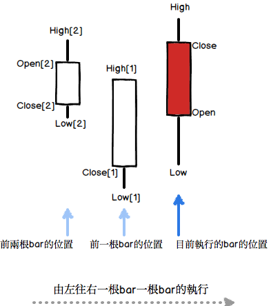

# XS語法入門

## 基本架構介紹：什麼是XS


### 什麼是XS呢 ?

簡單的來說，XS是一套可以讓使用者利用簡單的指令，來告訴電腦如何根據商品的價位，例如開，高，低，收等資料做運算，邏輯判斷等動作，然後把執行後的結果利用圖形，訊號等介面通知使用者的系統。由於輸入的指令可以客製化，所以每個人都可以利用XS來設計出他自己的看盤/交易/選股的邏輯，不再受到傳統看盤軟體的限制，而且因為電腦可以快速的執行這些指令，所以使用者可以運用XS來執行多檔商品的即時篩選，掌握最佳的交易時機。

我們用K線圖來跟大家說明XS的運算方式：

<!--  -->


在K線圖裡面，可以清楚的看到商品的價格變化是一個時間序列，由歷史的資料往最新的日期一路的發展過來，所以XS的設計方式，就是讓使用者可以順著這個時間序列上面，在每一根K棒上面一一的運算他所指定的邏輯。

<!--  -->


我們把每一根K棒(bar)上面所要執行的邏輯，寫在一個「腳本」之內。每一個腳本內，包含了一行一行的XS指令。當我們把這個腳本送給XS時，XS就會依照商品的K棒序列開始執行這個腳本，執行時使用者就可以透過腳本裡面的XS指令來取得商品K棒的價格，以及其他資料，然後利用不同的XS指令來做出運算以及判斷。這些一行一行的XS指令，有各種不同的寫法，這些不同的寫法就稱為XS語法。

<!--  -->


### XS語法架構

那在XS語法中，我們如何知道目前是在哪一根bar，而此時的價位又是如何呢 ?

在XS語法內，使用者可以使用以下幾個常用的英文字來取得目前這根bar的價格：Open代表開盤價，Close代表收盤價，High代表最高價，Low代表最低價，Date代表這根bar的日期，而Volume則代表這根bar的成交量。除了這幾個英文字之外，語法也提供一般的加減乘除等運算式，例如：

```xscript

High - Low

```

就是表示這根bar的振幅（最高價減最低價）。

由於在執行運算時我們常常會希望知道目前這根bar與先前bar的價位的比較，例如我們可能會想要知道這根bar的漲跌(也就是目前bar的收盤價減去前一根bar的收盤價)，所以在指令內可以使用中括號的方式來取得前幾根bar的數值。例如Close[1]表示前一根bar的收盤價，Open[2]表示前兩根bar的開盤價，所以K棒的漲跌就可以用以下的指令來表示：

```xscript

Close - Close[1]

```

<!--  -->


透過XS語法內的價格欄位，價格欄位的前期值，以及加減乘除等運算方式，我們可以把交易運算的邏輯鋪陳在XS腳本內，然後讓XS系統把這個邏輯一一的在我們指定的商品的每一根bar上面執行對應的計算跟判斷。透過這個機制，我們就可以研判商品的價格變化，繪製出我們想要的圖形，篩選出我們想要找的股票，讓XS系統在價格變化的關鍵點上立即通知我們，跳出警示，甚至送出交易指令！

在以下的章節內，我們將會陸續跟大家介紹XS語法以及XS系統的各種功能，請大家繼續看下去。
