# XS自動交易

來源：[XS自動交易](https://www.xq.com.tw/lesson/xsat/)

## 自動交易的基本觀念

### XS自動交易的簡介

XS自動交易的主要功能，是讓使用者可以設定欲交易的商品以及帳號，然後透過編寫腳本邏輯，來自動進行買進賣出的動作。透過交易相關的語法，使用者可以控制委託的買賣方向、委託數量、委託價格，也可以進一步的取得已經成交的數量及價格等完整的成交資訊，也就是說透過XS自動交易，使用者可以完成一個全自動化的交易流程。

在XS自動交易功能內，有三個主角，第一個是自動交易腳本，第二個是自動交易回測系統，第三個則是真正執行交易的自動交易中心。

就如同要設定XS策略雷達來做盤中即時警示時我們需要把何時要產生警示的邏輯寫在一個警示腳本內一樣，要設定XS自動交易時，我們也必須把交易的邏輯寫在一個交易腳本內，這個動作可以透過XS編輯器來完成。

設計好交易腳本之後，接下來我們可以進行回測。在回測的過程中，XS自動交易系統會以歷史資料來執行腳本，同時依照腳本內的指令進行交易的動作。這些交易的動作並不會送出委託單，而是會藉由歷史資料來判斷這些交易是否會成交，如果會的話成交價格以及成交數量又會是什麼。最後，透過這些成交的資料，回測系統可以告訴我們這個腳本的勝率、賺賠、報酬率等資訊。

如果接下來我們想要開始執行自動交易時，我們就需要設定這個自動交易執行時的相關參數，例如希望執行哪些商品，希望用什麼資料頻率來執行，希望用那個交易帳號來下單等。這一個動作則是透過「自動交易中心」這一個介面來做設定。

「自動交易中心」就如同「策略雷達」或是「選股中心」一樣，提供了執行XS自動交易功能的相關操作介面。在「自動交易中心」內，使用者可以設定很多個「自動交易策略」，每一個「自動交易策略」內可以指定要執行的交易腳本、商品、頻率、交易帳號等。一旦啟動「自動交易策略」，系統就會依照商品的資料來進行洗價以及交易的動作。

### 語法內如何進行交易

在警示腳本內，當腳本呼叫ret=1時就可以產生觸發訊號；在選股腳本內，同樣的也是呼叫ret=1表示希望選到這檔商品，那麼在交易腳本內，如果想要進行交易的話，那該怎麼做呢？

要瞭解如何進行自動交易，首先要先知道自動交易腳本內，Position(部位)的這個觀念。

所謂Position，指的是「這個商品的目標部位」，也就是這個腳本預期持有的部位。Position是一個整數，可以大於0，等於0，或是小於0。當我們想要進行買進動作時，就透過「交易指令」把Position的數值變大，反之當我們想要進行賣出動作的話，就透過交易指令把Position的數值變小。當Position的數值被異動之後，XS自動交易系統就會依照策略所指定的參數，送出對應的委託單，如果這些委託單順利成交的話，這個商品的淨成交張數就會跟Position是一致的。

XS自動交易提供了不同的「交易語法」可以用來更改Position數值，其中最重要的就是SetPosition這個語法：


```xscript

SetPosition(目標部位)
SetPosition(目標部位，委託價格)

```

SetPosition函數的第一個參數是目標部位。第二個參數是進行此次交易的委託價格，如果不傳的話則會使用策略的預設買進/賣出價格。

接下來我們來看一些SetPosition的使用範例。

**範例#1：**

```xscript

if Position = 0 then SetPosition(1);

```

**範例#2：**

```xscript

if Position = 0 then SetPosition(1, Close);

```

如果目前的Position是0的話，買進1張，委託價格使用目前的收盤價(洗價時的最新收盤價)。

SetPosition的第二個參數是委託價格，可以傳入一個固定數值(例如100.0)，或是其他的數值運算(例如Close, Close+1.0, 等)。

**範例#3：**

```xscript

if Position = 0 then SetPosition(-1);

```

如果目前的Position是0的話，賣出1張，委託價格使用策略的預設賣出價格。執行之後Position會變成-1。

**範例#4：**

```xscript

if Position > 0 then SetPosition(0, MARKET);

```

如果目前的Position大於0的話，則用市價賣出所有多單的張數。MARKET是一個特殊的保留字，代表希望用市價交易。XS自動交易系統會依照帳號類型來決定市價單該如何傳送，如果是證券帳號的話，會傳送市價委託，如果是期貨帳號的話，則會傳送範圍市價委託。

除了SetPosition語法可以更改目標部位之外，另外XS自動交易還提供了Buy、Sell、Short、Cover這四種語法。與SetPosition不同的是，這四種語法所傳入的數量是加碼/減碼的數量。不過不管是透過哪一種語法，這些交易指令最終的目的都是調整商品的目標部位。

當交易腳本呼叫SetPosition等語法之後，XS自動交易就會依照新的目標部位傳送買進或是賣出的委託，執行之後Position這個數值就會更改成新的目標部位。當這些委託單成交時，腳本就可以透過Filled這個欄位來取得目前成交的淨部位。

Filled欄位跟Position欄位一樣是一個整數，可以大於0，小於0，或是等於0。當自動交易策略開始執行時，Position的數值跟Filled的數值是一模一樣的。接下來當交易腳本呼叫SetPosition來更改目標Position時，Position會先改變，同時送出委託單，等到成交時，Filled的數值就會跟著更新。

關於Position跟Filled，還有兩個地方請讀者要務必注意：

第一：一個自動交易策略可能會執行多個商品，每個商品的Position/Filled都是互相獨立的。

第二：Position/Filled的數值是一個相對的數值，與交易帳號這個商品的庫存部位未必是一樣的。例如我的交易帳號內可能有0050的庫存2張，可是XS自動交易策略提供多種設定策略部位的方式自動交易策略設定說明，可以把Position設定從0開始，或是從2開始，甚至也可以設定成從1開始。

假設策略的Position設定從0開始，接下來的SetPosition(1)，指的是買進1張，如果成交的話，Filled也會是1，這兩個數值與帳號的庫存數值，就可能是不一樣的。

最後，我們來看一個完整的交易策略範例。

```xscript

Condition1 = Average(Close, 5) cross over Average(Close, 10);
Condition2 = Average(Close, 5) cross under Average(Close, 10);
if Position = 0 and Condition1 then SetPosition(1);
if Position = 1 and Condition2 then SetPosition(0);

```

在這個範例內，當短均線穿越長均線時，我們就買進1張，當短均線跌破長均線時，我們就把剛剛買到的那一張賣出。

更多的交易策略範例，可以參考XS編輯器內的系統範例腳本，也可以參考此篇文章喔！

<!-- 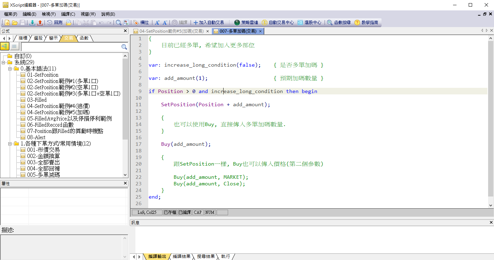 -->


瞭解SetPosition以及Position的觀念之後，接下來在下一篇文章「如何建立自動交易策略」內我們將介紹如何設計自動交易腳本，以及自動交易策略。

[返回](#xs自動交易)

## 如何建立自動交易策略

### 編寫交易腳本

首先，在XS編譯器內，要設計自動交易時，腳本請選擇「交易」這個類型。

交易腳本的設計方式跟警示腳本非常的類似，支援的報價欄位、資料欄位也是一樣的，最主要的差異就是可以透過SetPosition這些語法來指示XS自動交易系統如何進行交易。

<!-- 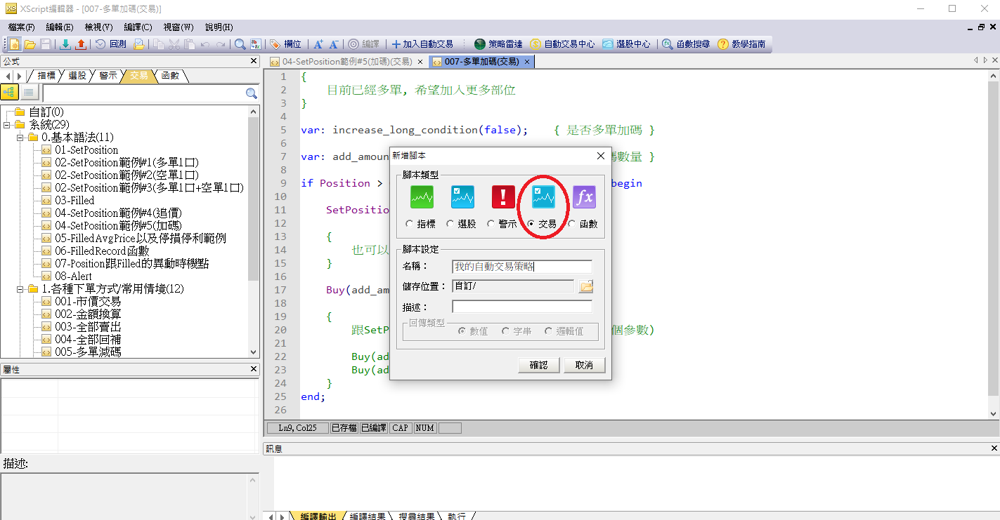 -->


### 自動交易策略

交易腳本編譯完畢之後，我們就可以建立一個「自動交易策略」來執行這個腳本。

建立自動交易策略的方式有兩種。

第一種方式是直接在XS編輯器內，選擇交易腳本，然後按右鍵「加到自動交易」。

<!-- 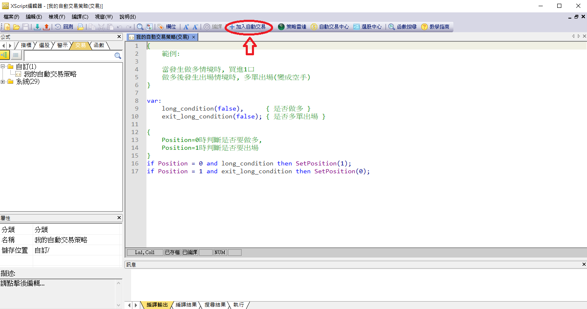 -->


第二種方式則是開啟「自動交易中心」，然後點選「新增」按鈕，或是從右鍵選單內選擇「新增自動交易」

<!-- 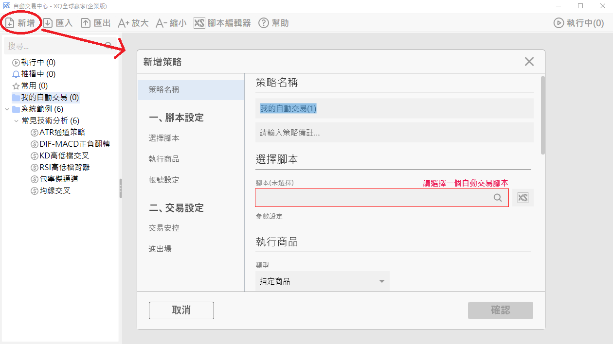 -->


要建立一個自動交易策略時，必須填入以下設定：

執行商品

決定策略要執行哪些商品。

提供的選項包含：

- 可以選擇一個或是多個商品
- 可以選擇一個分類清單(例如我的某組自選股)
- 可以選擇一個XS選股法，執行前會先執行這個選股法，符合選股法的商品就會執行這個腳本
- 可以選擇帳號的庫存
- 可以選擇從外部檔案匯入欲執行的商品

<!-- 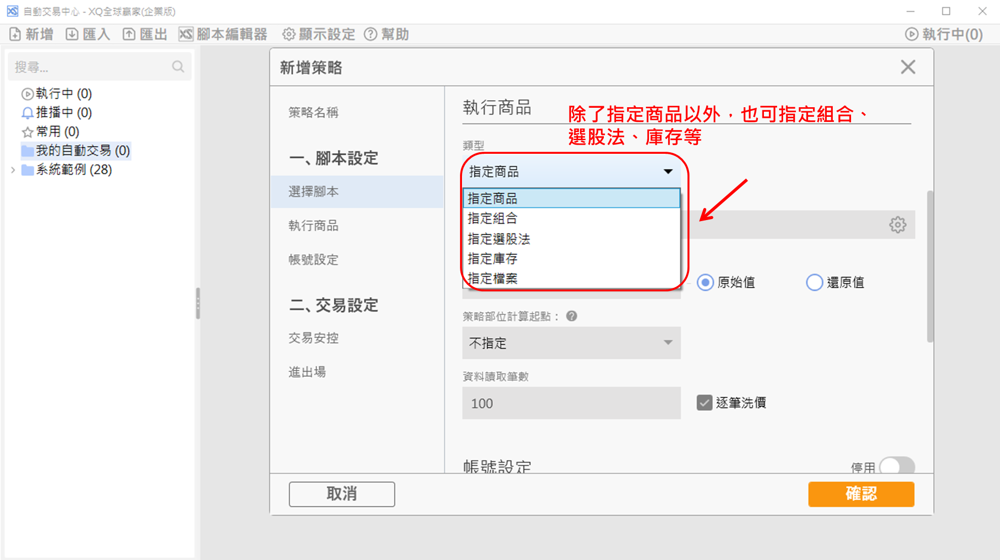 -->


<!-- 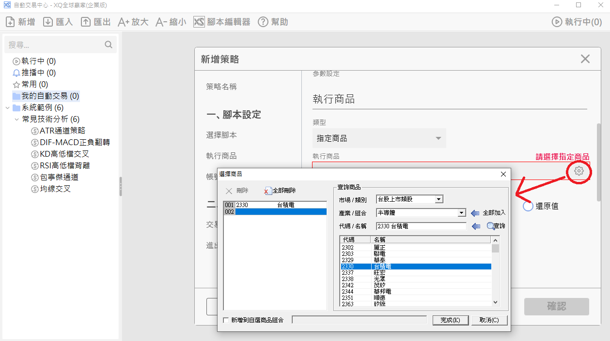 -->


#### 執行頻率以及是否逐筆洗價

選擇策略執行時所讀取的商品資料頻率，以及是每一根K棒執行一次，還是是價格有異動時就執行一次。

<!-- 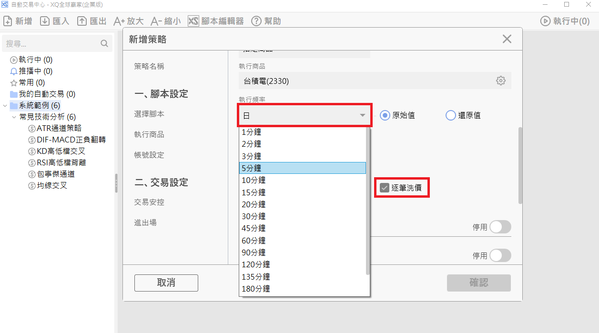 -->


資料讀取範圍以及是否使用歷史資料計算策略部位

透過這些參數，可以指定策略讀取歷史資料的範圍，以及是不是要使用歷史資料來模擬算出策略的部位，例如一個均線交易策略，可以使用歷史資料來算出策略目前是處在進場或是出場的位置，然後再接續當日的即時資料進行波段交易。

請參考此篇(自動交易策略參數總覽)文章。

<!-- 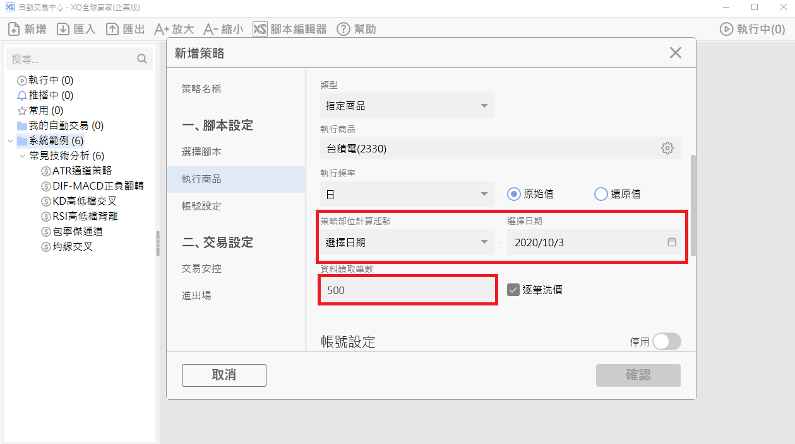 -->


#### 交易帳號，以及是否連結帳號庫存

自動交易策略可以在不指定帳號的情形底下執行。此時策略執行時不會傳送委託單到券商端，而是靠著目前市場的即時行情來模擬策略的部位異動是否會成交。透過這樣子的設定方式，使用者可以在不啟動實單交易的情形下確認策略執行的邏輯是否符合預期。

<!-- 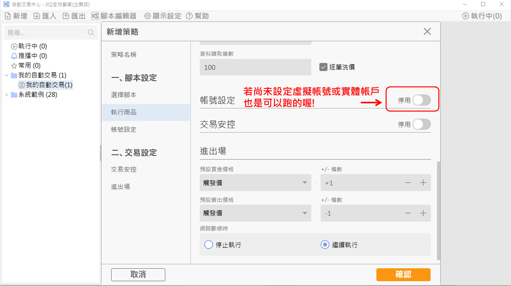 -->


或是，可以開啟帳號設定，指定證券或是期貨帳號，同時設定帳號的相關參數，之後XS自動交易執行時就會傳送真實的委託單到指定券商端。

更詳細的說明請參考此篇(自動交易策略參數總覽)文章。

<!-- 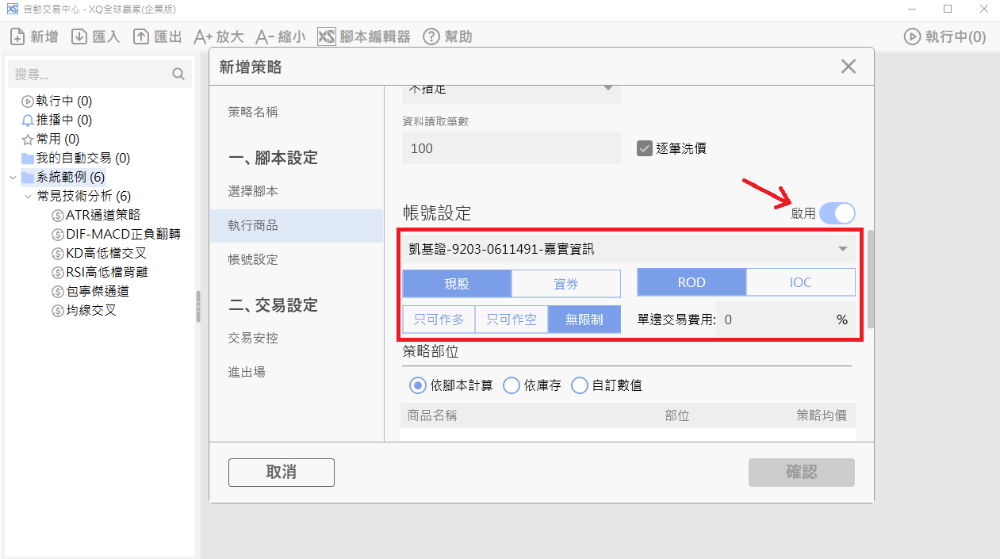 -->


#### 交易安控設定

XS自動交易提供了部位，進場次數，以及交易金額等安控選項。一旦啟動安控之後，如果交易指令的內容違反安控的話，XS自動交易將不會執行這一個交易指令。

<!-- 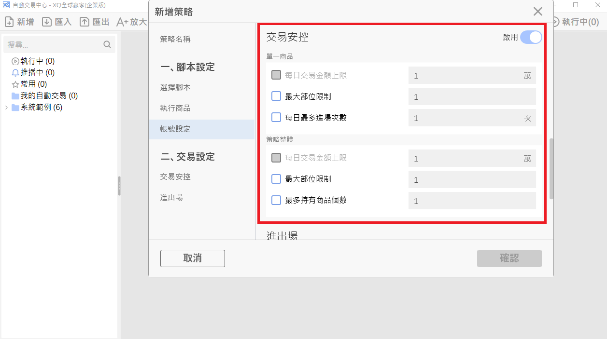 -->


#### 進出場設定

設定策略預設的買進價格以及賣出價格。腳本內的交易指令可以指定委託的價格，此時系統就會依照指定價格送單。如果交易指令內不指定價格的話，則會使用策略的預設買進/賣出價格來傳送委託。

使用者也可以決定萬一行情網路發生連線問題時，策略的執行會自動停止，還是等到行情連線恢復時繼續執行。

<!-- 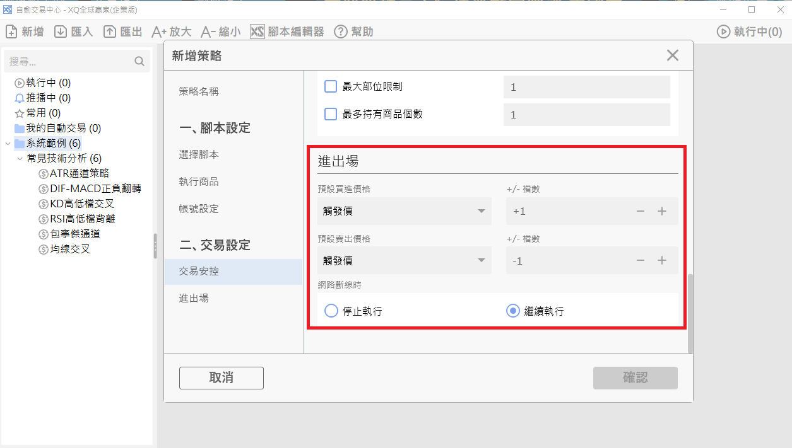 -->


到此為止，我們簡單的說明了自動交易策略的一些主要參數。在下一篇文章內我們會更詳細的介紹自動交易策略的所有參數以及執行交易時的行為。

另外關於自動交易中心的操作介面，也請大家參考自動交易中心操作界面這一篇文章。

[返回](#xs自動交易)
