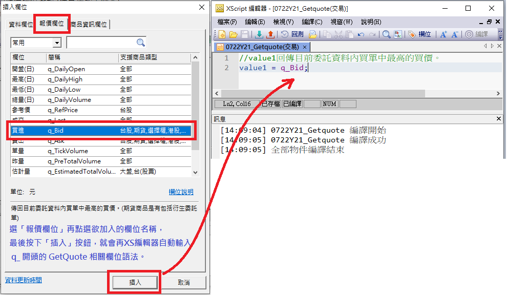
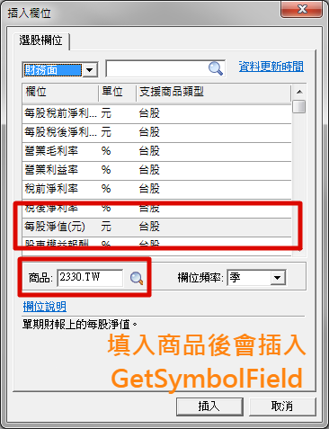
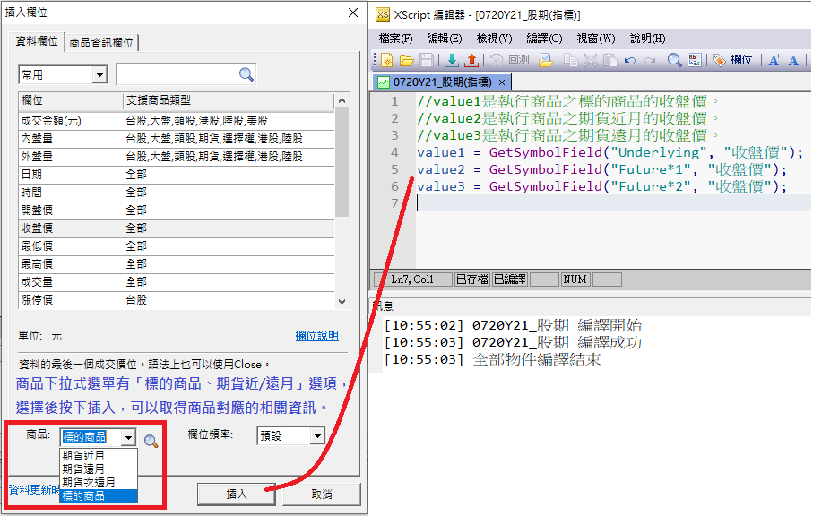

# 內建函數

## 欄位函數

### CheckField

**語法：**

判斷欄位資料是否存在，回傳 True / False。

CheckField("外盤量", "D");

**說明：**

CheckField會依據傳入的商品代碼、欄位和頻率來判斷該資料是否能夠取用，回傳True / False。

[返回](#欄位函數)

### CheckSymbolField

**語法：**

判斷指定商品的欄位資料是否存在，回傳 True / False。

CheckField("2330", "外盤量", "D");

**說明：**

CheckSymbolField會依據傳入的商品代碼、欄位和頻率來判斷該資料是否能夠取用，回傳True / False。

[返回](#欄位函數)

### GetField

**語法：**

讀取系統內的欄位資料

欄位數值 = GetField("欄位名稱")

欄位數值 = GetField("欄位名稱", "頻率")

欄位數值 = GetField("欄位名稱", "頻率", 是否為還原值)

欄位數值 = GetField("欄位名稱", "頻率", 是否為還原值, 設定預設值)

傳入欄位名稱、指定的欄位頻率、是否為還原值 以及 設定預設值。

如果不傳頻率的話，則讀取目前執行頻率的對應欄位。

如果不傳是否為還原值，則讀取原始值資料。

**說明：**

交易者在制定交易策略時，往往除了開高低收成交量之外，也會想要利用交易市場內獨特的資料，例如台股市場的融資券及法人的進出資料，來作為交易策略的運算基礎。為了讓交易者可以如願以償，XS語法內提供了GetField這個函數，來協助交易者完成這樣的工作。

GetField函數可以傳入四個參數:

- 第一個參數是欄位的中文或是英文名稱，
- 第二個參數則是欄位的頻率，如果省略這個參數的話，則會依照目前腳本執行的頻率來取得對應的資料
- 第三個參數則為「是否為還原值」運用 Adjusted參數 來設定要讀取的是原始資料，還是還原資料。
- 第四個參數則是「設定預設值」運用Default參數來設定若遇到此欄位對應K棒沒有資料的狀況要回傳的數值。

以下是一個簡單的範例:

```xscript

Value1 = GetField("收盤價");　// value1 為取得目前腳本執行頻率的收盤價。
Value2 = GetField("收盤價", "1");　// value2 為取得原始1分鐘頻率的收盤價。
Value3 = GetField("收盤價", "1", Adjusted:=true);　// value3 為取得還原1分鐘頻率的收盤價。
Value4 = GetField("本益比", "D", Default := 0);    // 當運算的K棒沒有對應的本益比時，則回傳0。

```

設定預設值並無法解決所有的欄位錯誤，例如 取未來值 (ex. GetField["Close", "1", Default:=0](-1)) 以及 不支援的欄位/頻率 (ex.GetField("本益比", "Y", Default := 0)) 還是會發生錯誤。

GetField可以使用的欄位分成兩種類型:

- 第一種是資料欄位，支援指標腳本、警示腳本以及交易腳本。
- 第二種是選股欄位，支援選股腳本。

使用者可以點選XS編輯器內的編輯選單/插入欄位選項，或是按快捷鍵F7，進入插入欄位畫面內搜尋或是瀏覽需要的欄位，從插入欄位畫面內也可以找到欄位的說明等資訊。

GetField欄位除了可以取得某個欄位在目前K棒的數值之外，也可以取得某個欄位的前期值:

```xscript

If Close > Close[1] And 
   GetField("外資買賣超") > GetField("外資買賣超")[1] 
Then 
   Ret = 1;

```

在上述警示範例內使用GetField("外資買賣超")來讀取外資的買賣超張數。注意到GetField["外資買賣超"](1)的用法：GetField函數的回傳值是跟Close一樣是一個序列，可以使用[]的語法來讀取前期值。

資料欄位支援Tick、分鐘、日、週、月、季、半年、年、還原日、還原月、還月季等頻率，視欄位內容決定支援的頻率，在插入欄位的畫面中會列出欄位支援的商品及頻率。

選股腳本不支援Tick、分鐘頻率，同樣也能在呼叫GetField時指定引用的資料頻率，

當使用者選擇「外資買賣超」欄位時，頻率選項內會列出這個欄位可以被使用的頻率：日、週、月。如果使用者選擇週的話，則按插入後編輯器內會出現以下的程式碼:

```xscript

GetField("外資買賣超","W");

```

注意到GetField的第二個參數傳入了 "W"，代表要抓取週線頻率。當GetField函數內傳入了指定頻率時，則不管腳本執行的頻率是什麼，系統一定會回傳這個欄位指定的頻率內容。

以下是GetField的頻率代碼清單：

- Tick: 1 Tick
- 1: 1分鐘。也可使用其他數字（1、2、3、5、10、15、20、30、45、60、90、120、135、180、240），代表對應的分鐘線資料
- D: 日資料
- W: 週資料
- M: 月資料
- Q: 季資料
- H: 半年資料
- Y: 年資料
- AD: 還原日資料
- AW: 還原週資料
- AM: 還原月資料

如果在頻率選項內選擇「預設」的話，則產生的GetField程式碼內將不會傳入第二個參數。這表示當GetField執行時回傳的資料頻率會跟腳本執行的頻率是一樣的。

如果GetField函數內傳入了頻率參數，而且這個頻率跟目前腳本執行的頻率不一樣的話，則我們稱這種情形為跨頻率。

```xscript

If Close > Close[1] and
   GetField("外資買賣超","W") > GetField("外資買賣超","W") [1] then ret = 1;

```

上述選股腳本內我們使用日頻率來執行，所以Close, Close[1]都是日頻率的資料，而GetField("外資買賣超","W")則是週頻率的資料。 當腳本執行時遇到要讀取不同頻率的資料時，系統會使用以下的方式來決定不同頻率的資料的日期:

目前腳本執行的頻率為主頻率，以上例而言主頻率為日頻率，如果要讀取週頻率資料時，以日資料的計算日期來取得當下的週資料；例如，台積電(2330) 在2018/07/16~2018/07/20期間中：

- 週一07/16的週線外資買賣超為-2071張、週線開盤價為224.5元、週線最高價為225元、週線最低價為223.5元、週線收盤價為223.5元、週線成交量為16107張。
- 週二07/17的週線外資買賣超為-3371張、週線開盤價為224.5元、週線最高價為225元、週線最低價為221元、週線收盤價為221.5元、週線成交量為38661張。
- 週三07/18的週線外資買賣超為-1733張、週線開盤價為224.5元、週線最高價為225元、週線最低價為221元、週線收盤價為223元、週線成交量為84464張。
- 週四07/19的週線外資買賣超為6021張、週線開盤價為224.5元、週線最高價為227元、週線最低價為221元、週線收盤價為224.5元、週線成交量為128440張。
- 週五07/20的週線外資買賣超為43423張、週線開盤價為224.5元、週線最高價為237.5元、週線最低價為221元、週線收盤價為237.5元、週線成交量為232092張。

如果依照上述邏輯所對應出來的期別資料不存在的話，則系統會依照資料對位(DataAlign)的設定方式來決定如何處理：

- 如果是絕對對位的話，則腳本執行時會發生錯誤(資料不存在)，
- 如果是遞補對位的話，則系統會往前尋找有資料的期別。以上述為例，假如日期為2018/07/16日，腳本內要去讀取週資料時，依照日期對位邏輯，系統會先找尋2018/07/16日的週資料，如果資料不存在的話則會往前找尋2018/07/13日的週資料，如果還不存在的話則會往前繼續尋找，直到找到為止。

通常在選股腳本內會使用遞補對位(預設值)來來處理財報/營收等資料期別比交易價位資料期別落後公佈的情形。

其他與欄位相關的函數還有 GetFieldDate函數以及GetQuote函數。

也可以利用GetSymbolField取得指定商品的欄位資料（跨商品），語法和GetField類似，只需要在第一個參數加上指定商品的SymbolID。

[返回](#欄位函數)

### GetFieldDate

**語法：**

讀取系統內的欄位的資料日期

欄位資料日期 = GetFieldDate(欄位名稱)

欄位資料日期 = GetFieldDate(欄位名稱, 頻率)

傳入欄位名稱，跟指定的欄位頻率。如果不傳頻率的話，則使用目前執行頻率。回傳欄位的資料日期，格式為YYYYMMDD 8碼數字。

**說明：**

在腳本內可以使用GetField函數來取得各種不同的欄位資料，而欄位資料的期別則會依照腳本的對位邏輯來決定。

如果使用者希望知道實際的欄位資料日期的話，則可以使用GetFieldDate這個函數。

GetFieldDate函數傳入的參數與GetField是一樣的，需要傳入欄位名稱，以及指定的期別。與GetField不同的是，GetField回傳的是這個欄位的數值，而GetFieldDate回傳的則是這個欄位的資料日期。

由於營收/財報等資料的公佈日期往往落後於目前的日期，所以如果在運算時需要清楚的知道資料的日期的話，則可以使用GetFieldDate這個函數。

在以下的選股腳本內，我們使用GetFieldDate來判斷最新一期月營收的日期，然後利用這個日期來估計最新一季的獲利:

```xscript

Var: mm(0);


mm = Month(GetFieldDate("月營收","M"));
if mm=1 or mm=4 or mm=7 or mm=10
then value1=GetField("月營收","M") * 3;


if mm=2 or mm=5 or mm=8 or mm=11
then value1=GetField("月營收","M") * 2 + GetField("月營收","M")[1];


if mm=3 or mm=6 or mm=9 or mm=12
then value1=GetField("月營收","M")+GetField("月營收","M")[1]+GetField("月營收","M")[2];


// 預估獲利(單位=百萬) = 季營收 * 毛利率 - 營業費用
//
value2 = value1 * GetField("營業毛利率","Q") - GetField("營業費用","Q");


OutputField1(value1, "預估單季營收(億)");
OutputField2(value2 / 100, "預估單季本業獲利(億)");


ret = 1;

```

當最新一期的月營收的月份是1月/4月/7月/10月時, 我們估算當季的營收為最新這個月的營收 *3，如果最新一期的月營收的月份是2月/5月/8月/11月時，因為當季的營收已經公佈了兩個月了，所以我們用當季的第一次營收 ( GetField["月營收", "M"](1) ) 來加上最新這個月的營收* 2來當成這一季的估季營收，如果最新一期的月營收的月份是3月/6月/9月/12月的話，則因為當季所有月份的營收都已經公佈了，所以我們就把近三期的月營收加起來。

計算完當季的估計營收之後，接下來就可以使用最新一期的毛利率等資料來估算獲利了。

在上面範例內估算營收的邏輯只是一個範例，如果知道了月份之後，也可以利用月營收年成長率來等資料來做其他的推算。

[返回](#欄位函數)

### GetFieldPublishDate

**語法：**

用來取得指定欄位在XQ中更新的日期。

GetFieldPublishDate(欄位名稱, 頻率);

第一個參數是要查詢的欄位名稱。

第二個參數是要查詢的欄位頻率，預設值為執行頻率。

回傳值為YYYYMMDD的8碼數字。

**說明：**

此函數能夠取得指定的欄位在XQ中更新的日期，亦可以透過 [N] 的方式來取得該欄位前 N 期的更新日。

例如 GetFieldPublishDate["月營收", "M"](1) 回傳的是上個月月營收的公布日 (也就是 GetField["月營收", "M"](1) 的公佈日)。

[返回](#欄位函數)

### GetQuote

**語法：**

讀取系統內的報價欄位資料 (僅支援警示、交易腳本)

報價欄位數值 = GetQuote(欄位名稱)

報價欄位數值 = q_欄位英文名稱

報價欄位不支援回測功能

**說明：**

在XS腳本內除了可以讀取資料欄位之外(GetField函數)，也可以讀取即時的報價欄位。

即時報價欄位涵蓋的範圍有:

- 由交易所提供的即時報價，如五檔委託價量以及即時成交等資料
- 由系統統計的市場行情資訊，如加權指數漲跌家數，當日內外盤量等資料
- 商品的最新一期基本資料相關數據，例如發行股數，每股淨值，最新一季的毛利率等

使用者可以點選XS編輯器內的編輯選單/插入欄位選項，或是按快捷鍵F7，在插入欄位畫面內點選報價標籤，然後就可以搜尋或是瀏覽需要的報價欄位。

使用者可以在XS編輯器中的功能列按下「欄位」圖示，或是按快捷鍵F7，進入插入欄位視窗後，先選取「報價欄位」標籤頁，再點選欲加入報價欄位的名稱，最後按下「插入」按鈕，就會在XS編輯器中產生 q_ 開頭的 GetQuote 報價欄位語法。

<!--  -->


目前即時報價欄位僅能使用在警示與交易類型的腳本。而且由於報價欄位的數值是採用即時更新的方式，只提供最新的數值，無法取得前期值，因此無法使用在回測上，在使用上要注意這個特性。

以下是一個使用即時報價欄位的範例:

```xscript

Input: OpenGap(1);
Input: Downpercent(1);


if  q_DailyHigh = q_DailyOpen and
    q_DailyOpen > q_RefPrice * (1+ OpenGap/100) and
    q_Last < q_DailyHigh * (1 - Downpercent/100)
then ret=1;

```

上面的這個警示腳本內判斷如果當日開在最高(q_DailyHigh = q_DailyOpen)，而且是跳空開出 (q_DailyOpen > q_RefPrice * (1 + 跳空比例/100)，而目前的價格 q_Last已經回落一定範圍的話則觸發警示。在這裡q_DailyHigh為當日的最高價, q_DailyOpen為當日的開盤價, q_RefPrice為當日的參考價, q_Last為當日的最新價格，這些都是常用的報價欄位。

[返回](#欄位函數)

### GetSymbolField

**語法：**

讀取系統內的欄位資料

欄位數值 = GetSymbolField("ID", "欄位名稱")

欄位數值 = GetSymbolField("ID", "欄位名稱","頻率")

欄位數值 = GetSymbolField("ID", "欄位名稱", "頻率", 是否為還原值)

欄位數值 = GetSymbolField("ID", "欄位名稱", "頻率", 是否為還原值, 設定預設值)

傳入商品ID、欄位名稱、指定的欄位頻率、是否為還原值 以及 設定預設值。

如果不傳頻率的話，則讀取目前執行頻率的對應欄位

**說明：**

GetSymbolField是GetField語法的延伸，在取得欄位相關資料時可以指定商品，透過這個函數可以在腳本中取得其他商品的欄位資料。

GetSymbolField函數可以傳入五個參數：

- 第一個參數是商品代碼，
- 第二個參數是欄位的中文或是英文名稱，
- 第三個參數則是欄位的頻率，如果省略這個參數的話，則會依照目前腳本執行的頻率來取得對應的資料
- 第四個參數則為「是否為還原值」運用 Adjusted參數 來設定要讀取的是原始資料，還是還原資料。
- 第五個參數為「設定預設值」運用 Default 參數來設定沒有資料時所回傳的預設值。

當你點選XS編輯器內的編輯選單/插入欄位選項，或是按快捷鍵F7，利用「插入欄位」畫面加入欄位的同時，如果在商品欄位填入有效商品時，系統會自動插入GetSymbolField函數（沒填商品時是插入GetField函數）。插入欄位畫面沒有還原分鐘的選項，如果使用者需要取的還原分鐘相關資料，請直接撰寫在腳本中。

<!--  -->


以下是一個簡單的範例：

```xscript

Value1 = getsymbolField("1101.TW", "收盤價");　// value1 為取得目前腳本執行頻率的台泥(1101)收盤價。
Value2 = getsymbolField("1101.TW", "收盤價", "1");　// value2 為取得原始1分鐘頻率的台泥(1101)收盤價。
Value3 = getsymbolField("1101.TW", "收盤價", "1", Adjusted:=true);　// value3 為取得還原1分鐘頻率的台泥(1101)收盤價。
Value4 = getsymbolField("1101.TW", "收盤價", "1", Adjusted:=true, Default:= 0);　// value3 為取得還原1分鐘頻率的台泥(1101)收盤價，當取不到資料時預設值為0。

```

另外在「插入欄位」畫面的商品下拉式選單有「標的商品、期貨近/遠/次遠月」選項，選擇後按下插入，系統會自動插入GetSymbolField取得標的商品相關欄位的語法在XS編輯器中，編譯成功後加入相關應用，即可取得商品的「標的商品、期貨近/遠/次遠月」相關欄位數據。

<!--  -->


以下是 GetSymbolField「標的商品、期貨近/遠/次遠月」範例：

```xscript

//假設以下情境：
//1. 執行商品：台積電期近月(FICDF*1.TF)
//2. 執行時間：08月24日
//3. 加入雷達，進行盤中雷達實際測試。


if getinfo("IsRealTime") <> 1 then return;
//只跑在即時資料區間段，原因是跑 GetSymbolField("Future*2", "收盤價") 會取得遠月的收盤價，但遠月歷史資料期間短，故僅跑在即時資料區間段。


value1 = GetSymbolField("Underlying", "收盤價");
//value1是台積電期近月之標的商品收盤價；
//也就是台積電(2330.TW)收盤價。


value2 = GetSymbolField("Future*1", "收盤價");
//value2是台積電期近月之期貨近月收盤價；
//在此範例就是台積電期09月(FICDF09.TF)收盤價。


value3 = GetSymbolField("Future*2", "收盤價");
//value3是台積電期近月之期貨遠月收盤價。
//在此範例就是台積電期10月(FICDF10.TF)收盤價。

```

詳細的語法說明可以參考 GetField函數。

[返回](#欄位函數)

### GetSymbolFieldDate

**語法：**

讀取系統內的欄位的資料日期

欄位資料日期 = GetSymbolFieldDate("ID", "欄位名稱")

欄位資料日期 = GetSymbolFieldDate("ID", "欄位名稱","頻率")

傳入欄位名稱，跟指定的欄位頻率。如果不傳頻率的話，則使用目前執行頻率。回傳欄位的資料日期，格式為YYYYMMDD 8碼數字。

**說明：**

GetSymbolFieldDate是GetFieldDate語法的延伸，在取得欄位相關資料的日期時可以指定商品，透過這個函數可以在腳本中取得其他商品欄位的資料日期。

GetSymbolFieldDate函數可以傳入三個參數：

- 第一個參數是商品代碼，
- 第二個參數是欄位的中文或是英文名稱，
- 第三個參數則是欄位的頻率，如果省略這個參數的話，則會依照目前腳本執行的頻率來取得對應的資料

以下是一個簡單的範例（選股腳本）：

```xscript

GetSymbolFieldDate("2330.TW","月營收");
GetSymbolFieldDate("2330.TW","月營收","M");
ret=1;

```

詳細的語法說明可以參考 GetFieldDate函數。

[返回](#欄位函數)

### GetSymbolInfo

**語法：**

讀取系統內商品資訊欄位資料

回傳最新的商品資訊 = GetSymbolInfo("商品資訊欄位名稱")

**說明：**

交易者在制定交易策略時，除了使用交易市場的數據用來計算相關數值外，也會想要利用商品相關資訊，例如台股商品的注意股及買賣現沖的資訊，來作為交易策略的判斷依據。為了讓交易者可以如願以償，XS語法內提供了GetSymbolInfo這個函數，來協助交易者完成這樣的工作。

GetSymbolInfo函數可以傳入商品資訊欄位的中文或是英文名稱，以下是一個簡單的範例：

```xscript

var:aa(""),aaa("");
aa = GetSymbolInfo("交易所");//回傳最新的實際掛牌交易所（支援台股、權證與可轉債）
aaa= GetSymbolInfo("exchange");//回傳最新的實際掛牌交易所（支援台股、權證與可轉債）

```

GetSymbolInfo可以使用的商品資訊欄位為：

- 交易所：回傳商品掛牌的交易所。格式是字串。支援台股、台(權證)、台(可轉債)、台(特別股)、美(股票)
- 即將處置結束股：回傳當日是否是處置期間的最後一日。格式是布林值。支援台股、台(權證)、台(可轉債)
- 近期處置結束股：回傳商品是否在過去7日內剛結束處置。格式是布林值。支援台股、台(權證)、台(可轉債)
- 累計異常注意股：回傳商品當日是否為累計異常注意股。格式是布林值。支援台股、台(權證)、台(可轉債)、台(特別股)
- 處置股：回傳當日是否為處置股(警示股)。格式是布林值。支援台股、台(權證)、台(可轉債)、台(特別股)
- 注意股：回傳當日是否為注意股。格式是布林值。支援台股、台(權證)、台(可轉債)、台(特別股)
- 買賣現沖：回傳當日是否可以現股當沖。格式是布林值。支援台股。
- 先買現沖：回傳當日是否可以現股先買後賣。格式是布林值。支援台股。
- 可放空：回傳當日是否可以融券放空。格式是布林值。支援台股。
- 平可空：回傳當日是否可以在平盤以下融券放空。格式是布林值。支援台股。
- 期貨近月：回傳商品的相關期貨近月商品代碼。格式是字串。例如FITXN01.TF、FICDF01.TF。支援台股、期貨。
- 期貨遠月：回傳商品的相關期貨遠月商品代碼。格式是字串。例如FITXN02.TF、FICDF02.TF。支援台股、期貨。
- 期貨次遠月：回傳商品的相關期貨次遠月商品代碼。格式是字串。例如FITXN03.TF。支援台股、期貨。
- 有認購權證：回傳商品是否有發行認購型權證商品。格式是布林值。支援台股、大盤。
- 有認售權證：回傳商品是否有發行認售型權證商品。格式是布林值。支援台股、大盤。
- 有牛證：回傳商品是否有發行牛證權證商品。格式是布林值。支援台股、大盤。
- 有熊證：回傳商品是否有發行熊證權證商品。格式是布林值。支援台股、大盤。
- 有期貨：回傳商品是否有衍生的期貨商品。格式是布林值。支援台股、大盤。
- 有選擇權：回傳商品是否有衍生的選擇權商品。格式是布林值。支援台股、大盤。
- 有可轉債：回傳商品是否有發行可轉債(CB)商品。格式是布林值。支援台股。
- 執行比例：回傳權證商品的執行比例。格式是數值。台(權證)
- 履約價：回傳選擇權商品或是權證商品的履約價。格式是數值。台(權證)、選擇權。
- 買賣權：回傳選擇權商品或是權證商品的買賣權別。格式是字串(CALL/PUT)。台(權證)、選擇權。
- 到期日：回傳商品的到期日。欄位格式為西元年月日，例如20221101。支援台(權證)、台(可轉債)、期貨、選擇權、美(特別股)
- 標的物：回傳衍生性商品所對應的標的商品代碼。格式是字串。支援台(權證)、台(可轉債)、台(特別股)、期貨、選擇權。
- 轉換價格：回傳可轉債商品(CB)最新的轉換價格。格式是數值。支援台(可轉債)
- 可轉換日：回傳可轉債商品(CB)的可轉換日期。欄位格式為西元年月日，例如20221101。台(可轉債)
- 票面利率：回傳可轉債商品(CB)或是特別股的票面利率。格式是數值。台(可轉債)、台(特別股)、美(特別股)
- 擔保品：回傳可轉換商品(CB)是否有擔保。格式是布林值。台(可轉債)
- 發行張數：回傳可轉債商品(CB)的發行張數。台(可轉債)
- 交易幣別：回傳商品的交易幣別。格式是字串，例如"台幣"，"美元"等。支援台股。
- 交易單位：回傳商品的交易單位。格式是數值。支援台股。
- 面額：回傳股票每一股的面額(是多少元)。格式是數值。支援台股。
- 面額幣別：回傳股票的發行幣別。格式是字串，例如"台幣"，"美元"等。支援台股。
- ETD：是否是交易所交易債券(ETD)。格式是布林值。支援美(特別股)
- 第一個回購日：回傳美股特別股的第一個回購日期。欄位格式為西元年月日，例如20221101。支援美(特別股)

[返回](#欄位函數)

### IsSupportField

**語法：**

判斷傳入的欄位和頻率是否為可支援的欄位。

IsSupportField("月營收", "M");

**說明：**

IsSupportField 可根據傳入的欄位和頻率，判斷指定的欄位是否存在，回傳True / False。

需注意此函數並不會判斷對應K棒上是否有資料，只會判斷欄位存在。

故可能會發生函數回傳True，但該根K棒上沒有資料的情況。

[返回](#欄位函數)

### IsSupportSymbolField

**語法：**

判斷傳入的商品代碼、欄位和頻率是否為可支援的欄位。

IsSupportSymbolField("TSE.TW", "月營收");

**說明：**

IsSupportSymbolField 可根據傳入的商品代碼、欄位和頻率，判斷指定的欄位是否存在，回傳True / False。

需注意此函數並不會判斷對應K棒上是否有資料，只會判斷欄位存在。

故可能會發生函數回傳True，但該根K棒上沒有資料的情況。

[返回](#欄位函數)

### Symbol

**語法：**

回傳目前執行腳本的商品代碼

回傳代碼 = Symbol

**說明：**

Symbol函數回傳目前執行腳本的商品代碼，格式是商品編碼 + '.' + 交易所編碼，例如 "2330.TW"，"TSE.TW"，"IBM.US"等。

如果有多個商品同時執行同一個腳本時(例如策略雷達)，可以利用這個函數來判斷目前執行的商品而做不同的處理，也可以利用這個函數搭配Print函數來輸出目前執行的商品代碼。

範例:

```xscript

If Symbol = "2330.TW" then
begin
    // 目前執行的商品為台積電
end;

```

請參考SymbolName函數。

[返回](#欄位函數)

### SymbolName

**語法：**

回傳目前執行腳本的商品名稱

回傳名稱 = SymbolName

**說明：**

SymbolName函數回傳目前執行腳本的商品名稱，例如 "台積電"，"鴻海"，等。

通常可以在Print函數內使用這個函數，在列印的內容內把商品名稱印出來。

範例:

```xscript

Print("商品名稱", SymbolName);

```

請參考Symbol函數。

[返回](#欄位函數)

### UserID

**語法：**

回傳XQ登入帳號

回傳使用者帳號 = UserID

**說明：**

UserID函數回傳目前XQ登入者的使用者代碼。

```xscript

Print("目前使用者代碼", UserID);

```

[返回](#欄位函數)

