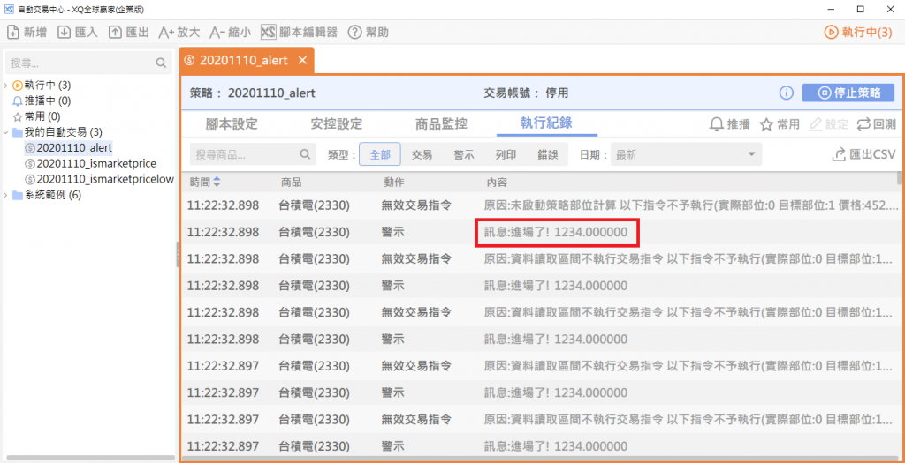
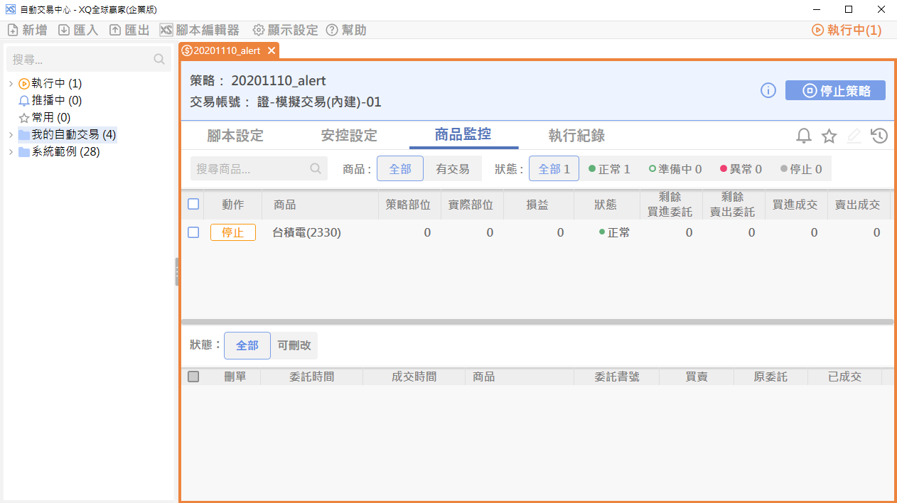
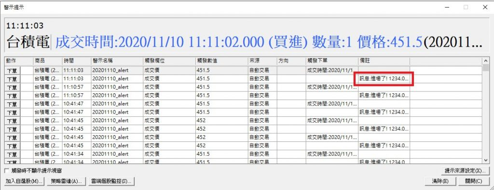
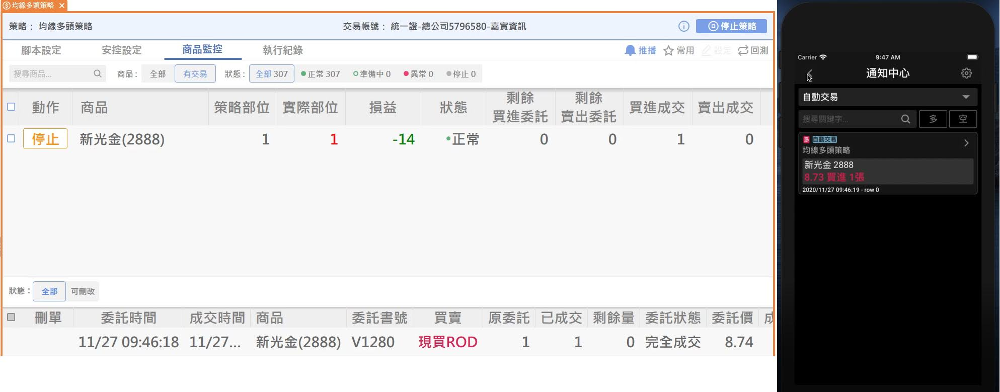
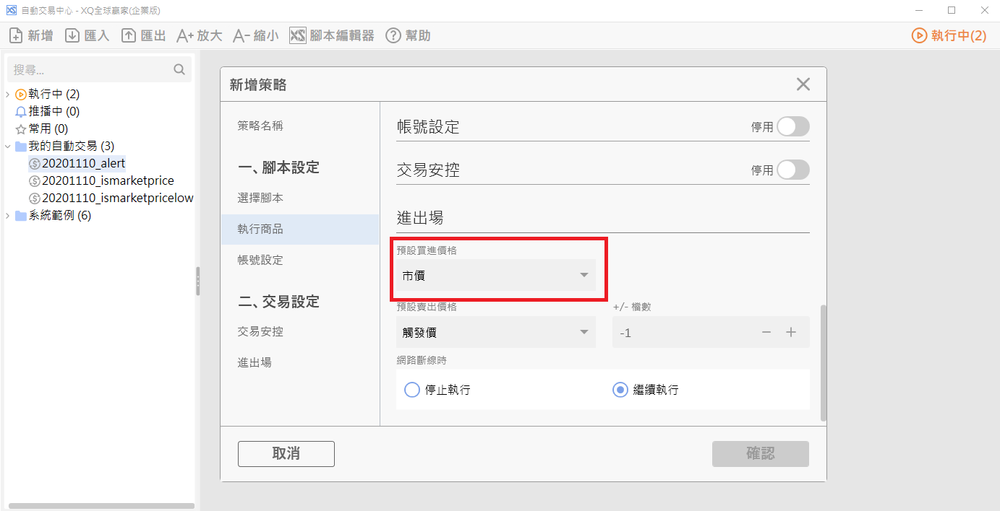
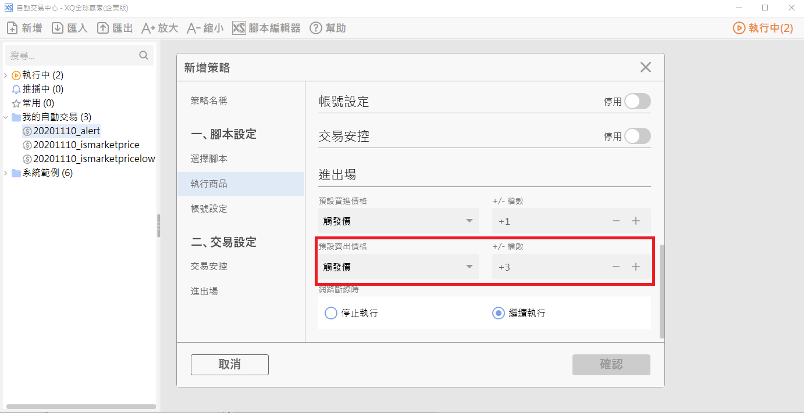
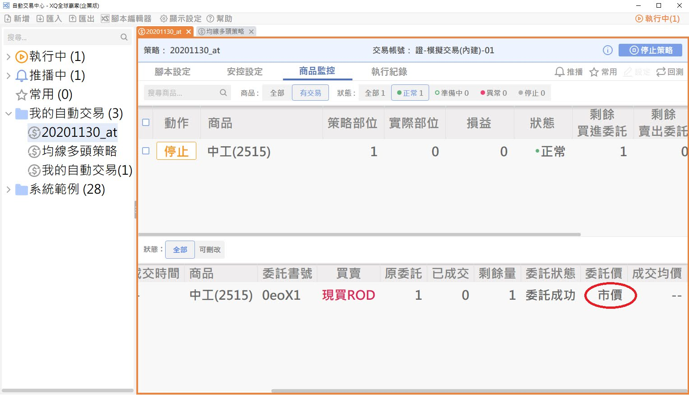
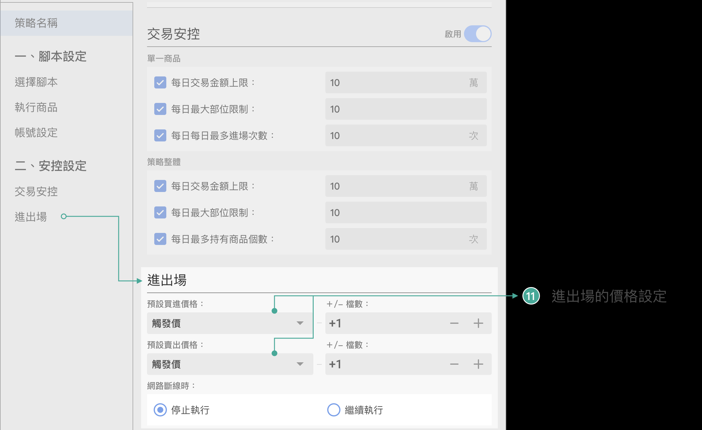
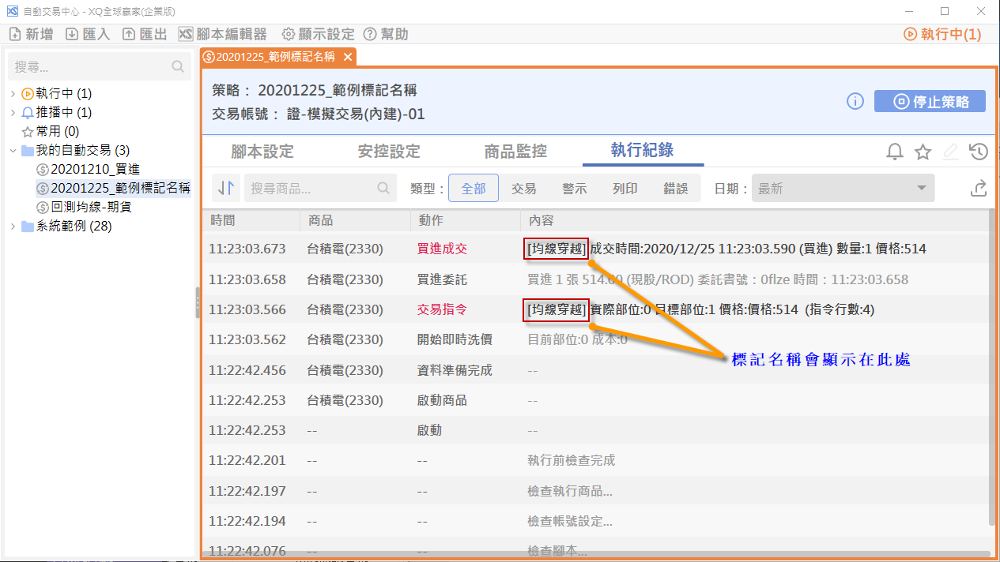

# 內建函數

## 交易函數

### AddSpread

**語法：**

計算調整檔位後的價格

Value1 = AddSpread(基礎價格, 檔位)

**說明：**

AddSpread函數用來計算依照商品跳動點加減幾檔後的價格。

呼叫時需要傳入兩個參數：第一個參數是基礎價格，第二個參數是加減檔數，如果要加檔數的話請傳入一個大於0的數值，如果要減檔數的話請傳入一個小於0的數值。如果商品有漲跌停限制的話，計算後的數值不會超過漲跌停限制。

範例

```xscript

Value1 = AddSpread(Close, 1);  { 收盤價+1檔 }
Value2 = AddSpread(Low, -1); { 最低價-1檔 }

```

這個函數主要應用在交易的情境，如果目前的執行商品並沒有檔位限制的話(例如加權指數)，則系統會以商品的報價跳動點來當成檔位的計算依據(例如加權指數的話則每一檔是0.01)。

[返回](#交易函數)

### Alert

**語法：**

在自動交易策略的執行過程內產生一筆警示紀錄

Alert(字串1)

Alert(字串1, 數值1, ...)

**說明：**

Alert函數可以傳入一個或是多個參數，參數的型態可以是文字、數字、或是布林值，系統會自動把傳入的參數轉成字串格式，如果傳入多個參數的話，不同參數之間會用空白接續起來。

透過Alert函數，自動交易策略在執行過程內可以產生一筆警示紀錄，達到類似策略雷達警示的提示效果。

當自動交易策略產生警示時，使用者可以透過以下幾種方式看到警示紀錄：

自動交易策略中心的執行紀錄畫面：

<!--  -->


自動交易策略中心的商品監控畫面：

<!--  -->


警示提示視窗：

<!--  -->


自動交易中心開啟推播後，可以傳到手機：

<!--  -->


[返回](#交易函數)

### Buy

**語法：**

把策略的多單部位變大，進行多單加碼的動作。

Buy(多單加碼數量)

Buy(多單加碼數量，委託價格)

Buy(多單加碼數量，label:="指令標記")

Buy(多單加碼數量，委託價格，label:="指令標記")

**說明：**

Buy函數的作用是把目前多單的部位變大，用來進行多單加碼的動作。

Buy函數的第一個參數是加碼部位，必須是一個正整數。第二個參數是此次交易的委託價格，第二個參數如果不傳的話則會使用策略的預設買進價格。

與SetPosition一樣，也可以透過label函數傳入指令標記。

範例

```xscript

Buy(1);
Buy(1, Close);
Buy(1, MARKET);
Buy(1, label:="買進1張");

```

注意事項

當目前的Position < 0時，執行Buy指令時會先把空頭部位全部平倉(部位變成0)，之後再進行加碼的動作。

Buy(0)是一個特殊用法，如果此時的部位小於0的話，Buy(0)的作用是把部位變成0，如果此時的部位大於0的話，則Buy(0)沒有任何作用。

以下是Buy(N)的執行邏輯：

```xscript

if Position < 0 then
    SetPosition(N)    { 從Position(負數)變成N(正數) }
else
    SetPosition(Position + N);  { 從Position(零或是正數)變成Position+N }

```

[返回](#交易函數)

### CancelAllOrders

**語法：**

刪除委託單。

CancelAllOrders()

CancelAllOrders(label:="指令標記")

**說明：**

大家好，今天跟大家介紹一個XS自動交易的新語法：CancelAllOrders，目的是用來刪除委託單。

請參考：CancelAllOrders語法說明 文章

[返回](#交易函數)

### Cover

**語法：**

把策略的空單部位變小，進行空單回補(減碼)的動作。

Cover(空單回補數量)

Cover(空單回補數量，委託價格)

Cover(空單回補數量，label:="指令標記")

Cover(空單回補數量，委託價格, label:="指令標記")

**說明：**

Cover函數的作用是把目前空單的部位變小，用來進行空單回補(減碼)的動作。請注意Cover減碼之後的最大部位是0，保證不會把目前的部位變成多單(Position > 0)。

Cover函數的第一個參數是回補部位，必須是一個正整數。第二個參數是此次交易的委託價格，第二個參數如果不傳的話則會使用策略的預設買進價格。

與SetPosition一樣，也可以透過label函數傳入指令標記。

範例

```xscript

Cover(1);
Cover(1, Close);
Cover(1, MARKET);
Cover(1, label:="回補1張");

```

注意事項

Cover指令只有在目前Position < 0時才會有作用。如果Cover的回補數量超過目前空單數量的話，則Position會改成0，也就是說Cover函數不會把目標部位變成多頭(Position > 0)。

Cover(0)是一個特殊用法，如果此時的部位小於0的話，Cover(0)的作用是把部位變成0，如果此時的部位大於0的話，則Cover(0)沒有任何作用。

以下是Cover(N)的執行邏輯：

```xscript

if Position < 0 then
    if N = 0 then
        SetPosition(0)  { N=0是特殊用法，把空單部位全部回補 }
    else
        SetPosition(minlist(Position + N, 0)); { 從Position(負數)增加N張，最終數字不會大於0 }

```

[返回](#交易函數)

### DefaultBuyPrice

**語法：**

回傳自動交易預設的買進價格

Value1 = DefaultBuyPrice

**說明：**

自動交易策略可以設定預設的買進(賣出)價格，指定的方式可以是

- 市價 (如果是期貨的話，則是範圍市價)
- 觸發價 +/- 檔數

<!--  -->


如果策略指定預設買進價格為市價的話，DefaultBuyPrice會回傳商品的漲停價(如果商品沒有漲停跌停價的話，則回傳洗價K棒的收盤價)。如果指定的是觸發價 +/- 檔數的話，則依照回傳洗價K棒的收盤價加減檔數後的價格。與AddSpread一樣，加減檔數後的數值不會超過商品的漲跌停限制。

使用者可以利用這個函數，取得交易指令的實際委託價格，可以應用於，例如利用金額來換算委託數量。

```xscript

input: ordersize_w(10, "每筆交易金額(萬)");


{ 換算委託張數 }
value1 = (ordersize_w * 10000) / (DefaultBuyPrice * 1000);
SetPosition(value1);

```

[返回](#交易函數)

### DefaultSellPrice

**語法：**

回傳自動交易預設的賣出價格。

Value1 = DefaultSellPrice

**說明：**

自動交易策略可以設定預設的買進(賣出)價格，指定的方式可以是

- 市價 (如果是期貨的話，則是範圍市價)
- 觸發價 +/- 檔數

<!--  -->


如果策略指定預設賣出價格為市價的話，DefaultSellPrice會回傳商品的跌停價(如果商品沒有漲停跌停價的話，則回傳洗價K棒的收盤價)。如果指定的是觸發價 +/- 檔數的話，則回傳依照洗價K棒的收盤價加減檔數後的價格。與AddSpread一樣，加減檔數後的數值不會超過商品的漲跌停限制。

使用者可以利用這個函數，取得交易指令的實際委託價格，可以應用於，例如利用金額來換算委託數量。

```xscript

input: ordersize_w(10, "每筆交易金額(萬)");


{ 換算委託張數 }
value1 = (ordersize_w * 10000) / (DefaultSellPrice * 1000);
SetPosition(-1 * value1);

```

[返回](#交易函數)

### Filled

**語法：**

取得目前商品的成交部位。

Value1 = Filled

**說明：**

Filled代表的是自動交易策略內目前執行商品的成交部位。

Filled是一個整數，可以大於0、等於0、也可以小於0。從自動交易腳本內，透過呼叫交易指令，例如SetPosition、Buy、Sell，來執行交易的動作。系統執行交易指令之後，Position的數值會跟著異動，如果個交易指令成交之後，則Filled的數值也會跟著異動。

舉例而言，假如腳本開始執行時Position是0，Filled也是0。

當腳本呼叫SetPosition(1)之後，系統會送出一筆買進1張的委託，Position會變成1，此時如果尚未成交的話，Filled還是0，等到這一筆委託單成交之後，Filled就會變成1。

如果委託單部分成交的話，則Filled也會反應部分成交的狀態。例如腳本呼叫SetPosition(2)之後，系統會送出一筆買進2張的委託，Position會變成2。此時如果尚未成交的話，Filled是0，如果這一筆委託單成交1張的話，Filled會變成１，等到這一筆委託單完成成交時，Filled就會變成2。

交易腳本在每一次執行(洗價)之前系統會決定Filled的數值，接下來的執行過程內，不管有沒有收到成交回報，Filled的數值都不會改變。

如同Position，Filled也是一個數值序列。Filled或是Filled[0]代表的是目前這一根bar的成交部位數值。Filled[1]則是上一根bar執行時的成交部位數值。如果開啟逐筆洗價的話，每一根bar內可能會執行多次，Filled的數值則會在每一次洗價之前就會依照當時的成交狀態更新。

透過比對Position跟Filled，腳本可以判斷目前腳本的成交情形，進而做不同的後續處理：

- 範例#1

```xscript

if Position = 0 and entry_condition then SetPosition(1);
if Filled = 1 then begin
   if Close >= FilledAvgPrice * 1.02 then SetPosition(0);
   if Close <= FilledAvgPrice * 0.98 then SetPosition(0);
end;

```

在這個範例內腳本透過判斷Filled是否是1來決定是否已經成交。一旦成交之後，則透過比對目前價格與未平倉成本FilledAvgPrice是否達到停損停利的範圍來決定是否要進行平倉。

- 範例#2

```xscript

if Position = 0 and entry_condition then SetPosition(1);
if TrueAll(Position <> Filled, 3) then SetPosition(1, MARKET);

```

在這個範例內腳本透過比對Position跟Filled的差異來決定是否尚未成交。如果Position跟Filled連續3根bar都不一樣的話，那麼就改用市價買進。

[返回](#交易函數)

### FilledAtBroker

**語法：**

Value1 = FilledAtBroker;

**說明：**

此函數會回傳對應商品的實際庫存數量，這個數值會是正、負的整數或 0。

該數值會隨策略設定的現股、資券而取得該類別的庫存數量。

FilledAtBroker 和 Filled 可能會不同，且策略運作時同一個券商帳號內發生的交易都會影響到此函數的回傳數值。

更詳細的說明可參考 如何使用函數取得商品的實際庫存數量 此篇文章。

[返回](#交易函數)

### FilledAvgPrice

**語法：**

取得商品目前的未平倉成本。

Value1 = FilledAvgPrice

**說明：**

FilledAvgPrice回傳目前商品的未平倉成本。如果目前Filled數值是0的話，則FilledAvgPrice回傳0，否則FilledAvgPrice回傳的是一個大於等於0的數值，與Filled的方向無關。

範例

```xscript

if Filled > 0 then begin
    if Close >= FilledAvgPrice * 1.02 then SetPosition(0);
    if Close <= FilledAvgPrice * 0.98 then SetPosition(0);
end;

```

#### 未平倉成本計算邏輯

腳本執行過程內，系統會紀錄每一筆成交紀錄，依照成交時間排序，然後依照這些成交紀錄的成交價格/數量，採用先進先出的方式計算商品的未平倉成本。

- 範例#1
  
  假設以下三筆成交記錄, 依照時間順序:

  - 第1筆成交：買進1張，100元，
  - 第2筆成交：買進1張，102元，
  - 第3筆成交：賣出1張，101元
  
  在第1筆成交時，Filled = 1，FilledAvgPrice = 100。

  在第2筆成交時，Filled = 2，FilledAvgPrice = (100 + 102) / 2 = 101。

  在第3筆成交時，Filled = 1，依照先進先出的沖銷順序， 第3筆賣出1張的成交會沖銷掉第1筆買進1張成交，所以未平倉數量剩下第2筆的買進1張, FilledAvgPrice = 102。

  請注意：上面這個計算方式跟把所有成本加總後來除是不一樣的((100 + 102 - 101) / 1 = 101)：全部加總後的平均數值會涵蓋已實現損益。

- 範例#2
  
  - 第1筆成交：買進2張，100元，
  - 第2筆成交：買進2張，101元，
  - 第3筆成交：買進2張，102元，
  - 第4筆成交：賣出3張，101元
  
  在第1筆成交時，Filled = 2，FilledAvgPrice = 100。

  在第2筆成交時，Filled = 4，FilledAvgPrice = (100 *2 + 101* 2) / 4 = 100.5。

  在第3筆成交時，Filled = 6，FilledAvgPrice = (100 *2 + 101* 2 + 102 * 2) / 6 = 101。

  在第4筆成交時，Filled = 3，依照先進先出的沖銷原則，第4筆的賣出3張分別沖掉了第1筆的買進2張，以及第2筆的買進1張，所以剩餘的買進成交是第2筆買進1張，101元，以及第3筆的買進2張，102元，FilledAvgPrice = (101*1 + 102* 2) / 3 = 101.66666。

  如果策略在設定時指定要採用交易帳號的庫存部位的話，此時系統就會依照策略的設定修改未平倉成本，之後收到成交之後再依照先進先出的方式調整數值。

- 範例#3
  
  - 策略設定時指定策略部位：部位=2張，成本=100元，
  - 第1筆成交：買進1張，102元，
  - 第2筆成交：賣出1張，101元，
  
  在策略指定策略部位時，Filled = 2，FilledAvgPrice = 100。

  第1筆成交時，Filled = 3，FilledAvgPrice = (100 *2 + 102* 1) / 3 = 100.66666。

  第2筆成交時，Filled = 2，依照先進先出的沖銷方式，這一筆賣出1張會沖銷掉策略指定部位其中1張，所以剩餘的數量是策略指定部位的1張，100元，跟第1筆成交1張的102元，FilledAvgPrice = (100 *1 + 102* 1) / 2 = 101。

  請注意：未平倉成本不包含交易成本，所以使用者如果要估算未平倉損益時，可以在腳本內利用[ＦFilledRecordCount等函數取得每一筆成交紀錄，然後再自行計算。

[返回](#交易函數)

### FilledEntryDate

**語法：**

Value1 = FilledEntryDate;

取得部位建立日期。

日期格式是一個8碼的數字，例如如果是2015年6月1日，則回傳20150601。

**說明：**

此函數會依照策略所保有的交易資料，採用先進先出的沖銷方式來算出的目前未平倉部位中第一筆建立的日期。

[返回](#交易函數)

### FilledEntryTime

**語法：**

Value1 = FilledEntryTime ;

取得部位建立時間。

時間格式是一個6碼的數字，例如如果是上午的11點30分00秒，則回傳113000。

**說明：**

此函數會依照策略所保有的交易資料，採用先進先出的沖銷方式來算出的目前未平倉部位中第一筆建立的時間。

[返回](#交易函數)

### FilledEntryTimeMS

**語法：**

Value1 = FilledEntryTimeMS;

取得部位建立時間(精準到毫秒)。

時間格式是一個9碼的數字，例如如果是上午的11點30分00秒500毫秒，則回傳113000.500。

**說明：**

此函數會依照策略所保有的交易資料，採用先進先出的沖銷方式來算出的目前未平倉部位中第一筆建立的時間。

[返回](#交易函數)

### FilledRecordBS

**語法：**

取得某一筆成交紀錄的成交方向，如果是買進的話回傳1，如果是賣出的話則回傳-1

Value1 = FilledRecordBS(idx)

**說明：**

FilledRecordBS必須傳入一個index參數，代表要取得第幾筆成交紀錄的日期，index的範圍從1開始(第一筆)，不能超過FilledRecordCount。

如果這一筆成交紀錄是買進的話，則回傳1，如果是賣出的話則回傳-1。

[返回](#交易函數)

### FilledRecordCount

**語法：**

回傳策略執行到目前為止的成交紀錄筆數

Value1 = FilledRecordCount

**說明：**

腳本執行過程內，系統會紀錄每一筆成交紀錄，依照成交時間排序，FilledRecordCount則代表這些成交紀錄的筆數。透過FilledRecordCount，以及其他FilledRecord開頭的函數，包含FilledRecordDate，FilledRecordTime，FilledRecordPrice，FilledRecordBS，FilledRecordQty等，來取得完整的成交紀錄資訊。

範例

```xscript

var: idx(0);
for idx = 1 to FilledRecordCount begin
    value1 = FilledRecordDate(idx);   { 成交日期 }
    value2 = FilledRecordTime(idx);   { 成交時間 }
    value3 = FilledRecordPrice(idx);   { 成交價格 }
    value4 = FilledRecordQty(idx);   { 成交數量 }
    value5 = FilledRecordBS(idx);   { 成交方向: 買進或是賣出 }
    value6 = FilledRecordIsRealtime(idx); { 是否是在即時區間成交 }
end;

```

[返回](#交易函數)

### FilledRecordDate

**語法：**

取得某一筆成交紀錄的成交日期

Value1 = FilledRecordDate(idx)

**說明：**

FilledRecordDate必須傳入一個index參數，代表要取得第幾筆成交紀錄的日期，index的範圍從1開始(第一筆)，不能超過FilledRecordCount。

回傳一個8位的數字，例如20200110，代表2020年1月10日。

[返回](#交易函數)

### FilledRecordIsRealtime

**語法：**

判斷某一筆成交紀錄是發生在策略部位計算區間或是即時K棒洗價區間

Value1 = FilledRecordIsRealtime(idx)

**說明：**

FilledRecordIsRealtime必須傳入一個index參數，代表要取得第幾筆成交紀錄的日期，index的範圍從1開始(第一筆)，不能超過FilledRecordCount。

如果策略啟動了策略部位計算功能的話，在執行過程內系統會使用歷史資料來模擬策略的交易狀態。

如果要判斷某一筆成交紀錄是發生在策略部位計算區間或是發生在即時K棒區間的話，可以透過FilledRecordIsRealtime這個函數。發生在即時K棒區間的成交紀錄會回傳1，發生在策略部位計算區間的則回傳0。

如果策略是用回測方式執行的話，則回傳0 (相當於策略部位計算區間)。

[返回](#交易函數)

### FilledRecordPrice

**語法：**

取得某一筆成交紀錄的成交價格

Value1 = FilledRecordPrice(idx)

**說明：**

FilledRecordPrice必須傳入一個index參數，代表要取得第幾筆成交紀錄的時間，index的範圍從1開始(第一筆)，不能超過FilledRecordCount。

不管這一筆成交是買進或是賣出，FilledRecordPrice回傳的數值都是大於0的數字。如果需要判斷是買進或是賣出，請使用FilledRecordBS函數。

[返回](#交易函數)

### FilledRecordQty

**語法：**

取得某一筆成交紀錄的成交數量

Value1 = FilledRecordQty(idx)

**說明：**

FilledRecordQty必須傳入一個index參數，代表要取得第幾筆成交紀錄的時間，index的範圍從1開始(第一筆)，不能超過FilledRecordCount。

不管這一筆成交是買進或是賣出，FilledRecordQty回傳的數值都是大於0的數字。如果需要判斷是買進或是賣出，請使用FilledRecordBS函數。

[返回](#交易函數)

### FilledRecordTime

**語法：**

取得某一筆成交紀錄的成交時間，回傳時間格式HHMMSS

Value1 = FilledRecordTime(idx)

**說明：**

FilledRecordTime必須傳入一個index參數，代表要取得第幾筆成交紀錄的時間，index的範圍從1開始(第一筆)，不能超過FilledRecordCount。

回傳一個最多6位的數字，例如103025，代表10點30分25秒。

[返回](#交易函數)

### FilledRecordTimeMS

**語法：**

取得某一筆成交紀錄的成交時間，回傳時間格式HHMMSS.fff

Value1 = FilledRecordTimeMS(idx)

**說明：**

FilledRecordTimeMS必須傳入一個index參數，代表要取得第幾筆成交紀錄的時間，index的範圍從1開始(第一筆)，不能超過FilledRecordCount。

回傳一個最多9位的數字，例如103025.123，代表10點30分25秒123毫秒。

[返回](#交易函數)

### IsListedSymbol

**語法：**

IsListedSymbol();

**說明：**

此函數會回傳布林值，判斷運算的商品為策略設定的執行商品，還是後來由於其他因素 (例如自動執行有部位的商品) 而加進來運算的商品。若為策略設定的執行商品則回傳 True。

舉例來說，假設策略為延續前次執行並勾選自動執行有部位的商品，執行商品設定為指定選股法。昨日選股法篩選出了2303.TW並買進了一張，今日策略啟動時，選股法篩選出了 2882.TW，因此策略在今日會執行 2303.TW 和 2882.TW。

IsListedSymbol 在 2303.TW時會回傳False，在 2882.TW 則是True。

[返回](#交易函數)

### IsMarketPrice

**語法：**

判斷傳入的價格是否是市價

Condition1 = IsMarketPrice(value1)

**說明：**

商品的五檔委買委賣價，或是成交明細資料(Tick資料)的買進價，賣出價有可能會是市價。如果腳本希望判斷這種情形時，可以使用IsMarketPrice這個函數。

```xscript

//範例
{ 委買最高價格是市價，表示必須送出市價買進才有機會買到 }
if IsMarketPrice(q_BestBid1) then setposition(1);   

```

<!--  -->


```xscript

//範例
{ 委賣最低價格是市價，表示必須送出市價賣出才有機會平倉 }
if IsMarketPrice(q_BestAsk1) then setposition(0);

```

[返回](#交易函數)

### Market

**語法：**

運用目前商品的市價送單

setposition(1, Market)

**說明：**

Market函數用來取得目前商品的市價，並搭配SetPosition的語法送單。

[返回](#交易函數)

### Position

**語法：**

取得目前商品的部位。

Value1 = Position

**說明：**

Position代表的是自動交易策略內目前執行商品的預期部位。

Position是一個整數，可以大於0、等於0、也可以小於0。從自動交易腳本內，透過呼叫交易指令，例如SetPosition、Buy、Sell，可以改變Position的數值，當數值變大時，代表要執行買進的動作，當數值變小時則代表要執行賣出的動作。

交易腳本在每一次執行(洗價)之前系統會決定Position的數值，接下來的執行過程內，不管有沒有呼叫交易指令，Position的數值都不會改變。等到執行完成之後，系統會決定要執行哪一個交易指令，之後Position的數值就會更動，同時系統也會決定如何送出委託來達到這個預期的部位。

Position跟Close、Value1等內建的變數一樣，都是一個數值序列。Position或是Position[0]代表的是目前這一根bar的數值。Position[1]則是上一根bar執行時的部位數值。要特別注意的是如果在一根bar內透過逐筆洗價執行了多次交易指令的話，Position的數值會在每一次洗價之後就會異動，也就是說Position是一個intrabarpersist的變數。

請參考SetPosition語法內關於Position異動的時機點的相關說明。

[返回](#交易函數)

### Sell

**語法：**

把策略的多單部位變小，進行多單減碼的動作。

Sell(多單減碼數量)

Sell(多單減碼數量，委託價格)

Sell(多單減碼數量，label:="指令標記")

Sell(多單減碼數量，委託價格，label:="指令標記")

**說明：**

Sell函數的作用是把目前多單的部位變小，用來進行多單減碼的動作。請注意Sell減碼之後的最小部位是0，保證不會把目前的部位變成空單(Position < 0)。

Sell函數的第一個參數是減碼部位，必須是一個正整數。第二個參數是此次交易的委託價格，第二個參數如果不傳的話則會使用策略的預設賣出價格。

與SetPosition一樣，也可以透過label函數傳入指令標記。

- 範例

```xscript

Sell(1);
Sell(1, Close);
Sell(1, MARKET);
Sell(1, label:="出場1張");

```

- 注意事項
  
  Sell指令只有在目前Position > 0時才會有作用。如果Sell的減碼數量大於目前Position的話，則Position會改成0，也就是說Sell函數不會把目標部位變成空頭(Position < 0)。

  Sell(0)是一個特殊用法，如果此時的部位大於0的話，Sell(0)的作用是把部位變成0，如果此時的部位小於0的話，則Sell(0)沒有任何作用。

  以下是Sell(N)的執行邏輯：

```xscript

if Position > 0 then
    if N = 0 then
        SetPosition(0)  { N=0是特殊用法，把多單部位全部平倉 }
    else
        SetPosition(maxlist(Position - N, 0)); { 從Position(正數)減少N張，最終數字不會小於0 }

```

[返回](#交易函數)

### SetPosition

**語法：**

調整交易策略至指定的部位。

SetPosition(目標部位)

SetPosition(目標部位，委託價格)

SetPosition(目標部位，label:="指令標記")

SetPosition(目標部位，委託價格，label:="指令標記")

**說明：**

SetPosition函數的第一個參數是目標部位(Position)，代表交易策略預期持有的部位。第二個參數是此次交易的委託價格，如果不傳的話則會使用策略的預設買進/賣出價格。

部位(Position)是XS自動交易語法內最重要的觀念，在自動交易策略執行過程內，每個商品會有一個Position的數值，這個數值可以是0(空手)、大於0(多單)、或是小於0(空單)。

當腳本希望作買進的動作時，腳本可以透過SetPosition(或是其他交易函數)，把目標部位變大，例如如果目前Position是0的話，腳本可以呼叫SetPosition(1)，表示希望買進1張。同樣的，如果腳本希望作賣出的動作時，腳本可以透過SetPosition(或是其他函數)，把目標部位變小。

當腳本呼叫SetPosition(或是其他交易函數)時，系統會比對目前的Position以及新的目標部位的差異，然後送出對應的委託單，如果這些委託單完全成交的話，商品的淨成交部位就會跟目標部位是一樣的。

**範例#1：**

```xscript

SetPosition(1);

```

把腳本的部位變成1，委託價格使用策略預設的買賣價格。如果原先的Position是0的話，這個指令會買進1張，如果原先的Position是2的話，這個指令會賣出1張。如果原先的Position是1的話，這個指令會檢視目前委託的執行情形，可能會送出改價的委託(如果原先委託尚未成交，且這一次的委託價格跟上一筆委託單的委託價格不一樣的話)，或是不做任何動作。詳細的執行邏輯請參考底下「[交易指令的執行方式](#交易指令的執行方式)」的說明。

**範例#2：**

```xscript

SetPosition(1, Close);

```

把腳本的部位變成1，委託價格使用目前的收盤價。SetPosition的第二個參數是委託價格，可以傳入一個固定數值(例如100.0)，或是其他的數值運算(例如Close, Close+1.0, 等)。

**範例#3：**

```xscript

SetPosition(-1);

```

把腳本的部位變成-1，委託價格使用策略預設的買賣價格。如果原先的Position是0的話，這個指令會賣出1張，如果原先的Position是-2的話，這個指令會買進1張。

**範例#4：**

```xscript

SetPosition(-1, MARKET);

```

把腳本的部位變成-1，委託價格使用市價。系統會依照帳號類型來決定市價單該如何傳送，如果是證券帳號的話，會傳送市價委託，如果是期貨帳號的話，則會傳送範圍市價委託。

**範例#5：**

```xscript

SetPosition(Position+1, AddSpread(Close, 1));

```

把腳本的部位變成目前的Position再加1張，所以不管原先的Position是多少，這個指令都會買進1張。委託的價格則是目前收盤價再往上加一檔。

Position是一個內建的欄位，腳本可以透過這個欄位取得目前的部位數值。

AddSpread函數可以用來計算加減檔數後的價格。

除了SetPosition語法可以改變腳本部位之外，系統同時還提供Buy、Sell、Short、Cover這幾種語法，請參考相關說明。

**範例#6：**

```xscript

SetPosition(1, label:="我的標記");

```

可以透過label這個參數, 傳入這次SetPosition的標記名稱。請參考底下[交易指令的標記名稱](#交易指令的標記名稱)的說明。

#### Position跟Filled的關係

Position欄位代表腳本的預期部位，而Filled欄位則是到目前為止的成交部位。簡單的來說，當腳本呼叫SetPosition傳入預期部位之後，系統就會依照SetPosition的參數來傳送委託，當收到成交時就會更新Filled欄位，如果Position跟Filled兩個欄位的數值一模一樣時，代表的是目前腳本的部位狀態與使用者的預期是一致的。

關於Position跟Filled，還有兩個地方要務必注意：

第一：一個自動交易策略可能會執行多個商品，每個商品的Position/Filled都是互相獨立的。

第二：Position/Filled的數值是一個相對的數值，與使用者所指定的交易帳號內這個商品的庫存部位未必是一樣的。例如我的交易帳號內可能有0050的庫存2張，可是XS自動交易策略提供多種設定策略部位的方式，可以把Position設定從0開始，或是從2開始，甚至也可以設定成從1開始。

假設策略的Position設定從0開始，接下來的SetPosition(1)，指的是買進1張，如果成交的話，Filled也會是1，這兩個數值與帳號的庫存數值，就可能是不一樣的。

#### 委託價格參數

如果SetPosition函數不傳入委託價格的話，則傳送委託時會依照交易策略的預設委託價格設定決定要使用那個價格，請注意交易策略的預設委託價格可以依照買進/賣出分別指定。

<!--  -->


如果想要指定委託價格的話，則可以在第二個參數內傳入一個固定數值，或是一個數值運算式，例如

- 100.0
- Close, High, Low
- GetField("漲停價", "D")
- GetField("跌停價", "D")

也可以傳入系統內定的市價參數(MARKET)，代表要用市價來交易。例如

- SetPosition(1, MARKET)

如果傳入MARKET的話，系統會依照帳號類型來決定市價單該如何傳送，如果是證券帳號的話，會傳送市價委託，如果是期貨帳號的話，則會傳送範圍市價委託。

系統也支援檔位計算的函數(AddSpread)，例如：

- SetPosition(1, AddSpread(Close, 2))
- SetPosition(-1, AddSpread(Close, -2))

為了保證委託價格符合商品的交易限制，在執行時系統會做以下的價格處理：

- 以台積電(2330)為例，
- 首先，先依照商品的小數點位數做四捨五入，例如298.765會先被轉成298.77，
- 接著如果這個價格不符合商品的跳動點的話，則會依照買進或是賣出做不同方式的轉換。如果是買進的話，價格會被轉成往下第一個符合跳動點的價格，如果是賣出的話，則會被轉成往上第一個符合跳動點的價格：
  - 如果是買進，298.77會被轉成298.5 (每一跳動點0.5)
  - 如果是賣出的話，298.77會被轉成299.0
- 如果商品有漲跌停限制的話，則系統會保證價格不會超過漲跌停。

#### 委託數量的處理

SetPosition的第一個參數是目標部位，系統預期腳本會傳入一個整數的數值(可以是0、大於0或是小於0)。

如果腳本傳入的目標部位不是整數的話，則一律捨去小數位數，例如如果呼叫SetPosition(1.5678)的話，系統會以SetPosition(1)的方式來處理。

由於不同的商品有每次交易最大數量的限制(例如台股每一筆委託單只能送出499張)，如果SetPosition傳入的目標部位與先前的部位的差異超過這個限制的話，為了安全起見，執行時系統會回傳錯誤(超過單筆委託限制)，同時停止這個商品的執行。

#### 交易指令的標記名稱

SetPosition所需傳入的參數除了目標部位以及委託價格之外，還可以另外透過label參數，傳入一個字串（字串長度最多64個字)，代表這個交易指令的名稱，當這個交易指令成交時，通知的UI上可以看到這個名稱文字，方便使用者辨識這次的成交原因。

範例

```xscript

if Position = 0 then begin
    condition1 = Average(Close, 5) cross over Average(Close, 10);
    condition2 = TrueAll(Close > Close[1], 5);
    if condition1 then SetPosition(1, label:="均線穿越");
    if condition2 then SetPosition(1, label:="連漲5筆");
end;

```

為了避免混淆，同一個腳本內的交易指令的標記名稱必須是唯一的。

<!--  -->


#### Position異動的時機點

我們看以下的腳本範例，這是一個很常見的進場+出場的交易情境：

```xscript

var: entry_condition(false), exit_condition(false);


entry_condition = Average(Close, 5) cross over Average(Close, 20);
exit_condition = Average(Close, 5) cross below Average(Close, 20);


if Position = 0 and entry_condition then SetPosition(1);
if Position = 1 and exit_condition then SetPosition(0);

```

我們知道當腳本發現Position是0，而且entry_condition是true的時候，腳本會呼叫SetPosition(1)。

那麼腳本呼叫完SetPosition(1)之後，在下一行執行時Position會馬上變成1嗎？

這個問題的答案是：不會。

在每一次系統執行腳本前，系統會決定當時的Position以及Filled的數值。
這兩個變數的數值在執行這一次腳本的過程內都不會改變。當這次腳本執行結束之後，系統知道這次執行時呼叫了SetPosition(1)，所以在執行腳本完成後，才會把Position的數值改成1，同時準備送出委託單。

如果接下來商品收到了價格異動，再次執行腳本的話，此時Position的數值就會是1，而Filled的數值則依照當時是否已經收到了成交來決定是0還是1。

規則#1: 系統會在執行腳本(洗價)前決定Position跟Filled的數值。

規則#2: 這兩個數值在執行腳本(洗價)的過程之間都不會改變。不會因為腳本呼叫了SetPosition之後就馬上改變Position的數值，也不會因為在這一次執行腳本(洗價)期間收到了成交而馬上改變Filled的數值。

#### 交易指令的優先順序

如果一個腳本內有多個交易指令的話，那系統怎麼決定要執行哪些交易指令呢？我們看以下的範例：

```xscript

if condition1 then SetPosition(1);
if condition2 then SetPosition(2);
if condition3 then SetPosition(3);

```

在上面這個範例內，有可能因為condition1，condition2，condition3的狀態而呼叫了不同的交易指令，甚至先呼叫了SetPosition(1)，然後又呼叫了SetPosition(3)。當遇到這種情形時，系統會如何決定要執行哪一個交易指令呢？

目前XS自動交易的執行方式是只執行第一個交易指令，忽略之後的交易指令。以上面腳本範例而言，如果condition1是false，condition2是true，condition3也是true的話，那麼當次洗價的第一個交易指令是SetPosition(2)，所以系統會執行這一個，至於之後呼叫的SetPosition(3)則予以忽略。

#### 交易指令的執行方式

當系統收到了SetPosition指令時，系統會依照以下狀態來判斷如何執行這一筆交易指令：

- 目前的Position(執行這一個交易指令之前的Position數值)，
- 目前的成交部位(在腳本內稱之為Filled，代表這個商品執行到目前為止的淨成交張數)，
- 是否先前的交易指令還有尚未完全成交的委託單

範例#1: SetPosition(1)，買進1張後成交，SetPosition(0)，賣出1張

我們先舉一個最簡單的例子，假設腳本呼叫了SetPosition(1)：

腳本在剛開始執行時，預設的Position是0，SetPosition這個指令傳入的目標部位是1，所以系統會送出一筆買進1張的委託單，委託價格則是策略預設的買進價格。

執行之後，Position會變成1。在這一筆委託單還沒有成交之前，Filled是0。等到這一筆委託單成交了，則Filled變成1。

接續先前的例子，如果接下來腳本呼叫了SetPosition(0)的話，因為目前的Position是1，新的目標部位是0，所以系統會送出一筆賣出1張的委託單，委託價格則是策略預設的賣出價格。

執行之後，Position會變成0。此時Filled的數值還是是1，等到這一筆賣出委託成交之後，Filled的數值就會變成0。

範例#2: SetPosition(1)，買進1張後未成交，SetPosition(0)，執行刪單

接下來我們考慮另外一種執行的情形，同樣的腳本先呼叫了SetPosition(1)，然後系統送出了一筆買進1張的委託單，Position變成1，Filled還是0(尚未成交)。

假如在這一筆委託單還沒有成交之前，腳本就呼叫了SetPosition(0)。此時會發生什麼情形呢？

因為這一筆委託單尚未成交，所以如果要讓Position變成是0的話，最直接的執行方式是在這一筆買進1張的委託尚未成交之前，就先刪除這一筆委託。如果可以順利刪除的話，就符合使用者的預期部位了！

範例#3: SetPosition(1)，買進1張後成交，SetPosition(2)，再買進1張

接下來我們來看部位加碼的執行方式。假設腳本先呼叫了SetPosition(1)，然後這一張成交了，此時Position是1，Filled也是1。

假如接下來腳本呼叫了SetPosition(2)的話，系統比對目前的Position是1，目標Position是2，所以送出了一筆買進1張的委託，送出後Position = 2，在還沒有成交前，Filled是1，等到成交之後，Filled就會變成2。

範例#4: SetPosition(1)，買進1張後沒有成交，SetPosition(2)，刪除先前委託改成買進2張

延續範例#3的情境，假設腳本先呼叫了SetPosition(1)，在這一筆買進1張的委託尚未成交之前，腳本又呼叫了SetPosition(2)，此時系統會怎麼執行呢？

一種可能的執行方式是保留原先的買進1張的委託，另外再送出一張買進1張的委託，這樣子當兩張都成交時就會符合使用者的預期。

可是這樣子的執行方式比較複雜，爾後假如這兩張委託都沒有成交之後，使用者又更改Position的話，執行的邏輯會越來越難掌握。

目前XS採用的方式是比較簡單的作法：當系統執行SetPosition(2)時，如果發現先前的委託單尚未完成成交的話，執行的邏輯是先刪除這一張委託，然後依照這一張委託的成交數量決定如何傳送下一筆委託：

- 假設刪除委託後沒有成交，此時使用者的實際成交部位是0，而腳本預期的Position是2，所以送出一筆買進2張的委託，
- 假設刪除委託後發現這一筆委託已經成交了，此時使用者的實際成交部位是1，所以送出一筆買進1張的委託，

綜合上述的邏輯可以歸納出XS執行交易指令的邏輯：

- 當收到交易指令時，會檢查目前是否有尚未完成成交的委託，如果沒有的話，則依照目前部位與新的部位的差異，送出一筆買進或是賣出的委託，
- 如果此時還有尚未完成成交的委託的話，則先刪除委託，確認成交的狀態，然後再依照目前成交部位與新的部位的差異，送出一筆買進或是賣出的委託，
- 至多只會保留一筆尚未完成成交的委託

範例#5: SetPosition(1)，買進1張後沒有成交，再次收到SetPosition(1)，刪除先前委託，改送不同價格的委託

我們接下來看另外一種情境，假設腳本先呼叫SetPosition(1, 100.0)，此時送出了一筆買進1張的委託，委託價格是100.0。

假設在這一筆委託還沒有成交前，腳本又呼叫了SetPosition(1, 99.0)，此時系統發現新的部位雖然跟原先部位一樣，可是因為還沒有成交，而且委託價格不一樣，所以此時系統會刪除原先的委託，然後改送一筆買進1張的委託，委託價格是99.0。

這樣子的執行邏輯可以應用在追價的情境，例如以下的腳本範例

```xscript

if Position = 0 and entry_condition then begin
    value1 = CurrentBar;
    SetPosition(1);
end;


if Position = 1 and Filled = 0 and CurrentBar - value1 >= 2 then begin
    value1 = CurrentBar;
    SetPosition(1, AddSpread(Close, 5));
end;

```

在這個腳本內我們發現Position是1，Filled還是0，而且離上一次下單已經超過2根bar了，通常會發生這樣子的情形可能是商品的價格已經超過先前委託的價格。此時可以使用SetPosition傳入不同價格的方式來告訴系統我想要改用不同的委託價格。當執行到 SetPosition(1, AddSpread(Close, 5))時，系統就會刪除原先的委託，然後改用新的委託價格來送單。

#### 策略初始部位

在先前的範例內，我們提到策略一開始執行時部位預設是從0開始。可是在以下的一些應用情境內，我們會希望策略一開始執行的部位不是0。例如：

- 我們使用的是一個波段的策略，部位持有的期間可能會超過1日。如果依照波段的計算方式的話，目前這個時間點可能是處在已經進場的階段，此時希望策略一開始的部位是1，而不是0，
- 我們希望使用這個策略來幫我的庫存進行平倉或是加碼的動作，所以我希望策略一開始的部位就是我的庫存張數

針對這些應用情境，XS自動交易提供了以下的設定方式：

##### 使用歷史資料來模擬計算策略的部位

使用者可以在策略設定內啟動計算策略部位的功能，同時指定策略部位計算的區間(指定日期起點，或是天期)，啟動之後系統就會讀取商品的歷史資料，使用這些歷史資料來執行策略，模擬策略在這段時間的交易部位。

詳細說明請參考「自動交易策略設定」內的「策略部位計算功能」

##### 使用交易帳號的庫存來設定策略的部位

使用者可以在指定策略的交易帳號後，利用帳號的庫存資料來設定策略的部位。可以讓策略的部位與帳號的庫存一模一樣，也可以指定策略的部位是部分庫存。

詳細說明請參考「自動交易策略設定」內的「交易帳號庫存部位整合」

以上是 SetPosition 的說明，大家看過後，若想在進一步了解自動交易功能，可以至以下的官網文章查看詳細的介紹，感謝大家的聆聽，預祝大家投資順心，謝謝：

- 自動交易的基本觀念
- 如何建立自動交易策略
- 自動交易策略參數總覽
- 自動交易中心操作介紹

[返回](#交易函數)

### Short

**語法：**

把策略的空單部位變大，進行空單加碼的動作

Short(空單加碼數量)

Short(空單加碼數量，委託價格)

Short(空單加碼數量，label:="指令標記")

Short(空單加碼數量，委託價格，label:="指令標記")

**說明：**

Short函數的作用是把目前空單的部位變大，用來進行空單加碼的動作。

Short函數的第一個參數是加碼部位，必須是一個正整數。第二個參數是此次交易的委託價格，第二個參數如果不傳的話則會使用策略的預設賣出價格。

與SetPosition一樣，也可以透過label函數傳入指令標記。

範例

```xscript

Short(1);
Short(1, Close);
Short(1, MARKET);
Short(1, label:="放空1張");

```

注意事項

當目前的Position > 0時，執行Short指令時會先把多頭部位全部平倉(部位變成0)，之後再進行空單加碼的動作。

Short(0)是一個特殊用法，如果此時的部位大於0的話，Short(0)的作用是把部位變成0，如果此時的部位小於0的話，則Short(0)沒有任何作用。

以下是Short(N)的執行邏輯：

```xscript

if Position > 0 then
    SetPosition(-1 * N)  { 從Position(正數)變成 -N }
else
    SetPosition(Position - N); { 從Position(0或是負數)變成 Position-N }

```

[返回](#交易函數)

