# XS語法應用

來源：[XS語法應用](https://www.xq.com.tw/lesson/xspractice/)

## SetTotalBar資料讀取範圍與腳本執行的關係

當你在設定XS警示時，有沒有注意到有一個設定資料讀取範圍的參數，可以從這裡選擇筆數或是起始日期。這個參數的用意到底是什麼呢？在這一篇文章內就讓我們來為大家說明。

<!--  -->


在XS語法入門內，我們有提到XS執行時的觀念是類似K線圖一樣，由左往右一筆一筆的執行。

<!--  -->


而資料讀取範圍的這個參數，就是用來設定腳本要從哪裡開始執行起。如果你指定10筆的話，那系統就會提供最近10筆的K棒，然後從這10筆的第一根K棒(編號1)開始往右執行：

<!-- 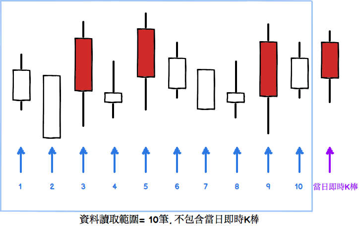 -->


在上圖內藍色這個區塊就是資料讀取範圍，這個數值的定義根據不同腳本類型而異：

| 腳本類型 | 資料讀取範圍                                                                                                                                                                                                                                       |
| -------- | -------------------------------------------------------------------------------------------------------------------------------------------------------------------------------------------------------------------------------------------------------- |
| 指標   | 指標總共要畫多少筆K棒，不包含當日即時的K棒範圍。 預設值是商品的全部資料長度。                                                                                                                                       |
| 警示   | 警示腳本要先執行多少筆之後開始進行即時的洗價以及是否要觸發。請注意這個範圍不包含當日即時的K棒。預設值是200。假設資料讀取範圍是10的話，那警示腳本會先執行當日之前的10根K棒，接下來執行當日即時的K棒，接下來等待收到即時資料後在執行時才會判斷是否要觸發。 |
| 選股   | 選股腳本要執行多少筆之後才判斷最後一根K棒是否觸發。 預設值是10。假設資料讀取範圍是10的話，則表示選股腳本總共要跑10筆資料，同時判斷第10筆資料是否ret=1。                              |

那我們設定資料讀取範圍時，到底該用什麼樣子的數值才對呢？這個問題沒有一個標準答案，必須依照腳本的內容來判斷。有一些指標，例如EMA均線，或是MACD指標，由於計算時會不斷的引用前一筆計算的數值做累計的平均，像這樣子的腳本，就會需要一個比較大的資料讀取筆數。反之，如果一個腳本內只會使用到最近固定期別的數字的話，那資料讀取筆數就不用設的很大。

資料讀取參數除了可以指定最近筆數之外，也可以指定一個固定的起始日期，這樣子可以方便使用者有更精準的控制。另外如果實際上這個商品並沒有那麼多筆資料的話，系統就會自動調整資料讀取筆數，以商品有的資料為基準。

### 最大引用範圍

執行腳本時，除了資料讀取筆數這個參數會影響腳本執行的筆數之外，另外由於腳本內常常需要讀取之前的資料來做計算，例如要計算3日收盤價平均值時，會引用到上一根K棒的收盤價以及上上一根K棒的收盤價：

```xscript

Value1 = (Close + Close[1] + Close[2]) / 3;

```

所以在腳本要執行之前，系統除了要準備資料讀取範圍內的K棒資料之外，另外也需要往前多準備一些K棒資料：

<!--  -->


在上面圖示內，資料讀取範圍左邊的這一個黃色區塊，就叫做最大引用範圍。這個範圍的目的是為了讓腳本可以正確的參考到目前執行的這根K棒往前的資料。同樣的，這個範圍的大小，會跟腳本內會參考到幾期前的資料有關。系統在開始執行時會提供一個預設值，如果在執行過程內腳本參考到了範圍之外的資料而發生錯誤的話，系統還是會繼續執行，改由下一根K棒開始重新計算。

在下面這張圖內，假如腳本的內容是

```xscript

Value1 = Close - Close[5]; {計算５日漲幅}

```

由於最大引用筆數只有4筆，所以腳本要去讀取Close[5]的時候會發生錯誤。這時候系統就會重新調整執行的範圍，從發生錯誤的下一筆開始重新執行。

<!-- 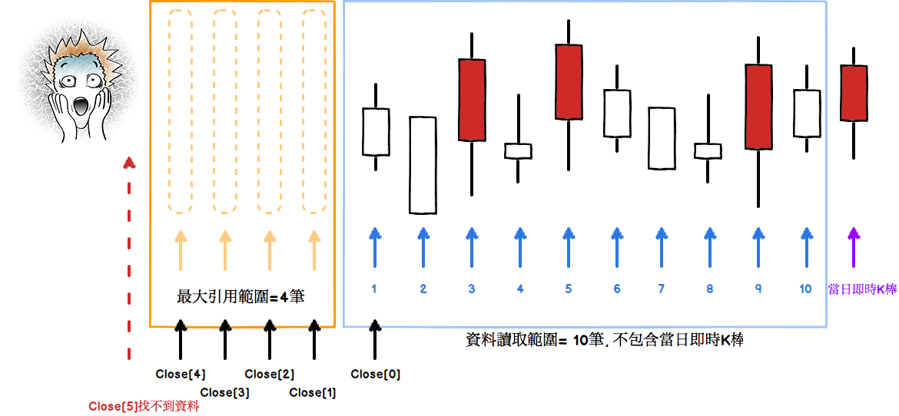 -->


發生錯誤之後系統自動重新調整最大引用範圍

<!-- 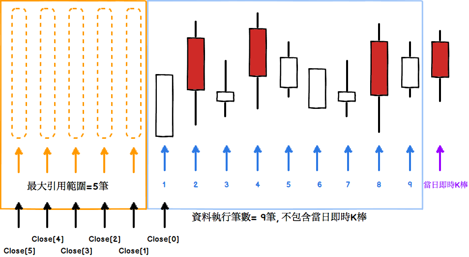 -->


注意到系統會往右一筆重新執行，讓最大引用範圍變大，這樣子一來，執行的筆數會變少，可是就不會發生錯誤了。由於系統執行時會自動處理這種情形，使用者在大部分的情形底下可以完全忽略最大引用範圍這個參數。可是如果腳本的引用範圍很大的話，那則可以從腳本內透過函數的呼叫來告訴系統這個參數，已減少執行時發生錯誤的機會。這部分在底下會有範例說明。

講完了基本的觀念之後，接下來我們來看不同類型的腳本的設定方式。

### XS自訂指標

在技術分析圖形上面放入XS自訂指標時，目前系統預設指標腳本的資料讀取筆數就是這個商品的全部歷史資料，技術分析的設定畫面上也就不提供指定資料讀取範圍的參數，你只要把指標放到技術分析圖上面就對了！！

針對特殊的情境，可以在屬性設定的視窗，直接指定計算資料的長度或起始日。

<!--  -->


或是可以透過以下的函數從腳本內控制指標資料的長度：

```xscript

SetTotalBar(300);

```

如果在指標腳本內引用SetTotalBar(300)的話，那這個指標就只會畫最新的300筆資料(不包含當日即時的資料)。如果你希望可以從某個指定日期開始畫圖，可以使用這一版新提供的SetFirstBarDate函數：

```xscript

SetFirstBarDate(20150101);

```

這樣子的話指標就會從20150101日開始畫圖。

至於最大引用範圍這個參數，系統會根據使用者指定的資料範圍來推算一個預設值。使用者也在腳本內透過SetBackBar這個函數來做控制：

```xscript

SetBackBar(50);

```

另外還有一個 SetBarBack函數，他的用途跟SetBackBar是一模一樣的。

### XS策略雷達

設定警示畫面內可以指定資料讀取筆數或是第一筆資料的日期：

<!-- 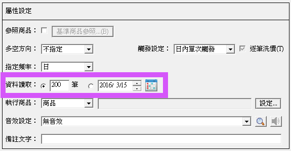 -->


進階的使用者也可以從腳本內直接透過 SetTotalBar 或是 SetFirstBarDate 這兩個函數來控制資料讀取筆數。同樣的，在腳本內也可以透過 SetBackBar函數來控制最大引用筆數。

### XS選股

設定選股策略時可以指定資料讀取筆數或是第一筆資料的日期：

<!-- 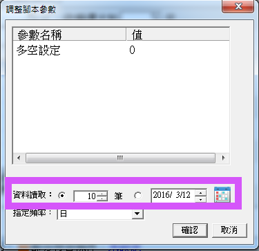 -->


進階的使用者也可以從腳本內直接透過 SetTotalBar 或是 SetFirstBarDate 這兩個函數來控制資料讀取筆數。

至於最大引用筆數這個參數，在XS選股系統內由於執行時已經事先讀取了全部的資料，所以使用者不需要再做設定。

以上為大家介紹了資料讀取筆數的觀念，以及設定的方式。相關的函數請參考函數說明文件。有任何問題或是建議的話，也歡迎您隨時跟我們說喔。

[返回](#xs語法應用)

## SetBackBar指定頻率設定資料筆數

[返回](#xs語法應用)

## 探討變數序列的觀念：幾天前黃金交叉商品為例

[返回](#xs語法應用)

## 如何運用Print指令來抓程式的臭蟲

[返回](#xs語法應用)

## 選股欄位放大鏡：談OutputField跟GetFieldDate這兩個函數

[返回](#xs語法應用)

## 計算區間漲跌幅的自訂函數

[返回](#xs語法應用)

## 那些股票中長紅之後還會續漲?

[返回](#xs語法應用)

## 私房交易策略之：強勢股整理結束

[返回](#xs語法應用)

## 關於背離的寫法

[返回](#xs語法應用)

## 利用GetSymbolInfo函數計算選擇權的希臘字母Delta

[返回](#xs語法應用)

## 利用InputKind函數製作跨頻率週期的選取介面

[返回](#xs語法應用)

## 盤中即時資料欄位的應用

在這一篇文章內我們會跟大家介紹另外一個7.02/3.02版所新增的XS功能：「盤中即時資料欄位」。

什麼叫做「盤中即時資料欄位」呢？在7.02/3.02之前的版本，資料欄位(例如內盤量，外盤量，外資買賣超，等)所支援的最快更新頻率都是日頻率，也就是說如果你的自訂指標或是策略雷達是執行分鐘頻率的話，你還是只能抓到昨日的數值，沒辦法抓到更精細的欄位，例如9:01分的數值，9:02的數值等。

以外資買賣超這種一天才公布一次的欄位而言，受限於資料來源，XS沒辦法提供分鐘頻率的數值。可是如內盤量，外盤量這種是以成交明細所統計出來的資料欄位，從7.02/3.02版開始，你就可以抓到每分鐘的數值了。因為這些資料欄位的數值可以在盤中即時抓到，即時更新，所以我們稱這些欄位為「盤中即時資料欄位」，換句話說，所謂「盤中即時資料欄位」指的是支援分鐘頻率的資料欄位。

從腳本內要怎麼樣取得這些欄位呢？一樣是透過GetField的語法：

```xscript

value1 = GetField("內盤量", "1"); // 取得1分鐘頻率的數值
value2 = GetField("內盤量", "2"); // 取得2分鐘頻率的數值
value3 = GetField("內盤量", "5"); // 取得5分鐘頻率的數值
value4 = GetField("內盤量");      // 不指定頻率: 依照目前執行的頻率

```

語法上最大的差異是頻率欄位可以直接傳入預期的分鐘頻率(只要是XQ目前有支援的分鐘頻率都可以使用)。如果雷達/指標是執行分鐘頻率的話也可以不指定頻率，執行時會依照執行的頻率來抓取對應的數值。

透過IDE的插入欄位功能也可以選到常用的分鐘頻率：

<!-- 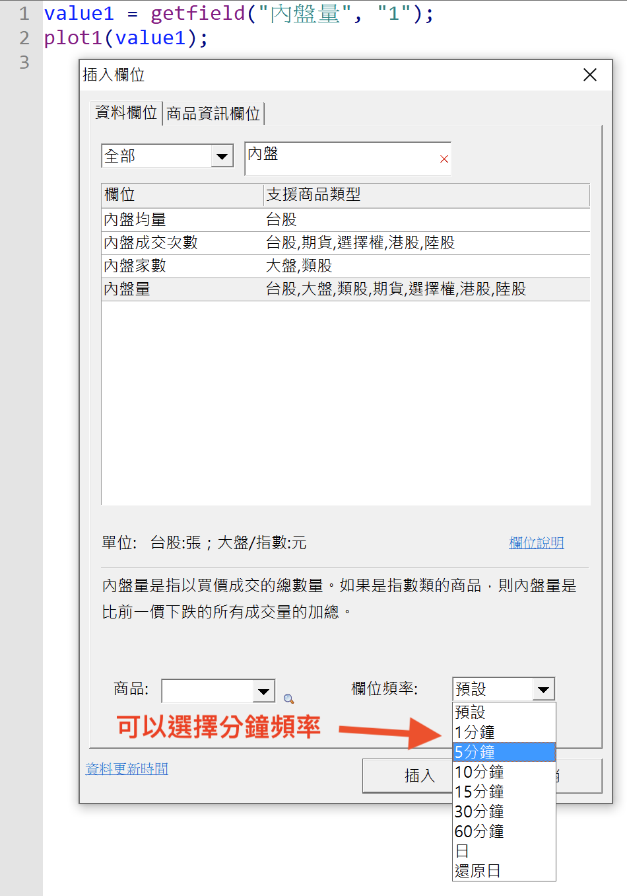 -->


這些「盤中即時資料欄位」所支援的最小頻率都是1分鐘。如果你使用的是比較大的頻率的話(例如5分鐘頻率)，那腳本所抓到的數值就會依照這個欄位的定義來決定。計算的方式有兩種：

- 累積值：例如「內盤量」欄位，5分鐘頻率所抓到的「內盤量」就是這5分鐘內每一個1分鐘「內盤量」的累積數值，
- 期末值：例如「均價」欄位，5分鐘頻率所抓到的「均價」就是最後1分鐘的「均價」數值

底下列出7.02版所支援的「盤中即時資料欄位」，如果想要了解欄位的詳細內容的話，請點選每個欄位名稱的連結。

| 欄位名稱                                                          | 說明                                                                           |
| --------------------------------------------------------------------- | -------------------------------------------------------------------------------- |
| 成交金額                                                          | 當分鐘的成交金額                                                         |
| 均價                                                                | 開盤到目前為止的成交均價                                             |
| 內盤量/外盤量                                                   | 當分鐘的內盤成交量/外盤成交量                                      |
| 上漲量/下跌量                                                   | 當分鐘的上漲成交量/下跌成交量                                      |
| 估計量                                                             | 到目前為止的當日估計量                                                |
| 量比                                                                | 估計量 / 昨日整日的成交量                                             |
| 總成交次數/內盤成交次數/外盤成交次數                 | 當分鐘的成交筆數/以內盤成交的成交筆數/以外盤成交的成交筆數 |
| 買進特大單量/買進大單量/買進中單量/買進小單量    | 依照單筆交易金額分級，統計當分鐘以外盤成交的特大單/大單/中單/小單的成交量(張數) |
| 賣出特大單量/賣出大單量/賣出中單量/賣出小單量    | 依照單筆交易金額分級，統計當分鐘以內盤成交的特大單/大單/中單/小單的成交量(張數) |
| 買進特大單金額/買進大單金額/買進中單金額/買進小單金額 | 依照單筆交易金額分級，統計當分鐘以外盤成交的特大單/大單/中單/小單的成交金額(元) |
| 賣出特大單金額/賣出大單金額/賣出中單金額/賣出小單金額 | 依照單筆交易金額分級，統計當分鐘以內盤成交的特大單/大單/中單/小單的成交金額(元) |
| 買進特大單成交次數/買進大單成交次數/買進中單成交次數/買進小單成交次數 | 依照單筆交易金額分級，統計當分鐘以外盤成交的特大單/大單/中單/小單的成交筆數 |
| 賣出特大單成交次數/賣出大單成交次數/賣出中單成交次數/賣出小單成交次數 | 依照單筆交易金額分級，統計當分鐘以內盤成交的特大單/大單/中單/小單的成交筆數 |
| 累計委買/累計委賣/累委買筆/累委賣筆                   | 由交易所公布，開盤到目前的累計委買委賣張數(口數)，以及累計委買委賣筆數 |
| 累買成筆/累賣成筆                                             | 由交易所公布，開盤到目前的以委買成交的筆數以及以委賣成交的筆數，支援期貨／選擇權 |
| 累計成交/累成交筆                                             | 由交易所公布，開盤到目前的累計成交數量以及成交筆數      |
| 漲停家數/跌停家數/上漲家數/下跌家數                   | 目前最新成交價是漲停/跌停/上漲/下跌的家數統計               |
| 內盤家數/外盤家數                                             | 當分鐘的內盤家數/外盤家數                                            |
| 基差                                                                | 當分鐘現貨價格與期貨價格之間的差額                              |
| Delta/Gamma/Theta/Vega/RHO                                            | 權證/選擇權的希臘數字                                                  |
| 理論價                                                             | 目前最新的理論價格                                                      |
| 波動率                                                             | 當分鐘的波動率                                                            |
| 隱含波動率                                                       | 當分鐘的隱含波動率                                                      |
| 買權成交量/賣權成交量                                       | 開盤到現在的買權/賣權成交量總和。夜盤商品不納入計算。  |

看完欄位清單之後，那我們就使用這些欄位來做幾個簡單的應用。

首先開啟IDE，新增一個指標腳本，取名為「當日賺賠」，輸入以下的程式碼：

```xscript

value1 = GetField("均價");
value2 = weightedclose - value1;

plot1(value2, "賺賠");

```

開啟技術分析圖，切換到5分鐘頻率，然後加入這個指標，顯示方式改成正負柱狀圖，你會看到類似下方的畫面。

<!-- 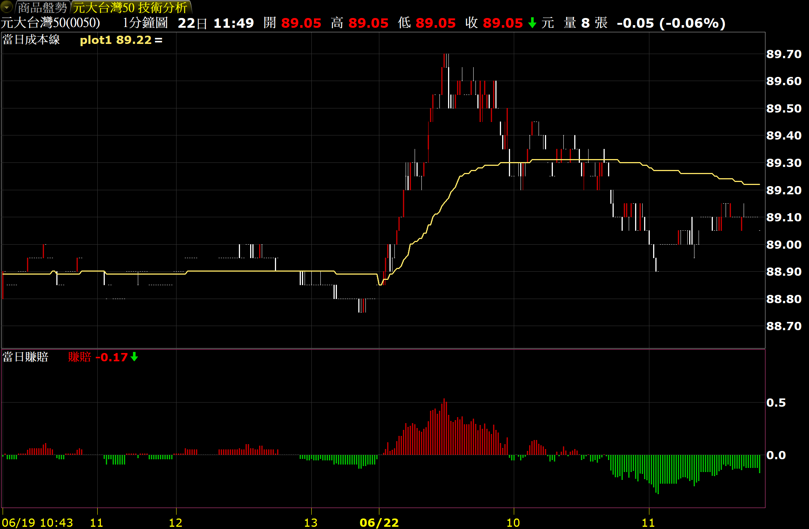 -->


在這個指標內所繪製的是當根K棒的加權平均價(WeightedClose)減去當日均價的數值。這個數值如果是正的，表示到目前為止，今天進場的人大多是賺錢的。你也可以試看看切換不同的分鐘頻率。

「即時資料欄位」除了可以在自訂指標內使用之外，當然也可以在雷達內使用。接下來新增一個警示腳本，取名為「特大單買盤進場」，然後輸入以下的程式碼：

```xscript

value1 = GetField("買進特大單量", "1") - GetField("賣出特大單量", "1"); 
if value1 > 0 then ret=1;

```

把這個腳本加到策略雷達內，選擇1分鐘頻率，勾選逐筆洗價，K棒內單次觸發，指定你想要監控的商品，開始執行後如果當分鐘特大單是買超的話，策略雷達就會產生警示，提醒你這檔商品可能有大戶要開始進場了。

到這裡對於「即時資料欄位」這個新的功能是否有更清楚了呢？小編在這裡做個整理：「即時資料欄位」是盤中會即時更新的資料序列，主要的應用情境是分鐘頻率，支援自訂指標以及策略雷達（並不支援選股）。至於回測的功能，我們還在努力開發中，等可以使用時會盡快讓大家知道。

下一篇文章「[Tick欄位的應用](#tick欄位的應用)」我們將會為你介紹另外一個功能，有興趣的同學可以繼續看下去！

[返回](#xs語法應用)

## Tick欄位的應用

在上一篇文章「盤中即時資料欄位的應用」，我們介紹了如何在腳本內引用「即時資料欄位」來繪製指標或是執行警示，在這一篇文章內我們將為大家介紹另外一種盤中會即時更新的資料: Tick資料。

什麼是Tick資料呢？Tick資料簡單的來說，就是每一筆成交資料。

<!-- 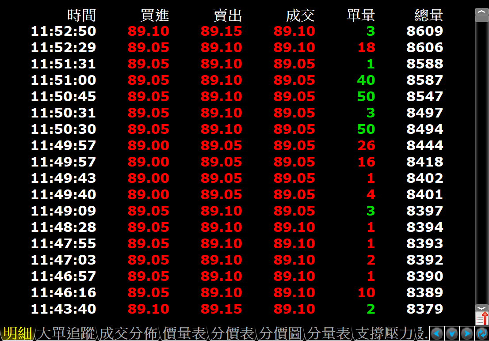 -->


從7.02版開始，你可以從腳本內取得每一筆成交資料的詳細資料，除了成交時間，成交價格，成交單量之外，還可以取得這一筆成交資料的內外盤標記(這一筆是外盤成交，還是內盤成交呢？)。以下是Tick資料所支援的所有欄位，以及從腳本內讀取資料的範例：

```xscript

value1 = GetField("Date", "Tick");   // 成交日期，例如20200611 (2020年6月11日)
value2 = GetField("Time", "Tick");   // 成交時間，例如103011 (10點30分11秒)
value3 = GetField("Close", "Tick");  // 成交價格
value4 = GetField("Volume", "Tick"); // 成交單量
value5 = GetField("BidAskFlag", "Tick"); // 內外盤標記: 1代表外盤成交(紅色), -1代表內盤成交(綠色), 0代表中立
value6 = GetField("BidPrice", "Tick"); // 買進價格
value7 = GetField("AskPrice", "Tick"); // 賣出價格
value8 = GetField("SeqNo", "Tick");  // 資料編號, 每個交易日從1開始編制, 第一筆是1, 第二筆是2, 以下類推

value22 = GetField("Close", "Tick")[1]; // 前一筆成交價格
value23 = GetField("Close", "Tick")[2]; // 前兩筆成交價格

```

透過Tick資料，我們從腳本內就可以更掌握目前的行情資料。我們來看一個大單篩選的警示範例，假如我們希望商品出現單筆成交量大於100張的成交時就通知我們的話，可以用底下這個警示腳本來完成：

```xscript

input: filterMode(1, "篩選方式", inputkind:=dict(["買盤",1], ["賣盤",-1]));
input: filterVolume(100, "大單門檻");

value1 = GetField("Time", "Tick"); // 時間
value2 = GetField("Close", "Tick"); // 價格
value3 = GetField("Volume", "Tick"); // 單量
value4 = GetField("BidAskFlag", "Tick"); // 外盤=1, 內盤=-1

if value4 = filterMode and value3 >= filterVolume then ret=1;

```

我們把這個腳本加到策略雷達內，選擇1分鐘頻率，勾選逐筆洗價，同時指定要篩選的參數，例如filterMode選擇買盤，filterVolume選擇100，這樣子就完成了。

<!-- 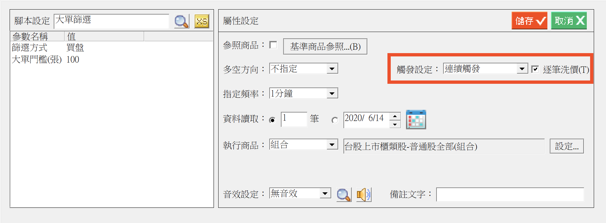 -->


Tips: 上面這個腳本有使用到inputKind這個語法，讓參數設定時可以用選單的方式來挑選。有興趣的同學可以參考inputKind的說明。

### Tick欄位 v.s. 報價欄位

在XS腳本內，你也可以透過報價欄位來取得盤中的行情欄位，例如q_Last可以取得最新一筆成交價格，q_TickVolume可以取得最新一筆成交單量，也可以透過q_BidAskFlag來取得最新一筆成交的內盤外盤註記。

那在這個腳本內為何不使用報價欄位，而要使用Tick欄位呢？

要說明這個問題時請大家先看底下這張圖：

<!-- 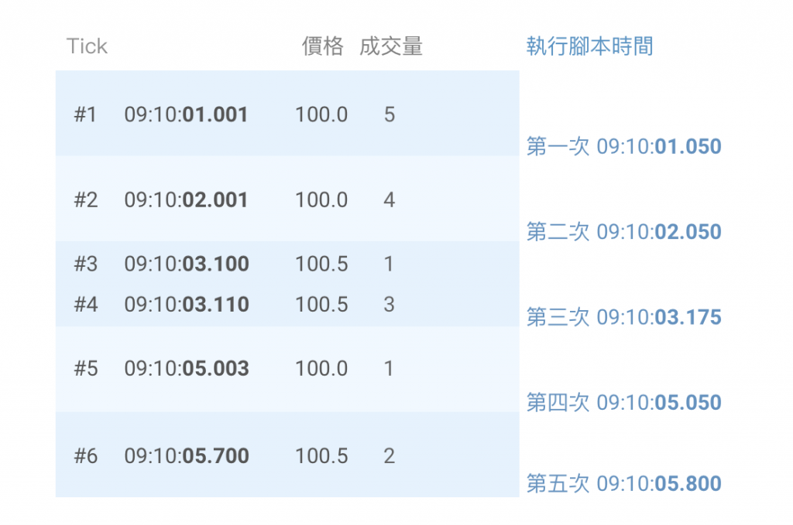 -->


從上面這張圖內我們可以觀察到XS洗價的執行方式：

- 啟動逐筆洗價時，當系統收到成交資料時就會觸發K棒的洗價，
- 一般而言每收到一筆成交就會觸發一次K棒的洗價，請注意上圖內的洗價時間是示意資料，實際洗價時間會因為電腦CPU，指定的洗價速度等因素而有差異，
- 可是如果快市的話，就有可能不是每一筆Tick都觸發一次洗價，而是好幾筆Tick才觸發一次洗價，例如在上面這張圖內, Tick編號#3跟Tick編號#4兩筆資料的間隔時間很短，所以觸發洗價時已經收到兩筆Tick了(編號#3跟編號#4)，
- 報價欄位所回傳的是目前最新的行情，在上面這個情形時就是編號#4的數值，所以大部分的時候報價欄位的數值會等於最新一筆Tick的資料，
- 可是有可能在電腦洗價時又收到了更多的成交資料，此時報價欄位會更新，q_Last就不一定會跟洗價時K棒的Close是一樣的數值，例如在上面這張圖內，執行第四次洗價時如收到了編號#6的Tick的話, q_Last會被更新成編號#6的資料，此時就會跟第四次洗價時所抓到的價格不一樣，
- 如果在洗價時去抓取Tick資料的話，則系統會保證此時抓到的Tick資料跟洗價當時的K棒內容是一致的。例如第四次洗價時抓到的Tick會是編號#5的Tick，縱使洗價當時編號#6的Tick已經收到了，
- 腳本可以在洗價當時透過讀取Tick資料的方式來抓到兩次洗價之間的所有Ticks：例如在第四次洗價時抓到的Tick是編號#5的Tick，此時腳本可以再抓取「前一筆」Tick，就會抓到編號#4的Tick，

K棒洗價的速度可以透過系統的設定功能來指定，如果調整成最快的話約是125ms會執行一次洗價，如果調整成最慢的話則是每1秒執行一次洗價，使用者可以依照腳本複雜度，CPU的等級等來決定合適的數值。

<!-- 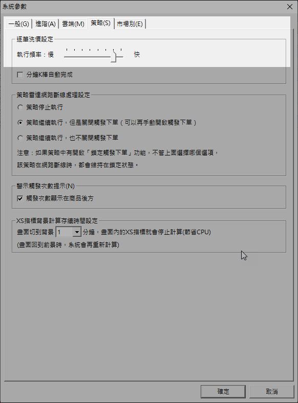 -->


### 如何抓到每一筆Tick資料

雖然在快市時不一定可以每次收到成交資料時就執行洗價，可是我們還是可以利用以下的技巧來抓到上一次洗價到這一次洗價之間的所有Tick資料：

- 每一筆Tick資料有一個「SeqNo」的欄位，這個欄位代表的是這一筆Tick是這個交易日的第幾筆，每個交易日會重新從1開始編制，
- Tick資料跟1分K, 5分K一樣，都是一個序列，可以使用[1]，[2]的語法來取得前一筆的數值

所以如果我們在腳本內記住這一次洗價時的SeqNo的數值，然後在下一次洗價時比對當時的SeqNo，就可以知道這兩次洗價之間相隔幾筆Tick，然後透過[n]的方式就可以把這些Tick資料都讀出來。例如上一次洗價時SeqNo是3，而這一次洗價時SeqNo是5，那麼這兩次之間就隔了兩筆Tick，所以腳本只要讀取當時的Tick，跟前一筆Tick資料(共兩筆)，就可以清楚知道兩次洗價之間市場的變化了。

我們把大單篩選的腳本改用這樣子的方式來撰寫。觸發的邏輯改成是如果兩次洗價之間出現了任何一筆大單的話，都顯示警示。

```xscript

input: filterMode(1, "篩選方式", inputkind:=dict(["買盤",1], ["賣盤",-1]));
input: filterVolume(100, "大單門檻");

var: intrabarpersist last_seqno(0);// 上次洗價時最後一筆Tick的SeqNo
var: curr_seqno(0);// 這次洗價時最後一筆Tick的SeqNo

if Date <> CurrentDate then return;// 只跑今日的資料

curr_seqno = GetField("SeqNo", "Tick");// 最新一筆Tick編號

if last_seqno = 0 then last_seqno = curr_seqno - 1; // 第一次洗價時只洗當時那一筆

var: seq_no(0), offset(0);
seq_no = curr_seqno;
offset = 0;
while seq_no > last_seqno begin

  // 讀取Tick資料
  value1 = GetField("Time", "Tick")[offset];
  value2 = GetField("Close", "Tick")[offset];
  value3 = GetField("Volume", "Tick")[offset];
  value4 = GetField("BidAskFlag", "Tick")[offset];

  if value4 = filterMode and value3 >= filterVolume then begin
    ret=1;
  end;

  seq_no = seq_no - 1;
  offset = offset + 1;
end;

last_seqno = curr_seqno;

```

上面這個腳本比較長一點，所以我們花點篇幅說明處理的方式:

- 第3行內宣告了last_seqno這個變數，這個變數是用來儲存上一次洗價時所對應的SeqNo，由於我們採用逐筆洗價方式，所以必須宣告成intrabarpersist，才可以讓這個變數的數值在同一根bar內可以正常更新，
- 每一次洗價時腳本會抓取當時的SeqNo (第9行)，然後把這個數值存在curr_seqno這個變數內，
- 腳本內使用while語法，來跑過curr_seqno到last_seqno之間的所有資料(第16行開始)，
  - 假如last_seqno是3，而curr_seqno是5的話，那這兩次洗價之間總共有2筆Tick資料，編號分別是4跟5(3的那一筆上一次已經讀過了)，
  - 腳本內宣告了offset這個變數(第13行)，用來控制往前讀取的位置，一開始offset = 0(第15行)，
  - 進入while loop後，第一次讀到的是GetField("Close", "Tick")[0](第19~22行)，也就是編號5的這一筆，
  - 每跑一次loop，offset會加1(第29行)，表示下一次我們會往前再讀一筆，
  - 第二次while loop讀到的是GetField["Close", "Tick"](1), 也就是編號4的這一筆，
  - 我們用seq_no這個變數來控制while loop的次數，seq_no一開始是curr_seqno(第14行)， 也就是5， 每一次loop seq_no會減1(第28行)（因為我們是往前讀），
  - 這個while loop總共跑了2次：第一次seq_no = 5，第二次=4，第二次跑完之後seq_no變成3， 此時就跳出loop了，
  - 全部跑完之後，要記得更新last_seqno (第32行)

這次的介紹到這裡先告個段落，在下一篇文章「[台股逐筆撮合的連續成交Tick序列](#台股逐筆撮合的連續成交tick序列)」，我們會再介紹台股逐筆撮合制度所產生的另外一種資料，也會跟大家介紹系統內建的ReadTicks函數，透過這個函數來簡化讀取Tick資料的流程。

下次再見囉。

[返回](#xs語法應用)

## 台股逐筆撮合的連續成交Tick序列

大家好。在上一篇文章「[Tick欄位的應用](#tick欄位的應用)」，我們說明了如何從腳本內取得「Tick」頻率的欄位。在這一篇文章內我們要介紹台股逐筆撮合制度上線後所產生的另外一種成交方式，我們稱之為「連續成交序列」。

大家先看一下底下這張圖：

<!-- 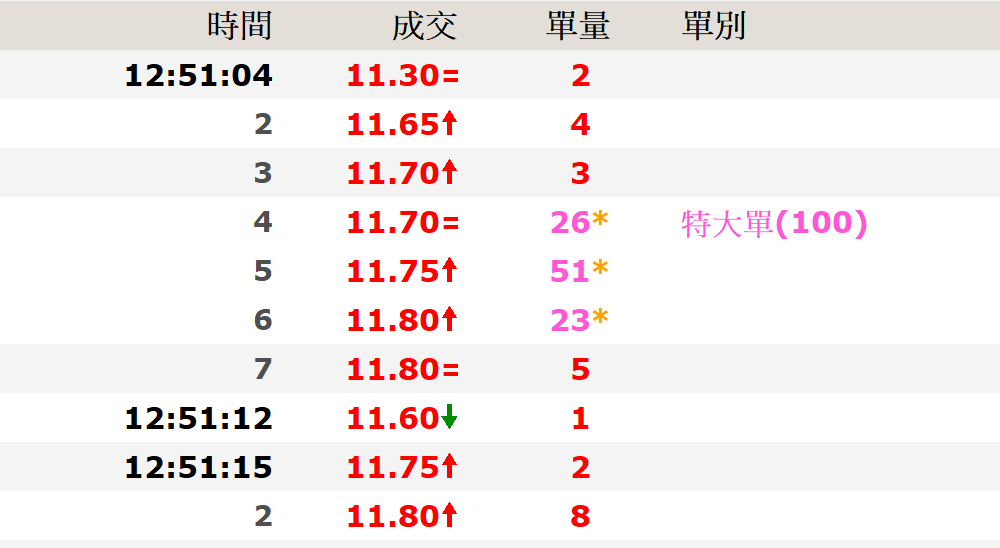 -->


注意到在12:51:04秒左右有三筆資料後面有標示星號，成交價分別是11.70元26張，11.75元51張，以及11.80元23張，可是這個星號是什麼意思呢？

之所以會有這個星號，是因為這三筆成交是由同一筆買進委託所產生的，而這一筆買進委託的委託量是100張，而且委託價格是11.8元。當交易所收到這一筆委託時，因為當時最低的委賣價是11.70元，只有26張委賣量，所以這一筆委託先撮合出11.70元26張的成交之後，接著交易所繼續撮合次高的委賣價11.75元51張，最後再撮合11.80元的委賣23張(26 + 51 + 23 = 100張)。

底下是這筆成交發生之前委賣五檔委託簿的樣子，請注意委賣價格以及委賣數量。

<!-- 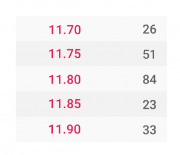 -->


當發生這種情形時，因為產生了三筆不同的成交，所以交易所會傳送出3筆連續的成交資料。可是如果我們去思考這次成交的買賣力道時，觀察的重點應該是產生這一系列成交的這一筆委買單，所以在大單追蹤這個畫面內我們用星號把這幾筆成交資料的關係標示出來，計算單別時也會把這三筆成交加總，來判斷這一筆的實際力道。

那麼這樣子的資訊，是不是可以從XS內得知呢？Yes，We Can。

```xscript

value1 = GetField("TickGroup", "Tick");

```

在Tick資料內有一個欄位叫做「TickGroup」，這個欄位是用來標示這一筆成交資料是怎麼撮合出來的，總共有5種可能的數值：

- -1: 表示這一筆成交並不是逐筆撮合所產生的。例如開盤的第一筆成交，收盤的那一筆成交都會標示-1，
- 0: 表示這一筆成交是逐筆撮合所產生的，只有撮出一筆，
- 1: 表示這一筆成交是連續成交序列內的第一筆，
- 2: 表示這一筆成交是連續成交序列內中間的任何一筆，
- 3: 表示這一筆成交是連續成交序列內的最後一筆

<!-- 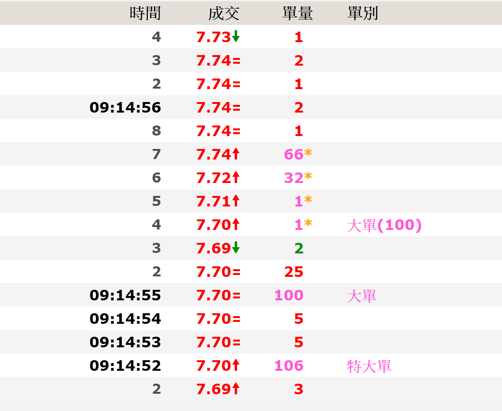 -->


如果對照到上面大單分析的那張圖的話，7.70元的那一筆的TickGroup是1，7.71 元以及7.72元的那兩筆的TickGroup都是2, 7.74元的那一筆的TickGroup是3。在腳本內，就可以藉由TickGroup這個欄位，把連續成交序列的每一筆Tick找出來，然後計算這個連續成交序列的總成交量。

為了簡化讀取Tick資料的流程，7.02版新增了一個ReadTicks函數，可以協助我們自動把把連續成交序列合併統計，讓腳本的的邏輯可以更簡單。我們把上一篇文章「[7.02-盤中即時資料欄位的應用](#盤中即時資料欄位的應用)」內的篩選大單的腳本改用ReadTicks這個函數來重寫：

```xscript

input: filterMode(1, "篩選方式", inputkind:=dict(["買盤",1], ["賣盤",-1]));
input: filterVolume(100, "大單門檻");

var: intrabarpersist readtick_cookie(0);// ReadTicks內部使用, 每次呼叫時請照實傳入
array: tick_array[100, 11](0);// 需要宣告一個2維陣列來儲存Tick資料
var: row_count(0), idx(0);

// 讀取Tick資料
row_count = ReadTicks(tick_array, readtick_cookie);
for idx = 1 to row_count begin
  if tick_array[idx, 5] = filterMode and tick_array[idx, 10] >= filterVolume then begin
    ret=1;
  end;
end;

```

要呼叫ReadTicks之前，我們要先準備一個二維的陣列(第5行的tick_array)，一個二維陣列就像是一個Excel的表格，呼叫完ReadTicks之後，每一橫列會儲存一筆Tick資料，而這一筆Tick資料的每個欄位則會存在這個橫列的每一行裡面。

除了這個陣列之外，我們還需要準備一個變數(第4行的readtick_cookie)，這個變數用來讓ReadTicks函數可以紀錄上次讀到的Tick資料位置。

接著每一次洗價時，我們就請ReadTicks函數讀取上次洗價到目前為止的所有Tick資料(第13行)，ReadTicks會回傳這次讀回的筆數(row_count)，接著我們就用for迴圈來檢視讀到的Tick資料。

ReadTicks讀回的Tick資料會存放在tick_array內，最新的一筆是第一個橫列(row), 前一筆是第二個row，以下類推。每一個row內包含11個欄位(column)，內容分別是：

- 第1個column是日期
- 第2個column是時間
- 第3個column是成交價
- 第4個column是成交量
- 第5個column是內外盤註記
- 第6個column是這一筆Tick的編號(SeqNo)
- 如果ReadTicks遇到多筆連續成交序列時，他會把這些Ticks都合併成1個row，第7個column存放的是這個連續成交序列總共有多少筆
- 如果這是連續成交序列的話，第8個column存放的是這個連續成交序列的第一筆的位置，第9個column存放的則是這個連續成交序列最後一筆的位置
- 第10個column存放的是這些連續成交序列的總成交量，如果這不是連續成交序列的話，這個column存放的則是這一筆的成交量(跟第四個column相同
- 第11個column存放的是這些連續成交序列的總成交金額(元)，如果這不是連續成交序列的話，這個column存放的則是這一筆的成交金額

所以透過ReadTicks之後，我們就可以很簡單的檢查這一筆資料是否符合我們要篩選的規則

```xscript

if tick_array[idx, 5] = filterMode and tick_array[idx, 10] >= filterVolume then ...

```

上面這個判斷式內，tick_array[idx, 5]是內外盤註記，而tick_array[idx, 10]則是這一筆成交的總量(或是連續成交序列的總量)！

到這裡為止，我們已經跟大家說明了Tick資料的所有欄位以及應用的方式，大家如果有任何建議或是問題的話，麻煩到我們的臉書或是XS技術支援區留言。下次再見囉。

[返回](#xs語法應用)

## 選股中心創掛牌新高與大單欄位的應用

[返回](#xs語法應用)

## 取得資料欄位時的「對位問題」

[返回](#xs語法應用)

## XS美股欄位的使用介紹

[返回](#xs語法應用)

## XS美股新增欄位列表

[返回](#xs語法應用)

## GetField 預設值

使用者在取得資料欄位時，有時會遇到資料尚未更新或欄位缺失的情況，這可能導致回測或執行時發生錯誤。 為避免此類問題，GetField 欄位新增了預設值參數，當資料缺失時，可回傳指定的預設值，確保策略順利執行。 除了預設值以外，還有其他函數可用來判斷欄位是否可用以及欄位名稱等參數是否正確。

### default

```xscript

Value1 = GetField("大戶持股比例", "W", default := 0); 
Value2 = GetSymbolField("2330.TW", "大戶持股比例", "W", default := Value2[1]);

```

GetField / GetSymbolField 在傳入參數時，現在可額外加上 default 參數。 此參數可以是固定數值 （ 如上方範例 0 ） 或是變數 （ 如上方範例 Value2[1] ）。

當欄位資訊輸入正確時，以下情境支援預設值：

- 資料尚未更新。
- 資料中間有空值。
- 資料讀取範圍內沒有資料。
- 資料序列為空。 例如： 從未發生不定期欄位事件的商品。

以下情境則不支援預設值：

- 取未來值。
- 回測頻率為 1 分鐘逐筆洗價取 Tick 或是分鐘頻率資料欄位，因無法對位故會發生錯誤。
- 不支援的商品 ／ 頻率。
- 回測範圍內沒有發生過不定期欄位的事件。 （ 會回最新一筆 ）

### CheckField

```xscript

CheckField("外盤量", "D");
CheckSymbolField("TSE.TW", "外盤量");

```

CheckField / CheckSymbolField 會依據傳入的商品代碼、欄位和頻率來判斷該資料是否能夠取用，回傳 True / False。

### IsSupportField

```xscript

IsSupportField("月營收", "M");
IsSupportSymbolField("TSE.TW", "月營收");

```

IsSupportField / IsSupportSymbolField 可根據傳入的商品代碼、欄位和頻率，判斷指定的欄位是否存在，回傳 True / False。

需注意此函數並不會判斷對應 K 棒上是否有資料，只會判斷欄位是否存在。

因此，可能會發生函數回傳 True ，但該根 K 棒上沒有資料的情況。

[返回](#xs語法應用)

## 商品清單功能 (Group)

目前 XS 語法可透過 GetSymbolField 取得不同商品的資料欄位，但在指定商品的狀況下僅能透過 Input 參數或直接輸入商品代號字串，當需要處理大量商品時，腳本撰寫會變得相對複雜 。

此次更新新增了商品清單功能，使用者可在 Input 參數中設定所需的商品清單，或透過新建立的 Group 語法獲取指定商品的成分股、期貨或可轉債等商品清單，並搭配 GetSymbolField 快速取得所需資訊。

### 透過 Input 宣告清單

```xscript

Input: myGroup(Group);
Var: _TF(False);

Value1 = GetSymbolField(myGroup[1], "Close", "D");
_TF = GetSymbolInfo(myGroup[1], "可放空");

```

上述範例使用 Input 語法宣告了一個清單 myGroup ，允許在指標或策略中設定所需的商品清單 。 myGroup 是一個陣列，存放清單中的商品代號，並可透過 [N] 來取得陣列中第 N 個商品代號 。 GetSymbolField 和 GetSymbolInfo 在這次修改中增加支援 Group 清單的功能 （ 需注意還是無法使用變數指定商品代碼 ） 。

從 Input 宣告的 Group 有四種方法可以設定清單 ：

- 商品： 使用者自行輸入所需商品
- 組合： 使用者選擇所需的組合 （ 包含自選股 ）
- 選股： 使用者選擇一個選股中心策略 （ 選股中心策略不能選擇其他選股中心的策略 ）
- 檔案： 使用者選擇一個外部傳入的檔案 （ 支援 .txt 和 .csv ）

<!--  -->


<!--  -->


以上四種設定方式與目前策略雷達和自動交易中心中設定執行商品的方式相同 。

### 透過 Group 宣告清單

```xscript

Group: myGroup();
Var: _TF(False);

myGroup = GetSymbolGroup("TSE23.TW", "成分股");

Value1 = GetSymbolField(myGroup[1], "Close", "D");
_TF = GetSymbolInfo(myGroup[1], "可放空");

```

上述範例使用 Group 語法宣告了一個清單 myGroup ，接著再透過 GetSymbolGroup 來取得指定商品的成分股 。

GetSymbolGroup 可用來取得系統內建的商品清單 。

- 第一個參數指定要取得清單的商品，例如範例中的 TSE23.TW 。 若未指定商品，則預設取得目前執行商品的清單 （ 前提是該清單存在 ） 。
- 第二個參數指定所需的清單類型，例如範例中的 成分股 ，此參數為必填 。

以下為支援的清單類型 ：

- 清單類型：成分股 (Component)
  - 支援商品：指數商品、細產業商品
  - 說明：
    - 回傳指數 ／ 細產業指數的成分股清單。
    - 支援台灣市場。
    - 指數的範圍為交易所公佈的類股指數，以及XQ所編制的細產業指數 (包含族群)，例如TSE11.TW。
    - 不包含TSE.TW、OTC.TW這種全市場的指數。
  
- 清單類型：權證 (Warrant)
  - 支援商品：股票
  - 說明：
    - 回傳此商品的所有權證商品。
    - 支援台股。

- 清單類型：股期／期貨 (Future)
  - 支援商品：指數 ／ 股票
  - 說明：
    - 回傳此商品的所有期貨。
    - 支援台灣市場。

- 清單類型：可轉債 (CB)
  - 支援商品：股票
  - 說明：
    - 回傳此商品的所有可轉債商品。
    - 支援台股。

- 清單類型：選擇權 (Option)
  - 支援商品：指數 ／ 股票
  - 說明：
    - 回傳此商品的所有選擇權。
    - 支援台灣市場。

(註： 在走勢圖 ／ 技術線圖上的商品名稱點擊右鍵，可確認該商品支援的相關清單類型 )

### 指標腳本的清單選單

```xscript

Input:cb_id("", inputKind:=SymbolGroup("CB"), quickedit:=true);
value1 = GetSymbolField(cb_id, "Close");
value2 = GetSymbolField(cb_id, "Volume");
plot1(value1, "CB走勢");
plot2(value2, "CB成交量");

```

在指標腳本中，若希望使用者能在介面上直接選擇所需的清單商品，可以在 Input 宣告時一併傳入清單類型 。

這樣一來，在技術分析頁面中，使用者即可透過選單快速切換執行商品對應的清單類型 。 例如上述範例中，若執行商品對應到多個可轉債，使用者便能透過選單切換，輕鬆繪製可轉債的價格與成交量 。

### 搭配清單使用的函數

```xscript

Value1 = GroupSize(myGroup);

```

GroupSize 會回傳商品清單包含的數量 。 可以此數值避免取用到超出陣列範圍的資料而導致錯誤 。

### 使用範例

#### 盤中漲幅排行 (警示腳本)

```xscript

input: _S(group, "排行股票");
Array: rankRT[2000, 2](-9999);

SetTotalBar(10);

value1 = GroupSize(_S);

//將清單的 商品代碼 以及 漲跌幅 的數值放入陣列中
for value2 = 1 to value1
begin
    value3 = 100 * (getsymbolField(_S[value2], "Close", default := 0)
            - getsymbolField(_S[value2], "參考價", "D", default := 0))
            / getsymbolField(_S[value2], "參考價", "D", default := 1);
    rankRT[value2, 1] = strtonum(leftStr(_S[value2], 4));
    rankRT[value2, 2] = value3;
end;

//將陣列依據漲跌幅排序後印出
Array_Sort2d(rankRT, 1, value1, 2, false);
print("==========漲跌幅前10==========");
print("日期時間：", numtostr(datetime, 0));
for value2 = 1 to 10
begin
    print(text("排名", numtostr(value2, 0), "商品: "),
            text(numtostr(rankRT[value2, 1], 0), ".TW"),
            " / 漲跌幅: ", rankRT[value2, 2]);
end;
print("==============================");

if symbol = text(numtostr(rankRT[1, 1], 0), ".TW") then ret = 1;

```

上述腳本中宣告了一個清單（ 設定為需要盤中即時排序的商品 ）和陣列，並將清單內的商品代號和漲跌幅存入陣列後進行排序 。

#### 指數成分股的營收加總 (指標腳本)

```xscript

group: _symbolGroup();
var: _sum(0), _num(0);

_symbolGroup = GetSymbolGroup("成分股");
value1 = GroupSize(_symbolGroup);

_sum = 0;
_num = 0;
for value2 = 1 to value1
begin
    if CheckSymbolField(_symbolGroup[value2], "月營收", "M") then
    begin
        _sum += GetSymbolField(_symbolGroup[value2], "月營收", "M");
        _num += 1;
    end;
end;

plot1(_sum);
SetPlotLabel(1, "成分股月營收");
plot2(_num);
SetPlotLabel(2, "有月營收家數");
plot3(value1);
SetPlotLabel(3, "成分股家數");

```

使用者可將執行商品設為指數商品 （ 如 TSE23.TW ） ，並透過 _symbolGroup 取得該指數對應的成分股清單 。

接著使用 CheckSymbolField 判斷指定成分股的月營收欄位是否存在，加總月營收和計算有資料的成分股數量，最後將其畫出 。

#### 對應選擇權的成交金額加總 (指標腳本)

```xscript

group: _list();
var: _uSum(0), _dSum(0), _count(0), _cp("");

_list = getsymbolgroup("選擇權");

_uSum = 0; //買權加總
_dSum = 0; //賣權加總
_count = 0;
for value1 = 1 to groupSize(_list)
begin
    if getsymbolField(_list[value1], "Date", "Tick", default:= 0) = getfield("Date", default:= -999999) then
    begin
        _cp = getsymbolinfo(_list[value1], "買賣權");
        if _cp = "CALL" then
            _uSum += getsymbolField(_list[value1], "Close", "Tick", default:=0) * getsymbolField(_list[value1], "Volume", "Tick", default:=0) * 2000;
        if _cp = "PUT" then
            _dSum += getsymbolField(_list[value1], "Close", "Tick", default:=0) * getsymbolField(_list[value1], "Volume", "Tick", default:=0) * 2000;
    end;
end;

plot1(_uSum, "近一筆買權權利金加總金額");
plot2(_dSum, "近一筆賣權權利金加總金額");

```

這個腳本會加總執行商品該日最近一筆買進權利金的交易金額 （ 買權賣權分開加總 ） ，並將這些總額繪製出來 。 透過觀察這個總額的變化，可以推測市場對該執行商品價格漲跌的看法，就像「以權追股」的功能一樣 。

如果想要根據成交量判斷是否有大額交易，或者只加總最近一段時間的成交金額，可以在腳本中的 For 迴圈部分進行修改 。

[返回](#xs語法應用)

## 排行語法 (Rank)

「排行語法」讓使用者可直接在選股腳本中撰寫排行條件，無需額外撰寫函數腳本，並可靈活運用不同的排行名次作為篩選條件。

### 語法

#### 基礎範例

```xscript

rank myRank
begin
    Value1 = Average(Close, 10);
    retval = (Close - Value1);
end;

if myRank.pos <= 100 then ret = 1;
OutputField1(myRank.value);

```

上面範例中，使用了 rank 宣告了 myRank 的物件，並將收盤價和移動平均線的差距來當作排行的條件。 接著透過呼叫 myRank 物件的 pos 屬性，將前一百名的商品篩選出，並使用 OutputField 將符合條件商品的收盤價和移動平均線差距輸出。

rank 語法只支援選股腳本，其他的腳本都無法使用。

每個排行透過 rank 函數宣告排行物件，並在 begin 到 end 區塊內撰寫排行條件所需的計算數值，最後透過 retval 回傳作為排行依據的數值，預設為由大到小。 當 rank 物件運算完成後，即可使用其屬性來進行排序與篩選等相關操作。

以下為 rank 物件支援的屬性：

| 屬性名稱 | 說明                                                                                                                                                |
| -------- | --------------------------------------------------------------------------------------------------------------------------------------------------- |
| pos      | 排行名次，整數，從 1 開始，1 是第一名。                                                                                                             |
| range    | 排行 %，等於 pos / <參與排行商品數> * 100。這是一個實數 (有小數點)，數值範圍介於 0 ~ 100 之間，越小排名越前面。                                     |
| pr       | Percentile Rank %。PR = (N - pos) / (N - 1) * 100。這是一個實數，數值範圍介於 100 ~ 0 之間，第一名是 100，PR95 表示是 95% 之前。                    |
| count    | 參與排行的商品個數。這個數值對任何一檔商品而言都是固定的。                                                                                          |
| value    | rank object 的回傳數值，也就是 retval 的回傳數值。                                                                                                  |
| avgvalue | 所有商品 rank.value 的平均值。可以使用這個數值來決定目前商品是否是在平均值以上或是平均值以下。這個數值對任何一檔商品而言都是固定的。                |
| medvalue | 所有商品 rank.value 的中位數 (median value)。可以使用這個數值來決定目前商品是否是在中位數以上或是中位數以下。這個數值對任何一檔商品而言都是固定的。 |

### rank 語法的注意點

- 同個腳本當中可以有多個 rank 物件，但每個物件的名稱不能和彼此、腳本中變數以及參數重複。

  (X) 錯誤的案例：

```xscript

var: myRank(0);
rank myRank
begin
    Value1 = Average(Close, 10);
    retval = (Close - Value1);
end;

```

  (O) 正確的案例：

```xscript

rank myRank1
begin
    retval = Close;
end;
rank myRank2
begin
    retval = Volume;
end;

```

- rank 物件不能夠放在任何的條件或是 begin … end 之間，需要放在最上面一層。

  (X) 錯誤的案例：

```xscript

if close > open then
begin
    rank myRank
    begin
        Value1 = Average(Close, 10);
        retval = (Close - Value1);
    end;
end;

```

  (O) 正確的案例：排行的結果是一個序列。

```xscript

rank myRank
begin
    retval = Close;
end;
if myRank.pos[1] <> myRank.pos then ret = 1;
//篩選出前期排行與當期排行不同的商品

```

- rank 排行預設為大到小，但可以透過 desc 和 asc 來設定是大到小還是小到大。

```xscript

//大到小
rank myRank1 desc
begin
    retval = Close;
end;

//小到大
rank myRank2 asc
begin
    retval = Close;
end;

```

- rank 物件內是獨立空間，無法傳入腳本他處的參數和變數。

  - rank 物件使用的變數需另行在 rank 區間內宣告 (亦可使用內建的 Value1 等變數)。
  - 變數即使有相同的名字，但不會互相影響 (內建變數亦相同)。

  (X) 錯誤的案例：

```xscript

//錯誤訊息要特別註明
Input: len(10);
rank myRank
begin
    Value1 = Average(Close, len);
    retval = (Close - Value1);
end;

```

  (O) 正確的案例：

```xscript

//編譯時禁止 rank 內宣告相同名稱的變數
var: _price(0);
_price = Open;
rank myRank
begin
    var: _price(0);
    _price = Average(Close, 10);
    retval = (Close - _price);
end;
// rank 物件內 _price 會是 10 期收盤價移動平均值，物件外的 _price 會是開盤價

```

- rank 內雖然不能夠使用外部的參數變數，但可以使用前面其他 rank 運算出來的結果。
  舉例來說，在 Alpha 101 的因子內，有些因子會需要針對某些排行結果再做另外一次排行。其中 Alpha 13＝-1 * rank(covariance(rank(close), rank(volume), 5))，這個因子的邏輯是：

  - 首先統計過去 5 日每一日 close 在母體內排名以及每一日 volume 在母體內的排名。
  - 如果這 5 日的排名正相關的話 (>1)，那就賣出這檔股票，如果是負相關的話 (<-1)，那就買進這檔股票。

  注意到這個因子必須針對過去 5 日的排行數值的運算結果 (covariance) 再做一次排行。以下是模擬 Alpha 13 的腳本範例：

```xscript

//收盤價排行

rank rank_close
begin
    retval = close;
end;

//成交量排行

rank rank_volume
begin
    retval = volume;
end;

//上述兩個排行的相關性

rank rank_alpha_13
begin
    retval = Covariance(rank_close.pr, rank_volume.pr, 5);
end;
ret = 1;

OutputField1(rank_alpha_13.value, "相關性");

```

[返回](#xs語法應用)

## 集保相關欄位調整

```xscript

```

[返回](#xs語法應用)

## 如何使用函數取得商品的實際庫存數量

```xscript

```

[返回](#xs語法應用)

## XS在可轉債的應用

```xscript

```

[返回](#xs語法應用)

## XS函數「isfirstcall」說明

```xscript

```

[返回](#xs語法應用)

## XScript 編輯器已支援 *.xs 副檔名的檔案

```xscript

```

[返回](#xs語法應用)

## XS指標 / 策略雷達 / 自動交易：支援選股欄位

```xscript

```

[返回](#xs語法應用)

## 哪些股票中長紅之後還會續漲？

[返回](#xs語法應用)

## 強勢股整理結束

[返回](#xs語法應用)

## 處置開始日期＆處置結束日期

[返回](#xs語法應用)

## 如何運用函數繪製填色區塊

[返回](#xs語法應用)
