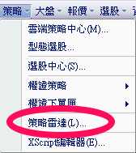
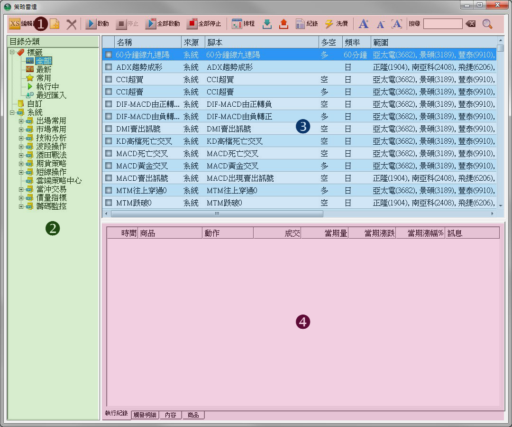
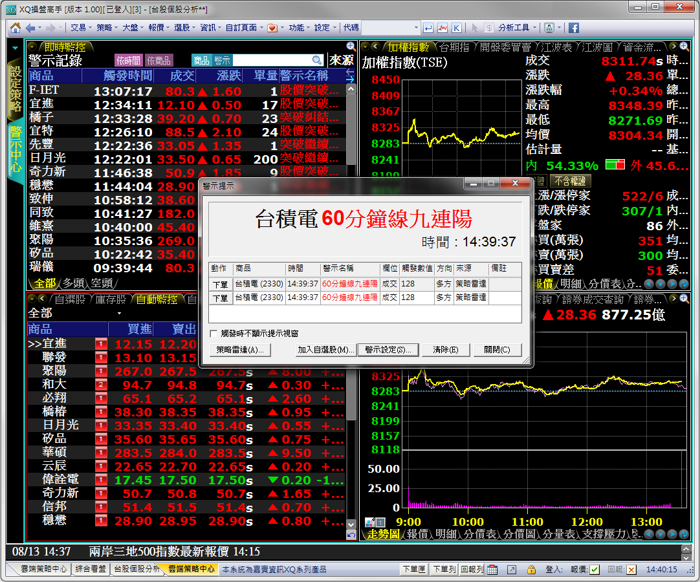

# XS策略雷達

來源：[XS策略雷達](https://www.xq.com.tw/lesson/sensor/)

## 策略雷達基本操作

本篇將為你說明「盤中量化交易模組」的策略雷達的基本操作。

### 步驟一：開啟策略雷達

從功能列→策略→策略雷達，就可以開啟策略雷達視窗

<!--  -->

策略雷達的版面配置如下：

- 功能列：所有功能都可直接由功能列上的按鈕作操作。

- 目錄區：可依標籤或目錄的方式檢索現有的策略雷達。

- 清單區：列出目前所選的標籤或目錄內的策略雷達清單。

- 訊息區：顯示目前策略雷達的相關執行內容及設定。

<!--  -->

### 步驟二：啟動策略雷達

- 選擇一個系統預設的策略雷達，這邊我們以「酒田戰法\長腳十字星」為例。
- 調整要監控的警示範圍。範圍的來源有三種：商品（可複選）、組合（自選+系統）或XS選股。調整好自己要的範圍後，按儲存。
- 點擊啟動，開始監控。

<!--  -->

### 步驟三：警示記錄

啟動策略雷達後，警示記錄會出現在：

- 觸發時會跳出警示提示視窗。
- 在雲端策略中心看到觸發的警示記錄。
  - 開啟雲端策略中心：策略→雲端策略中心→警示中心
- 觸發的記錄會自動變成系統組合。只要當天有觸發的商品，都會被納入。
  - 開啟綜合看盤：報價→綜合看盤→自動監控

請依個人使用習慣選擇

<!--  -->

[返回](#xs策略雷達)
