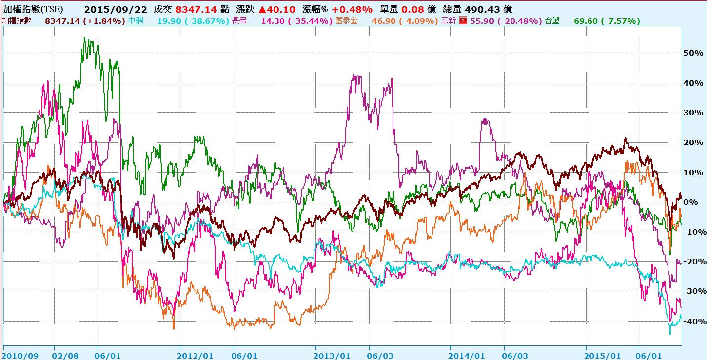
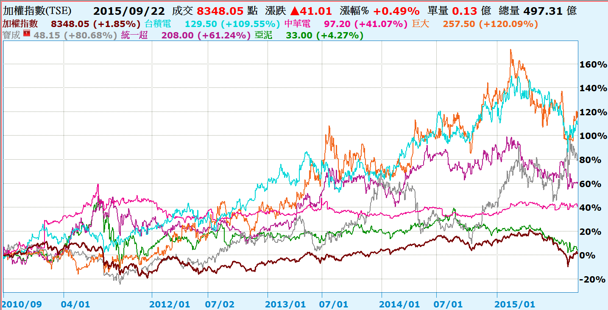
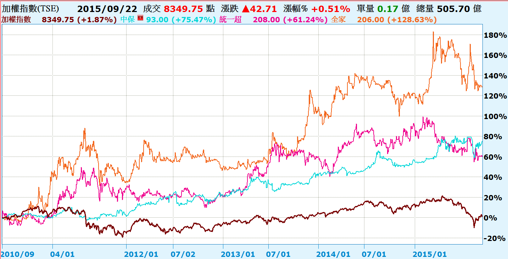
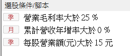
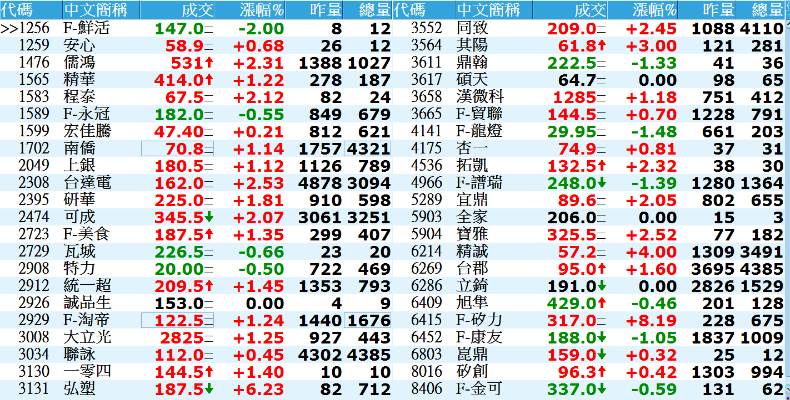

## 給股市長期投資人的忠告

最近接觸到一些股票長期投資者，發現每個人各有自己的撇步與罩門，整理了他們誤觸的地雷，我提出五點對股市長期投資者的忠告。

這些長期投資者，我發現他們朗朗上口的投資標的，常常有中鋼，中華電信，台積電，台達電，國泰金，巨大，正新，寶成，統一超，亞泥，台塑，南亞，長榮海運等等。

但在這些股票中，還是有一些股票，這五年來不漲反跌，讓這些長期投資者的投資績效大不如前。

<!--  -->

不過也有一些股票長期下來還真的擺的愈久賺的愈多：

<!--  -->

看到上面這些對照組，綜合這些朋友的長期投資經驗，我想提出五個觀察點：

1.要挑龍頭股。

龍頭股代表的經營績效優於同業，代表的是競爭力。

2.要挑有經濟規模的行業

<!--  -->

什麼叫經濟規模呢？就是當您很大了之後，您的營運成本會比那些新進者低很多的行業，例如像流通業統一超及全家，還有像保全業如中保這種，前者一趟車子出來可以送貨到很多家據點，後者一個保全中心可以cover很多的客戶，這種大者恆大的，別人要進來會很辛苦，就可以長期維持比較好的利潤。

這種股票通常都有維持高毛利率的特性。

3.要挑每股營收高的公司

如果一門生意要做一塊錢生意得投一塊錢資本支出，這種生意算是很消耗資本的行業，而且往往賺到的錢不能發現金，必須再拿去投資，所以才會造成每股營收不高。這種公司一旦賺不到足以再繼續投資的錢，就可能無法維持以往的績優表現，我們要小心那些獲利是靠砸大錢投資堆積出來的公司。

4.要挑A級領導人帶領的公司

我的朋友們有人挑上某公司的原因，竟然是因為常在電視上看到該公司的老闆，而且這位老闆經常講出一些他覺得很棒的經營管理哲學。

就我的觀察，這個世界瞬息萬變，老闆如果常在公開場合講東講西，很容易被打臉，如果老闆怕被打臉死不認錯，常會把公司帶向一個沒有彈性的方向，這時候如果看錯了就很慘，我比較傾向那些有穩定但不張揚的團隊領導的公司。

5.要挑營收長期維持在上昇軌道上的公司

這點很重要，十家新創的公司，十年後頂多剩三家，一定要長期觀察那些公司能否維持在成長的軌道上。

我根據上述五個原則，訂了幾個選股條件如下：

<!--  -->

挑出了45檔的股票：

<!--  -->

大家可以從這中間在去過濾那些產業前景不明的，非產業龍頭股的，剩下的就是比較值得長期留意的族群了。

[返回](#xs選股)
