    # 關鍵字

## 忽略字

XS語法內有一些特殊的忽略字。這些忽略字通常是英文常見的介係詞，可以任意使用在語法內，以便增加程式碼的可閱讀性。程式執行時這些忽略字會被自動省略，沒有任何作用。

目前提供的忽略字列表如下：

| A   | An   | At    | Based |
| --- | ---- | ----- | ----- |
| By  | Does | From  | Is    |
| Of  | On   | Place | Than  |
| The | Was  |       |       |

## 常數

系統內建常數

以下為系統目前提供的內建常數名稱，以及常數所對應的數值。

| 常數名稱  | 數值    |
| --------- | ------- |
| PI        | 3.14159 |
| Sunday    | 0       |
| Monday    | 1       |
| Tuesday   | 2       |
| Wednesday | 3       |
| Thursday  | 4       |
| Friday    | 5       |
| Saturday  | 6       |

在腳本內可以直接使用常數名稱，以增加可讀性。例如:

```xscript

Value1 = PI

```

跟

```xscript

Value1 = 3.14159

```

是一樣的意思，可是程式讀起來會比較清楚。

## 流程控制

在腳本撰寫的過程當中，我們可能會使用到一些比較複雜的邏輯進行運算。簡單的條列陳述沒有辦法達到這個需求，這時候我們就會需要一些流程控制的語法來幫忙。

- 條件判斷

  條件判斷是最常使用的一種流程控制，會依執行的順序依序判斷，符合後即條出。XSscript提供以下三種條件判斷式：

  [If Then Else](#if--then--else)

  [Switch Case Default](#switch--case--default)

  [Once](#once)

- 迴圈

  另一種流程控制是迴圈。迴圈用在計算或比較需要重複執行的情況，例如計算過去10期的值，就可以利用迴圈來完成。XSscript提供以下三種條件判斷式：

  [For To/DownTo](#for-todownto)

  [While](#while)

  [Repeat Until](#repeat--until)

- 中斷

  在執行的過程中，為了提升效率，可以控制電腦跳過某些計算不執行。就可以用中斷語法來達成。

  [Break](#break)：跳出迴圈

  [Return](#return)：跳出腳本

  [Ret（RetVal）](#ret-retval)
  
- 多行語法

  [Begin End](#begin--end)

  XSscript的執行是一行為單位（用分號“;”結尾）。所以在流程控制中，通常都會搭配Begin…End使用。Begin…End可以讓我們用多行的陳述式進行運算，而非原先僅能使用單行陳述式。

- 數列關係

  [Cross Over（Cross Above）](#cross-above--cross-below)：判斷是否黃金交叉

  [Cross Under（Cross Below）](#cross-above--cross-below)：判斷是否死亡交叉

- 邏輯判斷

  [Not](#not)：取得相反值

  [And](#and)：判斷條件是否同時成立

  [OR](#or)：判斷是否有任一條件成立

  [XOR](#xor)：計算差集

### IF / THEN / ELSE

使用 **IF/THEN/ELSE** 這三個語法來判斷某個條件成立時該執行那個動作，不成立時又該執行那個動作。

如果只需要判斷某個條件成立時該執行那個動作，則使用以下的語法:

```xscript

If Close > Open Then Ret = 1;

```

在上述範例內如果Close值大於Open值的話則 Ret 變數的數值會被設定為1。

如果當條件成立時需要執行多個指令的話，則使用 **Begin/End** 的語法來包圍所需要執行的指令。

```xscript

If Close > Open Then 
Begin
    Value1 = Close - Open;
    Value2 = High - Low;
End;

```

如果條件成立時跟不成立時都需要執行不同的指令的話，則可以加入 **ELSE** 語法來定義條件不成立時該執行的動作。

```xscript

If Close > Open Then
    Value1 = Close - Open
Else
    Value1 = Open - Close;

```

在上述範例內當Close的數值不大於Open的數值時，程式會執行Else內的語法。以這個例子為例，Value1的數值就是這根bar的實體高度。

同樣的，Else之後也可以使用Begin/End語法來定義多個指令，範例如下:

```xscript

If Close > Open Then 
Begin
    Value1 = Close - Open;
    Value2 = High - Low;
End
Else 
Begin
    Value1 = Open - Close;
    Value2 = High - Low;
End;

```

Else後面也可以接if，用else if來進行多層次的條件判斷，從腳本上至下依序縮小判斷範圍，範例如下:

```xscript

if value1 < 0 then 
    value2 = 1
else if value1 < 10 then //等同於if  0 <= value1 and value1 < 10
    value2 = 2
else if value1 < 20 then //等同於if  0 <= value1 and value1 < 10
    value2 = 3
else  //等同於if  20<= value1 
    value2 = 4;

```

[返回](#流程控制)

### Switch / Case / Default

Switch語法是用來判斷某個變數的值是否符合某些運算式，同時定義符合時的執行指令。

語法如下：

```xscript

Switch (變數)
Begin
  Case 運算式1: 
     符合運算式1時所執行的指定;
  Case 運算式2: 
     符合運算式2時所執行的指定;
  Default:
     都不符合時所執行的指令;
End;

```

在Switch語法內必須傳入一個變數，同時使用Case語法定義各種不同的運算式，以及當這個運算式符合時要執行的指令。同時也可以使用Default語法來定義當所有的Case都不符合時所需要執行的指令。

以下是一個範例:

```xscript

Value1 =DayOfMonth(date);
Switch (value1)
Begin
  Case 1:   // value1=1時執行這段程式碼
    print(Text("今天的日期是",numtoStr(date,0),
    "。是",numtoStr(DayOfMonth(date),0),"日")
    ,"value1=1時執行這段程式碼");
  
  Case 2:   // value1=2時執行這段程式碼
    print(Text("今天的日期是",numtoStr(date,0),
    "。是",numtoStr(DayOfMonth(date),0),"日"),
    "value1=2時執行這段程式碼");
  
  Case 3:   // value1=3時執行這段程式碼
    print(Text("今天的日期是",numtoStr(date,0),
    "。是",numtoStr(DayOfMonth(date),0),"日"),
    "value1=3時執行這段程式碼");
  
  Case 4:   // value1=4時執行這段程式碼
    print(Text("今天的日期是",numtoStr(date,0),
    "。是",numtoStr(DayOfMonth(date),0),"日"),
    "value1=4時執行這段程式碼");
  
  Case 5:   // value1=5時執行這段程式碼
    print(Text("今天的日期是",numtoStr(date,0),
    "。是",numtoStr(DayOfMonth(date),0),"日"),
    "value1=5時執行這段程式碼");
    
  Case 6 to 20: // value1= 6 ~ 20 時執行這段程式碼
    print(Text("今天的日期是",numtoStr(date,0),
    "。是",numtoStr(DayOfMonth(date),0),"日"),
    "value1=6~20時執行這段程式碼");
  
  Default:  // 其他情形都執行這段程式碼
    print(Text("今天的日期是",numtoStr(date,0),
    "。是",numtoStr(DayOfMonth(date),0),"日"),
    "其他情形都執行這段程式碼");
End;

```

在上述範例內這個變數為Value1，然後使用Case語法一一檢查Value1是否為1，2，3，4，5，620同時也使用Default語法定義當Value1不是1，2，3，4，5，620時所需要執行的指令。

由於DayOfMonth這個函數會計算出今天為幾日(如果是01日的話則回1，02日則回2，03日則回3)，所以以上的範例：

在 01 日會印出「今天的日期是19941101。是1日 value1=1時執行這段程式碼」

在 02 日會印出「今天的日期是19941102。是2日 value1=2時執行這段程式碼」

在 03 日會印出「今天的日期是19941103。是3日 value1=3時執行這段程式碼」

在 04 日會印出「今天的日期是19941104。是4日 value1=4時執行這段程式碼」

在 05 日會印出「今天的日期是19941105。是5日 value1=5時執行這段程式碼」

在 06 ~ 20 日會印出「今天的日期是19941107。是7日 value1=6~20時執行這段程式碼 」

在 21 ~ 月底會印出「今天的日期是19941121。是21日 其他情形都執行這段程式碼 」

[返回](#流程控制)

### Once

Once語法用來定義某些只需要執行一次的程式碼。

舉例而言：

```xscript

Once(High = Highest(High, 5))
Begin
    HighDate = Date;
    HighPrice = High;
End;

```

Once語法之後必須填入一個判斷式，以上例而言，這個判斷式是 High = Highest(High, 5)，在判斷式之後，可以填入當判斷式成立時要執行的指令，如果有多行指令的話則可以使用Begin/End來包圍。

所以上面這個範例執行的邏輯是，當創5日新高時，執行HighDate = Date，以及HighPrice = High這兩個指令，而且一旦出現創5日新高的情形之後，就不再執行HighDate = Date, 以及HighPrice = High這兩個指令。

如果要達到同樣的目的，也可以使用IF指令，搭配一個紀錄是否曾經執行過的變數：

```xscript

Var: FirstTime(False);
If High = Highest(High, 5) And Not FirstTime Then
Begin
    HighDate = Date;
    HighPrice = High;
    FirstTime = True;
End;

```

在上述範例內，程式使用FirstTime這個變數來紀錄這個IF狀態是否曾經發生過，以確保只會執行一次。

可是由於系統會根據執行的設定方式在每一筆bar甚至每一筆tick更新時都會執行完整的程式碼，所以如果是使用If的寫法的話，每一次執行時還是會去判斷 High是否等於Highest(High, 5)！反之，如果是使用Once的寫法的話，一旦Once的運算式成立之後，未來不管執行任意bar，系統都會自動跳過Once的判斷式以及程式碼。由於在這個例子內，IF內所需要執行的指令比較複雜且費時，所以就可以使用Once的語法來提升執行的速度。

[返回](#流程控制)

### For To/DownTo

For語法是用來定義一段迴圈的執行邏輯。

For迴圈語法內必須使用一個變數，指定這個變數的初始值跟結束值，同時指定這個迴圈內要執行的指令:

```xscript

For 變數 = 初始值 to 結束值
  執行的指令;

```

如果要執行的指定超過一行的話則使用Begin/End語法來包裝需要執行的指定

```xscript

For 變數 = 初始值 to 結束值
Begin
  執行的指令1;
  執行的指令2;
End;

```

迴圈內的指令總共會被執行**(結束值 - 初始值 + 1)次，在期間每次執行時，變數的值會從初始值一一遞增到結束值**為止。

以下是一個實例:

```xscript

SumValue = 0;
For i = 0 to 4
Begin
  SumValue = SumValue + Close[i];
End;
AvgValue = SumValue / 5;

```

上述的範例是一個累加的用法，透過For迴圈總共執行了5次(4 - 0 + 1)，第一次執行時i = 0(初始值), 第二次執行時i = 1(遞增), 最後一次執行時i = 4(結束值)。所以執行完For迴圈後SumValue的數值是最近５期Close欄位的累加值，把SumValue的值除以5之後就可以得到Close值的平均數值。

如果迴圈的控制方式希望是從初始值一直減少直到結束值為止的話，則可以使用DownTo指令。

```xscript

SumValue = 0;
For i = 4 downto 0
Begin
  SumValue = SumValue + Close[i];
End;
AvgValue = SumValue / 5;

```

上述範例執行的結果與先前相同，唯一的差異是DownTo語法，所以迴圈執行的方式是第一次i = 4, 第二次 i = 3(遞減), 第三次 i = 2, 第四次 i = 1, 最後一次 i = 0。

一般而言迴圈的執行次數是透過初始值跟結束值來控制的，可是如果需要在執行過程內提前跳出的話，則可以使用Break指令。

系統內還提供不同的迴圈控制方式，請參考Repeat/Until以及 While。

[返回](#流程控制)

### While

While語法是用來定義一段迴圈的執行邏輯。語法如下：

```xscript

While 判斷式
  執行的指令;

```

當判斷式成立時，While迴圈會重複的執行，一直到判斷式回傳False為止。

如果在迴圈內需要執行多個指令的話，則可以使用Begin/End的方式來包圍。

```xscript

While 判斷式
Begin
  執行的指令1;
  執行的指令2;
End;

```

以下是一個範例:

```xscript

SumValue = 0;
While i < 5
  Begin
    SumValue = SumValue + Close[i];
    i = i + 1;
  End;
AvgValue = SumValue / 5;

```

上述範例內While的迴圈會一直執行，直到 i 的數值 >= 5時才會停止。每次執行時SumValue會累加前幾期的Close數值，同時變數i 會每次加1。以這個範例而言，SumValue的數值會變成是最近５期收盤價的加總，最後算出AvgValue為最近５期的平均收盤價。

系統內還提供不同的迴圈控制方式，請參考 [Repeat/Until](#repeat--until) 以及 For。

[返回](#流程控制)

### Repeat / Until

Repeat/Until的語法是用來定義一段迴圈的執行邏輯。，語法如下:

```xscript

Repeat
  執行的指令;
Until 判斷式;

```

程式會不斷的執行Repeat之後的指令，一直到Until後續的判斷式變成True值時才會離開迴圈。

如果迴圈內需要執行的指令超過一個的話，則可以使用Begin/End來包圍:

```xscript

Repeat
  Begin
    執行的指令1;
    執行的指令2;
  End;
Until 判斷式;

```

以下是一個範例:

```xscript

SumValue = 0;
Repeat
  Begin
    SumValue = SumValue + Close[i];
    i = i + 1;
  End;
Until i = 4;
AvgValue = SumValue / 5;

```

上述範例內Repeat的迴圈會一直執行，每次執行時SumValue會累加前幾期的Close數值，同時變數 i 會每次加1。這個迴圈會一直跑到 i = 4 的時候才會離開。以這個範例而言，SumValue的數值會變成是最近５期收盤價的加總，最後算出AvgValue為最近５期的平均收盤價。

系統內還提供不同的迴圈控制方式，請參考 [While](#while) 以及 [For](#for-todownto)。

[返回](#流程控制)

### Break

Break指令的用處是控制迴圈執行時跳出迴圈的時機點，一般是用在For迴圈或是While迴圈內。

以下是For迴圈的範例:

```xscript

i = 0;
For i = 0 to 10
Begin
  If Close[i] < 20 Then Break;
End;

```

一般而言上面的迴圈會執行11次(從I = 0 到 10)。可是在執行過程內，如果某一期的Close欄位值比20小的話，就會馬上跳出 For 迴圈。

[返回](#流程控制)

### Return

Return指令用來中斷正在執行的腳本。當程式遇到這個指令時，執行將會中斷。

```xscript

If CurrentTime < 123000 Then Return;


If Close > Close[1] and Close = High Then Ret = 1;

```

上述範例利用CurrentTime來判斷執行時間，如果是在12:30之前的話則不做任何動作(腳本直接中斷，等待下一根bar)。在12:30過後如果收盤價創當日新高的話則觸發。

[返回](#流程控制)

### Ret (RetVal)

Ret是一個系統的內建變數，他的數值會決定警示腳本以及選股腳本執行結果。

當警示腳本以及選股腳本在每根bar重新執行時 Ret的數值會被設定為0，當這根bar結束完成時如果Ret的數值不是0的話，則會產生觸發訊號(警示腳本)，或是選取這檔商品(選股腳本)。

以下是一個範例，在收盤價大於五日平均值時把Ret的數值設為1，用來觸發警示或是選取這個商品。

```xscript

If Close > Average(Close, 5) Then Ret = 1;

```

[返回](#流程控制)

### Begin / End

Begin / End 語法用在 If, While, For 等控制指令內。當需要輸入超過一行的程式碼時，就必須使用Begin/End來把程式碼包圍起來。

```xscript

If Close >= Close[1] Then ret = 1;  // 計算漲跌

```

上述範例內當Close >= Close[1]時因為只需要執行一行指令，所以可以把指令直接寫出來。

可是在以下的範例內，由於當Close >= Close[1]時我們希望要執行兩個指令，所以透過Begin/End把這兩個指令包圍起來。

```xscript

If Close >= Close[1] Then
Begin
   Value1 = Close - Close[1];  // 計算漲跌
   Value2 = Value1 / Close[1]; // 計算漲跌幅
End;

```

[返回](#流程控制)

### Cross Above / Cross Below

Cross相關的語法共有兩種：

Cross Above 或是 Cross Over 是用來檢查目前的欄位數值是否向上穿越某個欄位的前期數值。
Cross Below 或是 Cross Under 則是用來檢查目前的欄位數值是否向下跌破某個欄位的前期數值。
以下是向上穿越均線的寫法：

```xscript

If Close Cross Above Average(Close, 5) Then ret = 1;

```

當這一期的Close欄位大於等於近5期的平均值(Average(Close,5))且前一期的Close欄位小於前一期的近5期的平均值的話，則ret會被設定成1。

以下則是向下跌破均線的寫法：

```xscript

If Close Cross Below Average(Close, 5) Then ret = 1;

```

如果這一期的Close欄位小於等於近5期的平均值(Average(Close,5))且前一期的Close欄位大於前一期的近5期的平均值的話，則ret會被設定成1。

Cross也可以寫成Crosses。

[返回](#流程控制)

### NOT

NOT語法回傳運算式的相反值。

請看以下的範例程式:

```xscript

If Close > Close[1] Then Ret = 1;

```

這個例子會在Close值大於Close的前期值時設定Ret為1。

如果使用者希望的是在Close值 不是 大於Close的前期值時才設定Ret為1的話，則可以寫成:

```xscript

If Not (Close > Close[1]) Then Ret = 1;

```

上述的範例會在Close值 不是 大於Close的前期值時設定Ret為1。

[返回](#流程控制)

### AND

AND語法用來檢查運算式是否同時成立。

```xscript

If Close >= Close[1] And Volume >= Volume[1] Then ret = 1;

```

在上述範例內如果close欄位 >= 前期值 而且同時 volume欄位 >= 前期值的話，則ret會被設定成1。

請參考 [OR](#or) 語法。

[返回](#流程控制)

### OR

OR語法用來檢查運算式是否有任一個成立。

```xscript

If Close >= Close[1] Or Close >= Close[2] Then ret = 1;

```

在上述範例內如果Close欄位 >= 前期值 或是 Close欄位 >= 前兩期值的話，則ret會被設定成1。

請參考 [AND](#and) 語法。

[返回](#流程控制)

### XOR

XOR運算式是用來計算兩個邏輯數值的差集。

運算方式如下：

  True XOR True 傳回False
  True XOR False 傳回True
  False XOR True 傳回True
  False XOR False 傳回False

[返回](#流程控制)

## 宣告

宣告是在腳本中引入變數使用。變數是用來存放計算後的數值，方便重複使用或增加腳本的可讀性。
變數需要先經過宣告的程序後才能使用，並且在宣告的同時也需要指定變數的類型、名稱或初始值等變數的屬性。

在XSscript中，一共有下列宣告變數的語法：

- 宣告變數

  [Var（Variable、Variables、Vars）](#var)

  [IntrabarPersist](#intrabarpersist)

- 宣告陣列

  [Array（Arrays）](#arrayarrays)

- 宣告輸入

  [Input（Inputs）](#inputinputs)

  [inputkind（inputkind）](#inputkindinputkind)

- 宣告數值輸入（函數）

  [Numeric](#numeric)

  [NumericSimple](#numeric)

  [NumericSeries](#numeric)

  [NumericRef](#numericref)

  [NumericArray](#numericarray)

  [NumericArrayRef](#numericarrayref)

- 宣告字串輸入（函數）

  [String](#string)

  [StringSimple](#string)

  [StringSeries](#string)

  [StringRef](#stringref)

  [StringArray](#stringarray)

  [StringArrayRef](#stringarrayref)

- 宣告布林輸入（函數）

  [TrueFalse](#truefalse)

  [TrueFalseSimple](#truefalse)

  [TrueFalseSeries](#truefalse)

  [TrueFalseRef](#truefalseref)

  [TrueFalseArray](#truefalsearray)

  [TrueFalseArrayRef](#truefalsearrayref)

### Var

Var語法用來宣告變數，並且給定變數的預設值。

系統會根據Var語法內給定的預設值的型態來決定變數的類型。目前系統提供以下三種變數類型:

- 數值，例如 10, 5.3,
- 字串, 例如 "String"，
- 邏輯值, 例如 True, False

語法如下:

```xscript

Var: SumValue(0);
Var: StrValue("");
Var: Flag(True);

```

在上述的範例內宣告了三個變數:

- SumValue是一個數值變數，初始值為0，
- StrValue是一個字串變數，初始值為"" (空白字串)，
- Flag是一個邏輯變數，初始值為True

多個變數也可以在同一行內宣告，例如可以把上述範例寫成:

```xscript

Var: SumValue(0), StrValue(""), Flag(True);

```

除了Var語法之外，也可以使用Vars語法，Variable語法，或是Variables語法來宣告變數，範例如下：

```xscript

Vars: SumValue(0);
Variable: StrValue("");
Variables: Flag(True);

```

[返回](#宣告)

### IntrabarPersist

IntrabarPersist語法用來控制變數數值在執行時的變化邏輯。

在程式執行時，變數的數值會自動延續前一筆bar最後的計算值。

以下是一個簡單的示意圖，說明變數的數值在執行時的變化情形。

<!-- 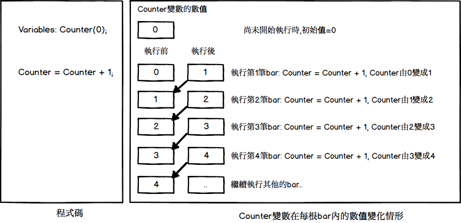 -->


注意到在上圖內變數的數值都會從上一筆執行後的結果延續到下一筆bar。

如果上述的腳本被設定成逐筆洗價的話(也就是說同一筆bar可能執行很多次)，則變數的數值變化情形如下:

<!-- 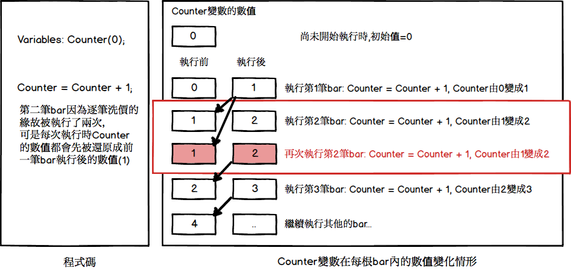 -->


請注意，雖然第二筆bar因為價位變化的關係被執行了兩次，可是每次執行時，Counter變數的數值還是都會先變成上一筆bar最後執行的結果(1)之後才開始執行第二筆bar。(圖示內紅色標記處)。所以雖然第二筆bar執行了兩次，Counter在離開第二筆bar的時候的數值還是為2。

這個行為是為了要保證逐筆洗價時最後算出來的數值只跟這一筆bar的價位有關，而不是跟這一筆bar被執行了多少次有關。
可是在某些情境底下可能需要保留最後一次計算後的數值(不管是否有換bar)，此時就可以使用IntrabarPersist的語法:

```xscript

input: atVolume(100); setinputname(1,"大單門檻");


variable: intrabarpersist Xtime(0);         //計數器


Volumestamp = q_DailyVolume;


if Date > date[1] then Xtime = 0; // 開盤那根要歸0次數


if q_tickvolume > 100 then Xtime += 1; // 量夠大就加1次


if Xtime > 10  then  
begin
  ret = 1;
  Xtime = 0;
end;

```

上述範例是一個警示腳本，使用日線頻率，逐筆洗價模式來執行。我們希望當大單(目前定義成單筆成交量 > 100張)的個數超過10之後就觸發。由於是日線模式，所以每次重新執行時 XTime都會變成0，無法實際統計發生大單的次數。

解決方式則是把XTime設為IntrabarPersist．一旦這樣設定之後，XTime的數值就不會因為重新執行這根bar而被還原，也因此可以正確的統計到在當日出現大單的個數。

[返回](#宣告)

### Array（Arrays）

Array 語法用來宣告一個陣列變數，同時設定陣列的大小以及陣列內儲存數值的資料型態(也可以寫成Arrays)。

所謂陣列就是一個可以儲存多個數值的變數，陣列內儲存數值的個數，以及數值的資料型態可以透過Array語法來定義。

系統提供兩種控制陣列數值個數的方式。第一種方式是固定個數，語法如下:

```xscript

Array: NumArray[10](0);
Array: StrArray[10]("");
Array: BoolArray[10](True);

```

在以上的範例設定了三個陣列變數：

- NumArray，這是一個數值陣列，總共有10個數值，每個數值的初始值都是0，
- StrArray，這是一個字串陣列，總共有10個數值，每個數值的初始值都是""，
- BoolArray，這是一個布林值陣列，總共有10個數值，每個數值的初始值都是True
以下是NumArray在宣告後的示意圖。

<!-- 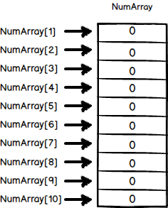 -->


如果要存取NumArray的話，則使用以下的語法：


```xscript

NumArray[1] = 5;
Value1 = NumArray[1];

```

在中括弧[]內傳入的數值稱之為索引值，索引值的範圍由1開始，一直到陣列宣告的最大個數。

如果陣列的大小無法預先知道的話，則可以使用第二種語法來宣告陣列：

```xscript

Array: NumArray[](0);
Array: StrArray[]("");
Array: BoolArray[](True);

```

請注意在上述語法內並未指定陣列的個數 ([] 內並沒有任何數值)。此時陣列已經被宣告，也已經定義這個陣列內可以存放的資料的格式，可以此時陣列還不可以被使用。

等到程式知道陣列的實際所需大小時，程式必須透過 Array_SetMaxIndex　函數來設定陣列的大小。

```xscript

Var: Count(0);
Array: NumArray[](0);


If High > Highest(High,20)[1] Then Count = Count + 1;


Array_SetMaxIndex(NumArray, Count);
NumArray[Count] = High;

```

在上述範例內每當創近20期新高時 (High > Highest[High,20](1))，NumArray就會多存放當時的新高價。由於無法預先知道所需要儲存的個數，所以使用上述語法來動態設定陣列的大小。

以上所定義的陣列變數都是屬於一維陣列，也就是說一個陣列變數內有多個數值，使用時像序列般的方式來存取。如果需要陣列內的數值可以以類似矩陣的方式來存取的話，則可以以下列語法來宣告二維陣列。

```xscript

Array: NumArray[10,2](0);

```

在上例內，中括弧[]內有兩個數值，分別是10跟2。透過這樣子的語法我們宣告了一個二維陣列，他的內容如下:

<!-- 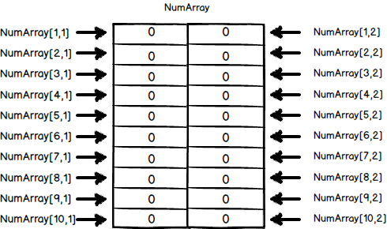 -->


我們可以想像一個二維陣列就好像是一個Excel的表格一樣。中括弧內的第一個數值宣告這個表格的行數，第二個數字則是宣告表格的欄數。

當需要存取二維陣列時、我們使用以下的語法:

```xscript

NumArray[5,1] = 10;
Value1 = NumArray[1,2];

```

存取時需要傳入兩個索引值，索引值的範圍是從１開始，不能超過陣列的行數跟欄數。

※ Array 維度最多 9 個。元素數量最多 7000。

例如：Array: LimitArray[a, b, c, d, e, f, g, h, i];

則 (a+1) X (b+1) X (c+1) X (d+1) X (e+1) X (f+1) X (g+1) X (h+1) X (i+1) 所得到的元素值最多為 7000 個。

[返回](#宣告)

### Input（Inputs）

Input語法用來宣告腳本參數的名稱以及資料類型(也可以寫成Inputs)。

Input的語法依照腳本類型而有差異。

如果是指標腳本，警示腳本，或是選股腳本的話，則使用以下語法。以下是一個指標的範例：

```xscript

Input: Length(10);


Plot1(Average(Close, Length));

```

在上述的指標範例內宣告了一個名為Length的參數，用來存放計算收盤價平均值的天期。這個參數的預設值為10，資料類型為數字。

一旦宣告之後，程式內則可以像變數 Var一樣的使用這個參數。可是跟變數不同的是，使用者在使用這個腳本時，可以透過參數設定的畫面來動態控制這個參數的數值。以下是設定指標時的參數設定畫面:

<!--  -->


由於使用者可以在引用腳本時動態控制參數的數值，腳本的應用上會更有彈性。

在上面的參數設定畫面內看到參數名稱顯示為Length，也就是Input語法內設定的變數名稱。如果希望畫面上看到的參數名稱是中文的話，則可以在Input語法內傳入參數名稱:

以下是修改後的範例:

```xscript

Input: Length(10, "天期");


Plot1(Average(Close, Length));

```

底下是設定參數畫面:

<!--  -->


注意到畫面上出現的參數名稱已經變成 "天期"了。這樣子的作法可以讓腳本的使用上更為清楚。

Input語法如果應用在函數腳本內的話，則必須使用不同的語法:

```xscript

Input: Price(NumericSeries);
Input: Length(NumericSimple);


Value1 = Summation(Price, Length) / Length;

```

在上述範例內宣告了兩個參數，第一個參數叫做Price，他的資料格式是一個數字序列，第二個參數叫做Length，他的資料格式是一個數字(不是序列)。

```xscript

Input: Price(NumericSeries,"價格");
Input: Length(NumericSimple,"天期");

```

在上述範例內宣告了兩個參數，第一個參數叫做Price，他的資料格式是一個數字序列，且參數名稱為價格；第二個參數叫做Length，他的資料格式是一個數字(不是序列)，且參數名稱為天期。

```xscript

Input: Price(close,NumericSeries,"價格");
Input: Length(10,NumericSimple,"天期");

```

在上述範例內宣告了兩個參數，第一個參數叫做Price，預設值為Close，他的資料格式是一個數字序列，參數名稱為價格；第二個參數叫做Length，預設值為10，他的資料格式是一個數字(不是序列)，參數名稱為天期。

關於函數所支援的各種不同的參數類型，請參考以下章節:

- [Numeric](#numeric)
- [NumericSimple](#numeric)
- [NumericSeries](#numeric)
- [NumericRef](#numericref)
- [NumericArray](#numericarray)
- [NumericArrayRef](#numericarrayref)
- [String](#string)
- [StringSimple](#string)
- [StringSeries](#string)
- [StringRef](#stringref)
- [StringArray](#stringarray)
- [StringArrayRef](#stringarrayref)
- [TrueFalse](#truefalse)
- [TrueFalseSimple](#truefalse)
- [TrueFalseSeries](#truefalse)
- [TrueFalseRef](#truefalseref)
- [TrueFalseArray](#truefalsearray)
- [TrueFalseArrayRef](#truefalsearrayref)

[返回](#宣告)

### inputkind（inputkind）

input宣告的時候，可以使用 inputkind 這個命名參數(named parameter)，用來控制系統參數設定的介面(UI)。再搭配 Dict 、 DateRange 或 SymbolPrice 函數來產生對應的內容。

Dict 產生選項的範例如下：

```xscript

input: IndexPomUnit(1, "大盤融資單位", inputkind:=Dict(["金額",1],["張數",2]));

```

在上述的範例內宣告了一個名為 IndexPomUnit 的參數，用來存放計算大盤融資的數值，不過此數值的單位有金額與張數兩種，故可以使用 inputkind 搭配 Dict 函數，就能在介面設定單位為金額或者張數，此範例預設單位為金額。

<!-- 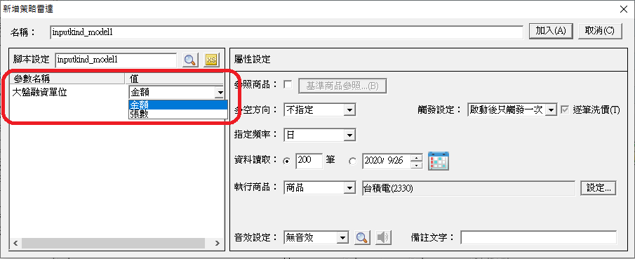 -->


也可以改寫成以下範例，使用字串型態的方式來撰寫相關程式碼：

```xscript

input: IndexPomUnit("Amount", "大盤融資單位", inputkind:=Dict(["金額","Amount"],["張數","Sheets"]));

```

DateRange 產生日期範圍選項的範例如下：

```xscript

input:FdifferenceDate(20180301,"外資買賣超查詢日期",inputkind:=daterange(20160301,20190301,"D"));
//daterange(最小查詢日期,最大查詢日期,"支援日/週/月/季/半年/年頻率")

```

在上述的範例內宣告了一個名為 FdifferenceDate 的參數，用來存放外資買賣超查詢日期的數值，就能方便在介面上勾選日曆選項使用，此範例預設查詢日期為2018年03月01日。

<!-- 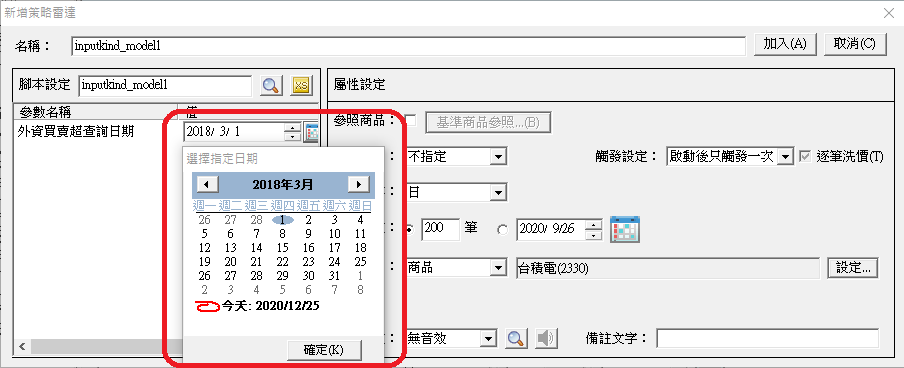 -->


SymbolPrice 產生 Open、High、Low、Close 四個選項的範例如下：

```xscript

input:OHLC_Opti(200,"價格：",inputkind:=SymbolPrice());

```

在上述的範例中，宣告了一個名為 OHLC_Opti 的參數，用來存放價格的數值，就能方便在介面上勾選 Open、High、Low、Close 四個選項使用。

<!-- 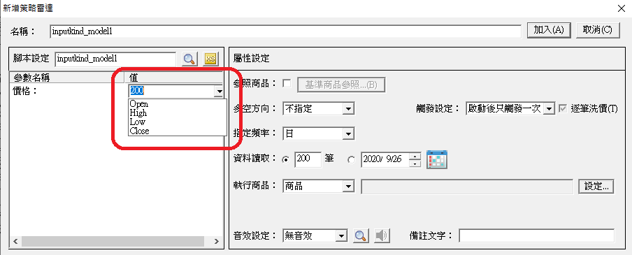 -->


[返回](#宣告)

### Numeric

(僅適用於函數腳本內)

Numeric語法是用來定義函數腳本的參數為數值型態。

```xscript

Input: Price(Numeric);
Input: Length(Numeric);


Value1 = Summation(Price, Length) / Length;

```

假設上例是一個名稱為MyFunction的函數, 在此Price參數跟Length參數都被定義成Numeric, 表示使用這個函數的腳本必須傳遞數值型態的參數，否則腳本編譯時會產生錯誤。

以下是使用這個函數的腳本的範例:

```xscript

Value1 = MyFunction(Close, 5);

```

在上例內呼叫MyFunction時傳入了Close(收盤價序列)，以及數值5。

Numeric型態還有以下兩個變形:

- NumericSeries: 表示傳入的數值為一個序列，例如傳入Close(收盤價序列),
- NumericSimple: 表示傳入的數值為一個單一數值，例如 5

這兩種變形的用意是要幫忙系統可以更精確的處理腳本跟函數之間的運作關係。所以上述MyFunction可以被改寫成:

```xscript

Input: Price(NumericSeries);
Input: Length(NumericSimple);


Value1 = Summation(Price, Length) / Length;

```

在這個函數內，由於Price是被當成序列來使用(計算加總時會用到前期值)，所以可以宣告成NumericSeries。而Length因為只會用到當下的數值，所以可以宣告成NumericSimple。

目前XS系統內，只要是數值參數，腳本內可以混用Numeric, NumericSimple, 以及 NumericSeries 這三種宣告方式，不影響腳本執行的結果。

[返回](#宣告)

### NumericRef

NumericRef語法用來定義函數腳本的參數為數值型態，並且可以從函數內修改呼叫者傳入的數值。

當一個函數變數被宣告成Numeric時，在函數內對這個數值的修改並不會影響呼叫者端傳入的變數，這個行為稱之為 Call By Value。

如果有需要從函數內可以更改呼叫者端的變數的話，則可以使用NumericRef的語法，此時的行為會變成Call By Reference。

```xscript

// MACD function
//  Input: Price序列, FastLength, SlowLength, MACDLength
//  Output: DifValue, MACDValue, OscValue
//
Input: Price(numericseries);
Input: FastLength(numericsimple);
Input: SlowLength(numericsimple);
Input: MACDLength(numericsimple);


Input: DifValue(numericref);
Input: MACDValue(numericref);
Input: OscValue(numericref);


DifValue = XAverage(price, FastLength) - XAverage(price, SlowLength);
MACDValue = XAverage(DifValue, MACDLength) ;
OscValue = DifValue - MACDValue;

```

在上述MACD函數內，呼叫者端傳入了價格序列(Price), 短天期(FastLength), 長天期(SlowLength)，以及MACD的天期(MACDLength)，函數內要算出DIF的數值, MACD的數值, 以及OSC的數值。由於總共有三個數值需要回傳，所以利用NumericRef的方式來完成。

呼叫者端的程式碼範例如下：

```xscript

input: FastLength(12), SlowLength(26), MACDLength(9);
variable: difValue(0), macdValue(0), oscValue(0);


MACD(Close, FastLength, SlowLength, MACDLength, difValue, macdValue, oscValue);


Ret = difValue Crosses Above macdValue;

```

注意到當呼叫完MACD函數後, difValue, macdValue, 以及 oscValue的數值都會從MACD函數內回傳。

[返回](#宣告)

### NumericArray

(僅適用於函數腳本內)

NumericArray語法用來定義函數腳本的參數為數值陣列型態。

```xscript

Input: MyNumericArray[X](NumericArray);


For Value1 = 1 to X
  Value2 = Value2 + MyNumericArray[Value1];

```

NumericArray與Numeric最大的差異是在Input語法內陣列變數名稱之後還需要定義*[陣列大小變數]。在上例內[X]*就宣告了一個變數X，他的數值會是傳入的陣列的大小(陣列內有多少數值)。

透過這個機制，函數內就可以知道傳入的陣列的大小，然後利用這個資訊來正確的判斷可以讀取哪些數值。 上述範例內使用一個 For迴圈來加總傳入陣列的每個數值，迴圈的範圍是從1開始，直到X結束。

如果需要傳入的陣列是二維的，則語法如下:

```xscript

Input: MyNumericArray[X,Y](NumericArray);

```

在上例內中括弧內必須填入兩個變數(X, Y)，這兩個變數的數值將會分別是傳入的陣列的行數跟欄數。

[返回](#宣告)

### NumericArrayRef

(僅適用於函數腳本內)

NumericArrayRef語法用來定義函數腳本的參數為數值陣列型態，並且可以從函數內修改呼叫者傳入的數值陣列。

```xscript

Input: MyNumericArray[X](NumericArrayRef);

```

NumericArrayRef 可以視為 NumericArray 以及 NumericRef 的綜合體。請參考以上兩種語法的說明。

[返回](#宣告)

### String

(僅適用於函數腳本內)

String語法用來定義函數腳本的參數為字串型態。

```xscript

Input: MyString(String);

```

String型態也有兩種變形:

- StringSeries: 代表傳入的是一個字串序列，
- StringSimple: 代表傳入的是一個字串的單一值

相關的語法請參考 [Numeric](#numeric)

[返回](#宣告)

### StringRef

(僅適用於函數腳本內)

StringRef語法用來定義函數腳本的參數為字串型態，並可以從函數內修改呼叫者傳入的數值。

```xscript

Input: MyString(StringRef);

```

關於從函數內回傳數值的行為，請參考 [NumericRef](#numericref)

[返回](#宣告)

### StringArray

(僅適用於函數腳本內)

StringArray語法用來定義函數腳本的參數為字串陣列型態。

```xscript

Input: MyStringArray[X](StringArray);

```

相關的語法請參考 [NumericArray](#numericarray)

[返回](#宣告)

### StringArrayRef

(僅適用於函數腳本內)

StringArrayRef語法用來定義函數腳本的參數為字串陣列型態，並且可以從函數內修改呼叫者傳入的字串陣列。

```xscript

Input: MyStringArray[X](StringArrayRef);

```

StringArrayRef可以視為 [StringArray](#stringarray) 以及 [StringRef](#stringref) 的綜合體。請參考以上兩種語法的說明。

[返回](#宣告)

### TrueFalse

(僅適用於函數腳本內)

TrueFalse語法用來定義函數腳本的參數為邏輯值型態(TRUE 或是 FALSE)。

```xscript

Input: MyFlag(TrueFalse);

```

TrueFalse型態也有兩種變形:

- TrueFalseSeries: 代表傳入的是一個邏輯值序列，
- TrueFalseSimple: 代表傳入的是一個邏輯值的單一值

相關的語法請參考 [Numeric](#numeric)

[返回](#宣告)

### TrueFalseRef

(僅適用於函數腳本內)

TrueFalseRef語法用來定義函數腳本的參數為邏輯值型態，並可以從函數內修改呼叫者傳入的數值。

```xscript

Input: MyFlag(TrueFalseRef);

```

關於從函數內回傳數值的行為，請參考 [NumericRef](#numericref)

[返回](#宣告)

### TrueFalseArray

(僅適用於函數腳本內)

TrueFalseArray語法用來定義函數腳本的參數為邏輯值陣列型態。

```xscript

Input: MyFlagArray[X](TrueFalseArray);

```

相關的語法請參考 [NumericArray](#numericarray)

[返回](#宣告)

### TrueFalseArrayRef

(僅適用於函數腳本內)

TrueFalseArrayRef語法用來定義函數腳本的參數為邏輯值陣列型態，並且可以從函數內修改呼叫者傳入的邏輯值陣列。

```xscript

Input: MyFlagArray[X](TrueFalseArrayRef);

```

TrueFalseArrayRef 可以視為 [TrueFalseArray](#truefalsearray) 以及 [TrueFalseRef](#truefalseref) 的綜合體。請參考以上兩種語法的說明。

[返回](#宣告)

### Rank

Rank是一個選股腳本內才能使用的語法，主要是用來宣告腳本執行排行的作業。 通常用於選股中心內的排行語法。
以下範例：依據收盤價與均線的乖離程度進行排序。

```xscript

Rank _bias10 begin
    retval = close - average(close, 10);
    end;

```

[返回](#宣告)

### Group

Group是用來宣告清單的語法，接著可以在腳本內透過使用 GetSymbolGroup 來取得和執行商品相關的清單。

詳細說明可參考商品清單功能。

以下範例：宣告一個名為 myGroup 的清單並讓其取得執行商品的成分股。

```xscript

Group: myGroup();
myGroup = GetSymbolGroup("成分股");

```

[返回](#宣告)

### SymbolGroup

SymbolGroup是用來在指標腳本的input中設定清單類型的語法，搭配inputkind和quickedit即可以在指標設定中透過選單來快速切換執行商品對應的清單。

詳細說明可參考商品清單功能。

以下範例：取得執行商品相關的可轉債並畫出，當有執行商品多個可轉債時可以在線圖上作快速切換。

```xscript

Input:cb_id("", InputKind:=SymbolGroup("CB"), QuickEdit:=true);
plot1(GetSymbolField(cb_id, "Close"));

```

[返回](#宣告)

### Default

搭配 Getfield函數 或 GetSymbolField函數 使用，Default 參數是用來設定若遇到欄位對應的K棒沒有資料的狀況所要回傳的數值。

範例:

```xscript

Value1 = GetField("本益比", "D", Default := 0);

```

如此一來當 Value1 的 本益比 遇到盤中運算時資料尚未更新的狀況下，就會改為回傳0而非出錯。

[返回](#宣告)

    # 內建函數

## 一般函數

### BarAdjusted

**語法：**

回傳執行腳本資料頻率是否為還原頻率。回傳布林值。

若為還原頻率，則回傳「True」

若不為還原頻率，則回傳「False」

**說明：**

運用這個函數來判斷目前的執行頻率是否為還原頻率。

在執行頻率為「分鐘」的資料表達為：

- 如果資料頻率是還原5分鐘，則 BarInterval  = 5，BarFreq = "Min"，BarBarAdjusted = true。
- 如果資料頻率是5分鐘，則 BarInterval  = 5，BarFreq = "Min"，BarBarAdjusted = false。

在執行頻率為「日」以上頻率的資料表達為：

- 如果資料是還原日線, 則 BarFreq = "AD", BarAdjusted = true。
- 如果資料是日線, 則BarFreq = "D", BarAdjusted = false。

應用在指定策略執行的頻率，避免執行頻率設定錯誤的範例語法如下：

- 範例一：確認執行頻率必須是「還原日」頻率才可執行

```xscript

if BarFreq <> "D" or BarAdjusted <> True  then raiseRunTimeError("僅支援還原日頻率");
    
```

- 範例二：確認執行頻率必須是「還原5分鐘」頻率才可執行

```xscript

if BarInterval <> 5 or barFreq <> "Min" or BarAdjusted <> true then
    raiseRunTimeError("僅支援還原5分鐘線圖");
    
```

[返回](#一般函數)

### BarFreq

**語法：**

傳回執行腳本資料頻率的單位。

執行頻率 = BarFreq

回傳以下字串: 分鐘線:"Min",

日線:"D",周線:"W", 月線:"M",

還原日線:"AD",還原周線:"AW", 還原月線:"AM",

季線:"Q", 半年線:"H",年線:"Y"

**說明：**

一般可以使用這個函數來判斷目前的執行頻率

```xscript

//確認資料必須是日線
if BarFreq <> "D" then return;
    
```

[返回](#一般函數)

### BarInterval

**語法：**

傳回執行腳本資料的分鐘頻率間隔

分鐘區間 = BarInterval

如果頻率是分鐘資料，則回傳分鐘的間隔，例如30分鐘線的話則回傳30，否則一律回傳1

**說明：**

一般而言BarInterval函數會跟 [BarFreq](#barfreq) 一起搭配使用，用來判斷目前執行的分鐘頻率的分鐘間隔。

```xscript

// 先判斷目前是分鐘線
If BarFreq = "Min" Then
Begin
    If BarInterval = 30 Then
    Begin
    // 資料為30分鐘線
    End;
End;
    
```

[返回](#一般函數)

### CallFunction

**語法：**

呼叫函數執行

回傳數值=CallFunction(函數名稱,參數一,參數二,...)

傳入一個以上參數:

- 第一個參數是函數名稱的字串。
- 第二個參數是被呼叫函數的第一個參數。
- 第三個參數是被呼叫函數的第二個參數。依此類推。

**說明：**

從 v6.20 開始，我們開放函數使用中文名稱，更方便大家使用。不過中文函數在被其他腳本呼叫時，會需要透過CallFunction這個函數來執行。

CallFunction的用法很簡單，第一個參數固定是要被呼叫的函數名稱，其餘的參數就是看被呼叫函數需要幾個參數，依序填入即可。

範例：

```xscript

plot1(average(c,5));
plot2(callfunction("average",c,5));
//以上二個寫法效果是一樣的
    
```

[返回](#一般函數)

### CurrentBar

**語法：**

傳回K棒目前的編號。

K棒編號 = CurrentBar

**說明：**

傳回執行腳本時的K棒序列編號，由1開始，第一筆K棒編號為1，第二筆K棒編號為2，依序遞增。

可以使用這個函數來判斷目前腳本執行的時機點

```xscript

if CurrentBar = 1 then
    value1 = Close
else
    value1 = value1[1] + value2 * (Close - value1[1]);
    
```

上述範例利用CurrentBar來判斷目前是否是第一筆K棒。如果是的話則回傳XAverage的初始數值。

[返回](#一般函數)

### DataAlign

**語法：**

設定資料對位方式

DataAlign(欲設定的資料對位方式)

如果是絕對對位的話，資料對位方式為0，如果是遞補對位的話，資料對位方式為1

**說明：**

在腳本執行時如果透過GetField函數讀取開高低收以外的資料欄位時，有可能會遇到需要讀取的欄位資料的資料時間與目前價位資料時間不一致的情形，此時系統會依照資料對位的設定方式來決定如何處理。

以下的圖示內我們使用日線頻率的外資買賣超資料來說明資料對位的處理邏輯。

<!-- 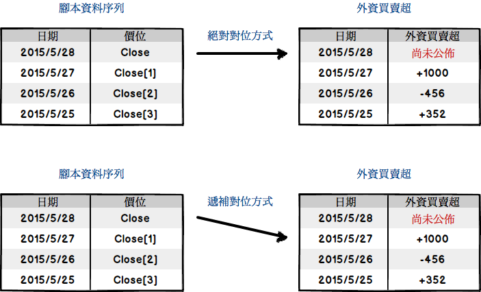 -->


由於每日外資買賣超資料都是在下午16:00以後才會公布，也就是在當日交易區段時價位資料的日期與外資買賣超資料的日期會有一天的差異。所以當以下的腳本在5/28日上午執行時

```xscript

if Close > Close[1] and 
    GetField("外資買賣超") > 0 then ...
    
```

系統會依照對位方式決定GetField("外資買賣超")函數會取得哪一天的外資買賣超資料。

目前系統支援兩種資料對位方式，分別是

- 絕對對位

```xscript

DataAlign(0);
    
```

- 遞補對位

```xscript

DataAlign(1);
    
```

在絕對對位模式時，GetField("外資買賣超")函數的日期必須與價位日期一致(同期別)，也就是說系統會嘗試讀取5/28日的外資買賣超資料，此時由於資料尚未公佈，所以執行會發生失敗(引用資料不存在)。

而在遞補對位模式時，系統在找不到5/28日的外資買賣超資料時，會自動往前尋找。在上面的範例內 GetField("外資買賣超")則會找到5/27日的外資買賣超資料。

目前系統預設的資料對位方式依照腳本類型而有所不同:

- 如果是指標腳本或是雷達腳本，資料對位方式預設為絕對對位 (DataAlign(0))
- 如果是選股腳本，資料對位方式預設為遞補對位 (DataAlign(1))

選股腳本由於常常需要讀取營收/財報等欄位資料，而這些資料通常公佈時間都是落後於價位日期的，所以預設為遞補對位。

使用者如果知道所需資料的日期的話，也可以透過不同的寫法來讀取到預期的資料，不需要更改對位模式。以上述範例而言，如果這是一個策略雷達腳本的話，由於策略雷達腳本的執行時間通常是在交易時間區段，此時外資買賣超資料一定會落後一期。所以腳本可以修改成下列寫法:

```xscript

if Close > Close[1] and 
    GetField("外資買賣超")[1] > 0 then ...
    
```

注意到腳本內使用 GetField "外資買賣超" 語法來讀取前一期的外資買賣超。

[返回](#一般函數)

### ExecOffset

**語法：**

回傳目前函數執行時偏移的K棒筆數

偏移筆數 = ExecOffset

**說明：**

使用在函數內，用來取得目前函數執行時偏移的K棒根數。

一般的函數呼叫方式如下:

```xscript

Value1 = Average(Volume, 5);
    
```

此時如果從Average函數內去呼叫ExecOffset時得到的值是0。

如果呼叫的方式改成:

```xscript

Value1 = Average(Volume, 5)[1];
    
```

的話，則在呼叫Average函數時利用**[1]**設定了偏移的K棒個數，此時Average function執行時取得的資料是當時資料往前偏移一筆的結果，也就是說Value1會是前5日成交量的平均值，不包含最新一日的成交量。

在這樣子的使用情境底下，Average函數內讀取ExecOffset時會得到1.

[返回](#一般函數)

### File

**語法：**

與Print指令搭配，用來指定Print輸出檔案的位置

Print(File(檔案路徑), 輸出數值1, 輸出數值2, 輸出數值3)

Print(File(檔案名稱), 輸出數值1, 輸出數值2, 輸出數值3)

**說明：**

Print指令如果沒有傳入指定檔案欄位時，預設會將所有的Print輸出到XQ安裝目錄底下的XS/Print子目錄內，輸出檔案的名稱為策略名稱_商品代碼.log，例如 MyStrategy_2330.TW.log。

如果使用者希望指定不同的輸出目錄，或是不同的輸出檔案名稱的話，則可以使用File指令來做設定。

File指令有兩種用法:

第一種用法是傳入目錄名稱，例如File("d:\Print")，請注意路徑名稱的結尾必須是""。一旦指定目錄之後，所有的Print輸出檔案都會產生在這個目錄底下，輸出檔案名稱還是策略名稱_商品代碼.log，

第二種用法是傳入檔案名稱，例如File("d:\Print\MyOutput.log")。一旦指定檔案名稱之後，所有Print的輸出都會寫到這個檔案內，包含所有被執行到的商品。

以下是完整的範例:

```xscript

Print(File("d:\Print\"), date,symbol,close);
Print(File("d:\Print\MyOutput.log"), date,symbol,close);
    
```

除了以上用法之外，File內的檔案名稱或是目錄名稱也可以包含以下的特殊字串:

- [StrategyName] ← 轉換成策略名稱，也就是代表雷達名稱、選股策略名稱、指標名稱、自動交易策略名稱
- [StartTime] ← 轉換成策略的啟動時間，格式為HHMMSS
- [Symbol] ← 轉換成執行的商品代碼
- [Freq] ← 轉換成執行的頻率
- [ScriptName] ← 轉換成腳本名稱
- [Date] ← 轉換成YYYYMMDD的日期

如果檔案名稱或是目錄名稱包含以上的特殊字串的話，則XS會把這些字串轉換成執行的商品，頻率，腳本名稱後組成輸出的目錄名稱或是檔案名稱。

舉例而言:

```xscript

Print(File("d:\Print\[Date]_[ScriptName]_[Symbol]_[Freq].log"), date, symbol, close);
    
```

如果腳本名稱是"MyScript", 執行的頻率是日, 執行的商品為2330.TW的話，則Print指令所產生的檔案會是"d:\Print\MyScript_2330.TW_D.log"。請注意如果檔案名稱內有包含特殊字串的話，則每個商品的Print檔案會獨立產生，而不是寫到同一個檔案內。

如果需要避開重覆Print在同一個檔案，可以運用File指令搭配[StartTime]參數，讓每次執行的Print檔案可以分開不同目錄，檔案維護上比較方便。

以下的範例會把輸出資料分開到不同檔案：

```xscript

Print(file("[StrategyName]_[Symbol]_[StartTime].log"), "Date=", NumToStr(Date, 0), "Close=", NumToStr(Close, 2));
    
```

請參考File指令，以及教學文章。

[返回](#一般函數)

### GetBackBar

**語法：**

回傳目前腳本計算所使用的資料引用筆數

回傳數值= GetBackBar

**說明：**

回傳目前腳本計算所使用的資料引用筆數，為一固定常數。

關於資料讀取範圍以及最大引用筆數的定義，請參考：SetTotalBar資料讀取範圍與腳本執行的關係。

[返回](#一般函數)

### GetBarBack

**語法：**

回傳目前腳本計算所使用的資料引用筆數

回傳數值= GetBarBack

**說明：**

回傳目前腳本計算所使用的資料引用筆數，為一固定常數。

關於資料讀取範圍以及最大引用筆數的定義，請參考資料讀取範圍與腳本執行的關係。

[返回](#一般函數)

### GetBarOffset

**語法：**

依傳入的交易日的日期取得相對K棒位置。

回傳數值=GetBarOffset(日期)

回傳數值=GetBarOffset(日期，時間)

傳入二個參數：

- 第一個參數是交易日的日期，格式為YYYYMMDD。
- 第二個參數是時間，格式為HHMMSS，第二個參數可以不用傳。

**說明：**

依傳入的交易日的日期取得相對K棒位置。

可以傳入兩個參數：

- 第一個參數是日期，格式為YYYYMMDD。
- 第二個參數是時間，格式為HHMMSS，第二個參數可以不用傳。

當回傳值為0時，表示傳入日期/時間 ≧K棒日期/時間。
當回傳值為1時，代表目前K棒的前一根K棒日期/時間為傳入日期/時間。

範例：

```xscript

value1 = GetBarOffset(20150831); //取得20150831這根K棒的相對位置
value2 = High[value1]; //取得20150831當天的最高價
plot1(value2); //繪出20150831最高價的水平線
    
```

注意，當無傳入日期這根K棒時，會往前找到最接近的一根。例如：20150829、20150830是非交易日，所以會往前找到20150828這根K棒。也就是說GetBarOffset(20150828)、GetBarOffset(20150829)、GetBarOffset(20150830)的回傳值會是相等的。

[返回](#一般函數)

### GetFieldStartOffset

**語法：**

判斷欄位初始點

欄位筆數 = GetFieldStartOffset("欄位名稱")

欄位筆數 = GetFieldStartOffset("欄位名稱", "頻率")

回傳目前最新一筆欄位與此欄位的第一筆資料間的欄位筆數。

如果無此欄位，或是欄位的初始點超過目前bar的位置，則回-1。

※如果不傳頻率的話，則讀取目前執行頻率的對應欄位。

※僅支援「選股」腳本類型。

**說明：**

請注意，回傳欄位的筆數，是依照傳入的欄位頻率來計算，可能與目前腳本執行的K棒頻率不同。
例如目前可能是跑日線，然後GetFieldStartOffset要查的是月頻率欄位，此時 GetFieldStartOffset所回傳的是月頻率欄位有幾筆。

選股腳本範例：判斷當月營收是否創掛牌新高

```xscript

value1 = GetFieldStartOffset("月營收", "M");
if value1 = 0 then begin 
    ret = 1;  // 只有1期, 就當成創新高了吧
    outputField1(GetField("月營收", "M"),"月營收");
end else if value1 > 0 then begin
    // 算出前N期的最大值
    value2 = Highest(GetField("月營收", "M")[1], value1);
    if GetField("月營收", "M") > value2 then ret = 1;
    outputField1(GetField("月營收", "M"),"月營收");
end;
    
```

範例選股範例：判斷創N期新高

```xscript

input: min_period(12, "最低期別");
value1 = GetFieldStartOffset("月營收", "M");
value2 = GetField("月營收", "M");// 最新一期營收
var: idx(0);
idx = 1;
while idx <= value1 begin
    if GetField("月營收", "M")[idx] < value2 then
        idx = idx + 1
    else
        break;
end;     
if idx >= min_period then begin
    ret=1;
    OutputField(1, idx, 0, "創新高期別");
    OutputField(2, GetField("月營收", "M")[idx], "創新高的月營收");
    OutputField(3, GetFielddate("月營收", "M")[idx], 0, "創新高的月營收資料日期");
end;
    
```

[返回](#一般函數)

### GetFirstBarDate

**語法：**

回傳目前腳本計算所使用第一筆資料的日期

回傳日期= GetFirstBarDate

**說明：**

回傳目前腳本計算所使用第一筆資料的日期，為一固定常數。

日期格式是一個8碼的數字，如果第一筆資料日期是是2009年1月2日，則回傳20090102

關於資料讀取範圍的定義，請參考資料讀取範圍與腳本執行的關係。

[返回](#一般函數)

### GetInfo

**語法：**

用來取得目前腳本的執行環境資訊。

回傳數值=GetInfo(資訊名稱)

傳入一個參數:

- 第一個參數是資訊名稱字串，可以是"Instance"、"IsRealTime"、"IsTimerMode"、"FilterMode"、"TradeMode"、"AT_EnableTrade"、"AT_BID"、"AT_AccType"或"AT_AID"

**說明：**

依傳入的參數回傳相關資訊。

當參數為"Instance"時，可以取得腳本執行的功能：

- 回傳值為1表示自訂指標。
- 回傳值為2表示策略雷達。
- 回傳值為3表示XS選股。
- 回傳值為31表示XS選股自訂排行。
- 回傳值為4表示策略雷達回測（進場）。
- 回傳值為41表示策略雷達回測（出場）。
- 回傳值為5表示自動交易
- 回傳值為6表示自動交易回測

當參數為"IsRealTime"時，可以取得K棒的狀態：

- 回傳值為0表示該筆資料為歷史資料或其他。
- 回傳值為1表示該筆資料為即時成交更新資料，需注意當該筆運算是因為自動洗價觸發時，就算資料不是即時成交更新也會回傳1。

當參數為"IsTimerMode"時，可以判斷該次洗價是否因為自動洗價所觸發，只支援警示腳本和交易腳本：

- 回傳值為1表示該次洗價是因為自動洗價所導致。
- 回傳值為0表示為成交洗價觸發，或是使用在其他腳本上。

當參數為"FilterMode"時，可以取得XS選股的模式：

- 回傳值為1表示XS選股。
- 回傳值為2表示XS選股回溯。
- 回傳值為3表示XS選股回測（進場）。

當參數為"TradeMode"時，可以交易策略目前執行的K棒是否處於資料讀取區間：

- 回傳值為0表示目前執行的K棒處理資料讀取區間，所以交易指令不會執行。
- 回傳值為1表示目前執行的K棒處理策略部位計算區間或是即時區間，交易指令將會執行。

當參數為"AT_EnableTrade"時，可以取得目前交易策略是否有啟動帳號：

- 回傳值為0表示回測或即時區間但沒有設定交易帳號。
- 回傳值為1表示即時區間且有設定交易帳號。

當參數為"AT_BID"時，可以取得券商的字串代碼：

- 回傳值為空白字串表示策略沒有設定交易帳號或是在回測。
- 回傳值為SYSTRADE表示策略帳號為模擬交易帳號。
- 回傳值為SYSCAMPUS表示策略帳號為校園模擬競賽。
- 其他券商會回傳各自對應的代碼。

當參數為"AT_AccType"時，可以取得策略運作的業務類別:

- 回傳值為1表示業務類別為證券。
- 回傳值為2表示業務類別為期貨。
- 回傳值為3表示業務類別為複委託。
- 回傳值為0表示策略沒有設定交易帳號或是在回測。

當參數為"AT_AID"時，可以取得目前策略運作的帳號:

- 回傳值為空白字串表示策略沒有設定交易帳號或是在回測。
- 回傳值為券商代碼加上交易帳號組成的字串。

關於AT的EnableTrade、BID、AccType以及AID的進一步說明，可以參考自動交易語法 取得「交易帳號」使用說明

範例：

```xscript

value1 = getinfo("IsRealTime"); //若value1為1，則代表目前計算的是即時資料
plot1(value1); 
    
```

[返回](#一般函數)

### GetSymbolFieldStartOffset

**語法：**

判斷欄位初始點

欄位筆數 = GetSymbolFieldStartOffset("ID", "欄位名稱")

欄位筆數 = GetSymbolFieldStartOffset("ID", "欄位名稱","頻率")

回傳目前最新一筆欄位與此欄位的第一筆資料間的欄位筆數。

如果無此欄位，或是欄位的初始點超過目前bar的位置，則回-1。

※如果不傳頻率的話，則讀取目前執行頻率的對應欄位。

※僅支援「選股」腳本類型。

**說明：**

GetSymbolFieldStartOffset是GetFieldStartOffset語法的延伸，在取得欄位相關資料時可以指定商品，透過這個函數可以在腳本中取得其他商品的欄位筆數。

以下是一個簡單的範例：

```xscript

Value1 = GetSymbolFieldStartOffset("1101.TW", "月營收");　// value1 為取得目前腳本執行頻率的台泥(1101)目前最新一筆月營收欄位與月營收欄位第一筆資料間的欄位筆數。
Value2 = GetSymbolFieldStartOffset("1101.TW", "月營收", "M");　// value2 為取得月頻率的台泥(1101)目前最新一筆月營收欄位與月營收欄位第一筆資料間的欄位筆數。
    
```

詳細的語法說明可以參考 GetFieldStartOffset函數。

[返回](#一般函數)

### GetSymbolGroup

**語法：**

用來取得 執行商品/指定商品 支援的相關商品清單。

Group: myGroup();

myGroup = GetSymbolGroup("權證");

myGroup = GetSymbolGroup("TSE23.TW", "成分股");

**說明：**

GetSymbolGroup 可用來取得系統內建的商品清單 。

第一個參數指定要取得清單的商品，例如範例中的 TSE23.TW 。 若未指定商品，則預設取得目前執行商品的清單 （ 前提是該清單存在 ） 。

第二個參數指定所需的清單類型，例如範例中的 成分股 ，此參數為必填 。

可參考商品清單功能。

[返回](#一般函數)

### GetTBMode

**語法：**

取得自定指標的繪圖模式

回傳數值= GetTBMode

**說明：**

取得自定指標的繪圖模式。回傳數值如下

- SetTBMode(1) 同v5.62行為，腳本資料計算筆數為資料讀取筆數加畫面上的K棒筆數，使用者拉動畫面會進行重算。
- SetTBMode(0) 預設值，腳本資料計算筆數為全部資料，整個數列只算一次，拉動畫面不會重算。

範例:

```xscript

Input: Period(200, "EMA");
Input: TB(1);
SetTBMode(TB);//指定自定指標的繪圖模式，可以變更參數比較一下計算值的差異
Plot1(EMA(Close, Period), "EMA");
Plot2(GetTBMode);//取得自定指標的繪圖模式
    
```

[返回](#一般函數)

### GetTotalBar

**語法：**

回傳目前腳本計算所使用的資料筆數

回傳數值= GetTotalBar

**說明：**

回傳目前腳本計算所使用的資料筆數，為一固定常數。

關於執行筆數以及最大引用筆數的說明，請參考資料讀取範圍與腳本執行的關係。

[返回](#一般函數)

### GroupSize

**語法：**

回傳指定Group中包含的商品數量。

Input: myGroup(Group);

Value1 = GroupSize(myGroup);

**說明：**

GroupSize函數會回傳商品清單包含的數量，可以此數值避免取用到超出陣列範圍的資料而導致錯誤。

[返回](#一般函數)

### IsFirstCall

**語法：**

回傳目前計算的K棒（currentbar）是否為事件的第一次洗價

傳入事件字串：" "、"Bar"、"Date"、"Realtime"、"RealBar"

回傳布林值=IsFirstCall

**說明：**

isfirstcall(" ")：此次執行的第一次洗價

isfirstcall("Bar")：此根 Bar 的第一次洗價

isfirstcall("Date")：此交易日的第一次洗價

isfirstcall("Realtime")：此交易日進入即時洗價區間的第一次洗價

isfirstcall("RealBar")：此交易日進入即時洗價區間，首次產生成交事件後的第一次洗價(通常會與"Realtime"一致；若是在揭示未成交K棒時，遇到暫緩開盤或開盤後沒有成交事件，兩者就會產生差異)

詳細說明與範例請參考：

https://www.xq.com.tw/learn/xspractice/isfirstcall/

[返回](#一般函數)

### IsLastBar

**語法：**

回傳目前計算的K棒（currentbar）是否為最新的K棒

回傳布林值=IsLastBar

**說明：**

當目前計算的K棒為最新的K棒時，回傳True；其他狀況則回傳False。

[返回](#一般函數)

### IsSessionFirstBar

**語法：**

回傳目前計算的K棒（currentbar）是否為當日第一根K棒

回傳布林值=IsSessionFirstBar

**說明：**

當目前計算的K棒為當日第一根K棒時，回傳True；其他狀況則回傳False。

[返回](#一般函數)

### IsSessionLastBar

**語法：**

回傳目前計算的K棒（currentbar）是否為當日最後一根K棒

回傳布林值=IsSessionLastBar

**說明：**

當目前計算的K棒為當日最後一根K棒時，回傳True；其他狀況則回傳False。

[返回](#一般函數)

### MaxBarsBack

**語法：**

取得腳本執行時所設定的最大引用筆數

Value1 = MaxBarsBack

**說明：**

回傳目前腳本計算所使用的資料引用筆數，為一固定常數。

關於資料讀取範圍以及最大引用筆數的定義，請參考資料讀取範圍與腳本執行的關係。

[返回](#一般函數)

### NoPlot

**語法：**

清除指定的指標序列目前這根K棒上面的數值

NoPlot(指標繪圖序列編號)

指標繪圖序列編號從1到999

**說明：**

在指標腳本內我們會使用Plot函數來產生不同的數值序列，每一個數值序列有一個編號，從1到999。

如果在某些情形底下我們希望某個序列這一點的值不要畫的話，則可以使用NoPlot的語法來做清除的動作。

以下我們先看一個範例:

```xscript

Value1 = Close - Close[1];
Plot1(Value1);
    
```

在上面這個腳本內，我們先計算先後兩筆K棒的差值，然後把差值畫在Plot1上面。

如果我們希望只有上漲時才畫的話，那則可以改成這樣子的寫法:

```xscript

Value1 = Close - Close[1];
Plot1(Value1);
If Value1 <= 0 Then NoPlot(1);
    
```

上述範例內使用NoPlot函數，指定序列1在Value1 <= 0 的時候不要畫圖。

[返回](#一般函數)

### OutputField

**語法：**

指定選股的輸出欄位

OutputField(輸出序號, 數值)

OutputField(輸出序號, 數值, 小數位數)

OutputField(輸出序號, 數值, 小數位數, 輸出欄位名稱)

OutputField1(數值)

OutputField1(數值, 小數位數)

OutputField1(數值, 小數位數, 輸出欄位名稱)

**說明：**

選股腳本預設只會顯示被選到的商品的商品名稱，成交，漲幅，成交量這幾個欄位。如果有需要在選股結果內輸出更多的欄位的話，則可以透過OutputField函數來新增欄位。

OutputField的語法可以傳入至多四個參數:

- 第一個參數為輸出序號，從1到99，用來指定輸出欄位的順序
- 第二個參數為要輸出的數值
- 第三個參數指定輸出時數值的小數點位數，可以不傳
- 從5.60版之後增加第四個參數，可以傳入輸出欄位的標題。如果不傳的話則預設的欄位標題為"欄位" + 序號。

以下是簡單的範例:

```xscript

OutputField(1, GetField("月營收年增率","M"));
OutputField(2, GetField("月營收月增率","M"), 1);
OutputField(3, GetField("月營收月增率","M"), 1, "月營收月增率");
    
```

以上的範例在執行後會多產生三個欄位，第一個欄位為"欄位1"，內容為月營收年增率。第二個欄位為"欄位2"，內容為月營收年增率轉成一位小數點。第三個欄位為"月營收年增率"，內容與第二個欄位相同。

<!--  -->


OutputField指令也可以在函數名稱之後直接加上序號，例如OutputField1, OutputField2等。如果函數名稱內就包含序號的話，則就不需要傳入序號參數。

上述的範例可以改寫為:

```xscript

OutputField1(GetField("月營收年增率","M"));
OutputField2(GetField("月營收月增率","M"), 1);
OutputField3(GetField("月營收月增率","M"), 1, "月營收月增率");
    
```

OutputField指令內所設定的欄位標題也可以透過SetOutputName函數來指定。

OutputField 也可以使用 order 來指定選股結果區的欄位數值上/下排序，請參考連結說明使用。

[返回](#一般函數)

### Playsound

**語法：**

播放指定的音訊檔案

**說明：**

在執行該行腳本時，播放設定的音訊檔案

若同一次腳本運算中執行了複數個 PlaySound 函數，只會撥放最後執行的音訊檔案。

在指定檔案時，若沒有指定絕對路徑的話，會從預設資料夾 C:\SysJust\XQ2005\User\Sound 搜尋符合的檔案。

範例:

```xscript

PlaySound("GML.wav");
PlaySound("C:\SysJust\XQ2005\User\Sound\GML.wav");
    
```

[返回](#一般函數)

### Plot

**語法：**

產生指標腳本的繪圖序列語法：

Plot(輸出序號，指標數值)

Plot(輸出序號，指標數值，繪圖序列名稱)

Plot(輸出序號，指標數值，繪圖序列名稱，checkbox:=1)

Plot1(指標數值)

Plot1(指標數值，繪圖序列名稱)

Plot1(指標數值，繪圖序列名稱，checkbox:=1)

**說明：**

在指標腳本內必須使用Plot函數來產生繪圖數列。

每個指標腳本可以產生至多999個繪圖數列，實際使用時必須在Plot之後加上指定的繪圖序列編號，例如Plot1, Plot2, 到Plot999。

Plot函數可以傳入三個參數

- 第一個參數是指標的數值
- 第二個參數是這個繪圖序列的名稱，可以不用傳。如果不傳的話，則繪圖序列的名稱為 "Plot"加上這個序列的編號
- 第三個參數為「是否開啟下拉式選單」提供給使用者勾選顯示指標。可以不用傳，如果不傳的話，則不會有下拉式選單提供選擇。checkbox:=1 為預設顯示指標；checkbox:=0 為預設「不」顯示指標。

範例#1

```xscript

Plot1(Average(Close, 5));
Plot2(Close, "收盤價");
    
```

在範例#1 內輸出兩個繪圖數列，第一個數列為收盤價的五日平均值，圖形名稱為 "Plot1"，第二個數列為收盤價(Close)，圖形名稱為 "收盤價"。

Plot1到Plot99除了可以是一個函數之外，也可以在腳本內被當成數列來引用。

範例#2

```xscript

Plot1(Average(Close, 5));
Plot2(Close, "收盤價");
Value1 = Plot2 - Plot1;
Plot3(Value1, "差值");
    
```

在範例#2 內Value1的數值是繪圖數列2(Plot2)與繪圖數列1(Plot1)的相減值，然後把這個差值畫在Plot3上面。

範例#3

```xscript

//checkbox:=1，為預設顯示指標。
//checkbox:=0，為預設「不」顯示指標。
plot1(open,"開盤價",checkbox:=0);
plot2(high,"最高價",checkbox:=0);
plot3(low,"最低價",checkbox:=0);
plot4(close,"收盤價",checkbox:=1);//預設繪製出「收盤價」指標
    
```

在範例#3 中，有使用到 checkbox 參數，故將此XS指標腳本加入指標後的技術分析副圖，在滑鼠點選下拉式選單圖示如下：

<!-- 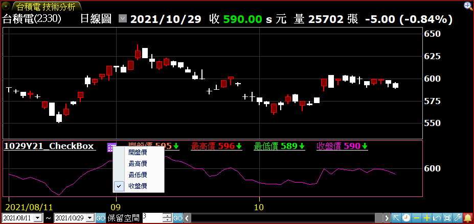 -->


[返回](#一般函數)

### PlotFill

**語法：**

PlotFill(序列編號, vFrom, vTo);

PlotFill(序列編號, vFrom, vTo, "序列名稱");

**說明：**

第一個參數是設定序列編號，會是 1~999 的數值，與目前 Plot 的序列編號相同。

第二個和第三個參數分別是當根 K 棒要填色的開始和結束點。 第四個參數是設定序列的名稱，為選填的參數。若沒有設定的話預設會是 " Plot "+序列編號。

此函數能夠在線圖上指定區域填色的功能，例如 KD 指標的超買超賣區間，讓使用者能夠更簡單的辨識指標間的範圍。

詳細說明可參考：如何運用函數繪製填色區塊 文章。

[返回](#一般函數)

### PlotK

**語法：**

在腳本運算的橫軸位置上畫出K棒。

PlotK(序列編號, vOpen, vHigh, vLow, vClose)

PlotK(序列編號, vOpen, vHigh, vLow, vClose, "序列名稱")

**說明：**

序列編號是1~999的數值，與目前XS Plot的序列編號相同。
序列名稱是非必需的參數，如果不傳的話，預設的序列名稱為"Plot"+序列編號，例如”Plot2”。
vOpen, vHigh, vLow, vClose 對應的是K棒的開高低收。

平均K線 (Heikin-Ashi) 範例：

```xscript

var: ha_open(0), ha_high(0), ha_low(0), ha_close(0);


if currentbar = 1 then
    ha_open = (open + close) / 2
else
    ha_open = (open[1] + close[1]) / 2;


ha_close = (open + high + low + close) / 4;
ha_high = maxlist(high, ha_open, ha_close);
ha_low = minlist(low, ha_open, ha_close);


PlotK(1, ha_open, ha_high, ha_low, ha_close, "平均K線");
    
```

[返回](#一般函數)

### PlotLine

**語法：**

繪製直線。

PlotLine(序列編號, x1, y1, x2, y2)

PlotLine(序列編號, x1, y1, x2, y2, "序列名稱")

**說明：**

大家好，今天來跟大家介紹一個XS指標的新功能：PlotLine，用來繪製直線。

請參考：PlotLine語法的介紹 文章

[返回](#一般函數)

### Print

**語法：**

將文字/數值輸出到XSScript編輯器的執行畫面跟檔案內

Print(數值1, 數值2, 數值3, ...)

Print(指定檔案,數值1, 數值2, 數值3, ...) ← 交易腳本必須用此法才能列印到檔案。

※執行選股與執行回測時，Print檔案加總超過 100M 就不會印出。

**說明：**

Print函數可以傳入多個參數，使用逗號分隔，參數可以是文字或是數值。每個Print函數會產生一行的輸出，內容為傳入的參數的文字或是數值，每個參數之間有一個空白。

範例:

```xscript

Print("Date=", NumToStr(Date, 0), "Close=", NumToStr(Close, 2));
    
```

把上述指標腳本放入技術分析內，執行時可以在XSScript編輯器的執行畫面內看到輸出，每一筆bar寫出一筆紀錄

<!-- 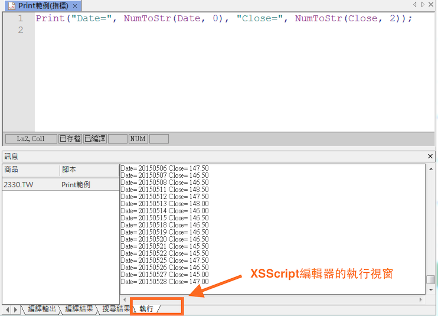 -->


Print函數的執行結果除了在XSScript編輯器內可以看到之外，另外也會產生一個文字檔案。

檔案的輸出位置是在XQ安裝目錄底下的XS\Print子目錄內，檔案名稱預設為策略名稱加上商品名稱，檔名為**.log**。以上述為例輸出的檔案名稱為 C:\SysJust\XQ2005\XS\Print\Print範例_2330.TW.log

策略名稱也就是代表雷達名稱、選股策略名稱、指標名稱或自動交易策略名稱。

使用者也可以利用File指令來指定輸出的目錄或是檔名，交易腳本必須用此法才能列印到檔案。

以下的範例會把輸出檔案寫在"d:\print"這個目錄內：

```xscript

Print(file("d:\print\"), "Date=", NumToStr(Date, 0), "Close=", NumToStr(Close, 2));
    
```

如果需要避開重覆Print在同一個檔案，可以運用File指令搭配[StartTime]參數，讓每次執行的Print檔案可以分開不同目錄，檔案維護上比較方便。

以下的範例會把輸出資料分開到不同檔案：

```xscript

Print(file("[StrategyName]_[Symbol]_[StartTime].log"), "Date=", NumToStr(Date, 0), "Close=", NumToStr(Close, 2));
    
```

請參考File指令，以及教學文章。

[返回](#一般函數)

### RaiseRunTimeError

**語法：**

用來中斷執行中的程式

RaiseRunTimeError(錯誤訊息)

**說明：**

當腳本遇到任何重大錯誤時，可以使用RaiseRunTimeError函數來終止腳本的執行。

舉例而言:

```xscript

if q_CurrentShareCapital < 100000000{100,000,000股*10 = 10億} then RaiseRunTimeError("市值小於10億踢除");
    
```

上述是一個警示腳本，透過 q_CurrentShareCapital 欄位來判斷商品的股本是否小於10億，如果小於10億是的話則中斷執行。

與下列程式比較:

```xscript

if q_CurrentShareCapital < 100000000{100,000,000股*10 = 10億} then return;
    
```

請注意如果是使用return指令的話，則執行的這一筆bar雖然會被跳出，可是當還有新的K棒時，程式還是會繼續執行，如果判斷是否要跳出的邏輯比較複雜的話，可能會有一些效率上的影響。如果已經確定腳本不需要再執行的話，可以使用RaiseRuntimeError，比較有效率，而且執行的畫面上也可以看到錯誤訊息，方便使用者掌握腳本的狀態。

[返回](#一般函數)

### SetAlign

**語法：**

根據欄位屬性，指定腳本執行時的資料對位計算方式

SetAlign("籌碼",資料對位計算方式)

SetAlign("營收財報",資料對位計算方式)

**說明：**

SetAlign可以根據欄位屬性，指定腳本執行時的資料對位計算方式。

說明資料的對位定義

無論是資料欄位或選股欄位，皆會在欄位可用頻率的K棒生成後，將對應時間的歷史資料標記在此根K棒上，舉例來說：

資料欄位 "外盤量" 的可用頻率為分鐘、日、還原日，因此當GetField["外盤量",”10”](n)時，可以想像在距離最新10分K之前的第n根10分K上，有一筆"外盤量"的資料標記在上面。

至於最新K棒尚未結束之前，GetField["外盤量",”10”](0)都會不斷被更新至最新10分K的標記當中。

在對資料與K棒之間的標記關係，有了理解之後，就要來說明資料的對位方式，有以下兩種：

- 絕對對位：根據資料名義上的所屬期別來標記對位。

例如 "大戶持股張數" 最快每周更新一次，那資料就會標記在當周的第一根K棒； "每股現金流量" 最快每季更新一次，那資料就會標記在當季的第一根K棒（標記更新後的持續區間，都會取得期初標記的資料，直到標記再次被更新為止）。

- 公布日對位：根據資料何時能被XS取得來標記對位（不一定等於資料被公司公布的時間，因為第一手資料公布後，上游的資料源會接收、整理後再轉給XQ，接著再轉成XS可以取得的格式）。

例如 "每股現金流量" 第一季的資料在4/16首次可以被XS取得、第二季的資料在7/13首次可以被XS取得。那4/16會標記第一季的資料；7/13的K棒才會標記第二季的資料（4/16~7/12之間的K棒，會取得的是第一季的資料）。

SetAlign的使用

- 指標、警示、自動交易腳本的範例如下：

```xscript

SetAlign("籌碼", 0);   //預設值，絕對對位
SetAlign("營收財報", 0); //預設值，絕對對位
SetAlign("籌碼", 1);   //公布日對位
SetAlign("營收財報", 1); //公布日對位

```

- 選股腳本則不在SetAlign的支援範圍：
  
  選股欄位中，除了籌碼欄位是絕對對位以外，其他欄位都是公佈日對位。

[返回](#一般函數)

### SetBackBar

**語法：**

腳本執行時，設置指定頻率的最大引用筆數

SetBackBar(最大引用筆數)

SetBackBar(最大引用筆數, "頻率")

如果不傳頻率的話，則指定目前執行頻率的最大引用筆數。

**說明：**

腳本執行時，設置指定頻率的最大引用資料範圍。

詳細介紹可以參考設置指定頻率引用筆數的應用。

關於資料讀取範圍以及最大引用筆數的定義，請參考資料讀取範圍與腳本執行的關係。

[返回](#一般函數)

### SetBarBack

**語法：**

腳本執行時，設置指定頻率的最大引用筆數

SetBarBack(最大引用筆數)

SetBarBack(最大引用筆數, "頻率")

如果不傳頻率的話，則指定目前執行頻率的最大引用筆數。

**說明：**

腳本執行時，設置指定頻率的最大引用資料範圍。

詳細介紹可以參考設置指定頻率引用筆數的應用。

關於資料讀取範圍以及最大引用筆數的定義，請參考資料讀取範圍與腳本執行的關係。

[返回](#一般函數)

### SetBarFreq

**語法：**

指定這個腳本可以支援的頻率(只可使用在選股腳本內)

SetBarFreq(支援頻率1, 支援頻率2, 支援頻率3, ...)

可以傳入多個頻率字串

**說明：**

SetBarFreq可以傳入多個頻率字串，使用逗號分隔，用來指定選股腳本可以使用的頻率。

頻率參數的格式如下

- 日線: "D"，
- 還原日線: "AD"，
- 周線: "W"，
- 還原周線: "AW"，
- 月線: "M"，
- 還原月線: "AM"，
- 季線: "Q"，
- 半年線: "H"，
- 年線: "Y"

範例:

```xscript

SetBarFreq("Q", "Y"); // 指定選股腳本只能執行在季線/年線的頻率上面
    
```

由於選股腳本內可能會同時運用到多種不同欄位的頻率，而不同頻率的欄位又有可能因為資料公佈的時間差而產生期別上的差異。為了幫助使用者選到合適的執行頻率，XS選股程式在執行時會先分析這個腳本內所使用到的所有欄位的頻率，然後列出可以挑選的頻率。如果使用者希望可以更精確的指定頻率的話，則可以使用SetBarFreq這個函數。

[返回](#一般函數)

### SetBarMode

**語法：**

指定腳本執行時的函數計算方式

SetBarMode(函數計算方式)

**說明：**

SetBarMode可以指定函數的計算方式，分別為(0),(1),(2)

對於Setbarmode 0,1,2 三種計算方式解釋:

```xscript

SetBarMode(0); //Auto，預設值
    
```

由系統判定是simple函數 或是 series 函數

```xscript

SetBarMode(1);  //指定為simple函數
    
```

Simple型態是指，例如average 這類函數計算方式，今期所計算的平均數與前一期的平均數為個別獨立運用，不會相互有關係
例如:平均數 average(1,2,3,4,5)/5 = 3 ；(2,3,4,5,6)/5 = 4 兩者計算的結果無關聯

```xscript

SetBarMode(2);  //指定為series函數
    
```

Series 型態是指，例如MACD,RSI 指標，屬於連續性的數值，今期所計算的值會引用到前期的數值來做運算。

例如RSI指標計算「期間內絕對漲幅」的公式為 UP t = UP t-1 + 1 / N ( Ut – UP t-1) ，(N 為平滑平均天數， t 為當日值， t-1為前一日值) 當期值t會使用到前期的(t-1) 進行運算

[返回](#一般函數)

### SetFirstBarDate

**語法：**

指定腳本執行時第一筆資料的日期(不支援交易腳本)

SetFirstBarDate(資料開始日期)

**說明：**

關於資料讀取範圍的定義，請參考資料讀取範圍與腳本執行的關係。

SetFirstBarDate 函數用於控制腳本執行時，所使用的第一個資料的日期，從而確定資料讀取的起始範圍。

語法為 SetFirstBarDate(YYYYMMDD)，其中 YYYYMMDD 是起始日期的年、月、日，且必須為合理有效的日期。

需要注意的是，SetFirstBarDate 不支援交易腳本。


如果在腳本中多次使用 SetFirstBarDate 函數，並設定了不同的日期：

- 將會採用其中最早（最小值）的日期作為最終的資料開始日期。
  
  若設定的日期不是合理有效的日期，該行的 SetFirstBarDate 將被視為編譯失敗。

如果在腳本中同時存在數個 SetTotalBar 和 SetFirstBarDate，並設定了不同的數值時：

- 系統將分別根據兩者被多次使用時的規則，決定接下來各自採用哪一個 SetTotalBar 與 SetFirstBarDate 做比較。
- 接著採用兩者當中，最後一個成功完成編譯的函數設定。
  
  若其中一個函數因參數無效（例如 SetTotalBar 的資料讀取筆數為負數，或 SetFirstBarDate 的日期不合理）而編譯失敗，則只有另一個成功編譯的函數設定會被採用。

### SetInputName

**語法：**

設定輸入參數(Input)的顯示名稱

SetInputName(序號, 顯示名稱)

SetInputName1(顯示名稱)

**說明：**

在XS語法內可以使用Input語法來設定腳本輸入的參數。

```xscript

Input: Length(10);


Plot1(Average(Close, Length));
    
```

例如上面範例內定義了一個輸入參數，名稱為Length，初始值為10。在腳本內可以直接使用Length這個變數，而在腳本執行時則可以利用參數設定畫面來動態修改Length的數值，以便讓程式的設計更有彈性。

<!--  -->


如果希望在設定畫面上可以看到中文名稱，而不是英文的變數名稱的話，則可以使用SetInputName這個函數。

```xscript

Input: Length(10);


SetInputName(1, "天期");
Plot1(Average(Close, Length));
    
```

SetInputName必須傳入兩個參數

- 第一個參數是參數的序號，從1開始，
- 第二個參數是參數的顯示名稱

以下是指標設定的畫面，標示處內可以看到透過SetInputName所指定的參數的名稱

<!-- 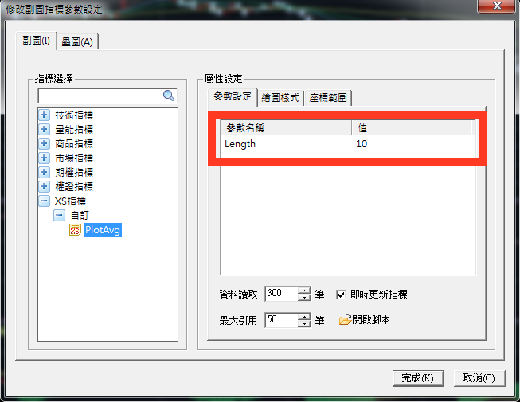 -->


SetInputField指令也可以在函數名稱之後直接加上序號，例如SetInputName1, SetInputName2等。如果函數名稱內就包含序號的話，則就不需要傳入序號參數。

上面的範例可以改寫成:

```xscript

Input: Length(10);


SetInputName1("天期");
Plot1(Average(Close, Length));
    
```

在XQ 5.60版之後，為了讓這個動作更簡單，使用者可以直接在Input語法內指定輸入參數的顯示名稱，上面的範例可以改寫成:

```xscript

Input: Length(10, "天期");


Plot1(Average(Close, Length));
    
```

新的Input的語法可以讓程式變的更短，而且由於顯示名稱跟Input可以寫在同一行內，使用者不需要再去記憶每個Input的序號，建議大家以後直接使用Input語法來指定輸入參數的顯示名稱。

### SetOutputName

**語法：**

指定選股的輸出欄位標題

SetOutputName(序號, 欄位標題)

SetOutputName1(欄位標題)

**說明：**

在XS語法內可以使用OutputField指令來產生選股時的輸出欄位。

預設的輸出欄位的標題為 "欄位"加上"序號"，例如"欄位1", "欄位2"等。為了讓輸出報表更清楚，可以使用SetOutputName指令來設定輸出欄位的名稱。

SetOutputName必須傳入兩個參數:

- 第一個參數是欄位的序號，從1到99，
- 第二個參數是欄位的名稱

例如:

```xscript

OutputField1(GetField("月營收年增率","M"));
SetOutputName(1, "月營收年增率");
    
```

在上面範例內指定第一個輸出欄位的標題為"月營收年增率"。

SetOutputField指令也可以在函數名稱之後直接加上序號，例如SetOutputName1, SetOutputName2等。如果函數名稱內就包含序號的話，則就不需要傳入序號參數。

上面的範例可以改寫成:

```xscript

OutputField1(GetField("月營收年增率","M"));
SetOutputName1("月營收年增率");
    
```

在XQ 5.60版之後，OutputField指令也增加了可以直接傳入欄位標題的功能。

[返回](#一般函數)

### SetPlotLabel

**語法：**

設定繪圖序列的名稱

SetPlotLabel(繪圖序列編號，繪圖序列名稱)

**說明：**

SetPlotLabel傳入兩個參數

- 第一個參數是繪圖序列的編號，可以從1到99，
- 第二個參數則是這個序列的名稱，為一個字串值

這個函數可以用來指定這個繪圖序列的名稱，跟Plot函數的第二個參數是類似的。

兩者最大的差異是，在Plot函數內的第二個參數目前只支援固定的字串，而SetPlotLabel的第二個參數則可以是一個字串相關的敘述式，使用上比較有彈性。

舉例而言:

```xscript

Input: Period(10);


Plot1(Average(Close, Period));
SetPlotLabel(1, Text("天期(", NumToStr(Period, 0), ")"));
    
```

在上述範例內我們希望指標圖形上面可以看到平均線的天期，例如如果天期是5的話，我們希望指標序列的名稱是"天期(5)"，而如果天期是10的話，則我們希望指標序列的名稱是"天期(10)"。

由於天期是透過Input語法傳入的，數值可以動態被修改，沒有辦法寫成一個固定的字串，所以我們使用SetPlotLabel，搭配Text函數以及NumToStr函數來組出天期的字串。

[返回](#一般函數)

### SetTBMode

**語法：**

指定自定指標的繪圖模式

SetTBMode(繪圖模式)

**說明：**

指定自定指標的繪圖模式。支援模式的如下

- SetTBMode(1) 同v5.62行為，腳本資料計算筆數為資料讀取筆數加畫面上的K棒筆數，使用者拉動畫面會進行重算。
- SetTBMode(0) 預設值，腳本資料計算筆數為全部資料，整個數列只算一次，拉動畫面不會重算。

範例:

```xscript

Input: Period(200, "EMA");
SetTBMode(1);//指定自定指標的繪圖模式，可以變更參數比較一下計算值的差異
Plot1(EMA(Close, Period), "EMA");
    
```

[返回](#一般函數)

### SetTotalBar

**語法：**

指定腳本執行時的資料讀取範圍

SetTotalBar(資料讀取筆數)

**說明：**

關於資料讀取範圍的定義，請參考資料讀取範圍與腳本執行的關係。

SetTotalBar 用於設定腳本執行時，讀取的歷史K棒數量。

SetTotalBar 設定的資料讀取筆數必須為非負整數。當腳本引用 SetTotalBar 並指定一個數值時，系統會預先提供指定數值的K棒，並從這些K棒的第一根 (編號為1) 開始執行腳本。

不同腳本類型的規則：

- 指標腳本： 將繪製的歷史 K 棒數量，不包含即時的 K 棒。
- 選股腳本： 判斷目前K棒是否滿足選股條件之前，將執行的 K 棒數量。
- 警示腳本： 開始接收即時價格更新並觸發警示訊號之前，將執行的 K 棒數量，不包含即時的 K 棒。
- 自動交易腳本：(策略部位計算起點之前，或)開始接收即時價格更新並觸發警示訊號之前，將執行的 K 棒數量，不包含即時的 K 棒。

如果在腳本中多次使用 SetTotalBar ，並設定了不同的數值：

- 將會採用其中編譯成功的最大數值作為最終的K棒總數。
  
  若設定的數值不是非負整數，該行的SetTotalBar將被視為編譯失敗。

如果在腳本中同時存在數個 SetTotalBar 和 SetFirstBarDate ，並設定了不同的數值時：

- 系統將分別根據兩者被多次使用時的規則，決定接下來各自採用哪一個 SetTotalBar 與 SetFirstBarDate 做比較。
- 接著採用兩者當中，最後一個成功完成編譯的函數設定。
  
  若其中一個函數因參數無效（例如 SetTotalBar 的資料讀取筆數為負數，或 SetFirstBarDate 的日期不合理）而編譯失敗，則只有另一個成功編譯的函數設定會被採用。

[返回](#一般函數)

### SymbolExchange

**語法：**

目前執行商品的交易所編碼

回傳代碼 = SymbolExchange

**說明：**

SymbolExchange函數回傳目前執行商品的交易所編碼，例如 "TW"。

當回傳值為"TW"時，表示商品屬於台灣證券交易所（上市&上櫃）。

當回傳值為"TE"時，表示商品屬於台灣興櫃。

當回傳值為"TF"時，表示商品屬於台灣期貨交易所。

當回傳值為"FS"時，表示商品屬於國際指數。

當回傳值為"FX"時，表示商品屬於外匯。

當回傳值為"HK"時，表示商品屬於香港交易所。

當回傳值為"SH"時，表示商品屬於上海交易所。

當回傳值為"SZ"時，表示商品屬於深圳交易所。

當回傳值為"KS"時，表示商品屬於韓股。

當回傳值為"JP"時，表示商品屬於日股。

當回傳值為"US"時，表示商品屬於美股。

當回傳值為"SG"時，表示商品屬於新加坡。

範例:

```xscript

If SymbolExchange = "TW" then
begin
    // 目前執行的商品為台股商品
end;
    
```

[返回](#一般函數)

### SymbolType

**語法：**

回傳目前執行腳本的商品類型

回傳代碼 = SymbolType

**說明：**

SymbolType函數回傳目前執行腳本的商品類型。

當回傳值為1時，表示商品是指數。

當回傳值為2時，表示商品是股票。

當回傳值為3時，表示商品是期貨。

當回傳值為4時，表示商品是權證。

當回傳值為5時，表示商品是選擇權。

當回傳值為6時，表示商品是可轉債。

當回傳值為7時，表示商品是特別股。

範例:

```xscript

If SymbolType = 3 then
begin
    // 目前執行的商品為期貨
end;
    
```

[返回](#一般函數)


## 時間函數

### CurrentTime

**語法：**

回傳腳本的執行時間（歷史區間為當時；即時區間為當下）

回傳時間 = CurrentTime

時間格式是一個6碼的數字, 例如如果是上午的11點30分00秒, 則回傳113000

注意：不支援選股（執行選股時，數值為0）

**說明：**

歷史區間為當時的意思是，例如回溯、回測，都是腳本執行在歷史的時間範圍中，這時的CurrentTime就會是歷史當時的時間，而非此時此刻。

即時區間為當下的意思是，腳本執行在當下，因此CurrentTime就會是此時此刻的時間。

時間的格式為5碼或6碼的數字 HHMMSS:

- HH: 執行的小時，數值範圍從0到23 (24小時制), 可能是1碼或2碼，
- MM: 執行的分鐘，數值範圍從00到59，兩碼，
- SS: 執行的秒數，數值範圍從00到59，兩碼

舉例而言，如果執行時間是上午的9點30分00秒，則CurrentTime回傳 93000，如果執行時間為下午1點30分00秒，則CurrentTime回傳133000。

我們可以使用這個函數來判斷腳本的執行時間，例如在以下範例內使用CurrentTime來判斷腳本執行時是否已經是中午12:30分之後。

```xscript

If CurrentTime >= 123000 Then
Begin
    // 執行時間是中午12:30分以後
End;

```

[返回](#時間函數)

### CurrentTimeMS

**語法：**

回傳腳本的執行時間（歷史區間為當時；即時區間為當下）

回傳時間 = CurrentTimeMS

時間格式是一個9碼的數字, 例如如果是上午的11點30分00秒500毫秒, 則回傳113000.500

注意：不支援選股（執行選股時，數值為0）

**說明：**

歷史區間為當時的意思是，例如回溯、回測，都是腳本執行在歷史的時間範圍中，這時的CurrentTimeMS就會是歷史當時的時間，而非此時此刻。

即時區間為當下的意思是，腳本執行在當下，因此CurrentTimeMS就會是此時此刻的時間。

時間的格式為8碼或9碼的數字 HHMMSS.FFF:

- HH: 執行的小時，數值範圍從0到23 (24小時制), 可能是1碼或2碼，
- MM: 執行的分鐘，數值範圍從00到59，兩碼，
- SS: 執行的秒數，數值範圍從00到59，兩碼，
- FFF：執行的毫秒，數值範圍從000到999，三碼。

舉例而言，如果執行時間是上午的9點30分00秒500毫秒，則CurrentTimeMS回傳 93000.500，如果執行時間為下午1點10分00秒500毫秒，則CurrentTimeMS回傳131000.500。

我們可以使用這個函數來判斷腳本的執行時間，例如在以下範例內使用CurrentTimeMS來判斷腳本執行時是否已經是中午12點30分00秒500毫秒之後。

```xscript

If CurrentTimeMS >= 123000.500 Then
Begin
 // 執行時間是中午12點30分00秒500毫秒以後
End;

```

[返回](#時間函數)

### EncodeTime

**語法：**

傳入小時，分鐘，秒數，回傳對應的時間數值

時間數值 = EncodeTime(小時數值, 分鐘數值, 秒數數值)

時間數值 = EncodeTime(小時數值, 分鐘數值, 秒數數值 ,毫秒數值)

**說明：**

傳入三個參數:

- 第一個參數是小時(HH)，數值範圍為0到23 (24小時制)
- 第二個參數是分鐘(MM)，數值範圍為0到59，
- 第三個參數是秒數(SS)，數值範圍為0到59
- 第四個參數是毫秒(MS)，數值範圍為0到999，如果省略這個參數的話，則回傳HHMMSS。

函數回傳值的格式為5至9碼的時間數字。

例如傳入HH=9, MM=30, SS=0的話，則回傳93000。如果傳入HH=12, MM=30, SS=0的話，則回傳123000。如果傳入HH=13, MM= 15, SS=0, MS=255 的話，則回傳 131500.255。

以下是應用範例:

```xscript

Value1 = EncodeTime(12, 30, 0);
Value2 = EncodeTime(13, 15, 0, 255);


If CurrentTime >= Value1 Then Begin
 // 目前時間是中午12點30分以後
End;


if CurrentTimeMS >= Value2 Then Begin
 // 目前時間是中午13點15分00秒255毫秒 以後
End;

```

[返回](#時間函數)

### FormatTime

**語法：**

把傳入的時間數值依照指定的格式組合轉成字串

字串 = FormatTime(格式字串組合, 時間數值)

**說明：**

時間數值是一個5~6碼的數字，格式是HHMMSS:

- HH是小時，數值範圍從0到23，可以是1位數字或是2位數字
- MM是分鐘，數值範圍從00到59，必須是2位數字
- SS是秒數，數值範圍從00到59，必須是2位數字

時間數值通常是透過CurrentTime，Time(資料的時間欄位)，或是其他時間相關函數所產生的時間數值。

CurrentTimeMS，則是含有毫秒的時間數值，是一個 8~9 碼的數字，格式是HHMMSS.fff:

- HH是小時，數值範圍從0到23，可以是1位數字或是2位數字
- MM是分鐘，數值範圍從00到59，必須是2位數字
- SS是秒數，數值範圍從00到59，必須是2位數字
- fff是毫秒，數值範圍從000到999，必須是3位數字

格式字串可以是以下字串的組合:

- h: 回傳12小時制的小時，如果不到兩位數，前面不補零，例如上午8點的話回傳 "8"，上午11點回傳 "11", 下午4點回傳 "4"，
- hh: 回傳12小時制的小時，如果不到兩位數，前面補零，例如上午8點的話回傳 "08"，上午11點回傳 "11", 下午4點回傳 "04"，
- H: 回傳24小時制的小時，如果不到兩位數，前面不補零，例如上午8點的話回傳 "8"，上午11點回傳 "11", 下午4點回傳 "16"，
- HH: 回傳24小時制的小時，如果不到兩位數，前面補零，例如上午8點的話回傳 "08"，上午11點回傳 "11", 下午4點回傳 "16"，
- m: 回傳分鐘，如果不到兩位數，前面不補零，例如上午8點5的話回傳 "5"，上午8點15分的話則回傳 "15"，
- mm: 回傳分鐘，如果不到兩位數，前面補零，例如上午8點5的話回傳 "05"，上午8點15分的話則回傳 "15"，
- s: 回傳秒數，如果不到兩位數，前面不補零，例如上午8點5分5秒的話回傳 "5"，上午8點5分15秒的話則回傳 "15"，
- ss: 回傳秒數，如果不到兩位數，前面補零，例如上午8點5分5秒的話回傳 "05"，上午8點5分15秒的話則回傳 "15"，
- t: 回傳上午或是下午的代碼，例如時間是上午的話則回傳"A", 如果時間是下午的話則回傳"P"，
- tt: 回傳上午或是下午的完整代碼，例如時間是上午的話則回傳"AM", 如果時間是下午的話則回傳"PM"，
- fff: 回傳毫秒完整代碼，如果不到三位數，前面補零，例如上午8點5分5秒5毫秒的話回傳 "005"，上午8點5分15秒555毫秒的話則回傳 "555"，

格式字串內除了可以使用上面字串的組合之外，也可以搭配其他的字元。

範例如下

```xscript

var:_Str1(""),_Str2("");


_Str1 = FormatTime("HH:mm:ss", 132530.255);  // _Str1 = "13:25:30"
_Str2 = FormatTime("HH:mm:ss:fff", 132530.255);  // _Str2 = "13:25:30"

```

注意到格式字串內有使用":"字串，這些額外的字串也會出現在回傳字串內。

[返回](#時間函數)

### Hour

**語法：**

計算傳入時間的小時數值

小時 = Hour(時間數值)

回傳小時的數值範圍從0到23 (24小時制)

**說明：**

時間數值是一個5~6碼的數字，格式是HHMMSS.fff:

- HH是小時，數值範圍從0到23，可以是1位數字或是2位數字
- MM是分鐘，數值範圍從00到59，必須是2位數字
- SS是秒數，數值範圍從00到59，必須是2位數字

時間數值通常是透過CurrentTime，Time(資料的時間欄位)，或是其他時間相關函數所產生的時間數值。

```xscript

Value1 = Hour(Time);


If Value1 = 12 Then
Begin
 // 目前分鐘K棒的資料時間是12點
End;

```

上述範例利用Hour取得目前分鐘K棒資料時間的小時數值。

```xscript

Value2 = Hour(CurrentTime);
If Value2 >= 12 Then
Begin
 // 目前時間是中午12點過後
End;

```

上述範例則是傳入CurrentTime，也就是目前電腦的時間，格視為 HHMMSS。


也可以傳入含有毫秒的時間數值 CurrentTimeMS 回傳格式為 HHMMSS.fff

- HH是小時，數值範圍從0到23，可以是1位數字或是2位數字
- MM是分鐘，數值範圍從00到59，必須是2位數字
- SS是秒數，數值範圍從00到59，必須是2位數字
- fff是毫秒，數值範圍從000到999，必須是3位數字

```xscript

Value3 = Hour(CurrentTimeMS);
If Value3 >= 12 Then
Begin
 // 目前時間是中午12點過後
End;

```

上述範例是傳入CurrentTimeMS，也是目前電腦的時間，不過是含有毫秒的電腦的時間，格式為 HHMMSS.fff。

時間相關的的函數請參考Hour函數，Minute函數，以及Second函數。

[返回](#時間函數)

### MilliSecond

**語法：**

計算傳入時間的秒數

毫秒數 = MilliSecond(時間數值)

回傳秒數的數值範圍從0到999

**說明：**

時間數值是一個8~9碼的數字，格式是HHMMSS.fff:

- HH是小時，數值範圍從0到23，可以是1位數字或是2位數字
- MM是分鐘，數值範圍從00到59，必須是2位數字
- SS是秒數，數值範圍從00到59，必須是2位數字
- fff是毫秒，數值範圍從0到999，必須是3位數字

時間數值通常是透過CurrentTime，CurrentTimeMS，Time(資料的時間欄位)，或是其他時間相關函數所產生的時間數值。

```xscript

Value1 = CurrentTimeMS;
If Hour(Value1) = 13 And Minute(Value1) = 05 And Second(Value1) >= 30 And MilliSecond(Value1) >= 500 Then
Begin
 // 目前時間 >= 13:05:30.500
End;

```

時間相關的的函數請參考Hour函數，Minute函數，Second函數，以及MilliSecond

[返回](#時間函數)

### Minute

**語法：**

計算傳入時間的秒數

分鐘數 = Minute(時間數值)

回傳分鐘數的數值範圍從0到59

**說明：**

時間數值是一個5~6碼的數字，格式是HHMMSS.fff：

- HH是小時，數值範圍從0到23，可以是1位數字或是2位數字
- MM是分鐘，數值範圍從00到59，必須是2位數字
- SS是秒數，數值範圍從00到59，必須是2位數字

時間數值通常是透過CurrentTime，Time(資料的時間欄位)，或是其他時間相關函數所產生的時間數值。

```xscript

Value1 = Minute(Time);
If Value1 = 0 Then
Begin
 // 目前分鐘K棒資料時間是0分
End;

```

上述範例取得目前分鐘K棒資料時間的分鐘數值。


時間數值也可以是一個8~9碼，含有毫秒的數字，格式是HHMMSS.fff：

- HH是小時，數值範圍從0到23，可以是1位數字或是2位數字
- MM是分鐘，數值範圍從00到59，必須是2位數字
- SS是秒數，數值範圍從00到59，必須是2位數字
- fff是毫秒，數值範圍從000到999，必須是3位數字

含有毫秒的時間數值，通常是透過CurrentTimeMS，FilledRecordTimeMS，或是其他時間相關函數所產生的時間數值。

```xscript

Value1 = Minute(CurrentTimeMS);
If Value1 = 0 Then
Begin
 // 目前分鐘K棒資料時間是0分
End;

```

上述範例，也是取得目前分鐘K棒資料時間的分鐘數值，不過是傳入含有毫秒的目前電腦時間。

時間相關的的函數請參考Hour函數，Minute函數，以及Second函數。

[返回](#時間函數)

### Second

**語法：**

計算傳入時間的秒數

秒數 = Second(時間數值)

回傳秒數的數值範圍從0到59

**說明：**

時間數值是一個5~6碼的數字，格式是HHMMSS:

- HH是小時，數值範圍從0到23，可以是1位數字或是2位數字
- MM是分鐘，數值範圍從00到59，必須是2位數字
- SS是秒數，數值範圍從00到59，必須是2位數字

時間數值通常是透過CurrentTime，Time(資料的時間欄位)，或是其他時間相關函數所產生的時間數值。

```xscript

Value1 = CurrentTime;
If Hour(Value1) = 13 And Minute(Value1) = 05 And Second(Value1) >= 30 Then
Begin
 // 目前時間 >= 13:05:30
End;

```


時間數值也可以是一個含有毫秒的 8~9 碼的數字，格式是HHMMSS.fff：

- HH是小時，數值範圍從0到23，可以是1位數字或是2位數字
- MM是分鐘，數值範圍從00到59，必須是2位數字
- SS是秒數，數值範圍從00到59，必須是2位數字
- fff是毫秒，數值範圍從000到999，必須是3位數字

含有毫秒的時間數值，通常是透過CurrentTimeMS，FilledRecordTimeMS，或是其他時間相關函數所產生的時間數值。

以下的範例是用 CurrentTimeMS 傳入的時間數值

```xscript

Value2 = CurrentTimeMS;
If Hour(Value2) = 13 And Minute(Value2) = 05 And Second(Value2) >= 30 Then
Begin
 // 目前時間 >= 13:05:30
End;

```

時間相關的的函數請參考Hour函數，Minute函數，Second函數，以及MilliSecond

[返回](#時間函數)

### StringToTime

**語法：**

把傳入的字串轉成時間

時間數值 = StringToTime( 時間字串)

時間字串的格式為"HH:MM:SS"，而回傳的時間格式為HHMMSS的6碼數字

時間字串的格式也可以是"HH:MM:SS.fff"，回傳的時間格式則為HHMMSS.fff的9碼數字

**說明：**

範例:

```xscript

if CurrentTime > StringToTime("13:00:00") Then Begin
 // 目前時間大於中午13:00:00
End;


if CurrentTimeMS > StringToTime("13:00:00.500") Then Begin
 // 目前時間大於中午13:00:00.500
End;

```

請參考TimeToString函數。

[返回](#時間函數)

### TimeAdd

**語法：**

用來計算某個時間以前或是以後的時間。

回傳時間 = TimeAdd(時間數值，要運算的時間欄位單位，要增加的數值)

第一個參數是開始計算的時間，格式為HHMMSS，或者HHMMSS.fff的時間數字

第二個參數是要運算的時間欄位，如果是小時則傳"H"，如果是分鐘則傳"M"，如果是秒的話則傳"S"，如果是毫秒的話則傳"MS"

第三個參數是要增加的數值，可以是正數或是負數

回傳計算後的時間，格式也是 HHMMSS 或 HHMMSS.fff 的時間數字

**說明：**

時間數值是一個5~6碼的數字，格式是HHMMSS：

- HH是小時，數值範圍從0到23，可以是1位數字或是2位數字
- MM是分鐘，數值範圍從00到59，必須是2位數字
- SS是秒數，數值範圍從00到59，必須是2位數字

通常是透過CurrentTime，Time(資料的時間欄位)，或是其他時間相關函數所產生的時間數值。


時間數值也可以是一個含有毫秒的 8~9 碼的數字，格式是HHMMSS.fff：

- HH是小時，數值範圍從0到23，可以是1位數字或是2位數字
- MM是分鐘，數值範圍從00到59，必須是2位數字
- SS是秒數，數值範圍從00到59，必須是2位數字
- fff是毫秒，數值範圍從000到999，必須是3位數字

通常是透過CurrentTimeMS，FilledRecordTimeMS，或是其他含有毫秒的時間相關函數所產生的時間數值。

第二個參數是要執行運算的時間欄位單位，如果我們要計算第一個時間的後幾小時的話，則傳入"H"，如果我們要計算第一個時間的後幾分的話，則傳入"M"，如果我們要計算第一個時間的後幾秒的話，則傳入"S"，如果我們要計算第一個時間的後幾毫秒的話，則傳入"MS"。

第三個參數則是要增加的數值，可以是正數(表示往後加), 也可以是負數(表示往前減)。

TimeAdd回傳的數值也是HHMMSS或者HHMMSS.fff的時間格式。

以下是簡單的範例：

```xscript

Value1 = TimeAdd(120000, "H", 1); // Value1 = 130000
Value2 = TimeAdd(123000, "M", -30); // Value2 = 120000
Value3 = TimeAdd(120000, "MS", 1); // Value3 = 120000.001

```

以下是一個應用範例，使用１分鐘頻率執行，利用TimeAdd來判斷目前資料是否是位於創新高後的１小時內:

```xscript

Var: HighTime(0);
if Date <> Date[1] then HighTime = 0;
if H > Highest(H[1],60) then HighTime = Time;


if HighTime > 0 And Time > HighTime And Time < TimeAdd(HighTime,"H",1) Then 
Begin
   // 創新高後的1小時內
End;

```

請注意上述範例內當Date不等於Date[1]時(分鐘線資料換日)必須把HighTime清掉，以確保HighTime是當日創新高的時間點。

[返回](#時間函數)

### TimeDiff

**語法：**

計算兩個時間數值的差異

差異 = TimeDiff(第一個時間數值，第二個時間數值, 要計算差異的單位)

計算的單位可以是"H"(小時), "M"(分鐘), "S"(秒數), 或是"MS"(毫秒)

回傳數值是第一個時間減第二個時間差幾個小時，幾分鐘，幾秒鐘，或是幾毫秒

**說明：**

時間數值是一個5~6碼的數字，格式是HHMMSS:

- HH是小時，數值範圍從0到23，可以是1位數字或是2位數字
- MM是分鐘，數值範圍從00到59，必須是2位數字
- SS是秒數，數值範圍從00到59，必須是2位數字


時間數值通常是透過CurrentTime，Time(資料的時間欄位)，或是其他時間相關函數所產生的時間數值。

時間數值也可以是一個含有毫秒的 8~9 碼的數字，格式是HHMMSS.fff：

- HH是小時，數值範圍從0到23，可以是1位數字或是2位數字
- MM是分鐘，數值範圍從00到59，必須是2位數字
- SS是秒數，數值範圍從00到59，必須是2位數字
- fff是毫秒，數值範圍從000到999，必須是3位數字

通常是透過CurrentTimeMS，FilledRecordTimeMS，或是其他含有毫秒的時間相關函數所產生的時間數值。

TimeDiff回傳的數值是第一個時間減第二個時間的差異:

- 如果第三個參數是"H"，則回傳兩個時間差換算成小時數，
- 如果第三個參數是"M"，則回傳兩個時間換算成分鐘數，
- 如果第三個參數是"S"，則回傳兩個時間換算成秒數。
- 如果第三個參數是"MS"，則回傳兩個時間換算成毫秒。

如果第一個時間小於第二個時間的話，則回傳的數值是負數。

```xscript

Value1 = TimeDiff(130000, 120000, "H"); // Value1 = 1(小時)
Value2 = TimeDiff(133000, 123000, "M"); // Value2 = 60(分鐘)
Value3 = TimeDiff(133000, 090000, "M"); // Value3 = 270(分鐘)
Value4 = TimeDiff(123000, 130000, "H"); // Value4 = -0.5(小時)
Value5 = TimeDiff(120000.123, 120000, "MS"); // Value5 = 123(毫秒)

```

底下是一個應用範例，使用１分鐘資料。利用TimeDiff來計算大單成交的時間間隔，如果發生的很密集的話則觸發。

```xscript

Var: vTime(0); 
if getfielddate("Date") <> getfielddate("Date")[1] then vTime = 0;
If Volume*Close > 10000 then vTime =Time; // 紀錄交易金額大於1000萬的K棒時間
If vTime <> vTime[1] and absValue(TimeDiff(vTime, vTime[1], "M")) < 5 Then begin
    ret = 1;
    print(vTime, vTime[1], absvalue(TimeDiff(vTime, vTime[1], "M")));
end;

```

[返回](#時間函數)

### TimeToString

**語法：**

把傳入的時間轉成字串

時間字串 = TimeToString(時間數值)

回傳的時間字串格式為HH:MM:SS

回傳的時間字串格式也可以為HH:MM:SS.fff

**說明：**

時間數值是一個5~6碼的數字，格式是HHMMSS:

- HH是小時，數值範圍從0到23，可以是1位數字或是2位數字
- MM是分鐘，數值範圍從00到59，必須是2位數字
- SS是秒數，數值範圍從00到59，必須是2位數字
- fff是毫秒，數值範圍從000到999，必須是3位數字

時間數值通常是透過CurrentTime，CurrentTimeMS，Time(資料的時間欄位)，或是其他時間相關函數所產生的時間數值。

回傳字串的格式是"HH:MM:SS"，其中HH(小時)的範圍從00到23 (24小時制，兩碼)，MM(分鐘)的範圍從00到59，SS(秒數)的範圍從00到59。

舉例而言，如果目前時間是9點30分00秒，以下的程式碼

```xscript

Print(TimeToString(CurrentTime));

```

將會印出 "09:30:00"的字串。


如果回傳字串的格式是"HH:MM:SS.fff"，其中HH(小時)的範圍從00到23 (24小時制，兩碼)，MM(分鐘)的範圍從00到59，SS(秒數)的範圍從00到59，fff(毫秒)的範圍從000到999。

例如目前時間是9點30分00秒500毫秒，以下的程式碼

```xscript

Print(TimeToString(CurrentTimeMS));

```

將會印出 "09:30:00.500"的字串。

請參考StringToTime函數。

[返回](#時間函數)

### TimeValue

**語法：**

用來取得輸入時間數值的各種不同欄位

欄位數值 = TimeValue(時間數值，指定欄位)

指定欄位有 H(回傳小時), M(回傳分鐘), S(回傳秒數), MS(回傳毫秒)

**說明：**

時間數值是一個5~6碼的數字，格式是HHMMSS：

- HH是小時，數值範圍從0到23，可以是1位數字或是2位數字
- MM是分鐘，數值範圍從00到59，必須是2位數字
- SS是秒數，數值範圍從00到59，必須是2位數字

時間數值通常是透過CurrentTime，Time(資料的時間欄位)，或是其他時間相關函數所產生的時間數值。

回傳數值依照指定欄位分別定義:

- 如果是 H 的話，則回傳時間的小時數，範圍從0到23(24小時制)
- 如果是 M 的話，則回傳時間的分鐘數，範圍從0到59
- 如果是 S 的話，則回傳時間的秒數，範圍從0到59


時間數值也可以是一個含有毫秒的 8~9碼 的數字，格式為HHMMSS.fff：

- HH是小時，數值範圍從0到23，可以是1位數字或是2位數字
- MM是分鐘，數值範圍從00到59，必須是2位數字
- SS是秒數，數值範圍從00到59，必須是2位數字
- fff是毫秒，數值範圍從000到999，必須是3位數字

含有毫秒的時間數值通常是透過CurrentTimeMS，FilledRecordTimeMS，或是其他時間相關函數所產生的時間數值。

回傳數值依照指定欄位分別定義:

- 如果是 H 的話，則回傳時間的小時數，範圍從0到23(24小時制)
- 如果是 M 的話，則回傳時間的分鐘數，範圍從0到59
- 如果是 S 的話，則回傳時間的秒數，範圍從0到59
- 如果是 MS 的話，則回傳時間的毫秒，範圍從0到999

以下是一個範例:

```xscript

Value1 = TimeValue(CurrentTime, "H");
Value2 = TimeValue(CurrentTimeMS, "MS");


If Value1 >= 12 Then Begin
 // 目前時間是中午12點過後
End;


if Value2 >= 500 Then Begin
 // 目前時間是 500 毫秒過後
End;

```

這個函數可以看成是 Hour, Minute, Second, 以及 MilliSecond 還有的綜合體。

[返回](#時間函數)

## 日期函數

### CurrentDate

**語法：**

回傳腳本的執行日期（歷史區間為當時；即時區間為當日）

回傳日期 = CurrentDate

日期格式是一個8碼的數字, 例如如果是2015年6月1日, 則回傳20150601

**說明：**

歷史區間為當時的意思是，例如回溯、回測，都是腳本執行在歷史的時間範圍中，這時的CurrentDate就會是歷史當天，而非今天。

即時區間為當日的意思是，腳本執行在當下，因此CurrentDate就會是今天。

回傳的日期格式是一個8碼的數字 YYYYMMDD:

- YYYY: 執行的年度，例如2015，4碼，
- MM: 執行的月份，數值範圍從01到12，2碼，
- DD: 執行的日期，數值範圍從01到31，2碼

舉例而言，如果執行日期是2015年6月1日，則CurrentDate回傳 20150601。

```xscript

Print("CurrentDate=", CurrentDate);

```

[返回](#日期函數)

### DateAdd

**語法：**

用來計算某個日期以前或是以後的日期。

回傳日期 = DateAdd(日期數值，要運算的日期欄位單位，要增加的數值)

第一個參數是開始計算的日期，格式為YYYYMMDD的8碼數字

第二個參數是要運算的日期欄位，如果是年則傳"Y"，如果是月則傳"M"，如果是日則傳"D"

第三個參數是要增加的數值，可以是正數或是負數

回傳計算後的日期，格式也是YYYYMMDD的8碼數字

**說明：**

日期數值是一個8碼的數字，格式為YYYYMMDD:

- YYYY是西元年份，例如2015，
- MM是月份，兩位數字，範圍從01到12，
- DD是日期，兩位數字，範圍從01到31，

第二個參數是要執行運算的日期欄位單位，如果我們要計算第一個日期的後幾年的是哪一天的話，則傳入"Y"，如果我們要計算第一個日期的後幾月是哪一天的話，則傳入"M"，如果我們要計算第一個日期的後幾日的是哪一天的話，則傳入"D"。

第三個參數則是要增加的數值，可以是正數(表示往後加), 也可以是負數(表示往前減)。

DateAdd函數回傳的數值也是YYYYMMDD的日期格式。

範例:

```xscript

Value1 = DateAdd(20150601, "Y", 1);  // Value1 = 20160601, 加1年
Value2 = DateAdd(20150601, "M", 1);  // Value2 = 20150701, 加1個月
Value3 = DateAdd(20150601, "D", 1);  // Value3 = 20150602, 加1天
Value4 = DateAdd(20150601, "D", -1); // Value4 = 20150531, 減1天

```

[返回](#日期函數)

### DateDiff

**語法：**

計算兩個日期數值的差異天數(第一個日期減第二個日期)

請傳入日期格式YYYYMMDD

差異天數 = DateDiff(第一個日期數值，第二個日期數值)

**說明：**

日期數值為YYYYMMDD的8碼數字，例如CurrentDate，或是Date，或是20150601，或是其他日期相關函數所回傳的日期欄位。

DateDiff回傳的數值是第一個日期減第二個日期的差異天數，如果第一個日期小於第二個日期的話，則回傳的數值是負數。

```xscript

Value1 = DateDiff(20160601, 20160501);  // Value1 = 31(日)
Value2 = DateDiff(20160601, 20160602);  // Value2 = -1(日)

```

一般可以利用這個函數來判斷價位日期之間的關係

```xscript

if High > Highest(Close[1],60) and DateDiff(CurrentDate, Date) < 5 then ret=1;

```

以上的警示範例(使用日資料執行)會在近5日內創60日新高時觸發。注意到腳本內使用DateDiff來判斷創新高的日期(Date)是否與目前電腦日期(也就是執行當日)的差異是在5日之內。

[返回](#日期函數)

### DateToJulian

**語法：**

將YYYYMMDD的8碼日期轉成儒略日(Julian)格式

儒略日 = DateToJulian(日期數值)

**說明：**

在XS系統內日期的標準格式為YYYYMMDD的8碼數字。如果需要執行日期的計算時，一般可以使用DateAdd函數或是DateDiff函數。

另外一種計算方式，則是把日期轉換成儒略日格式後再來計算。因為儒略日格式採用絕對天數的方式來紀錄日期數值，所以可以直接做數值運算，然後再使用JulianToDate函數轉成YYYYMMDD的8碼日期格式。

```xscript

Value1 = DateToJulian(20150601);  // 把20150601轉成Julian格式
Value1 = Value1 + 1;                        // 直接加1天
Value2 = JulianToDate(Value1);       // Value2 = 20150602

```

[返回](#日期函數)

### DateToString

**語法：**

把傳入的日期轉成字串

日期字串 = DateToString(日期數值)

回傳的日期字串格式為YYYY/MM/DD

**說明：**

日期數值是一個8碼的數字，格式為YYYYMMDD:

- YYYY是西元年份，例如2015，
- MM是月份，兩位數字，範圍從01到12，
- DD是日期，兩位數字，範圍從01到31，

日期數值通常是透過CurrentDate，或是Date(資料的日期欄位)，或是其他日期相關函數所產生的日期數值。

回傳字串的格式是"YYYY/MM/DD"，其中YYYY為４位年份，MM為月份，從01到12，DD則是日期，從01到31。

舉例而言，如果目前日期是20150601的話，以下的程式碼

```xscript

Print(DateToString(CurrentDate));

```

將會印出 "2015/06/01"的字串。

請參考StringToDate函數。

[返回](#日期函數)

### DateValue

**語法：**

用來取得輸入日期數值的各種不同欄位

欄位數值 = DateValue(日期數值，指定欄位)

指定欄位有 Y(回傳年度), M(回傳月份), D(回傳月份的第幾天), DW(回傳星期幾), WM(回傳月份的第幾週), WY(回傳當年的第幾週)

**說明：**

日期數值是一個8碼的數字，格式為YYYYMMDD:

- YYYY是西元年份，例如2015，
- MM是月份，兩位數字，範圍從01到12，
- DD是日期，兩位數字，範圍從01到31，

日期數值通常是透過CurrentDate，或是Date(資料的日期欄位)，或是其他日期相關函數所產生的日期數值。

回傳數值依照指定欄位而有不同:

- 如果是Y，則回傳日期的西元年度
- 如果是M，則回傳日期的月份，範圍從1到12
- 如果是D，則回傳這個月的第幾天，範圍從1到31
- 如果是DW，則回傳星期幾，星期天為0, 星期一為1, 星期二為2, 由此類推
- 如果是WM，則回傳這個月份的第幾週，範圍從1到6
- 如果是WY，則回傳當年的第幾週，範圍從1到53

以下是一個範例:

```xscript

Value1 = DateValue(20150601, "Y");  // Value1 = 2015
Value2 = DateValue(20150601, "M");  // Value2 = 6
Value3 = DateValue(20150601, "D");  // Value3 = 1
Value4 = DateValue(20150601, "DW"); // Value4 = 1 (星期一)
Value5 = DateValue(20150601, "WM"); // Value5 = 1 (6月第一週)
Value6 = DateValue(20150601, "WY"); // Value6 = 23 (2015年第23週)

```

這個函數可以看成是Year函數，Month函數，DayOfMonth函數，DayOfWeek函數，WeekOfMonth函數，以及WeekOfYear函數等函數的綜合體。

[返回](#日期函數)

### DayOfMonth

**語法：**

計算傳入日期的是這個月的第幾天

天數 = DayOfMonth(日期)

回傳數值的範圍從1到31

**說明：**

日期數值是一個8碼的數字，格式為YYYYMMDD:

- YYYY是西元年份，例如2015，
- MM是月份，兩位數字，範圍從01到12，
- DD是日期，兩位數字，範圍從01到31，

日期數值通常是透過CurrentDate，或是Date(資料的日期欄位)，或是其他日期相關函數所產生的日期數值。

回傳的數值則是這個日期是這個月的第幾天，可能的數值從1到31。

舉例：

```xscript

Value1 = DayOfMonth(20150601); // Value1 = 1
Value2 = DayOfMonth(20150630);  // Value2 = 30

```

日期相關的函數請參考Year函數，Month函數，DayOfMonth函數，DayOfWeek函數，WeekOfMonth函數，以及WeekOfYear函數。

[返回](#日期函數)

### DayOfWeek

**語法：**

計算傳入日期的是這個星期的第幾天

第幾天 = DayOfWeek(日期)

如果是星期日的話則回傳0, 星期一的話則回傳1, 由此類推

**說明：**

日期數值是一個8碼的數字，格式為YYYYMMDD:

- YYYY是西元年份，例如2015，
- MM是月份，兩位數字，範圍從01到12，
- DD是日期，兩位數字，範圍從01到31，

日期數值通常是透過CurrentDate，或是Date(資料的日期欄位)，或是其他日期相關函數所產生的日期數值。

回傳的數值則是這個日期是這個星期的第幾天，可能的數值從0(星期日)到6(星期六)。

範例:

```xscript

If DayOfWeek(Date) = 1 Then
Begin
 // 目前K棒資料日期是星期一
End;

```

日期相關的函數請參考Year函數，Month函數，DayOfMonth函數，DayOfWeek函數，WeekOfMonth函數，以及WeekOfYear函數。

[返回](#日期函數)

### EncodeDate

**語法：**

傳入年份，月份，日期，回傳對應的日期數值

日期數值 = EncodeDate(年份, 月份, 日期)

**說明：**

傳入三個參數:

- 第一個參數是年份(YYYY)，4碼數字，例如 2015，
- 第二個參數是月份(MM)，數值範圍為1到12，
- 第三個參數是日期(DD)，數值範圍為1到31

函數回傳值的格式為8碼的日期數字。

以下範例:

```xscript

Value1 = EncodeDate(2015,1,1);   // Value1 = 20150101
Value2 = EncodeDate(2015,12,31); // Value2 = 20151231

```

[返回](#日期函數)

### FormatDate

**語法：**

把傳入的日期數值依照指定的格式組合轉成字串

字串 = FormatDate(格式字串組合, 日期數值)

**說明：**

日期數值是一個8碼的數字，格式為YYYYMMDD:

- YYYY是西元年份，例如2015，
- MM是月份，兩位數字，範圍從01到12，
- DD是日期，兩位數字，範圍從01到31，

日期數值通常是透過CurrentDate，或是Date(資料的日期欄位)，或是其他日期相關函數所產生的日期數值。

格式字串可以是以下字串的組合:

- d: 回傳這個日期是這個月的第幾天，如果不到兩位數，前面不補零，例如5號的話回傳 "5"，15號的話回傳 "15"，
- dd: 回傳這個日期是這個月的第幾天，如果不到兩位數，前面補零，例如5號的話回傳 "05"，15號的話回傳 "15"，
- ddd: 回傳這個日期是星期幾的英文縮寫，分別是"Mon", "Tue", "Wed", "Thu", "Fri", "Sat", "Sun"
- dddd: 回傳這個日期是星期幾的英文全名，分別是"Monday", "Tuesday", "Wednesday", "Thursday", "Friday", "Saturday", "Sunday"
- M: 回傳這個日期的月份，如果不到兩位數，前面不補零，例如1月回傳 "1"，12月回傳 "12"，
- MM: 回傳這個日期的月份，如果不到兩位數，前面補零，例如1月回傳 "01"，12月回傳 "12"，
- MMM: 回傳這個日期的月份英文簡稱，分別是 "Jan", "Feb", "Mar", "Apr", "May", "Jun", "Jul", "Aug", "Sep", "Oct", "Nov", "Dec"，
- MMMM: 回傳這個日期的月份英文全名，分別是 "January", "February", "March", "April", "May", "June", "July", "August", "September", "October", "November", "December"
- y: 回傳這個日期的年份後兩碼，如果不到兩位數前面不補零，例如2005年的話則回傳"5", 2015年的話則回傳"15"，
- yy: 回傳這個日期的年份後兩碼，如果不到兩位數前面補零，例如2005年的話則回傳"05", 2015年的話則回傳"15"，
- yyy: 回傳這個日期的年份後兩碼，如果不到兩位數前面補零，例如2005年的話則回傳"05", 2015年的話則回傳"15"，
- yyyy: 回傳這個日期的4碼年份，例如2005年的話則回傳 "2005"，

格式字串內除了可以使用上面字串的組合之外，也可以搭配其他的字元。

範例如下:

```xscript

Value1 = FormatDate("yyyy/MM/dd", 20150601);  // Value1 = "2015/06/01"

```

注意到格式字串內有使用"/"字串，這些額外的字串也會出現在回傳字串內。

[返回](#日期函數)

### JulianToDate

**語法：**

將儒略日(Julian)格式的日期轉成YYYYMMDD的8碼日期格式

日期 = JulianToDate(儒略日數值)

**說明：**

把儒略日格式的日期轉換成YYYYMMDD的8碼日期格式。

請參考DateToJulian函數的說明。

[返回](#日期函數)

### Month

**語法：**

計算傳入日期的月份

月份 = Month(日期)

回傳月份的範圍從1到12

**說明：**

日期數值是一個8碼的數字，格式為YYYYMMDD:

- YYYY是西元年份，例如2015，
- MM是月份，兩位數字，範圍從01到12，
- DD是日期，兩位數字，範圍從01到31，

日期數值通常是透過CurrentDate，或是Date(資料的日期欄位)，或是其他日期相關函數所產生的日期數值。
回傳的數值則是這個日期的月份，可能的數值從1到12。

舉例：

```xscript

Value1 = Month(20150601);　　// Value1 = 6

```

日期相關的函數請參考Year函數，Month函數，DayOfMonth函數，DayOfWeek函數，WeekOfMonth函數，以及WeekOfYear函數。

[返回](#日期函數)

### StringToDate

**語法：**

把傳入的字串轉成日期

日期數值 = StringToDate( 日期字串)

日期字串的格式為"YYYY/MM/DD"，而回傳的日期格式為YYYYMMDD的8碼數字

**說明：**

範例:

```xscript

Value1 = StringToDate("2015/06/01");  // Value1 = 20150601

```

請參考DateToString函數。

[返回](#日期函數)

### WeekOfMonth

**語法：**

計算傳入日期的是這個月的第幾個星期

第幾個星期 = WeekOfMonth(日期)

回傳數值的範圍從1到6

**說明：**

日期數值是一個8碼的數字，格式為YYYYMMDD:

- YYYY是西元年份，例如2015，
- MM是月份，兩位數字，範圍從01到12，
- DD是日期，兩位數字，範圍從01到31，

日期數值通常是透過CurrentDate，或是Date(資料的日期欄位)，或是其他日期相關函數所產生的日期數值。

回傳的數值則是這個日期是這個月的第幾個星期，可能的數值從1到6。

```xscript

Value1 = WeekOfMonth(20150601);   // Value1 = 1 (第一週)

```

日期相關的函數請參考Year函數，Month函數，DayOfMonth函數，DayOfWeek函數，WeekOfMonth函數，以及WeekOfYear函數。

[返回](#日期函數)

### WeekOfYear

**語法：**

計算傳入日期的是這一年的第幾個星期

第幾個星期 = WeekOfYear(日期)

回傳數值的範圍從1到53

**說明：**

日期數值是一個8碼的數字，格式為YYYYMMDD:

- YYYY是西元年份，例如2015，
- MM是月份，兩位數字，範圍從01到12，
- DD是日期，兩位數字，範圍從01到31，

日期數值通常是透過CurrentDate，或是Date(資料的日期欄位)，或是其他日期相關函數所產生的日期數值。

回傳的數值則是這一年第幾個星期，可能的數值從1到53。

```xscript

Value1 = WeekOfYear(20150101);   // Value1 = 1 (第一週)

```

日期相關的函數請參考Year函數，Month函數，DayOfMonth函數，DayOfWeek函數，WeekOfMonth函數，以及WeekOfYear函數。

[返回](#日期函數)

### Year

**語法：**

計算傳入日期的年度

年度 = Year(日期)

**說明：**

日期數值是一個8碼的數字，格式為YYYYMMDD:

- YYYY是西元年份，例如2015，
- MM是月份，兩位數字，範圍從01到12，
- DD是日期，兩位數字，範圍從01到31，

日期數值通常是透過CurrentDate，或是Date(資料的日期欄位)，或是其他日期相關函數所產生的日期數值。

回傳的數值則是這個日期的所在年度。

舉例：

```xscript

Value1 = Year(20150601);　　// Value1 = 2015

```

日期相關的函數請參考Year函數，Month函數，DayOfMonth函數，DayOfWeek函數，WeekOfMonth函數，以及WeekOfYear函數。

[返回](#日期函數)


## 字串函數

### InStr

**語法：**

回傳某個字串是否是另一個字串的一部分。

比對位置 = InStr(原始字串, 比對字串);

比對位置 = InStr(字串1, 字串2, 比對開始位置);

- 回傳比對字串位於原始字串的位置，如果不存在的話則回0。
- 第三個參數可以指定比對的開始位置，預設是從第一個位置開始找起。

**說明：**

這個函數可以傳入參個參數：

- 第一個參數是原始字串。
- 第二個參數是欲比對的字串。
- 第三個參數可以指定比對開始的位置。

如果欲比對的字串是原始字串的一部份的話，則回傳這個字串位於原始字串的位置。反之則回傳0。

```xscript

Value1 = InStr("abcdefg", "bc");  // Value1 = 2
Value2 = InStr("abcdefg", "xyz"); // Value2 = 0
Value3 = InStr("Hello Hello", "Hello", 6);  //Value3 = 7

```

在上述範例內，"bc"是"abcdefg"的一部份，所以Value1的值會是"bc"位於"abcdefg"內的位置，第2個字元。而"xzy"並不是"abcdefg"的一部份，所以Value2 = 0。

Value3 則是因為指定要從第6個位置開始找起，所以會找到第二個Hello，故回7。

[返回](#字串函數)

### LeftStr

**語法：**

回傳字串的左邊子字串

子字串 = LeftStr(原始字串，字元長度)

**說明：**

這個函數傳入兩個參數：

- 第一個參數是原始字串
- 第二個參數是欲取出的字元個數

回傳值是從原始字串左邊開始長度為第二個參數的子字串。

```xscript

Var: str1("");


str1 = LeftStr("abcdefg", 3);  // str1 = "abc"

```

在上面範例內，str1是"abcdefg"從左邊算起長度為3的子字串，"abc"。

請參考 RightStr函數 以及 MidStr函數。

[返回](#字串函數)

### LowerStr

**語法：**

把字串的每個英文字元轉成小寫

回傳字串 = LowerStr(原始字串)

**說明：**

範例如下:

```xscript

Var: str1("");


str1 = LowerStr("ABCDEFG");  // str1 = "abcdefg"

```

請參考UpperStr函數

[返回](#字串函數)

### MidStr

**語法：**

回傳字串內從指定位置開始的子字串。

子字串 = MidStr(原始字串，指定位置，子字串長度)

**說明：**

這個函數傳入三個參數：

- 第一個參數是原始字串
- 第二個參數是欲取出的子字串的起始位置
- 第三個參數是欲取出的子字串的字元長度

範例:

```xscript

Var: str1(""), str2("");


str1 = MidStr("abcdefg", 1, 3);  // str1 = "abc"
str2 = MidStr("abcdefg", 2, 3);  // str1 = "bcd"

```

在上面範例內，str1是"abcdefg"這個字串第一個位置開始長度為3的子字串, "abc"，而str2則是"abcdefg"這個字串第二個位置開始長度為3的子字串, "bcd"。

請參考 LeftStr函數 以及 RightStr函數。

[返回](#字串函數)

### NumToStr

**語法：**

回傳數值的字串形式，同時可以指定顯示的小數位數。

回傳字串 = NumToStr(數值，小數位數)

**說明：**

NumToStr回傳的字串會依照指定的小數位數來處理，如果實際數值的小數位數大於指定的小數位數的話，則採用四捨五入的方式來計算，如果實際數值的小數位數小於指定的小數位數的話，則在小數位數後面補0。

舉例說明:

```xscript

Var: Str1(""), Str2(""), Str3("");


Value1 = 144.5;


Str1 = NumToStr(Value1, 0);  // Str1 = "145"
Str2 = NumToStr(Value1, 1);  // Str2 = "144.5"
Str3 = NumToStr(Value2, 2);  // Str3 = "144.50"

```

在上例內，Str1的字串值是144.5四捨五入後換算的結果 "145"，而Str3的字串值則在小數位數1之後補0，以確保有兩位小數 "144.50"。

請參考StrToNum函數。

[返回](#字串函數)

### RightStr

**語法：**

回傳字串的右邊子字串

子字串 = RightStr(原始字串，字元長度)

**說明：**

這個函數傳入兩個參數：

- 第一個參數是原始字串
- 第二個參數是欲取出的字元個數

回傳值是從原始字串右邊開始長度為第二個參數的子字串。

```xscript

Var: str1("");


str1 = RightStr("abcdefg", 3);  // str1 = "efg"

```

在上面範例內，str1是"abcdefg"從右邊算起長度為3的子字串，"efg"。

請參考 LeftStr函數 以及 MidStr函數。

[返回](#字串函數)

### StrCompare

**語法：**

比較字串是否相同

數值 = StrCompare(字串1, 字串2)

數值 = StrCompare(字串1, 字串2, 不區分大小寫)

傳入二個以上參數:

- 第一個參數是字串1。
- 第二個參數是字串2。
- 第三個參數是選用參數，True表示不區分大小寫，False代表區分大小寫，預設為不區分大小寫。

**說明：**

比較二個字串是否相同

- 當回傳值為 0 時，表示字串1和字串2一樣。
- 當回傳值為 1 時，表示字串1順序大於字串2。
- 當回傳值為 -1 時，表示字串1順序小於字串2。

```xscript

//預設為不區分大小寫，所以下列二種得到的結果是一樣的
if StrCompare(symbol,"2330.tw") = 0 then plot1(1) else plot1(0);
if StrCompare(symbol,"2330.TW") = 0 then plot2(1) else plot2(0);
//假設主商品是台積電，當區分為大小寫時，plot3會是0、plot4會是1
if StrCompare(symbol,"2330.tw",false) = 0 then plot3(1) else plot3(0);
if StrCompare(symbol,"2330.TW",false) = 0 then plot4(1) else plot4(0);

```

[返回](#字串函數)

### StrEndWith

**語法：**

condition1 = StrEndWith(字串1, 字串2);

condition1 = StrEndWith(字串1, 字串2, 比對方式);

- 傳入兩個字串，判斷第一個字串的結尾是否與第二個字串的完整內容相同。
- 回傳布林值。
- 預設的比對方式是不分大小寫，可以傳入第三個參數指定比對的方式，True表示不區分大小寫。

**說明：**

此函數可以用來比較傳入的第一個字串結尾字母是否和第二個字串相同。

預設的比對方是不區分字母大小寫，但可以透過傳入第三個參數來改變。

範例：

```xscript

condition1 = StrEndWith(“ABCDEFG”, “DEFG”);
//回傳 True。


condition1 = StrEndWith(“ABCDEFG”, “ABC”);
//回傳 False。


condition1 = StrEndWith(“ABCDEFG”, “defg”)
//回傳 True。(預設是不區分大小寫)


condition1 = StrEndWith(“ABCDEFG”, “defg”, false);
//回傳 False。

```

[返回](#字串函數)

### StrLen

**語法：**

回傳字串的長度

字串長度 = StrLen(字串)

**說明：**

範例如下:

```xscript

Value1 = StrLen("abcdefg");  // Value1 = 7

```

[返回](#字串函數)

### StrSplit

**語法：**

value1 = StrSplit(字串, 分隔字元, 輸出陣列);

- 把一個字串依照指定的分隔字串切割成多個子字串。
- 需傳入三個參數，第一個參數是要切割的字串，第二個參數是分隔字串，第三個參數是一個一維的字串陣列。
- 切割後的子字串會依序放入輸出陣列內，如果陣列的大小已經固定，則至多只會放入這麼多個子字串，如果陣列是動態陣列，則當陣列空間不夠時，系統會自動調整陣列的大小，以便放入所以切割出來的子字串。
- 回傳值為切割得到的子字串的個數。

**說明：**

此函數可以把第一個字串參數用第二個字串參數切割後放入的第三個參數陣列中。

範例：

```xscript

Array: tokens[](""), tokens2[3]("");


value1 = StrSplit("A,B,C,D,E", ",", tokens);  
value2 = StrSplit("A,B,C;D,E", ",", tokens2);

```

value1 會是5。

tokens因為是動態陣列，所以會被自動調整成5個元素的大小。

tokens[1] = "A", tokens[2] = "B", tokens[3]="C", tokens[4]="D", tokens[5]="E"。

因為tokens2的大小已經固定，所以value2會是3。

tokens2[1] = "A", tokens2[2] = "B", tokens2[3] = "C;D"。

[返回](#字串函數)

### StrStartWith

**語法：**

condition1 = StrStartWith(字串1, 字串2);

condition1 = StrStartWith(字串1, 字串2, 比對方式);

- 傳入兩個字串, 判斷第一個字串的開頭是否與第二個字串的完整內容相同。
- 回傳布林值。
- 預設的比對方式是不分大小寫，可以傳入第三個參數指定比對的方式，True表示不區分大小寫。

**說明：**

此函數可以用來比較傳入的第一個字串開頭字母是否和第二個字串相同。

預設的比對方是不區分字母大小寫，但可以透過傳入第三個參數來改變。

範例：

```xscript

condition1 = StrStartWith(“ABCDEFG”, “ABC”);
//回傳 True。


condition1 = StrStartWith(“ABCDEFG”, “DEF”);
//回傳 False。


condition1 = StrStartWith(“ABCDEFG”, “abc”);
//回傳 True。(預設是不區分大小寫)


condition1 = StrStartWith(“ABCDEFG”, “abc”, false);
//回傳 False。

```

[返回](#字串函數)

### StrToNum

**語法：**

將傳入的字串轉成數值後回傳

回傳數值 = StrToNum(字串)

**說明：**

範例：

```xscript

Value1 = StrToNum("123.45");  // Value1 = 123.45

```

請參考NumToStr函數。

[返回](#字串函數)

### StrTrim

**語法：**

str1 = StrTrim(字串);

str1 = StrTrim(字串, 選項);

- 傳入字串後，去除這個字串開頭以及結尾的空白後回傳字串。
- 預設是刪除空白。
- 可以傳入第二個參數選項，指定刪除的範圍。
- 選項是一個數字，0 = 頭尾都刪除(如同預設)， 1 = 只去除開頭的空白，2 = 只去除結尾的空白。

**說明：**

此函數可以用來刪除字串中的開頭和結尾的空白字元，預設是將開頭與結尾的空白都刪除，但可以透過傳入參數的方式來指定只刪除開頭或結尾。

範例：

```xscript

str1 = StrTrim("  hello world "); 
//回傳的字串會是"hello world"。


str1 = StrTrim("  hello world ", 0); 
//回傳的字串會是 "hello world"。


str1 = StrTrim("  hello world ", 1); 
//回傳的字會是 "hello world "。


str1 = StrTrim("  hello world ", 2);
//回傳的字串會是"  hello world"。

```

[返回](#字串函數)

### Text

**語法：**

傳入多個參數，回傳由這些參數連結而成的一個字串

回傳字串 = Text(參數1, 參數2, 參數3, ...)

**說明：**

Text函數可以傳入多個參數，使用逗號分隔。函數執行完成後會把這些參數一一轉成對應的字串後再將這些字串連結成一個大字串後回傳。

舉例:

```xscript

Variables: str("");


str = Text("Close=", 10);

```

上述範例執行之後 str變數的值會變成 "Close=10"。

這個函數可以搭配Print函數來控制印出來的結果。

[返回](#字串函數)

### UpperStr

**語法：**

把字串的每個英文字元轉成大寫

回傳字串 = UpperStr(原始字串)

**說明：**

範例如下:

```xscript

Var: str1("");


str1 = UpperStr("abcdefg");  // str1 = "ABCDEFG"

```

請參考LowerStr函數

[返回](#字串函數)


## 數學函數

### AbsValue

**語法：**

取絕對值。傳回無正負號的數值

回傳數值 = AbsValue(數值)

**說明：**

AbsValue函數用來計算傳入數值的絕對值。舉例而言：

```xscript

Value1 = Abs(3);
Value2 = Abs(-3);

```

在上面範例內, Value1跟Value2的數值都是3。

以下使用AbsValue來計算兩條均線的差異，由於腳本只關心差異的大小，所以使用AbsValue函數來取得絕對值，不用考慮正負號。

```xscript

Value1 = Average(Close, 5);
Value2 = Average(Close, 10);
Value3 = AbsValue(Value1 - Value2);
If Value3 <= 0.01 * Close Then Ret = 1;

```

[返回](#數學函數)

### ArcCosine

**語法：**

計算反餘弦函數，請傳入絕對值小於 1 的數字。

角度 = ArcCosine(數值)

**說明：**

ArcCosine函數用來計算三角函數的反餘絃函數。

輸入數值後，算出對應的角度。

範例:

```xscript

Value1 = ArcCosine(0.5);  // Value1 = 60

```

[返回](#數學函數)

### ArcSine

**語法：**

計算反正弦函數，請傳入絕對值小於 1 的數字。

角度 = ArcSine(數值)

**說明：**

計算三角函數的反正絃函數。

輸入數值後，算出對應的角度。

範例:

```xscript

Value1 = ArcSine(0.5);  // Value1 = 30

```

[返回](#數學函數)

### ArcTangent

**語法：**

計算反正切函數

角度 = ArcTangent(數值)

**說明：**

計算三角函數的反正切函數。

輸入數值後，算出對應的角度。

範例:

```xscript

Value1 = ArcTangent(1);  // Value1 = 45

```

[返回](#數學函數)

### AvgList

**語法：**

傳入數個數值，回傳這些數值的的平均值。

回傳平均值 = AvgList(數值1, 數值2, 數值3, ..)

**說明：**

使用AvgList時可以傳入多個數值，數值之間使用逗號分隔，例如：

```xscript

Value1 = AvgList(Open, High, Low);

```

上述範例內使用AvgList來計算Typical Price ((開盤價 + 最高價 + 最低價) / 3)。

請注意: 如果要計算序列型的數值的平均值的話，則可以使用Average函數。

[返回](#數學函數)

### Ceiling

**語法：**

把小數無條件進位後轉成整數

回傳數值 = Ceiling(數值)

**說明：**

回傳小數點無條件進位後的整數。

範例:

```xscript

Value1 = Ceiling(10.0);  // Value1 = 10.0
Value2 = Ceiling(10.1);  // Value2 = 11.0

```

[返回](#數學函數)

### Combination

**語法：**

計算從集合個數M內取出N個元素的可能組合數目

回傳數值 = Combination(集合個數M, 欲取出的個數N)

**說明：**

計算從N個不同數字的集合內取出M個不同數字的可能組合個數。

範例

```xscript

Value1 = Combination(3, 2); // Value1 = 3

```

假設母集合有三個數字 A, B, C, 則取出任意兩個數字的可能組合數 = (A,B), (B,C), (A,C) 共三種。

請參考 Permutation函數

[返回](#數學函數)

### Cos

**語法：**

計算角度的餘弦值

餘弦值 = Cos(角度)

**說明：**

計算三角函數的餘絃函數。

輸入角度後回傳餘弦值。

範例:

```xscript

Value1 = Cos(60);  // Value1 = 0.5

```

[返回](#數學函數)

### Cosine

**語法：**

計算角度的餘弦值

數值 = Cosine(角度)

**說明：**

計算三角函數的餘絃函數。與Cos函數相同。

[返回](#數學函數)

### CoTangent

**語法：**

計算餘切函數。

回傳數值 = CoTangent(角度)

**說明：**

計算三角函數的餘切函數。

輸入角度後回傳餘切值。

範例:

```xscript

Value1 = CoTangent(45);  // Value1 = 1.0

```

[返回](#數學函數)

### ExpValue

**語法：**

計算自然對數次方運算後的數值

回傳數值 = ExpValue(數值)

**說明：**

計算自然對數次方運算後的數值。

回傳結果為 e(自然對數, 約等於2.718281828)的N次方。

```xscript

Value1 = ExpValue(1);  // Value1 = 2.718281828

```

請參考Log函數。

[返回](#數學函數)

### Factorial

**語法：**

計算數字的階乘結果

回傳數值 = Factorial(數字)

**說明：**

階乘函數就是由1開始遞增連乘到該整數。例如3的階乘數(3!) = 1 *2* 3 = 6。

範例:

```xscript

Value1 = Factorial(3); // Value1 = 6

```

[返回](#數學函數)

### Floor

**語法：**

把小數無條件捨去後轉成整數

回傳數值 = Floor(數值)

**說明：**

回傳數值的整數部分，小數點後的數字無條件捨去。

範例:

```xscript

Value1 = Floor(10.5); // Value1 = 10

```

請參考 Ceiling函數 以及 Round函數

[返回](#數學函數)

### FracPortion

**語法：**

計算數值的小數部分

回傳數值 = FracPortion(數值)

**說明：**

範例:

```xscript

Value1 = IntPortion(10.5);   // Value1 = 10
Value2 = FracPortion(10.5);  // Value2 = 0.5

```

請參考 IntPortion函數。

[返回](#數學函數)

### IntPortion

**語法：**

計算傳入數值的整數部分的數值

回傳數值 = IntPortion(數值)

**說明：**

範例:

```xscript

Value1 = IntPortion(10.5);   // Value1 = 10
Value2 = FracPortion(10.5);  // Value2 = 0.5

```

請參考 FracPortion函數。

[返回](#數學函數)

### Log

**語法：**

取以e為底的對數值，請傳入大於0的數字。

回傳數值 = Log(數值)

**說明：**

回傳以e(自然對數)為底的對數值。

```xscript

Value1 = ExpValue(1);
Value2 = Log(Value1);  // 約等於1

```

請參考ExpValue函數。

[返回](#數學函數)

### MaxList

**語法：**

計算多個數值內的最大值

回傳數值 = MaxList(數值1, 數值2, 數值3, ..)

**說明：**

MaxList可以傳入多個數值，數值之間使用逗號分開。

以下是範例:

```xscript

Value1 = Average(Close, 5);
Value2 = Average(Close, 10);
Value3 = Average(Close, 20);
If Open < MinList(Value1, Value2, Value3) And
   Close > MaxList(Value1, Value2, Value3) 
Then Ret = 1;

```

在這個腳本內使用MaxList來算出5日/10日/20日均線的最大值。當開盤價低於均線且收盤價站上均線時觸發訊號。

腳本內同時使用到MinList函數，這個函數的用法類似MaxList，傳入多個數值後回傳這些數值的最小值。

[返回](#數學函數)

### MaxList2

**語法：**

計算多個數值內的最2大值

回傳數值 = MaxList2(數值1, 數值2, 數值3, ..)

**說明：**

MaxList2可以傳入多個數值，數值之間使用逗號分開。

範例:

```xscript

Value1 = MaxList2(1, 2, 3, 4, 5);  // Value1 = 4;

```

[返回](#數學函數)

### MinList

**語法：**

計算多個數值內的最小值

回傳數值 = MinList(數值1, 數值2, 數值3, ..)

**說明：**

MinList可以傳入多個數值，數值之間使用逗號分開。

以下是一個腳本範例:

```xscript

Value1 = Average(Close, 5);
Value2 = Average(Close, 10);
Value3 = Average(Close, 20);
If Open < MinList(Value1, Value2, Value3) And
   Close > MaxList(Value1, Value2, Value3) 
Then Ret = 1;

```

在這個腳本內使用MinList來算出5日/10日/20日均線的最小值。當開盤價低於均線且收盤價站上均線時觸發訊號。

腳本內同時使用到MaxList函數，這個函數的用法類似MinList，傳入多個數值後回傳這些數值的最大值。

[返回](#數學函數)

### MinList2

**語法：**

計算多個數值內的最2小值

回傳數值 = MinList2(數值1, 數值2, 數值3, ..)

**說明：**

MinList2可以傳入多個數值，數值之間使用逗號分開。

範例:

```xscript

Value1 = MinList2(1, 2, 3, 4, 5);  // Value1 = 2;

```

[返回](#數學函數)

### Mod

**語法：**

計算傳入的兩個數值相除後的餘數

餘數 = Mod(被除數，除數)

**說明：**

範例:

```xscript

Value1 = Mod(10, 2); // Value1 = 0 (可以整除)
Value2 = Mod(10, 3); // Value2 = 1(不能整除，除完後餘1)

```

[返回](#數學函數)

### Neg

**語法：**

將輸入的數值轉成負的絕對值

回傳數值 = Neg(數值)

**說明：**

範例

```xscript

Value1 = Neg(5);  // Value1 = -5
Value2 = Neg(-5);  // Value2 = -5

```

請參考Pos函數。

[返回](#數學函數)

### NthMaxList

**語法：**

傳入多個數值，回傳這些數值內由大到小排名第幾的數字。

回傳數值 = NthMaxList(排名位置, 數值1, 數值2, 數值3, ..)

**說明：**

排名位置從1開始，1表示是回傳排名第一(最大)的數字，2表示回傳排名第二(次大)的數字，以下類推。在排名位置之後可以傳入任意個數值，使用逗號分開。

舉例:

```xscript

Value1 = NthMaxList(1, 50, 50, 40, 30);  // Value1 = 50
Value2 = NthMaxList(2, 50, 50, 40, 30);  // Value2 = 50
Value3 = NthMaxList(3, 50, 50, 40, 30);  // Value3 = 40
Value4 = NthMaxList(4, 50, 50, 40, 30);  // Value4 = 30

```

上述計算 50, 50, 40, 30 這四個數字由大到小的排名數字。請注意傳入的數值內有兩個50，分居排名1跟2。

另外一個範例:

```xscript

Value1 = NthMaxList(1, Close, Close[1], Close[2], Close[3], Close[4]);
Value2 = NthMaxList(5, Close, Close[1], Close[2], Close[3], Close[4]);

```

使用NthMaxList取得近5日的最高收盤價以及最低收盤。

當排名位置為1時，NthMaxList函數等同於MaxList函數。當排名位置為最後一名時，NthMaxList函數等同於MinList函數。

[返回](#數學函數)

### NthMinList

**語法：**

傳入多個數值，回傳這些數值內由小到大排名第幾的數字。

回傳數值 = NthMinList(排名位置, 數值1, 數值2, 數值3, ..)

**說明：**

排名位置從1開始，1表示是回傳排名第一(最小)的數字，2表示回傳排名第二(次小)的數字，以下類推。在排名位置之後可以傳入任意個數值，使用逗號分開。

舉例:

```xscript

Value1 = NthMinList(1, 50, 50, 40, 30);  // Value1 = 30
Value2 = NthMinList(2, 50, 50, 40, 30);  // Value2 = 40
Value3 = NthMinList(3, 50, 50, 40, 30);  // Value3 = 50
Value4 = NthMinList(4, 50, 50, 40, 30);  // Value4 = 50

```

上述計算 50, 50, 40, 30 這四個數字由小到大的排名數字。請注意傳入的數值內有兩個50，分居排名3跟4。

請參考 NthMaxList函數。

[返回](#數學函數)

### Permutation

**語法：**

計算從集合個數M內取出N個元素的可能排列個數

回傳數值 = Permutation(集合個數M, 欲取出的個數N)

**說明：**

計算從N個不同數字的集合內取出M個不同數字的可能排列個數。

範例:

```xscript

Value1 = Permutation(3, 2);  // Value1 = 6

```

假設母集合有三個數字 A, B, C, 則取出任意兩個不同數字的可能排列方式 = (A,B), (A,C), (B,A), (B,C), (C,A), (C,B) 共六種。

請參考 Combination函數

[返回](#數學函數)

### Pos

**語法：**

將輸入的數值轉為正數。

回傳數值 = Pos(數值)

**說明：**

這個函數的結果與AbsValue函數相同。

```xscript

Value1 = Pos(-10);  // Value1 = 10
Value2 = Pos(10);  // Value2 = 10

```

[返回](#數學函數)

### Power

**語法：**

計算數字的乘冪數值

回傳數值 = Power(底數, 指數)

**說明：**

範例:

```xscript

Value1 = Power(10, 2);  // Value1 = 10的2次方 = 100

```

[返回](#數學函數)

### Random

**語法：**

回傳一個介於0跟傳入數值之間的隨機亂數

隨機亂數 = Random(最大亂數的範圍)

**說明：**

範例:

```xscript

Value1 = Random(10);

```

Value1的數值會是一個介於0跟10之間的隨機數字 (0 <= Value1 And Value1 < 10)，而且每次執行時Value1的數值都會不相同。

一般而言會在計算統計相關數字時使用隨機數字來模擬可能的數值分配情境。

[返回](#數學函數)

### Round

**語法：**

回傳數值四捨五入後的結果，可以指定小數位數。

回傳數值 = Round(數值，小數位數)

**說明：**

範例:

```xscript

Value1 = Round(10.547, 0); // Value1 = 11
Value2 = Round(10.547, 1); // Value1 = 10.5
Value3 = Round(10.547, 2); // Value1 = 10.55

```

請參考 Ceiling函數 以及 Floor函數

[返回](#數學函數)

### Sign

**語法：**

回傳數值的正負號

回傳數值 = Sign(數值)

如果是正數，回傳1，如果是負數，回傳-1，如果是0，則回傳0

**說明：**

範例:

```xscript

Value1 = Sign(10);  // Value1 = 1
Value2 = Sign(-10); // Value2 = -1
Value3 = Sign(0);   // Value3 = 0

```

[返回](#數學函數)

### Sin

**語法：**

計算角度的正弦值

正弦值 = Sin(角度)

**說明：**

計算三角函數的正絃函數。

輸入角度後回傳正弦值。

範例:

```xscript

Value1 = Sin(30);  // Value1 = 0.5

```

[返回](#數學函數)

### Sine

**語法：**

計算角度的正弦值

正弦值 = Sine(角度)

**說明：**

計算三角函數的正絃函數，與Sin函數相同。

[返回](#數學函數)

### Square

**語法：**

計算傳入數值的平方

回傳數值 = Square(數值)

**說明：**

範例:

```xscript

Value1 = Square(10);  // Value1 = 100

```

請參考 SquareRoot函數。

[返回](#數學函數)

### SquareRoot

**語法：**

計算傳入數值的平方根，請傳入大於0的數字。

回傳數值 = SquareRoot(數值)

**說明：**

範例:

```xscript

Value1 = SquareRoot(100);  // Value1 = 10

```

請參考 Square函數。

[返回](#數學函數)

### SumList

**語法：**

傳入數個數值，回傳這些數值的的加總

回傳加總值 = SumList(數值1, 數值2, 數值3, ..)

**說明：**

使用SumList時可以傳入數個數值，數值之間用逗號隔開。

範例:

```xscript

Value1 = SumList(Open, High, Low, Close) / 4;

```

上述範例內使用SumList來計算平均價格 ((開盤價 + 最高價 + 最低價 + 收盤價) / 4)。

請注意: 如果要計算序列型的數值的加總值的話，則可以使用Summation函數。

[返回](#數學函數)

### Tan

**語法：**

計算角度的正切值

正切值 = Tag(角度)

**說明：**

計算三角函數的正切函數。

輸入角度，回傳對應的正切值。

範例:

```xscript

Value1 = Tan(45);  // Value1 = 1.0

```

[返回](#數學函數)

### Tangent

**語法：**

計算角度的正切值

正切值 = Tangent(角度)

**說明：**

計算三角函數的正切函數。與Tan函數相同。

[返回](#數學函數)


## 欄位函數

### CheckField

**語法：**

判斷欄位資料是否存在，回傳 True / False。

CheckField("外盤量", "D");

**說明：**

CheckField會依據傳入的商品代碼、欄位和頻率來判斷該資料是否能夠取用，回傳True / False。

[返回](#欄位函數)

### CheckSymbolField

**語法：**

判斷指定商品的欄位資料是否存在，回傳 True / False。

CheckField("2330", "外盤量", "D");

**說明：**

CheckSymbolField會依據傳入的商品代碼、欄位和頻率來判斷該資料是否能夠取用，回傳True / False。

[返回](#欄位函數)

### GetField

**語法：**

讀取系統內的欄位資料

欄位數值 = GetField("欄位名稱")

欄位數值 = GetField("欄位名稱", "頻率")

欄位數值 = GetField("欄位名稱", "頻率", 是否為還原值)

欄位數值 = GetField("欄位名稱", "頻率", 是否為還原值, 設定預設值)

傳入欄位名稱、指定的欄位頻率、是否為還原值 以及 設定預設值。

如果不傳頻率的話，則讀取目前執行頻率的對應欄位。

如果不傳是否為還原值，則讀取原始值資料。

**說明：**

交易者在制定交易策略時，往往除了開高低收成交量之外，也會想要利用交易市場內獨特的資料，例如台股市場的融資券及法人的進出資料，來作為交易策略的運算基礎。為了讓交易者可以如願以償，XS語法內提供了GetField這個函數，來協助交易者完成這樣的工作。

GetField函數可以傳入四個參數:

- 第一個參數是欄位的中文或是英文名稱，
- 第二個參數則是欄位的頻率，如果省略這個參數的話，則會依照目前腳本執行的頻率來取得對應的資料
- 第三個參數則為「是否為還原值」運用 Adjusted參數 來設定要讀取的是原始資料，還是還原資料。
- 第四個參數則是「設定預設值」運用Default參數來設定若遇到此欄位對應K棒沒有資料的狀況要回傳的數值。

以下是一個簡單的範例:

```xscript

Value1 = GetField("收盤價");　// value1 為取得目前腳本執行頻率的收盤價。
Value2 = GetField("收盤價", "1");　// value2 為取得原始1分鐘頻率的收盤價。
Value3 = GetField("收盤價", "1", Adjusted:=true);　// value3 為取得還原1分鐘頻率的收盤價。
Value4 = GetField("本益比", "D", Default := 0);    // 當運算的K棒沒有對應的本益比時，則回傳0。

```

設定預設值並無法解決所有的欄位錯誤，例如 取未來值 (ex. GetField["Close", "1", Default:=0](-1)) 以及 不支援的欄位/頻率 (ex.GetField("本益比", "Y", Default := 0)) 還是會發生錯誤。

GetField可以使用的欄位分成兩種類型:

- 第一種是資料欄位，支援指標腳本、警示腳本以及交易腳本。
- 第二種是選股欄位，支援選股腳本。

使用者可以點選XS編輯器內的編輯選單/插入欄位選項，或是按快捷鍵F7，進入插入欄位畫面內搜尋或是瀏覽需要的欄位，從插入欄位畫面內也可以找到欄位的說明等資訊。

GetField欄位除了可以取得某個欄位在目前K棒的數值之外，也可以取得某個欄位的前期值:

```xscript

If Close > Close[1] And 
   GetField("外資買賣超") > GetField("外資買賣超")[1] 
Then 
   Ret = 1;

```

在上述警示範例內使用GetField("外資買賣超")來讀取外資的買賣超張數。注意到GetField["外資買賣超"](1)的用法：GetField函數的回傳值是跟Close一樣是一個序列，可以使用[]的語法來讀取前期值。

資料欄位支援Tick、分鐘、日、週、月、季、半年、年、還原日、還原月、還月季等頻率，視欄位內容決定支援的頻率，在插入欄位的畫面中會列出欄位支援的商品及頻率。

選股腳本不支援Tick、分鐘頻率，同樣也能在呼叫GetField時指定引用的資料頻率，

當使用者選擇「外資買賣超」欄位時，頻率選項內會列出這個欄位可以被使用的頻率：日、週、月。如果使用者選擇週的話，則按插入後編輯器內會出現以下的程式碼:

```xscript

GetField("外資買賣超","W");

```

注意到GetField的第二個參數傳入了 "W"，代表要抓取週線頻率。當GetField函數內傳入了指定頻率時，則不管腳本執行的頻率是什麼，系統一定會回傳這個欄位指定的頻率內容。

以下是GetField的頻率代碼清單：

- Tick: 1 Tick
- 1: 1分鐘。也可使用其他數字（1、2、3、5、10、15、20、30、45、60、90、120、135、180、240），代表對應的分鐘線資料
- D: 日資料
- W: 週資料
- M: 月資料
- Q: 季資料
- H: 半年資料
- Y: 年資料
- AD: 還原日資料
- AW: 還原週資料
- AM: 還原月資料

如果在頻率選項內選擇「預設」的話，則產生的GetField程式碼內將不會傳入第二個參數。這表示當GetField執行時回傳的資料頻率會跟腳本執行的頻率是一樣的。

如果GetField函數內傳入了頻率參數，而且這個頻率跟目前腳本執行的頻率不一樣的話，則我們稱這種情形為跨頻率。

```xscript

If Close > Close[1] and
   GetField("外資買賣超","W") > GetField("外資買賣超","W") [1] then ret = 1;

```

上述選股腳本內我們使用日頻率來執行，所以Close, Close[1]都是日頻率的資料，而GetField("外資買賣超","W")則是週頻率的資料。 當腳本執行時遇到要讀取不同頻率的資料時，系統會使用以下的方式來決定不同頻率的資料的日期:

目前腳本執行的頻率為主頻率，以上例而言主頻率為日頻率，如果要讀取週頻率資料時，以日資料的計算日期來取得當下的週資料；例如，台積電(2330) 在2018/07/16~2018/07/20期間中：

- 週一07/16的週線外資買賣超為-2071張、週線開盤價為224.5元、週線最高價為225元、週線最低價為223.5元、週線收盤價為223.5元、週線成交量為16107張。
- 週二07/17的週線外資買賣超為-3371張、週線開盤價為224.5元、週線最高價為225元、週線最低價為221元、週線收盤價為221.5元、週線成交量為38661張。
- 週三07/18的週線外資買賣超為-1733張、週線開盤價為224.5元、週線最高價為225元、週線最低價為221元、週線收盤價為223元、週線成交量為84464張。
- 週四07/19的週線外資買賣超為6021張、週線開盤價為224.5元、週線最高價為227元、週線最低價為221元、週線收盤價為224.5元、週線成交量為128440張。
- 週五07/20的週線外資買賣超為43423張、週線開盤價為224.5元、週線最高價為237.5元、週線最低價為221元、週線收盤價為237.5元、週線成交量為232092張。

如果依照上述邏輯所對應出來的期別資料不存在的話，則系統會依照資料對位(DataAlign)的設定方式來決定如何處理：

- 如果是絕對對位的話，則腳本執行時會發生錯誤(資料不存在)，
- 如果是遞補對位的話，則系統會往前尋找有資料的期別。以上述為例，假如日期為2018/07/16日，腳本內要去讀取週資料時，依照日期對位邏輯，系統會先找尋2018/07/16日的週資料，如果資料不存在的話則會往前找尋2018/07/13日的週資料，如果還不存在的話則會往前繼續尋找，直到找到為止。

通常在選股腳本內會使用遞補對位(預設值)來來處理財報/營收等資料期別比交易價位資料期別落後公佈的情形。

其他與欄位相關的函數還有 GetFieldDate函數以及GetQuote函數。

也可以利用GetSymbolField取得指定商品的欄位資料（跨商品），語法和GetField類似，只需要在第一個參數加上指定商品的SymbolID。

[返回](#欄位函數)

### GetFieldDate

**語法：**

讀取系統內的欄位的資料日期

欄位資料日期 = GetFieldDate(欄位名稱)

欄位資料日期 = GetFieldDate(欄位名稱, 頻率)

傳入欄位名稱，跟指定的欄位頻率。如果不傳頻率的話，則使用目前執行頻率。回傳欄位的資料日期，格式為YYYYMMDD 8碼數字。

**說明：**

在腳本內可以使用GetField函數來取得各種不同的欄位資料，而欄位資料的期別則會依照腳本的對位邏輯來決定。

如果使用者希望知道實際的欄位資料日期的話，則可以使用GetFieldDate這個函數。

GetFieldDate函數傳入的參數與GetField是一樣的，需要傳入欄位名稱，以及指定的期別。與GetField不同的是，GetField回傳的是這個欄位的數值，而GetFieldDate回傳的則是這個欄位的資料日期。

由於營收/財報等資料的公佈日期往往落後於目前的日期，所以如果在運算時需要清楚的知道資料的日期的話，則可以使用GetFieldDate這個函數。

在以下的選股腳本內，我們使用GetFieldDate來判斷最新一期月營收的日期，然後利用這個日期來估計最新一季的獲利:

```xscript

Var: mm(0);


mm = Month(GetFieldDate("月營收","M"));
if mm=1 or mm=4 or mm=7 or mm=10
then value1=GetField("月營收","M") * 3;


if mm=2 or mm=5 or mm=8 or mm=11
then value1=GetField("月營收","M") * 2 + GetField("月營收","M")[1];


if mm=3 or mm=6 or mm=9 or mm=12
then value1=GetField("月營收","M")+GetField("月營收","M")[1]+GetField("月營收","M")[2];


// 預估獲利(單位=百萬) = 季營收 * 毛利率 - 營業費用
//
value2 = value1 * GetField("營業毛利率","Q") - GetField("營業費用","Q");


OutputField1(value1, "預估單季營收(億)");
OutputField2(value2 / 100, "預估單季本業獲利(億)");


ret = 1;

```

當最新一期的月營收的月份是1月/4月/7月/10月時, 我們估算當季的營收為最新這個月的營收 *3，如果最新一期的月營收的月份是2月/5月/8月/11月時，因為當季的營收已經公佈了兩個月了，所以我們用當季的第一次營收 ( GetField["月營收", "M"](1) ) 來加上最新這個月的營收* 2來當成這一季的估季營收，如果最新一期的月營收的月份是3月/6月/9月/12月的話，則因為當季所有月份的營收都已經公佈了，所以我們就把近三期的月營收加起來。

計算完當季的估計營收之後，接下來就可以使用最新一期的毛利率等資料來估算獲利了。

在上面範例內估算營收的邏輯只是一個範例，如果知道了月份之後，也可以利用月營收年成長率來等資料來做其他的推算。

[返回](#欄位函數)

### GetFieldPublishDate

**語法：**

用來取得指定欄位在XQ中更新的日期。

GetFieldPublishDate(欄位名稱, 頻率);

第一個參數是要查詢的欄位名稱。

第二個參數是要查詢的欄位頻率，預設值為執行頻率。

回傳值為YYYYMMDD的8碼數字。

**說明：**

此函數能夠取得指定的欄位在XQ中更新的日期，亦可以透過 [N] 的方式來取得該欄位前 N 期的更新日。

例如 GetFieldPublishDate["月營收", "M"](1) 回傳的是上個月月營收的公布日 (也就是 GetField["月營收", "M"](1) 的公佈日)。

[返回](#欄位函數)

### GetQuote

**語法：**

讀取系統內的報價欄位資料 (僅支援警示、交易腳本)

報價欄位數值 = GetQuote(欄位名稱)

報價欄位數值 = q_欄位英文名稱

報價欄位不支援回測功能

**說明：**

在XS腳本內除了可以讀取資料欄位之外(GetField函數)，也可以讀取即時的報價欄位。

即時報價欄位涵蓋的範圍有:

- 由交易所提供的即時報價，如五檔委託價量以及即時成交等資料
- 由系統統計的市場行情資訊，如加權指數漲跌家數，當日內外盤量等資料
- 商品的最新一期基本資料相關數據，例如發行股數，每股淨值，最新一季的毛利率等

使用者可以點選XS編輯器內的編輯選單/插入欄位選項，或是按快捷鍵F7，在插入欄位畫面內點選報價標籤，然後就可以搜尋或是瀏覽需要的報價欄位。

使用者可以在XS編輯器中的功能列按下「欄位」圖示，或是按快捷鍵F7，進入插入欄位視窗後，先選取「報價欄位」標籤頁，再點選欲加入報價欄位的名稱，最後按下「插入」按鈕，就會在XS編輯器中產生 q_ 開頭的 GetQuote 報價欄位語法。

<!--  -->


目前即時報價欄位僅能使用在警示與交易類型的腳本。而且由於報價欄位的數值是採用即時更新的方式，只提供最新的數值，無法取得前期值，因此無法使用在回測上，在使用上要注意這個特性。

以下是一個使用即時報價欄位的範例:

```xscript

Input: OpenGap(1);
Input: Downpercent(1);


if  q_DailyHigh = q_DailyOpen and
    q_DailyOpen > q_RefPrice * (1+ OpenGap/100) and
    q_Last < q_DailyHigh * (1 - Downpercent/100)
then ret=1;

```

上面的這個警示腳本內判斷如果當日開在最高(q_DailyHigh = q_DailyOpen)，而且是跳空開出 (q_DailyOpen > q_RefPrice * (1 + 跳空比例/100)，而目前的價格 q_Last已經回落一定範圍的話則觸發警示。在這裡q_DailyHigh為當日的最高價, q_DailyOpen為當日的開盤價, q_RefPrice為當日的參考價, q_Last為當日的最新價格，這些都是常用的報價欄位。

[返回](#欄位函數)

### GetSymbolField

**語法：**

讀取系統內的欄位資料

欄位數值 = GetSymbolField("ID", "欄位名稱")

欄位數值 = GetSymbolField("ID", "欄位名稱","頻率")

欄位數值 = GetSymbolField("ID", "欄位名稱", "頻率", 是否為還原值)

欄位數值 = GetSymbolField("ID", "欄位名稱", "頻率", 是否為還原值, 設定預設值)

傳入商品ID、欄位名稱、指定的欄位頻率、是否為還原值 以及 設定預設值。

如果不傳頻率的話，則讀取目前執行頻率的對應欄位

**說明：**

GetSymbolField是GetField語法的延伸，在取得欄位相關資料時可以指定商品，透過這個函數可以在腳本中取得其他商品的欄位資料。

GetSymbolField函數可以傳入五個參數：

- 第一個參數是商品代碼，
- 第二個參數是欄位的中文或是英文名稱，
- 第三個參數則是欄位的頻率，如果省略這個參數的話，則會依照目前腳本執行的頻率來取得對應的資料
- 第四個參數則為「是否為還原值」運用 Adjusted參數 來設定要讀取的是原始資料，還是還原資料。
- 第五個參數為「設定預設值」運用 Default 參數來設定沒有資料時所回傳的預設值。

當你點選XS編輯器內的編輯選單/插入欄位選項，或是按快捷鍵F7，利用「插入欄位」畫面加入欄位的同時，如果在商品欄位填入有效商品時，系統會自動插入GetSymbolField函數（沒填商品時是插入GetField函數）。插入欄位畫面沒有還原分鐘的選項，如果使用者需要取的還原分鐘相關資料，請直接撰寫在腳本中。

<!--  -->


以下是一個簡單的範例：

```xscript

Value1 = getsymbolField("1101.TW", "收盤價");　// value1 為取得目前腳本執行頻率的台泥(1101)收盤價。
Value2 = getsymbolField("1101.TW", "收盤價", "1");　// value2 為取得原始1分鐘頻率的台泥(1101)收盤價。
Value3 = getsymbolField("1101.TW", "收盤價", "1", Adjusted:=true);　// value3 為取得還原1分鐘頻率的台泥(1101)收盤價。
Value4 = getsymbolField("1101.TW", "收盤價", "1", Adjusted:=true, Default:= 0);　// value3 為取得還原1分鐘頻率的台泥(1101)收盤價，當取不到資料時預設值為0。

```

另外在「插入欄位」畫面的商品下拉式選單有「標的商品、期貨近/遠/次遠月」選項，選擇後按下插入，系統會自動插入GetSymbolField取得標的商品相關欄位的語法在XS編輯器中，編譯成功後加入相關應用，即可取得商品的「標的商品、期貨近/遠/次遠月」相關欄位數據。

<!--  -->


以下是 GetSymbolField「標的商品、期貨近/遠/次遠月」範例：

```xscript

//假設以下情境：
//1. 執行商品：台積電期近月(FICDF*1.TF)
//2. 執行時間：08月24日
//3. 加入雷達，進行盤中雷達實際測試。


if getinfo("IsRealTime") <> 1 then return;
//只跑在即時資料區間段，原因是跑 GetSymbolField("Future*2", "收盤價") 會取得遠月的收盤價，但遠月歷史資料期間短，故僅跑在即時資料區間段。


value1 = GetSymbolField("Underlying", "收盤價");
//value1是台積電期近月之標的商品收盤價；
//也就是台積電(2330.TW)收盤價。


value2 = GetSymbolField("Future*1", "收盤價");
//value2是台積電期近月之期貨近月收盤價；
//在此範例就是台積電期09月(FICDF09.TF)收盤價。


value3 = GetSymbolField("Future*2", "收盤價");
//value3是台積電期近月之期貨遠月收盤價。
//在此範例就是台積電期10月(FICDF10.TF)收盤價。

```

詳細的語法說明可以參考 GetField函數。

[返回](#欄位函數)

### GetSymbolFieldDate

**語法：**

讀取系統內的欄位的資料日期

欄位資料日期 = GetSymbolFieldDate("ID", "欄位名稱")

欄位資料日期 = GetSymbolFieldDate("ID", "欄位名稱","頻率")

傳入欄位名稱，跟指定的欄位頻率。如果不傳頻率的話，則使用目前執行頻率。回傳欄位的資料日期，格式為YYYYMMDD 8碼數字。

**說明：**

GetSymbolFieldDate是GetFieldDate語法的延伸，在取得欄位相關資料的日期時可以指定商品，透過這個函數可以在腳本中取得其他商品欄位的資料日期。

GetSymbolFieldDate函數可以傳入三個參數：

- 第一個參數是商品代碼，
- 第二個參數是欄位的中文或是英文名稱，
- 第三個參數則是欄位的頻率，如果省略這個參數的話，則會依照目前腳本執行的頻率來取得對應的資料

以下是一個簡單的範例（選股腳本）：

```xscript

GetSymbolFieldDate("2330.TW","月營收");
GetSymbolFieldDate("2330.TW","月營收","M");
ret=1;

```

詳細的語法說明可以參考 GetFieldDate函數。

[返回](#欄位函數)

### GetSymbolInfo

**語法：**

讀取系統內商品資訊欄位資料

回傳最新的商品資訊 = GetSymbolInfo("商品資訊欄位名稱")

**說明：**

交易者在制定交易策略時，除了使用交易市場的數據用來計算相關數值外，也會想要利用商品相關資訊，例如台股商品的注意股及買賣現沖的資訊，來作為交易策略的判斷依據。為了讓交易者可以如願以償，XS語法內提供了GetSymbolInfo這個函數，來協助交易者完成這樣的工作。

GetSymbolInfo函數可以傳入商品資訊欄位的中文或是英文名稱，以下是一個簡單的範例：

```xscript

var:aa(""),aaa("");
aa = GetSymbolInfo("交易所");//回傳最新的實際掛牌交易所（支援台股、權證與可轉債）
aaa= GetSymbolInfo("exchange");//回傳最新的實際掛牌交易所（支援台股、權證與可轉債）

```

GetSymbolInfo可以使用的商品資訊欄位為：

- 交易所：回傳商品掛牌的交易所。格式是字串。支援台股、台(權證)、台(可轉債)、台(特別股)、美(股票)
- 即將處置結束股：回傳當日是否是處置期間的最後一日。格式是布林值。支援台股、台(權證)、台(可轉債)
- 近期處置結束股：回傳商品是否在過去7日內剛結束處置。格式是布林值。支援台股、台(權證)、台(可轉債)
- 累計異常注意股：回傳商品當日是否為累計異常注意股。格式是布林值。支援台股、台(權證)、台(可轉債)、台(特別股)
- 處置股：回傳當日是否為處置股(警示股)。格式是布林值。支援台股、台(權證)、台(可轉債)、台(特別股)
- 注意股：回傳當日是否為注意股。格式是布林值。支援台股、台(權證)、台(可轉債)、台(特別股)
- 買賣現沖：回傳當日是否可以現股當沖。格式是布林值。支援台股。
- 先買現沖：回傳當日是否可以現股先買後賣。格式是布林值。支援台股。
- 可放空：回傳當日是否可以融券放空。格式是布林值。支援台股。
- 平可空：回傳當日是否可以在平盤以下融券放空。格式是布林值。支援台股。
- 期貨近月：回傳商品的相關期貨近月商品代碼。格式是字串。例如FITXN01.TF、FICDF01.TF。支援台股、期貨。
- 期貨遠月：回傳商品的相關期貨遠月商品代碼。格式是字串。例如FITXN02.TF、FICDF02.TF。支援台股、期貨。
- 期貨次遠月：回傳商品的相關期貨次遠月商品代碼。格式是字串。例如FITXN03.TF。支援台股、期貨。
- 有認購權證：回傳商品是否有發行認購型權證商品。格式是布林值。支援台股、大盤。
- 有認售權證：回傳商品是否有發行認售型權證商品。格式是布林值。支援台股、大盤。
- 有牛證：回傳商品是否有發行牛證權證商品。格式是布林值。支援台股、大盤。
- 有熊證：回傳商品是否有發行熊證權證商品。格式是布林值。支援台股、大盤。
- 有期貨：回傳商品是否有衍生的期貨商品。格式是布林值。支援台股、大盤。
- 有選擇權：回傳商品是否有衍生的選擇權商品。格式是布林值。支援台股、大盤。
- 有可轉債：回傳商品是否有發行可轉債(CB)商品。格式是布林值。支援台股。
- 執行比例：回傳權證商品的執行比例。格式是數值。台(權證)
- 履約價：回傳選擇權商品或是權證商品的履約價。格式是數值。台(權證)、選擇權。
- 買賣權：回傳選擇權商品或是權證商品的買賣權別。格式是字串(CALL/PUT)。台(權證)、選擇權。
- 到期日：回傳商品的到期日。欄位格式為西元年月日，例如20221101。支援台(權證)、台(可轉債)、期貨、選擇權、美(特別股)
- 標的物：回傳衍生性商品所對應的標的商品代碼。格式是字串。支援台(權證)、台(可轉債)、台(特別股)、期貨、選擇權。
- 轉換價格：回傳可轉債商品(CB)最新的轉換價格。格式是數值。支援台(可轉債)
- 可轉換日：回傳可轉債商品(CB)的可轉換日期。欄位格式為西元年月日，例如20221101。台(可轉債)
- 票面利率：回傳可轉債商品(CB)或是特別股的票面利率。格式是數值。台(可轉債)、台(特別股)、美(特別股)
- 擔保品：回傳可轉換商品(CB)是否有擔保。格式是布林值。台(可轉債)
- 發行張數：回傳可轉債商品(CB)的發行張數。台(可轉債)
- 交易幣別：回傳商品的交易幣別。格式是字串，例如"台幣"，"美元"等。支援台股。
- 交易單位：回傳商品的交易單位。格式是數值。支援台股。
- 面額：回傳股票每一股的面額(是多少元)。格式是數值。支援台股。
- 面額幣別：回傳股票的發行幣別。格式是字串，例如"台幣"，"美元"等。支援台股。
- ETD：是否是交易所交易債券(ETD)。格式是布林值。支援美(特別股)
- 第一個回購日：回傳美股特別股的第一個回購日期。欄位格式為西元年月日，例如20221101。支援美(特別股)

[返回](#欄位函數)

### IsSupportField

**語法：**

判斷傳入的欄位和頻率是否為可支援的欄位。

IsSupportField("月營收", "M");

**說明：**

IsSupportField 可根據傳入的欄位和頻率，判斷指定的欄位是否存在，回傳True / False。

需注意此函數並不會判斷對應K棒上是否有資料，只會判斷欄位存在。

故可能會發生函數回傳True，但該根K棒上沒有資料的情況。

[返回](#欄位函數)

### IsSupportSymbolField

**語法：**

判斷傳入的商品代碼、欄位和頻率是否為可支援的欄位。

IsSupportSymbolField("TSE.TW", "月營收");

**說明：**

IsSupportSymbolField 可根據傳入的商品代碼、欄位和頻率，判斷指定的欄位是否存在，回傳True / False。

需注意此函數並不會判斷對應K棒上是否有資料，只會判斷欄位存在。

故可能會發生函數回傳True，但該根K棒上沒有資料的情況。

[返回](#欄位函數)

### Symbol

**語法：**

回傳目前執行腳本的商品代碼

回傳代碼 = Symbol

**說明：**

Symbol函數回傳目前執行腳本的商品代碼，格式是商品編碼 + '.' + 交易所編碼，例如 "2330.TW"，"TSE.TW"，"IBM.US"等。

如果有多個商品同時執行同一個腳本時(例如策略雷達)，可以利用這個函數來判斷目前執行的商品而做不同的處理，也可以利用這個函數搭配Print函數來輸出目前執行的商品代碼。

範例:

```xscript

If Symbol = "2330.TW" then
begin
    // 目前執行的商品為台積電
end;

```

請參考SymbolName函數。

[返回](#欄位函數)

### SymbolName

**語法：**

回傳目前執行腳本的商品名稱

回傳名稱 = SymbolName

**說明：**

SymbolName函數回傳目前執行腳本的商品名稱，例如 "台積電"，"鴻海"，等。

通常可以在Print函數內使用這個函數，在列印的內容內把商品名稱印出來。

範例:

```xscript

Print("商品名稱", SymbolName);

```

請參考Symbol函數。

[返回](#欄位函數)

### UserID

**語法：**

回傳XQ登入帳號

回傳使用者帳號 = UserID

**說明：**

UserID函數回傳目前XQ登入者的使用者代碼。

```xscript

Print("目前使用者代碼", UserID);

```

[返回](#欄位函數)


## 陣列函數

### Array_Compare

**語法：**

比較陣列A跟陣列B內的元素

Array_Compare(陣列A, 陣列A開始比對的位置, 陣列B, 陣列B開始比對的位置, 比對的個數)

如果陣列A比較大則回傳1，如果陣列B比較大則回傳-1，如果相同的話則回傳0，例外情形回傳-2

**說明：**

比對執行的方式如下:

- 先比較 陣列A[比對開始位置] 跟 陣列B[比對開始位置] 這兩個數值，如果陣列A的值比較大的話則回傳1，如果陣列B的值比較大的話則回傳-1，否則繼續比對兩個陣列的下一個數值(陣列A[比對開始位置+1] 與 陣列B[比對開始位置+1])。
- 同樣的，如果陣列A的值比較大的話則回傳1，如果陣列B的值比較大的話則回傳-1，否則繼續比對下去直到比對個數超過為止。
- 如果比到最後都是一樣的話，則回傳0。
- 如果比對的範圍超過Array的大小的話，則回傳-2。

舉例:

```xscript

Array: arrA[5](0); // 宣告arrA是一個有5個元素的陣列，初始值都是0
Array: arrB[5](0); // 宣告arrB是一個有5個元素的陣列，初始值都是0
Array: arrC[5](0); // 宣告arrC是一個有5個元素的陣列，初始值都是0


arrA[1] = 0;  arrA[2] = 10; arrA[3] = 20; arrA[4] = 30; arrA[5] = 40;
arrB[1] = 0;  arrB[2] = 0;  arrB[3] = 10; arrB[4] = 20; arrB[5] = 30;
arrC[1] = 0;  arrC[2] = 20; arrC[3] = 30; arrC[4] = 40; arrC[5] = 50;


Value1 = Array_Compare(arrA, 1, arrB, 1, 3); // 範例1: Value1 = 1
Value2 = Array_Compare(arrA, 1, arrC, 1, 3); // 範例2: Value2 = -1
Value3 = Array_Compare(arrA, 1, arrB, 2, 3); // 範例3: Value3 = 0
Value4 = Array_Compare(arrA, 1, arrB, 1, 8); // 範例4: Value4 = -2

```

第一個範例比對arrA的第一個位置開始的三個數字跟arrB的第一個位置開始的三個數字，也就是比對 (arrA[1], arrA[2], arrA[3])這三個數字與 (arrB[1], arrB[2], arrB[3])這三個數字的差異。其中 arrA的三個數字分別為 (0, 10, 20), 而 arrB的三個數字分別為 (0, 0, 10)。比對時兩邊的第一個數字是相同的(都是0)，而第二個數字 arrA的10 > arrB的0，所以回傳1。

第二個範例比對arrA的第一個位置開始的三個數字跟arrC的第一個位置開始的三個數字，也就是比對 (arrA[1], arrA[2], arrA[3])這三個數字與 (arrC[1], arrC[2], arrC[3])這三個數字的差異。其中 arrA的三個數字分別為 (0, 10, 20), 而 arrC的三個數字分別為 (0, 20, 30)。比對時兩邊的第一個數字是相同的(都是0)，而第二個數字 arrA的10 < arrC的20，所以回傳-1。

第三個範例比對arrA的第一個位置開始的三個數字跟arrB的第二個位置開始的三個數字，也就是比對 (arrA[1], arrA[2], arrA[3])這三個數字與 (arrB[2], arrB[3], arrB[4])這三個數字的差異。其中 arrA的三個數字分別為 (0, 10, 20), 而 arrB的三個數字分別為 (0, 10, 20)。由於這三個數字都一樣，所以回傳0。

第四個範例內，從第一個位置開始比，總共比8個，可是陣列內只有5個元素，超過範圍，於是回傳-2。

[返回](#陣列函數)

### Array_Copy

**語法：**

把陣列A的元素複製到陣列B內

Array_Copy(陣列A, 陣列A開始複製的位置, 陣列B, 陣列B開始儲存複製資料的位置, 複製的個數)

如果成功則回傳0，否則回傳小於0的錯誤碼

**說明：**

請參考以下範例:

```xscript

Array: arrA[5](0); // 宣告arrA是一個有5個元素的陣列，初始值都是0
Array: arrB[5](0); // 宣告arrB是一個有5個元素的陣列，初始值都是0
Array: arrC[5](0); // 宣告arrC是一個有5個元素的陣列，初始值都是0


arrA[1] = 1;  arrA[2] = 2; arrA[3] = 3; arrA[4] = 4; arrA[5] = 5;


Array_Copy(arrA, 1, arrB, 1, 5); // 執行後 arrB = [1, 2, 3, 4, 5]
Array_Copy(arrA, 1, arrC, 2, 3); // 執行後 arrC = [0, 1, 2, 3, 0]

```

第一個範例內，指定從arrA的第一個位置開始複製到arrB的第一個位置，總共複製5個元素，所以執行完成後arrB的內容會是[1, 2, 3, 4, 5]，剛好跟arrA的數值完全一樣。

第二個範例內，指定從arrA的第一個位置開始複製到arrC的第二個位置，總共複製3個元素，也就是說:

- arrA[1] 複製到 arrC[2]
- arrA[2] 複製到 arrC[3]
- arrA[3] 複製到 arrC[4]

所以執行完成後 arrC的內容會是 [0, 1, 2, 3, 0]，注意到arrC的初始值為0，所以沒有被複製到的位置還是保留初始值。

[返回](#陣列函數)

### Array_GetMaxIndex

**語法：**

取得陣列內的元素個數

元素個數 = Array_GetMaxIndex(陣列變數)

**說明：**

回傳陣列內的元素個數。

```xscript

Array: arrA[5](0); // 宣告arrA是一個有5個元素的陣列，初始值都是0


Value1 = Array_GetMaxIndex(arrA);  // Value1 = 5

```

我們可以利用這個函數來動態取得陣列的大小，讓程式更容易維護：

```xscript

Array: arrA[5](0); // 宣告arrA是一個有5個元素的陣列，初始值都是0
Var: I(0);


For I = 1 To Array_GetMaxIndex(arrA) 
Begin
  arrA[I] = arrA[I] + 1;
End;

```

在上述範例內雖然我們已經知道arrA的大小為5，可是我們還是可以利用 Array_GetMaxIndex 來取得 arrA 的大小。未來程式如果有需要調整arrA的大小時，程式內迴圈的程式碼可以不需要修改，方便程式的維護。

[返回](#陣列函數)

### Array_GetType

**語法：**

回傳陣列的資料類型

資料類型 = Array_GetType(陣列)

回傳數值如果是2，表示為邏輯值True/False陣列，如果是3，表示為字串陣列，如果是7，則表示為數值陣列

**說明：**

請看下列範例程式跟註解說明:

```xscript

Array: arrNumber[5](0);
Array: arrString[5]("");
Array: arrBoolean[5](true);


Value1 = Array_GetType(arrNumber);  // Value1 = 7
Value2 = Array_GetType(arrString);     // Value2 = 3
Value3 = Array_GetType(arrBoolean); // Value3 = 2

```

[返回](#陣列函數)

### Array_SetMaxIndex

**語法：**

重新設定陣列的大小

僅支援一維陣列

Array_SetMaxIndex(陣列，陣列內的元素個數)

**說明：**

設定動態陣列的大小。

```xscript

Var: Count(0);
Array: NumArray[](0);


If High > Highest(High,20)[1] Then Count = Count + 1;


Array_SetMaxIndex(NumArray, Count);
NumArray[Count] = High;

```

在上述範例內，我們希望可以儲存破20期新高的所有價格。由於執行過程內可能會發生多次創新高的情形，所以我們使用陣列來儲存這些創新高的價位。又由於無法知道創新高的出現次數，所以程式使用動態陣列來儲存這些價格。在上面的範例內，Count就是目前已經創新高的個數，而當又出現創新高的情形時，程式就使用Array_SetMaxIndex來擴充陣列的大小。

[返回](#陣列函數)

### Array_SetValRange

**語法：**

把陣列內某段元素改成指定的數值

Array_SetValRange(陣列，開始位置，結束位置，新設定的數值)

**說明：**

Array_SetValRange需要傳入四個參數:

- 第一個參數是陣列變數，
- 第二個參數是設定數值的開始位置，位置從1開始，
- 第三個參數是設定數值的結束位置，位置從1開始，
- 第四個參數是要設定的數值

執行時，從這個陣列的開始位置一直到結束位置的每個元素的數值都會被改成為新設定的數值。

```xscript

Array: arr[5](0); // 宣告arrA是一個有5個元素的陣列，初始值都是0


arr[1] = 1;  arr[2] = 2; arr[3] = 3; arr[4] = 4; arr[5] = 5;


Array_SetValRange(arr, 1, 3, 0); // arr[1] = 0, arr[2] = 0, arr[3] = 0, arr[4] = 4, arr[5] = 5

```

在上例內呼叫Array_SetValRange，位置從1到3，新設定的數值為0。

所以執行結束後arr[1], arr[2], arr[3]的數值都會被改成0，而arr[4]跟arr[5]的值則維持不變。

[返回](#陣列函數)

### Array_Sort

**語法：**

把陣列內的某段元素進行排序。

Array_Sort(陣列，執行排序的開始位置，執行排序的結束位置，排序的順序)

排序的順序如果是true的話則由小排到大，如果是false的話則由大排到小

**說明：**

Array_Sort需要傳入四個參數:

- 第一個參數是要排序的陣列變數，
- 第二個參數是這個陣列內執行排序的開始位置。位置從1開始，
- 第三個參數是這個陣列內執行排序的結束位置。位置從1開始，
- 第四個參數決定排序的順序，如果是true的話，則由小排到大，如果是false的話，則由大排到小，

執行後這個陣列內指定範圍內元素將會依照指定的排序方式重新排列。

舉例:

```xscript

Array: arr[5](0); // 宣告arrA是一個有5個元素的陣列，初始值都是0


arr[1] = 1;  arr[2] = 3; arr[3] = 5; arr[4] = 2; arr[5] = 4;


Array_Sort(arr, 1, 5, true);   // arr = [1, 2, 3, 4, 5]
Array_Sort(arr, 1, 5, false);  // arr = [5, 4, 3, 2, 1]

```

上例內第一次呼叫Array_Sort時，傳入的順序是true，所以會從小排到大，執行完成後arr的內容變成
[1, 2, 3, 4, 5]。

第二次呼叫Array_Sort時，傳入的順序是false，所以會從大排到小，執行完成後arr的內容變成[5, 4, 3, 2, 1]。

[返回](#陣列函數)

### Array_Sort2d

**語法：**

把二維陣列內的某段元素進行排序。

Array_Sort2d(陣列，執行排序的開始位置，執行排序的結束位置，排序的比較欄位，排序的順序)

排序的順序如果是true的話則由小排到大，如果是false的話則由大排到小

**說明：**

Array_Sort2d需要傳入五個參數:

- 第一個參數是要排序的二維陣列變數，
- 第二個參數是這個陣列內執行排序的開始位置。位置從1開始，
- 第三個參數是這個陣列內執行排序的結束位置。位置從1開始，
- 第四個參數是決定排序的基準位置。位置從1開始，
- 第五個參數決定排序的順序，如果是true的話，則由小排到大，如果是false的話，則由大排到小，

執行後這個陣列內指定範圍內元素將會依照指定的排序方式重新排列。

舉例:

```xscript

Array: datum[15, 6](0); // 宣告datum是一個有15（列）6（行）的二維陣列，初始值都是0
var:i(0);


for i = 1 to 15 begin
   datum[i, 1] = time[i];
   datum[i, 2] = open[i];
   datum[i, 3] = high[i];
   datum[i, 4] = low[i];
   datum[i, 5] = close[i];
   datum[i, 6] = volume[i];
end;
 
array_sort2d(datum, 1, 15, 6, true); //datum = [最小volume, 次小volume, ... 最大volume]
array_sort2d(datum, 1, 15, 6, false); //datum = [最大volume, 次大volume, ... 最小volume]

```

上例內第一次呼叫array_sort2d時，傳入的順序是true，所以會從小排到大，執行後datum的內容以第六行排序，排序後同列的資料會以第六行為基準一起移動。

第二次呼叫array_sort2d時，傳入的順序是false，所以會從大排到小，執行後datum的內容以第六行排序，排序後同列的資料會以第六行為基準一起移動。

[返回](#陣列函數)

### Array_Sum

**語法：**

回傳陣列內元素的加總數值

加總數值 = Array_Sum(陣列, 開始位置, 結束位置)

**說明：**

Array_Sum除了要傳入陣列變數之外，尚須傳入要進行加總的開始位置跟結束位置。

舉例:

```xscript

Array: arr[5](0); // 宣告arrA是一個有5個元素的陣列，初始值都是0


arr[1] = 1;  arr[2] = 2; arr[3] = 3; arr[4] = 4; arr[5] = 5;


Value1 = Array_Sum(arr, 1, 5); // Value1 = 15 (1 + 2 + 3 + 4 + 5)
Value2 = Array_Sum(arr, 1, 3); // Value2 = 6 (1 + 2 + 3)

```

上例內Value1是arr這個陣列從第一個元素加總到第五個元素的數值，也就是等於arr[1] + arr[2] + arr[3] + arr[4] + arr[5] = 15，而Value2則是從第一個元素到第三個元素的加總 (1 + 2 + 3 = 6)。

[返回](#陣列函數)


## 交易函數

### AddSpread

**語法：**

計算調整檔位後的價格

Value1 = AddSpread(基礎價格, 檔位)

**說明：**

AddSpread函數用來計算依照商品跳動點加減幾檔後的價格。

呼叫時需要傳入兩個參數：第一個參數是基礎價格，第二個參數是加減檔數，如果要加檔數的話請傳入一個大於0的數值，如果要減檔數的話請傳入一個小於0的數值。如果商品有漲跌停限制的話，計算後的數值不會超過漲跌停限制。

範例

```xscript

Value1 = AddSpread(Close, 1);  { 收盤價+1檔 }
Value2 = AddSpread(Low, -1); { 最低價-1檔 }

```

這個函數主要應用在交易的情境，如果目前的執行商品並沒有檔位限制的話(例如加權指數)，則系統會以商品的報價跳動點來當成檔位的計算依據(例如加權指數的話則每一檔是0.01)。

[返回](#交易函數)

### Alert

**語法：**

在自動交易策略的執行過程內產生一筆警示紀錄

Alert(字串1)

Alert(字串1, 數值1, ...)

**說明：**

Alert函數可以傳入一個或是多個參數，參數的型態可以是文字、數字、或是布林值，系統會自動把傳入的參數轉成字串格式，如果傳入多個參數的話，不同參數之間會用空白接續起來。

透過Alert函數，自動交易策略在執行過程內可以產生一筆警示紀錄，達到類似策略雷達警示的提示效果。

當自動交易策略產生警示時，使用者可以透過以下幾種方式看到警示紀錄：

自動交易策略中心的執行紀錄畫面：

<!--  -->


自動交易策略中心的商品監控畫面：

<!--  -->


警示提示視窗：

<!--  -->


自動交易中心開啟推播後，可以傳到手機：

<!--  -->


[返回](#交易函數)

### Buy

**語法：**

把策略的多單部位變大，進行多單加碼的動作。

Buy(多單加碼數量)

Buy(多單加碼數量，委託價格)

Buy(多單加碼數量，label:="指令標記")

Buy(多單加碼數量，委託價格，label:="指令標記")

**說明：**

Buy函數的作用是把目前多單的部位變大，用來進行多單加碼的動作。

Buy函數的第一個參數是加碼部位，必須是一個正整數。第二個參數是此次交易的委託價格，第二個參數如果不傳的話則會使用策略的預設買進價格。

與SetPosition一樣，也可以透過label函數傳入指令標記。

範例

```xscript

Buy(1);
Buy(1, Close);
Buy(1, MARKET);
Buy(1, label:="買進1張");

```

注意事項

當目前的Position < 0時，執行Buy指令時會先把空頭部位全部平倉(部位變成0)，之後再進行加碼的動作。

Buy(0)是一個特殊用法，如果此時的部位小於0的話，Buy(0)的作用是把部位變成0，如果此時的部位大於0的話，則Buy(0)沒有任何作用。

以下是Buy(N)的執行邏輯：

```xscript

if Position < 0 then
    SetPosition(N)    { 從Position(負數)變成N(正數) }
else
    SetPosition(Position + N);  { 從Position(零或是正數)變成Position+N }

```

[返回](#交易函數)

### CancelAllOrders

**語法：**

刪除委託單。

CancelAllOrders()

CancelAllOrders(label:="指令標記")

**說明：**

大家好，今天跟大家介紹一個XS自動交易的新語法：CancelAllOrders，目的是用來刪除委託單。

請參考：CancelAllOrders語法說明 文章

[返回](#交易函數)

### Cover

**語法：**

把策略的空單部位變小，進行空單回補(減碼)的動作。

Cover(空單回補數量)

Cover(空單回補數量，委託價格)

Cover(空單回補數量，label:="指令標記")

Cover(空單回補數量，委託價格, label:="指令標記")

**說明：**

Cover函數的作用是把目前空單的部位變小，用來進行空單回補(減碼)的動作。請注意Cover減碼之後的最大部位是0，保證不會把目前的部位變成多單(Position > 0)。

Cover函數的第一個參數是回補部位，必須是一個正整數。第二個參數是此次交易的委託價格，第二個參數如果不傳的話則會使用策略的預設買進價格。

與SetPosition一樣，也可以透過label函數傳入指令標記。

範例

```xscript

Cover(1);
Cover(1, Close);
Cover(1, MARKET);
Cover(1, label:="回補1張");

```

注意事項

Cover指令只有在目前Position < 0時才會有作用。如果Cover的回補數量超過目前空單數量的話，則Position會改成0，也就是說Cover函數不會把目標部位變成多頭(Position > 0)。

Cover(0)是一個特殊用法，如果此時的部位小於0的話，Cover(0)的作用是把部位變成0，如果此時的部位大於0的話，則Cover(0)沒有任何作用。

以下是Cover(N)的執行邏輯：

```xscript

if Position < 0 then
    if N = 0 then
        SetPosition(0)  { N=0是特殊用法，把空單部位全部回補 }
    else
        SetPosition(minlist(Position + N, 0)); { 從Position(負數)增加N張，最終數字不會大於0 }

```

[返回](#交易函數)

### DefaultBuyPrice

**語法：**

回傳自動交易預設的買進價格

Value1 = DefaultBuyPrice

**說明：**

自動交易策略可以設定預設的買進(賣出)價格，指定的方式可以是

- 市價 (如果是期貨的話，則是範圍市價)
- 觸發價 +/- 檔數

<!--  -->


如果策略指定預設買進價格為市價的話，DefaultBuyPrice會回傳商品的漲停價(如果商品沒有漲停跌停價的話，則回傳洗價K棒的收盤價)。如果指定的是觸發價 +/- 檔數的話，則依照回傳洗價K棒的收盤價加減檔數後的價格。與AddSpread一樣，加減檔數後的數值不會超過商品的漲跌停限制。

使用者可以利用這個函數，取得交易指令的實際委託價格，可以應用於，例如利用金額來換算委託數量。

```xscript

input: ordersize_w(10, "每筆交易金額(萬)");


{ 換算委託張數 }
value1 = (ordersize_w * 10000) / (DefaultBuyPrice * 1000);
SetPosition(value1);

```

[返回](#交易函數)

### DefaultSellPrice

**語法：**

回傳自動交易預設的賣出價格。

Value1 = DefaultSellPrice

**說明：**

自動交易策略可以設定預設的買進(賣出)價格，指定的方式可以是

- 市價 (如果是期貨的話，則是範圍市價)
- 觸發價 +/- 檔數

<!--  -->


如果策略指定預設賣出價格為市價的話，DefaultSellPrice會回傳商品的跌停價(如果商品沒有漲停跌停價的話，則回傳洗價K棒的收盤價)。如果指定的是觸發價 +/- 檔數的話，則回傳依照洗價K棒的收盤價加減檔數後的價格。與AddSpread一樣，加減檔數後的數值不會超過商品的漲跌停限制。

使用者可以利用這個函數，取得交易指令的實際委託價格，可以應用於，例如利用金額來換算委託數量。

```xscript

input: ordersize_w(10, "每筆交易金額(萬)");


{ 換算委託張數 }
value1 = (ordersize_w * 10000) / (DefaultSellPrice * 1000);
SetPosition(-1 * value1);

```

[返回](#交易函數)

### Filled

**語法：**

取得目前商品的成交部位。

Value1 = Filled

**說明：**

Filled代表的是自動交易策略內目前執行商品的成交部位。

Filled是一個整數，可以大於0、等於0、也可以小於0。從自動交易腳本內，透過呼叫交易指令，例如SetPosition、Buy、Sell，來執行交易的動作。系統執行交易指令之後，Position的數值會跟著異動，如果個交易指令成交之後，則Filled的數值也會跟著異動。

舉例而言，假如腳本開始執行時Position是0，Filled也是0。

當腳本呼叫SetPosition(1)之後，系統會送出一筆買進1張的委託，Position會變成1，此時如果尚未成交的話，Filled還是0，等到這一筆委託單成交之後，Filled就會變成1。

如果委託單部分成交的話，則Filled也會反應部分成交的狀態。例如腳本呼叫SetPosition(2)之後，系統會送出一筆買進2張的委託，Position會變成2。此時如果尚未成交的話，Filled是0，如果這一筆委託單成交1張的話，Filled會變成１，等到這一筆委託單完成成交時，Filled就會變成2。

交易腳本在每一次執行(洗價)之前系統會決定Filled的數值，接下來的執行過程內，不管有沒有收到成交回報，Filled的數值都不會改變。

如同Position，Filled也是一個數值序列。Filled或是Filled[0]代表的是目前這一根bar的成交部位數值。Filled[1]則是上一根bar執行時的成交部位數值。如果開啟逐筆洗價的話，每一根bar內可能會執行多次，Filled的數值則會在每一次洗價之前就會依照當時的成交狀態更新。

透過比對Position跟Filled，腳本可以判斷目前腳本的成交情形，進而做不同的後續處理：

- 範例#1

```xscript

if Position = 0 and entry_condition then SetPosition(1);
if Filled = 1 then begin
   if Close >= FilledAvgPrice * 1.02 then SetPosition(0);
   if Close <= FilledAvgPrice * 0.98 then SetPosition(0);
end;

```

在這個範例內腳本透過判斷Filled是否是1來決定是否已經成交。一旦成交之後，則透過比對目前價格與未平倉成本FilledAvgPrice是否達到停損停利的範圍來決定是否要進行平倉。

- 範例#2

```xscript

if Position = 0 and entry_condition then SetPosition(1);
if TrueAll(Position <> Filled, 3) then SetPosition(1, MARKET);

```

在這個範例內腳本透過比對Position跟Filled的差異來決定是否尚未成交。如果Position跟Filled連續3根bar都不一樣的話，那麼就改用市價買進。

[返回](#交易函數)

### FilledAtBroker

**語法：**

Value1 = FilledAtBroker;

**說明：**

此函數會回傳對應商品的實際庫存數量，這個數值會是正、負的整數或 0。

該數值會隨策略設定的現股、資券而取得該類別的庫存數量。

FilledAtBroker 和 Filled 可能會不同，且策略運作時同一個券商帳號內發生的交易都會影響到此函數的回傳數值。

更詳細的說明可參考 如何使用函數取得商品的實際庫存數量 此篇文章。

[返回](#交易函數)

### FilledAvgPrice

**語法：**

取得商品目前的未平倉成本。

Value1 = FilledAvgPrice

**說明：**

FilledAvgPrice回傳目前商品的未平倉成本。如果目前Filled數值是0的話，則FilledAvgPrice回傳0，否則FilledAvgPrice回傳的是一個大於等於0的數值，與Filled的方向無關。

範例

```xscript

if Filled > 0 then begin
    if Close >= FilledAvgPrice * 1.02 then SetPosition(0);
    if Close <= FilledAvgPrice * 0.98 then SetPosition(0);
end;

```

#### 未平倉成本計算邏輯

腳本執行過程內，系統會紀錄每一筆成交紀錄，依照成交時間排序，然後依照這些成交紀錄的成交價格/數量，採用先進先出的方式計算商品的未平倉成本。

- 範例#1
  
  假設以下三筆成交記錄, 依照時間順序:

  - 第1筆成交：買進1張，100元，
  - 第2筆成交：買進1張，102元，
  - 第3筆成交：賣出1張，101元
  
  在第1筆成交時，Filled = 1，FilledAvgPrice = 100。

  在第2筆成交時，Filled = 2，FilledAvgPrice = (100 + 102) / 2 = 101。

  在第3筆成交時，Filled = 1，依照先進先出的沖銷順序， 第3筆賣出1張的成交會沖銷掉第1筆買進1張成交，所以未平倉數量剩下第2筆的買進1張, FilledAvgPrice = 102。

  請注意：上面這個計算方式跟把所有成本加總後來除是不一樣的((100 + 102 - 101) / 1 = 101)：全部加總後的平均數值會涵蓋已實現損益。

- 範例#2
  
  - 第1筆成交：買進2張，100元，
  - 第2筆成交：買進2張，101元，
  - 第3筆成交：買進2張，102元，
  - 第4筆成交：賣出3張，101元
  
  在第1筆成交時，Filled = 2，FilledAvgPrice = 100。

  在第2筆成交時，Filled = 4，FilledAvgPrice = (100 *2 + 101* 2) / 4 = 100.5。

  在第3筆成交時，Filled = 6，FilledAvgPrice = (100 *2 + 101* 2 + 102 * 2) / 6 = 101。

  在第4筆成交時，Filled = 3，依照先進先出的沖銷原則，第4筆的賣出3張分別沖掉了第1筆的買進2張，以及第2筆的買進1張，所以剩餘的買進成交是第2筆買進1張，101元，以及第3筆的買進2張，102元，FilledAvgPrice = (101*1 + 102* 2) / 3 = 101.66666。

  如果策略在設定時指定要採用交易帳號的庫存部位的話，此時系統就會依照策略的設定修改未平倉成本，之後收到成交之後再依照先進先出的方式調整數值。

- 範例#3
  
  - 策略設定時指定策略部位：部位=2張，成本=100元，
  - 第1筆成交：買進1張，102元，
  - 第2筆成交：賣出1張，101元，
  
  在策略指定策略部位時，Filled = 2，FilledAvgPrice = 100。

  第1筆成交時，Filled = 3，FilledAvgPrice = (100 *2 + 102* 1) / 3 = 100.66666。

  第2筆成交時，Filled = 2，依照先進先出的沖銷方式，這一筆賣出1張會沖銷掉策略指定部位其中1張，所以剩餘的數量是策略指定部位的1張，100元，跟第1筆成交1張的102元，FilledAvgPrice = (100 *1 + 102* 1) / 2 = 101。

  請注意：未平倉成本不包含交易成本，所以使用者如果要估算未平倉損益時，可以在腳本內利用[ＦFilledRecordCount等函數取得每一筆成交紀錄，然後再自行計算。

[返回](#交易函數)

### FilledEntryDate

**語法：**

Value1 = FilledEntryDate;

取得部位建立日期。

日期格式是一個8碼的數字，例如如果是2015年6月1日，則回傳20150601。

**說明：**

此函數會依照策略所保有的交易資料，採用先進先出的沖銷方式來算出的目前未平倉部位中第一筆建立的日期。

[返回](#交易函數)

### FilledEntryTime

**語法：**

Value1 = FilledEntryTime ;

取得部位建立時間。

時間格式是一個6碼的數字，例如如果是上午的11點30分00秒，則回傳113000。

**說明：**

此函數會依照策略所保有的交易資料，採用先進先出的沖銷方式來算出的目前未平倉部位中第一筆建立的時間。

[返回](#交易函數)

### FilledEntryTimeMS

**語法：**

Value1 = FilledEntryTimeMS;

取得部位建立時間(精準到毫秒)。

時間格式是一個9碼的數字，例如如果是上午的11點30分00秒500毫秒，則回傳113000.500。

**說明：**

此函數會依照策略所保有的交易資料，採用先進先出的沖銷方式來算出的目前未平倉部位中第一筆建立的時間。

[返回](#交易函數)

### FilledRecordBS

**語法：**

取得某一筆成交紀錄的成交方向，如果是買進的話回傳1，如果是賣出的話則回傳-1

Value1 = FilledRecordBS(idx)

**說明：**

FilledRecordBS必須傳入一個index參數，代表要取得第幾筆成交紀錄的日期，index的範圍從1開始(第一筆)，不能超過FilledRecordCount。

如果這一筆成交紀錄是買進的話，則回傳1，如果是賣出的話則回傳-1。

[返回](#交易函數)

### FilledRecordCount

**語法：**

回傳策略執行到目前為止的成交紀錄筆數

Value1 = FilledRecordCount

**說明：**

腳本執行過程內，系統會紀錄每一筆成交紀錄，依照成交時間排序，FilledRecordCount則代表這些成交紀錄的筆數。透過FilledRecordCount，以及其他FilledRecord開頭的函數，包含FilledRecordDate，FilledRecordTime，FilledRecordPrice，FilledRecordBS，FilledRecordQty等，來取得完整的成交紀錄資訊。

範例

```xscript

var: idx(0);
for idx = 1 to FilledRecordCount begin
    value1 = FilledRecordDate(idx);   { 成交日期 }
    value2 = FilledRecordTime(idx);   { 成交時間 }
    value3 = FilledRecordPrice(idx);   { 成交價格 }
    value4 = FilledRecordQty(idx);   { 成交數量 }
    value5 = FilledRecordBS(idx);   { 成交方向: 買進或是賣出 }
    value6 = FilledRecordIsRealtime(idx); { 是否是在即時區間成交 }
end;

```

[返回](#交易函數)

### FilledRecordDate

**語法：**

取得某一筆成交紀錄的成交日期

Value1 = FilledRecordDate(idx)

**說明：**

FilledRecordDate必須傳入一個index參數，代表要取得第幾筆成交紀錄的日期，index的範圍從1開始(第一筆)，不能超過FilledRecordCount。

回傳一個8位的數字，例如20200110，代表2020年1月10日。

[返回](#交易函數)

### FilledRecordIsRealtime

**語法：**

判斷某一筆成交紀錄是發生在策略部位計算區間或是即時K棒洗價區間

Value1 = FilledRecordIsRealtime(idx)

**說明：**

FilledRecordIsRealtime必須傳入一個index參數，代表要取得第幾筆成交紀錄的日期，index的範圍從1開始(第一筆)，不能超過FilledRecordCount。

如果策略啟動了策略部位計算功能的話，在執行過程內系統會使用歷史資料來模擬策略的交易狀態。

如果要判斷某一筆成交紀錄是發生在策略部位計算區間或是發生在即時K棒區間的話，可以透過FilledRecordIsRealtime這個函數。發生在即時K棒區間的成交紀錄會回傳1，發生在策略部位計算區間的則回傳0。

如果策略是用回測方式執行的話，則回傳0 (相當於策略部位計算區間)。

[返回](#交易函數)

### FilledRecordPrice

**語法：**

取得某一筆成交紀錄的成交價格

Value1 = FilledRecordPrice(idx)

**說明：**

FilledRecordPrice必須傳入一個index參數，代表要取得第幾筆成交紀錄的時間，index的範圍從1開始(第一筆)，不能超過FilledRecordCount。

不管這一筆成交是買進或是賣出，FilledRecordPrice回傳的數值都是大於0的數字。如果需要判斷是買進或是賣出，請使用FilledRecordBS函數。

[返回](#交易函數)

### FilledRecordQty

**語法：**

取得某一筆成交紀錄的成交數量

Value1 = FilledRecordQty(idx)

**說明：**

FilledRecordQty必須傳入一個index參數，代表要取得第幾筆成交紀錄的時間，index的範圍從1開始(第一筆)，不能超過FilledRecordCount。

不管這一筆成交是買進或是賣出，FilledRecordQty回傳的數值都是大於0的數字。如果需要判斷是買進或是賣出，請使用FilledRecordBS函數。

[返回](#交易函數)

### FilledRecordTime

**語法：**

取得某一筆成交紀錄的成交時間，回傳時間格式HHMMSS

Value1 = FilledRecordTime(idx)

**說明：**

FilledRecordTime必須傳入一個index參數，代表要取得第幾筆成交紀錄的時間，index的範圍從1開始(第一筆)，不能超過FilledRecordCount。

回傳一個最多6位的數字，例如103025，代表10點30分25秒。

[返回](#交易函數)

### FilledRecordTimeMS

**語法：**

取得某一筆成交紀錄的成交時間，回傳時間格式HHMMSS.fff

Value1 = FilledRecordTimeMS(idx)

**說明：**

FilledRecordTimeMS必須傳入一個index參數，代表要取得第幾筆成交紀錄的時間，index的範圍從1開始(第一筆)，不能超過FilledRecordCount。

回傳一個最多9位的數字，例如103025.123，代表10點30分25秒123毫秒。

[返回](#交易函數)

### IsListedSymbol

**語法：**

IsListedSymbol();

**說明：**

此函數會回傳布林值，判斷運算的商品為策略設定的執行商品，還是後來由於其他因素 (例如自動執行有部位的商品) 而加進來運算的商品。若為策略設定的執行商品則回傳 True。

舉例來說，假設策略為延續前次執行並勾選自動執行有部位的商品，執行商品設定為指定選股法。昨日選股法篩選出了2303.TW並買進了一張，今日策略啟動時，選股法篩選出了 2882.TW，因此策略在今日會執行 2303.TW 和 2882.TW。

IsListedSymbol 在 2303.TW時會回傳False，在 2882.TW 則是True。

[返回](#交易函數)

### IsMarketPrice

**語法：**

判斷傳入的價格是否是市價

Condition1 = IsMarketPrice(value1)

**說明：**

商品的五檔委買委賣價，或是成交明細資料(Tick資料)的買進價，賣出價有可能會是市價。如果腳本希望判斷這種情形時，可以使用IsMarketPrice這個函數。

```xscript

//範例
{ 委買最高價格是市價，表示必須送出市價買進才有機會買到 }
if IsMarketPrice(q_BestBid1) then setposition(1);   

```

<!--  -->


```xscript

//範例
{ 委賣最低價格是市價，表示必須送出市價賣出才有機會平倉 }
if IsMarketPrice(q_BestAsk1) then setposition(0);

```

[返回](#交易函數)

### Market

**語法：**

運用目前商品的市價送單

setposition(1, Market)

**說明：**

Market函數用來取得目前商品的市價，並搭配SetPosition的語法送單。

[返回](#交易函數)

### Position

**語法：**

取得目前商品的部位。

Value1 = Position

**說明：**

Position代表的是自動交易策略內目前執行商品的預期部位。

Position是一個整數，可以大於0、等於0、也可以小於0。從自動交易腳本內，透過呼叫交易指令，例如SetPosition、Buy、Sell，可以改變Position的數值，當數值變大時，代表要執行買進的動作，當數值變小時則代表要執行賣出的動作。

交易腳本在每一次執行(洗價)之前系統會決定Position的數值，接下來的執行過程內，不管有沒有呼叫交易指令，Position的數值都不會改變。等到執行完成之後，系統會決定要執行哪一個交易指令，之後Position的數值就會更動，同時系統也會決定如何送出委託來達到這個預期的部位。

Position跟Close、Value1等內建的變數一樣，都是一個數值序列。Position或是Position[0]代表的是目前這一根bar的數值。Position[1]則是上一根bar執行時的部位數值。要特別注意的是如果在一根bar內透過逐筆洗價執行了多次交易指令的話，Position的數值會在每一次洗價之後就會異動，也就是說Position是一個intrabarpersist的變數。

請參考SetPosition語法內關於Position異動的時機點的相關說明。

[返回](#交易函數)

### Sell

**語法：**

把策略的多單部位變小，進行多單減碼的動作。

Sell(多單減碼數量)

Sell(多單減碼數量，委託價格)

Sell(多單減碼數量，label:="指令標記")

Sell(多單減碼數量，委託價格，label:="指令標記")

**說明：**

Sell函數的作用是把目前多單的部位變小，用來進行多單減碼的動作。請注意Sell減碼之後的最小部位是0，保證不會把目前的部位變成空單(Position < 0)。

Sell函數的第一個參數是減碼部位，必須是一個正整數。第二個參數是此次交易的委託價格，第二個參數如果不傳的話則會使用策略的預設賣出價格。

與SetPosition一樣，也可以透過label函數傳入指令標記。

- 範例

```xscript

Sell(1);
Sell(1, Close);
Sell(1, MARKET);
Sell(1, label:="出場1張");

```

- 注意事項
  
  Sell指令只有在目前Position > 0時才會有作用。如果Sell的減碼數量大於目前Position的話，則Position會改成0，也就是說Sell函數不會把目標部位變成空頭(Position < 0)。

  Sell(0)是一個特殊用法，如果此時的部位大於0的話，Sell(0)的作用是把部位變成0，如果此時的部位小於0的話，則Sell(0)沒有任何作用。

  以下是Sell(N)的執行邏輯：

```xscript

if Position > 0 then
    if N = 0 then
        SetPosition(0)  { N=0是特殊用法，把多單部位全部平倉 }
    else
        SetPosition(maxlist(Position - N, 0)); { 從Position(正數)減少N張，最終數字不會小於0 }

```

[返回](#交易函數)

### SetPosition

**語法：**

調整交易策略至指定的部位。

SetPosition(目標部位)

SetPosition(目標部位，委託價格)

SetPosition(目標部位，label:="指令標記")

SetPosition(目標部位，委託價格，label:="指令標記")

**說明：**

SetPosition函數的第一個參數是目標部位(Position)，代表交易策略預期持有的部位。第二個參數是此次交易的委託價格，如果不傳的話則會使用策略的預設買進/賣出價格。

部位(Position)是XS自動交易語法內最重要的觀念，在自動交易策略執行過程內，每個商品會有一個Position的數值，這個數值可以是0(空手)、大於0(多單)、或是小於0(空單)。

當腳本希望作買進的動作時，腳本可以透過SetPosition(或是其他交易函數)，把目標部位變大，例如如果目前Position是0的話，腳本可以呼叫SetPosition(1)，表示希望買進1張。同樣的，如果腳本希望作賣出的動作時，腳本可以透過SetPosition(或是其他函數)，把目標部位變小。

當腳本呼叫SetPosition(或是其他交易函數)時，系統會比對目前的Position以及新的目標部位的差異，然後送出對應的委託單，如果這些委託單完全成交的話，商品的淨成交部位就會跟目標部位是一樣的。

**範例#1：**

```xscript

SetPosition(1);

```

把腳本的部位變成1，委託價格使用策略預設的買賣價格。如果原先的Position是0的話，這個指令會買進1張，如果原先的Position是2的話，這個指令會賣出1張。如果原先的Position是1的話，這個指令會檢視目前委託的執行情形，可能會送出改價的委託(如果原先委託尚未成交，且這一次的委託價格跟上一筆委託單的委託價格不一樣的話)，或是不做任何動作。詳細的執行邏輯請參考底下「[交易指令的執行方式](#交易指令的執行方式)」的說明。

**範例#2：**

```xscript

SetPosition(1, Close);

```

把腳本的部位變成1，委託價格使用目前的收盤價。SetPosition的第二個參數是委託價格，可以傳入一個固定數值(例如100.0)，或是其他的數值運算(例如Close, Close+1.0, 等)。

**範例#3：**

```xscript

SetPosition(-1);

```

把腳本的部位變成-1，委託價格使用策略預設的買賣價格。如果原先的Position是0的話，這個指令會賣出1張，如果原先的Position是-2的話，這個指令會買進1張。

**範例#4：**

```xscript

SetPosition(-1, MARKET);

```

把腳本的部位變成-1，委託價格使用市價。系統會依照帳號類型來決定市價單該如何傳送，如果是證券帳號的話，會傳送市價委託，如果是期貨帳號的話，則會傳送範圍市價委託。

**範例#5：**

```xscript

SetPosition(Position+1, AddSpread(Close, 1));

```

把腳本的部位變成目前的Position再加1張，所以不管原先的Position是多少，這個指令都會買進1張。委託的價格則是目前收盤價再往上加一檔。

Position是一個內建的欄位，腳本可以透過這個欄位取得目前的部位數值。

AddSpread函數可以用來計算加減檔數後的價格。

除了SetPosition語法可以改變腳本部位之外，系統同時還提供Buy、Sell、Short、Cover這幾種語法，請參考相關說明。

**範例#6：**

```xscript

SetPosition(1, label:="我的標記");

```

可以透過label這個參數, 傳入這次SetPosition的標記名稱。請參考底下[交易指令的標記名稱](#交易指令的標記名稱)的說明。

#### Position跟Filled的關係

Position欄位代表腳本的預期部位，而Filled欄位則是到目前為止的成交部位。簡單的來說，當腳本呼叫SetPosition傳入預期部位之後，系統就會依照SetPosition的參數來傳送委託，當收到成交時就會更新Filled欄位，如果Position跟Filled兩個欄位的數值一模一樣時，代表的是目前腳本的部位狀態與使用者的預期是一致的。

關於Position跟Filled，還有兩個地方要務必注意：

第一：一個自動交易策略可能會執行多個商品，每個商品的Position/Filled都是互相獨立的。

第二：Position/Filled的數值是一個相對的數值，與使用者所指定的交易帳號內這個商品的庫存部位未必是一樣的。例如我的交易帳號內可能有0050的庫存2張，可是XS自動交易策略提供多種設定策略部位的方式，可以把Position設定從0開始，或是從2開始，甚至也可以設定成從1開始。

假設策略的Position設定從0開始，接下來的SetPosition(1)，指的是買進1張，如果成交的話，Filled也會是1，這兩個數值與帳號的庫存數值，就可能是不一樣的。

#### 委託價格參數

如果SetPosition函數不傳入委託價格的話，則傳送委託時會依照交易策略的預設委託價格設定決定要使用那個價格，請注意交易策略的預設委託價格可以依照買進/賣出分別指定。

<!--  -->


如果想要指定委託價格的話，則可以在第二個參數內傳入一個固定數值，或是一個數值運算式，例如

- 100.0
- Close, High, Low
- GetField("漲停價", "D")
- GetField("跌停價", "D")

也可以傳入系統內定的市價參數(MARKET)，代表要用市價來交易。例如

- SetPosition(1, MARKET)

如果傳入MARKET的話，系統會依照帳號類型來決定市價單該如何傳送，如果是證券帳號的話，會傳送市價委託，如果是期貨帳號的話，則會傳送範圍市價委託。

系統也支援檔位計算的函數(AddSpread)，例如：

- SetPosition(1, AddSpread(Close, 2))
- SetPosition(-1, AddSpread(Close, -2))

為了保證委託價格符合商品的交易限制，在執行時系統會做以下的價格處理：

- 以台積電(2330)為例，
- 首先，先依照商品的小數點位數做四捨五入，例如298.765會先被轉成298.77，
- 接著如果這個價格不符合商品的跳動點的話，則會依照買進或是賣出做不同方式的轉換。如果是買進的話，價格會被轉成往下第一個符合跳動點的價格，如果是賣出的話，則會被轉成往上第一個符合跳動點的價格：
  - 如果是買進，298.77會被轉成298.5 (每一跳動點0.5)
  - 如果是賣出的話，298.77會被轉成299.0
- 如果商品有漲跌停限制的話，則系統會保證價格不會超過漲跌停。

#### 委託數量的處理

SetPosition的第一個參數是目標部位，系統預期腳本會傳入一個整數的數值(可以是0、大於0或是小於0)。

如果腳本傳入的目標部位不是整數的話，則一律捨去小數位數，例如如果呼叫SetPosition(1.5678)的話，系統會以SetPosition(1)的方式來處理。

由於不同的商品有每次交易最大數量的限制(例如台股每一筆委託單只能送出499張)，如果SetPosition傳入的目標部位與先前的部位的差異超過這個限制的話，為了安全起見，執行時系統會回傳錯誤(超過單筆委託限制)，同時停止這個商品的執行。

#### 交易指令的標記名稱

SetPosition所需傳入的參數除了目標部位以及委託價格之外，還可以另外透過label參數，傳入一個字串（字串長度最多64個字)，代表這個交易指令的名稱，當這個交易指令成交時，通知的UI上可以看到這個名稱文字，方便使用者辨識這次的成交原因。

範例

```xscript

if Position = 0 then begin
    condition1 = Average(Close, 5) cross over Average(Close, 10);
    condition2 = TrueAll(Close > Close[1], 5);
    if condition1 then SetPosition(1, label:="均線穿越");
    if condition2 then SetPosition(1, label:="連漲5筆");
end;

```

為了避免混淆，同一個腳本內的交易指令的標記名稱必須是唯一的。

<!--  -->


#### Position異動的時機點

我們看以下的腳本範例，這是一個很常見的進場+出場的交易情境：

```xscript

var: entry_condition(false), exit_condition(false);


entry_condition = Average(Close, 5) cross over Average(Close, 20);
exit_condition = Average(Close, 5) cross below Average(Close, 20);


if Position = 0 and entry_condition then SetPosition(1);
if Position = 1 and exit_condition then SetPosition(0);

```

我們知道當腳本發現Position是0，而且entry_condition是true的時候，腳本會呼叫SetPosition(1)。

那麼腳本呼叫完SetPosition(1)之後，在下一行執行時Position會馬上變成1嗎？

這個問題的答案是：不會。

在每一次系統執行腳本前，系統會決定當時的Position以及Filled的數值。
這兩個變數的數值在執行這一次腳本的過程內都不會改變。當這次腳本執行結束之後，系統知道這次執行時呼叫了SetPosition(1)，所以在執行腳本完成後，才會把Position的數值改成1，同時準備送出委託單。

如果接下來商品收到了價格異動，再次執行腳本的話，此時Position的數值就會是1，而Filled的數值則依照當時是否已經收到了成交來決定是0還是1。

規則#1: 系統會在執行腳本(洗價)前決定Position跟Filled的數值。

規則#2: 這兩個數值在執行腳本(洗價)的過程之間都不會改變。不會因為腳本呼叫了SetPosition之後就馬上改變Position的數值，也不會因為在這一次執行腳本(洗價)期間收到了成交而馬上改變Filled的數值。

#### 交易指令的優先順序

如果一個腳本內有多個交易指令的話，那系統怎麼決定要執行哪些交易指令呢？我們看以下的範例：

```xscript

if condition1 then SetPosition(1);
if condition2 then SetPosition(2);
if condition3 then SetPosition(3);

```

在上面這個範例內，有可能因為condition1，condition2，condition3的狀態而呼叫了不同的交易指令，甚至先呼叫了SetPosition(1)，然後又呼叫了SetPosition(3)。當遇到這種情形時，系統會如何決定要執行哪一個交易指令呢？

目前XS自動交易的執行方式是只執行第一個交易指令，忽略之後的交易指令。以上面腳本範例而言，如果condition1是false，condition2是true，condition3也是true的話，那麼當次洗價的第一個交易指令是SetPosition(2)，所以系統會執行這一個，至於之後呼叫的SetPosition(3)則予以忽略。

#### 交易指令的執行方式

當系統收到了SetPosition指令時，系統會依照以下狀態來判斷如何執行這一筆交易指令：

- 目前的Position(執行這一個交易指令之前的Position數值)，
- 目前的成交部位(在腳本內稱之為Filled，代表這個商品執行到目前為止的淨成交張數)，
- 是否先前的交易指令還有尚未完全成交的委託單

範例#1: SetPosition(1)，買進1張後成交，SetPosition(0)，賣出1張

我們先舉一個最簡單的例子，假設腳本呼叫了SetPosition(1)：

腳本在剛開始執行時，預設的Position是0，SetPosition這個指令傳入的目標部位是1，所以系統會送出一筆買進1張的委託單，委託價格則是策略預設的買進價格。

執行之後，Position會變成1。在這一筆委託單還沒有成交之前，Filled是0。等到這一筆委託單成交了，則Filled變成1。

接續先前的例子，如果接下來腳本呼叫了SetPosition(0)的話，因為目前的Position是1，新的目標部位是0，所以系統會送出一筆賣出1張的委託單，委託價格則是策略預設的賣出價格。

執行之後，Position會變成0。此時Filled的數值還是是1，等到這一筆賣出委託成交之後，Filled的數值就會變成0。

範例#2: SetPosition(1)，買進1張後未成交，SetPosition(0)，執行刪單

接下來我們考慮另外一種執行的情形，同樣的腳本先呼叫了SetPosition(1)，然後系統送出了一筆買進1張的委託單，Position變成1，Filled還是0(尚未成交)。

假如在這一筆委託單還沒有成交之前，腳本就呼叫了SetPosition(0)。此時會發生什麼情形呢？

因為這一筆委託單尚未成交，所以如果要讓Position變成是0的話，最直接的執行方式是在這一筆買進1張的委託尚未成交之前，就先刪除這一筆委託。如果可以順利刪除的話，就符合使用者的預期部位了！

範例#3: SetPosition(1)，買進1張後成交，SetPosition(2)，再買進1張

接下來我們來看部位加碼的執行方式。假設腳本先呼叫了SetPosition(1)，然後這一張成交了，此時Position是1，Filled也是1。

假如接下來腳本呼叫了SetPosition(2)的話，系統比對目前的Position是1，目標Position是2，所以送出了一筆買進1張的委託，送出後Position = 2，在還沒有成交前，Filled是1，等到成交之後，Filled就會變成2。

範例#4: SetPosition(1)，買進1張後沒有成交，SetPosition(2)，刪除先前委託改成買進2張

延續範例#3的情境，假設腳本先呼叫了SetPosition(1)，在這一筆買進1張的委託尚未成交之前，腳本又呼叫了SetPosition(2)，此時系統會怎麼執行呢？

一種可能的執行方式是保留原先的買進1張的委託，另外再送出一張買進1張的委託，這樣子當兩張都成交時就會符合使用者的預期。

可是這樣子的執行方式比較複雜，爾後假如這兩張委託都沒有成交之後，使用者又更改Position的話，執行的邏輯會越來越難掌握。

目前XS採用的方式是比較簡單的作法：當系統執行SetPosition(2)時，如果發現先前的委託單尚未完成成交的話，執行的邏輯是先刪除這一張委託，然後依照這一張委託的成交數量決定如何傳送下一筆委託：

- 假設刪除委託後沒有成交，此時使用者的實際成交部位是0，而腳本預期的Position是2，所以送出一筆買進2張的委託，
- 假設刪除委託後發現這一筆委託已經成交了，此時使用者的實際成交部位是1，所以送出一筆買進1張的委託，

綜合上述的邏輯可以歸納出XS執行交易指令的邏輯：

- 當收到交易指令時，會檢查目前是否有尚未完成成交的委託，如果沒有的話，則依照目前部位與新的部位的差異，送出一筆買進或是賣出的委託，
- 如果此時還有尚未完成成交的委託的話，則先刪除委託，確認成交的狀態，然後再依照目前成交部位與新的部位的差異，送出一筆買進或是賣出的委託，
- 至多只會保留一筆尚未完成成交的委託

範例#5: SetPosition(1)，買進1張後沒有成交，再次收到SetPosition(1)，刪除先前委託，改送不同價格的委託

我們接下來看另外一種情境，假設腳本先呼叫SetPosition(1, 100.0)，此時送出了一筆買進1張的委託，委託價格是100.0。

假設在這一筆委託還沒有成交前，腳本又呼叫了SetPosition(1, 99.0)，此時系統發現新的部位雖然跟原先部位一樣，可是因為還沒有成交，而且委託價格不一樣，所以此時系統會刪除原先的委託，然後改送一筆買進1張的委託，委託價格是99.0。

這樣子的執行邏輯可以應用在追價的情境，例如以下的腳本範例

```xscript

if Position = 0 and entry_condition then begin
    value1 = CurrentBar;
    SetPosition(1);
end;


if Position = 1 and Filled = 0 and CurrentBar - value1 >= 2 then begin
    value1 = CurrentBar;
    SetPosition(1, AddSpread(Close, 5));
end;

```

在這個腳本內我們發現Position是1，Filled還是0，而且離上一次下單已經超過2根bar了，通常會發生這樣子的情形可能是商品的價格已經超過先前委託的價格。此時可以使用SetPosition傳入不同價格的方式來告訴系統我想要改用不同的委託價格。當執行到 SetPosition(1, AddSpread(Close, 5))時，系統就會刪除原先的委託，然後改用新的委託價格來送單。

#### 策略初始部位

在先前的範例內，我們提到策略一開始執行時部位預設是從0開始。可是在以下的一些應用情境內，我們會希望策略一開始執行的部位不是0。例如：

- 我們使用的是一個波段的策略，部位持有的期間可能會超過1日。如果依照波段的計算方式的話，目前這個時間點可能是處在已經進場的階段，此時希望策略一開始的部位是1，而不是0，
- 我們希望使用這個策略來幫我的庫存進行平倉或是加碼的動作，所以我希望策略一開始的部位就是我的庫存張數

針對這些應用情境，XS自動交易提供了以下的設定方式：

##### 使用歷史資料來模擬計算策略的部位

使用者可以在策略設定內啟動計算策略部位的功能，同時指定策略部位計算的區間(指定日期起點，或是天期)，啟動之後系統就會讀取商品的歷史資料，使用這些歷史資料來執行策略，模擬策略在這段時間的交易部位。

詳細說明請參考「自動交易策略設定」內的「策略部位計算功能」

##### 使用交易帳號的庫存來設定策略的部位

使用者可以在指定策略的交易帳號後，利用帳號的庫存資料來設定策略的部位。可以讓策略的部位與帳號的庫存一模一樣，也可以指定策略的部位是部分庫存。

詳細說明請參考「自動交易策略設定」內的「交易帳號庫存部位整合」

以上是 SetPosition 的說明，大家看過後，若想在進一步了解自動交易功能，可以至以下的官網文章查看詳細的介紹，感謝大家的聆聽，預祝大家投資順心，謝謝：

- 自動交易的基本觀念
- 如何建立自動交易策略
- 自動交易策略參數總覽
- 自動交易中心操作介紹

[返回](#交易函數)

### Short

**語法：**

把策略的空單部位變大，進行空單加碼的動作

Short(空單加碼數量)

Short(空單加碼數量，委託價格)

Short(空單加碼數量，label:="指令標記")

Short(空單加碼數量，委託價格，label:="指令標記")

**說明：**

Short函數的作用是把目前空單的部位變大，用來進行空單加碼的動作。

Short函數的第一個參數是加碼部位，必須是一個正整數。第二個參數是此次交易的委託價格，第二個參數如果不傳的話則會使用策略的預設賣出價格。

與SetPosition一樣，也可以透過label函數傳入指令標記。

範例

```xscript

Short(1);
Short(1, Close);
Short(1, MARKET);
Short(1, label:="放空1張");

```

注意事項

當目前的Position > 0時，執行Short指令時會先把多頭部位全部平倉(部位變成0)，之後再進行空單加碼的動作。

Short(0)是一個特殊用法，如果此時的部位大於0的話，Short(0)的作用是把部位變成0，如果此時的部位小於0的話，則Short(0)沒有任何作用。

以下是Short(N)的執行邏輯：

```xscript

if Position > 0 then
    SetPosition(-1 * N)  { 從Position(正數)變成 -N }
else
    SetPosition(Position - N); { 從Position(0或是負數)變成 Position-N }

```

[返回](#交易函數)

