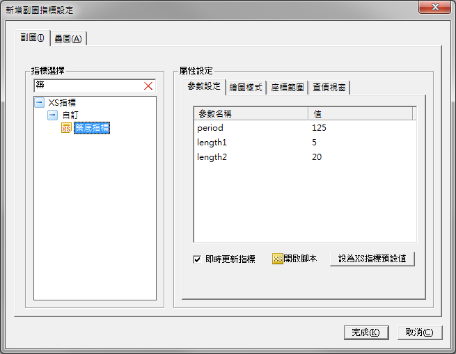

# XS自訂指標

來源：[XS自訂指標](https://www.xq.com.tw/lesson/indicator/)

## 什麼是XS指標

XS指標，是使用XScript語法寫出計算邏輯的指標，它可以自訂顏色、繪圖樣式、座標範圍，在技術分析線圖上驗證新的交易策略與想法。

[返回](#xs自訂指標)

## 新增自訂指標

在XQ全球贏家的臉書專頁內我們會常常會分享一些新的指標，文章內的指標程式碼都是可以直接使用的。

**步驟一：複製程式碼**

首先，我們要從文章上複製指標的程式碼。這邊我們以**築底指標**做範例。

打開網頁之後，可以看到圖文並茂的說明。每篇可都是專家們的心血，值得你再三研究。不過我們今天是來教怎麼樣把指標放到XQ裡，所以，請往下找到程式碼的位置。

在每篇文章中，程式碼都是以獨立區塊顯示的，點擊右上角的標記程式碼之後，系統會自動幫你選取要複製的程式碼。請利用右鍵選單將程式碼複製一份下來。

<!--  -->

**步驟二：開啟XScript編輯器**

接下來，回到XQ、打開XScript編輯器。

從主選單的 策略→XScript編輯器

<!--  -->

XScript編輯器的版面配置如下：

- 功能列：功能包括「檔案」、「編輯」、「檢視」、「編譯」、「視窗」、「說明」。
- 工具列：常用功能可直接點選工具列上的按鈕作操作。
- 公式區：提供樹狀或清單檢示所有公式。
- 編輯區：公式腳本的編輯區。
- 屬性區：顯示所選公式的屬性值。
- 訊息區：顯示系統或除錯訊息。

<!--  -->

**步驟三：新增指標腳本**

這次的範例是「築底換標」，所以接下來我們來新增一個指標腳本

- 點擊工具列上的【新增】，會出現新增腳本視窗

  XS腳本一共有四種類型：
  - 指標：可以用於技術分析繪製自訂指標
  - 選股：可以用於選股中心做為選股條件
  - 警示：可以用於策略雷達做為警示條件
  - 函數：如果是會很常重複使用的程式碼，寫成函數腳本後可以被其他腳本引用

- 選擇指標腳本
- 在名稱欄填入「築底指標」
- 確認新增

<!--  -->

- 在編輯區上剛剛複製的程式碼
- 點擊工具列上的"編譯"或按下 **F6** 編譯腳本

<!--  -->

當訊息視窗顯示編譯成功的訊息時，就完成新增腳本的動作。

如果有錯誤訊息出現，請檢查腳本是否正確。

<!--  -->

**步驟四：檢視自訂指標**

現在我們要把寫好的指標腳本放到技術分析看看效果如何

- 在一般工具列的代碼欄填入商品代碼（例如：2330.TW），然後點擊顯示商品技術分析圖，開啟商品K線。

<!--  -->

- 在技術分析圖上按滑鼠右鍵，可以叫出右鍵選單，選擇**增加副圖**開啟新增副圖指標設定視窗。

<!--  -->

- 在搜尋框中輸入**築**可以列出所有包含築字的指標。點擊**築底指標**，相關屬性設定會顯示在右半邊。

<!--  -->

- 點擊**完成**後，就可以看到新增加的築底指標出現在畫面的最下方。

<!--  -->

**小秘訣**

設定**XS指標計算範圍**，可以加快系統處理的速度，相關說明如下

- 在技術分析圖上按滑鼠右鍵，可以叫出右鍵選單，選擇**設定**開啟技術分析設定視窗。

<!--  -->

- XS指標計算範圍設定說明
  
  資料頻率依**日線以上**、**分鐘**與**Tick**區分，下列介紹各資料頻率繪圖的方式

  - 日線以上：預設不勾選。勾選此項，則XS指標計算範圍，依據**資料筆數**或**指定開始日**選項，開始繪圖。
  - 分鐘、Tick：預設勾選。勾選此項，則XS指標計算範圍，依據**設定期間**繪圖；不勾選此項，系統會以所有已下載資料進行運算，可能會有系統延滯的現象。

<!--  -->

- XS指標計算範圍使用時機為，當您的XS指標，僅需看一段時間到現在的繪圖畫面時，可勾選此項，降低電腦耗能。

[返回](#xs自訂指標)
